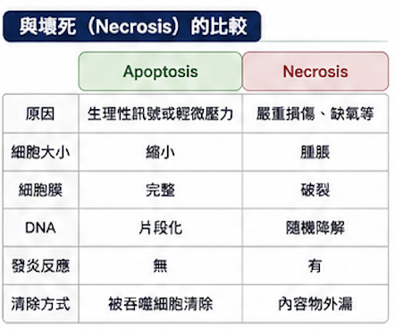
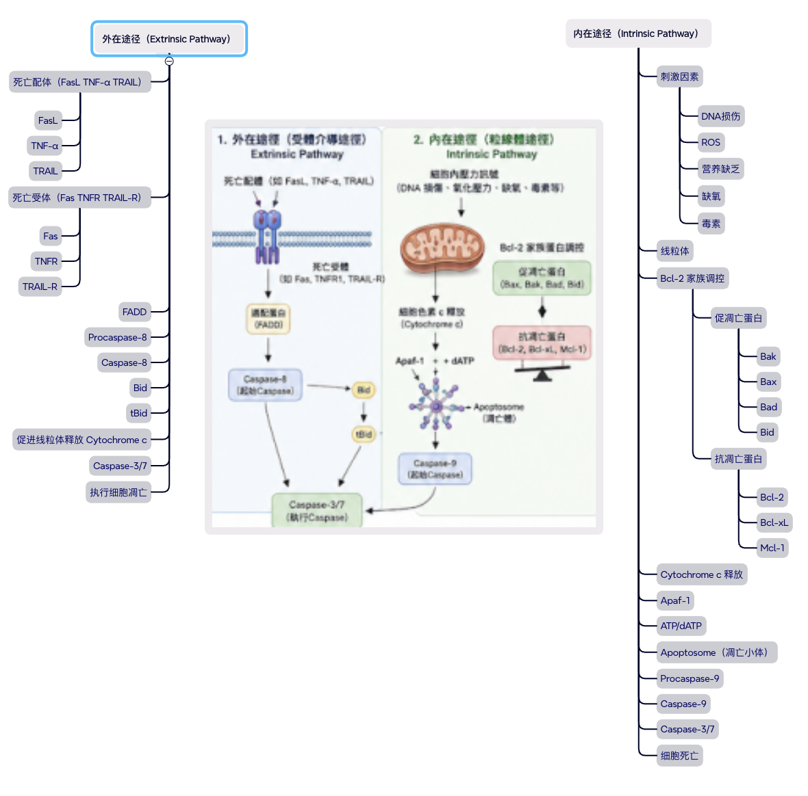
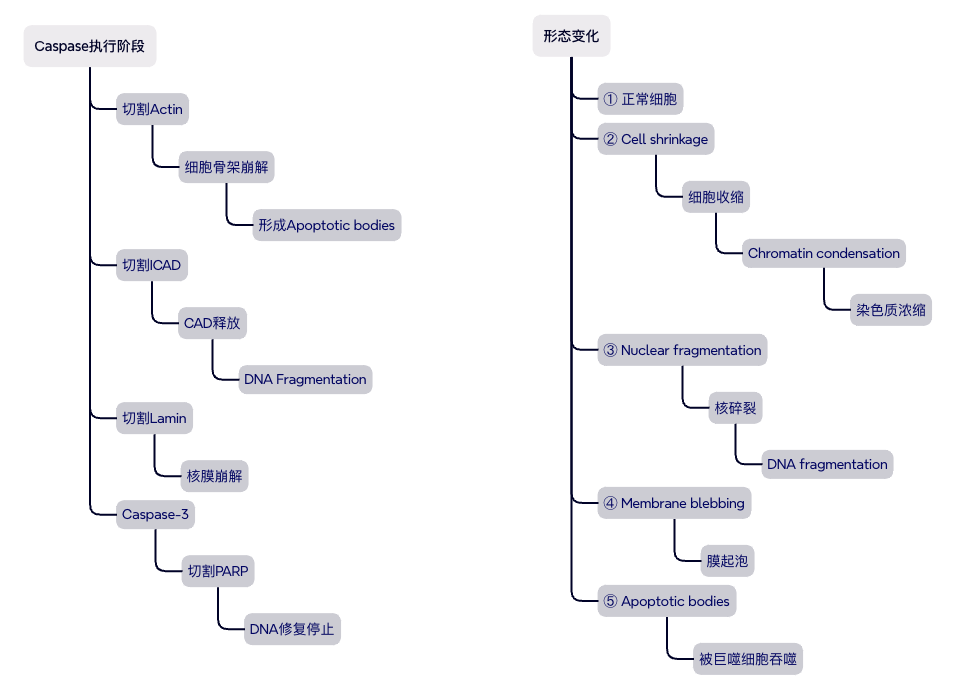
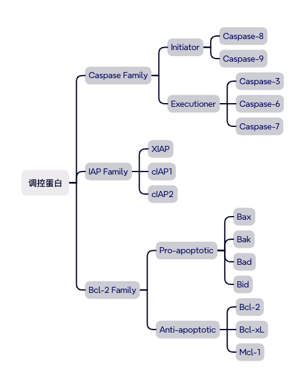
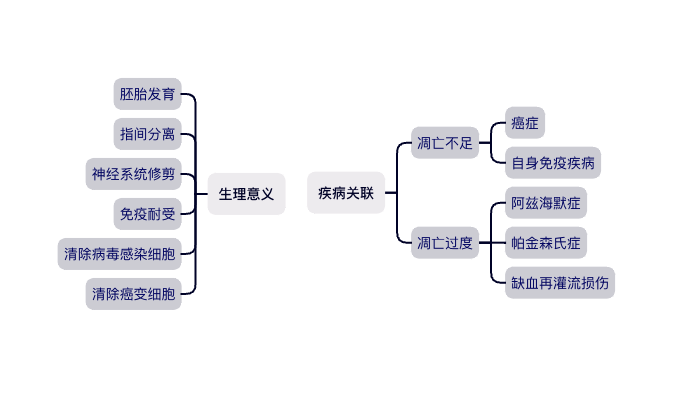

### Apoptosis（细胞凋亡，程序性细胞死亡）

细胞按照内置"程序"有序自杀的过程，不同于因创伤而爆裂的坏死（necrosis）。
凋亡是受严格调控的、"干净"的死亡，细胞会皱缩、DNA 断裂，最后被清理。

#### 主要特征

- 程序性死亡（Programmed）

- 需要ATP

- 不会引起明显炎症反应

- DNA发生规律性断裂

- 细胞膜保持完整

- 最终形成凋亡小体（Apoptotic bodies）

- 被巨噬细胞吞噬清除
  

#### 细胞凋亡的两条主要途径

> 外在、内在途径最终都会活化 Caspase-3/7。
> Caspase 是执行细胞凋亡的核心蛋白酶。
> Bcl-2 家族决定线粒体是否释放 Cytochrome c。
> 细胞凋亡是一种主动且有序的死亡方式，不会引发明显炎症。
