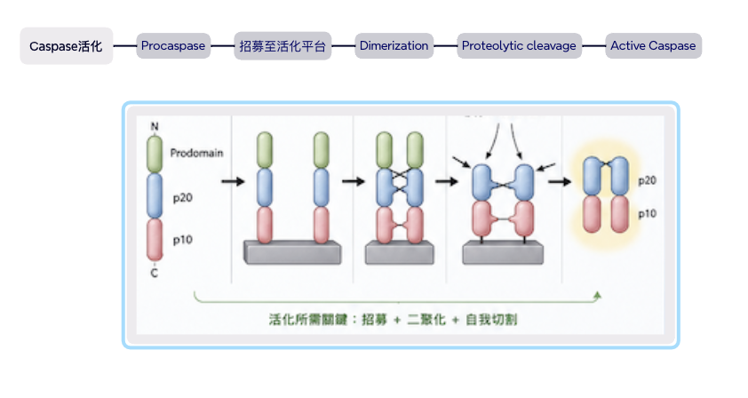
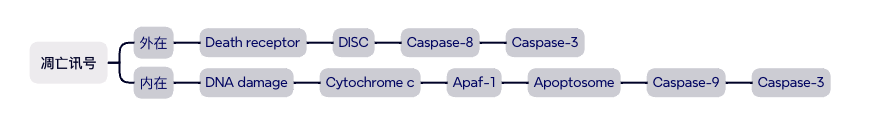
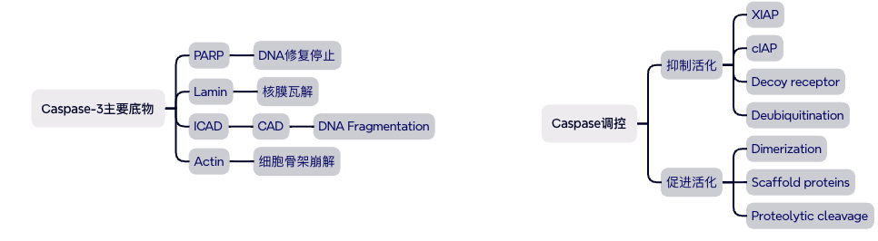
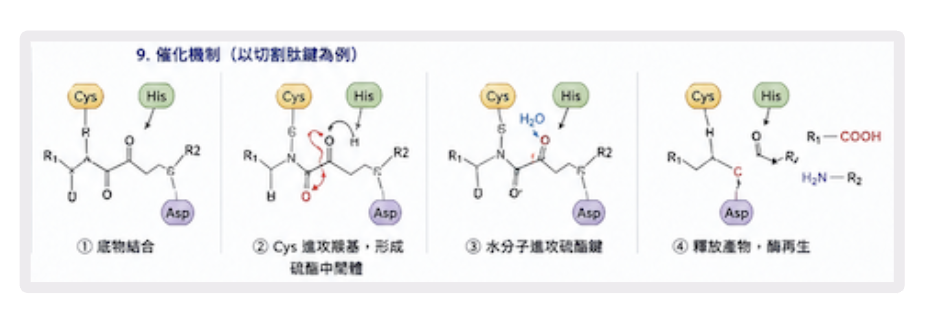
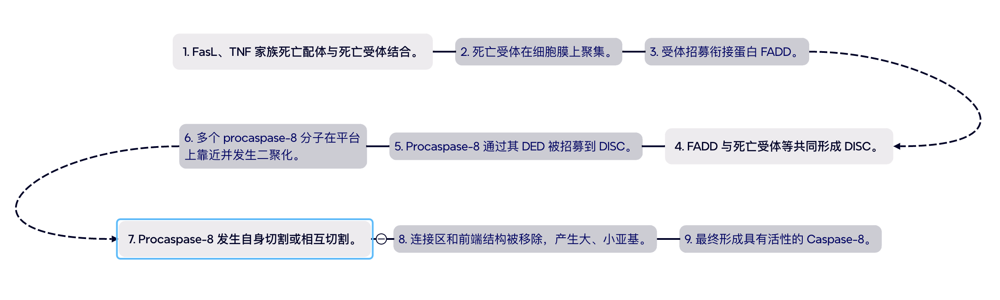

## Caspase

### Caspase（半胱天冬酶）家族

Caspase(Cysteine-dependent Aspartate-directed Protease)是一群半胱氨酸蛋白酶
特点

- Active-site Cys
- 切割Asp之后的肽键
- 以前体（Procaspase）存在
- 活化后才能发挥功能

分两类角色：

- Initiator caspase（起始）：
  如 caspase 8，负责"点火"，一旦激活就启动级联反应。它需要二聚化才能激活——这正是本系统利用的开关点。
- Effector / executioner caspase（效应/执行）：如 caspase 3，是级联下游的"执行者"，真正去切割细胞里的关键蛋白导致死亡。
  文中检测"细胞真的在凋亡"的证据之一，就是死亡细胞同时对 activated caspase 3（活化的 caspase 3） 染色阳性——说明级联确实从 8 传到了 3。

### Caspase 8 的 p20 / p10 催化域

caspase 8 被切割后形成两个亚基 **p20** 和 **p10**（数字是分子量，约 20/10 kDa），它们组成有活性的催化核心。文中用的是人源 caspase 8 的活化片段（对应氨基酸 **Ser217–Asp479**），即"已经准备好干活、只差二聚化"的版本。

#### Caspase-8 的基本结构

N 端 → DED1 → DED2 → p20 大催化亚基 → p10 小催化亚基 → C 端

- DED1 与 DED2 合称 **DED 区域**。
- p20 与 p10 共同构成 **催化域（catalytic domain）**。
- Caspase-8 最初以前体形式 **procaspase-8** 存在。
- N 端含有两个 DED（Death Effector Domains，死亡效应结构域），主要负责将 procaspase-8 招募到 DISC，而不是直接执行催化作用。

#### p20：大亚基（large subunit）

- 包含催化半胱氨酸附近的重要氨基酸残基。
- 是 Caspase-8 催化核心的主要组成部分。
- 成熟 Caspase-8 中的大亚基实际常接近 **p18**，但教学和结构描述中经常统称为 p20。

#### p10：小亚基（small subunit）

- 协助形成稳定、正确的活性构象。
- 参与构成底物结合沟槽和催化区域。
- 对酶活性维持及底物识别十分重要。

> p20 与 p10 并不是两个独立的酶，而是共同组成一个具有功能的 Caspase-8 催化单元。

### 活性位点与催化核心

- p20：大催化亚基。
- p10：小催化亚基。
- 活性位点主要包含：
  - **Catalytic Cys：催化半胱氨酸**
  - **Catalytic His：协助催化的组氨酸**
- Caspase 属于 **cysteine protease（半胱氨酸蛋白酶）**。
- Caspase 通常识别特定四肽序列，并切割位于天冬氨酸 Asp（D）残基之后的肽键。

### Caspase-8 常见识别序列

IETD↓X

- I：Isoleucine，异亮氨酸
- E：Glutamate，谷氨酸
- T：Threonine，苏氨酸
- D：Aspartate，天冬氨酸
- ↓：切割位置
- X：任意氨基酸

可概括为：

XXXD↓X

其中 P1 位点通常必须是 Asp。

### Caspase-8 如何被活化？

#### 外在性细胞凋亡途径

> 关键
> 先招募 → 再二聚化 → 再发生蛋白水解切割。

> 更准确地说，**邻近诱导的二聚化是活化的关键步骤，切割通常用于进一步稳定及成熟活性酶。**

### 成熟酶的组成

一个活化的 Caspase-8 酶复合体通常可表示为：

**（p20／p10）× 2**

即由两个 p20／p10 异源二聚单元组成的二聚体。

结构示意：

- 第一套：p20 + p10
- 第二套：p20 + p10
- 两套共同形成具有完整催化活性的 Caspase-8。

更严格地描述，成熟形式常记作：

**（p18／p10）₂**

---

### p20／p10 催化域的功能

#### 切割下游执行者 Caspase

Caspase-8 可切割并活化：

- Procaspase-3
- Procaspase-7

从而启动执行者 Caspases，进入细胞凋亡的执行阶段。

#### 切割 Bid

Caspase-8 可将 Bid 切割为 tBid。

tBid 转位至线粒体，促进线粒体外膜通透化，从而连接：

- 外在性凋亡途径
- 线粒体内在性凋亡途径

#### 放大凋亡信号

通过活化执行者 Caspases 以及线粒体途径，Caspase-8 可放大并扩散细胞凋亡信号。

#### 推动细胞进入 apoptosis

最终造成：

- 细胞收缩
- 染色质凝集
- DNA 断裂
- 细胞骨架分解
- 细胞膜起泡
- 形成凋亡小体
- 被吞噬细胞清除

---
