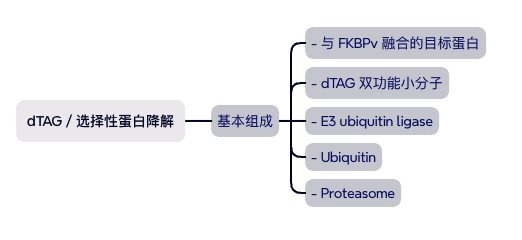
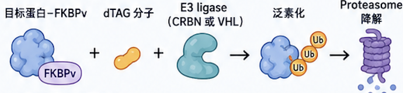

# FKBP 与 FKBPv（Phe36Val 突变体）

## 结构、配体选择性与常见应用

FKBP 是 **FK506-binding protein（FK506 结合蛋白）** 的缩写，
是一类 immunophilin（免疫亲和蛋白）。
经典成员：**FKBP12**
FKBP12 具有 PPIase （**Peptidyl-prolyl cis-trans isomerase activity**）活性，
即肽基脯氨酰顺反异构酶活性
其功能是催化蛋白质中脯氨酸相关肽键的顺式与反式构象转换，
因此可参与蛋白质折叠和构象调控。
FKBP12 可与FK506（tacrolimus）Rapamycin（sirolimus）结合，
FKBP 与这些配体形成复合物后，可进一步影响细胞信号通路。

### 2. FKBPv 是什么？

FKBPv 通常是指经过工程化改造的FKBP12（F36V）
也就是 FKBP12 的第 36 位氨基酸由**Phenylalanine，Phe，F**
突变为**Valine，Val，V**（可表示为**Phe36Val**或简写为**F36V**）

因此FKBP12 WT：第 36 位为 Phe。
FKBP12（F36V）／FKBPv：第 36 位为 Val。
这一突变会改变 FKBP12 配体结合口袋的形状和理化性质，因此常用于设计具有选择性的 chemical biology 工具系统。

### F36V 突变带来的改变

#### 野生型 FKBP12

第 36 位为 Phe：

- 侧链体积较大。
- 含有芳香环。
- 适合与 FK506、rapamycin 等经典 FKBP 配体相互作用。
- 对野生型 FKBP 配体具有天然结合偏好。

#### FKBPv／FKBP12（F36V）

第 36 位为 Val：

- 侧链体积比 Phe 小。
- 不含芳香环。
- 改变并扩展原有配体结合口袋中的局部空间。
- 通常会降低对部分天然配体或经典配体的结合偏好。
- 可提高对专门设计的合成配体的选择性识别。

#### 核心概念

口袋微调 → 配体选择性改变
这种设计通常称为**Orthogonal binding，正交结合**
意思是工程化蛋白与工程化配体之间形成相对专一的配对，同时尽量减少对内源性野生型 FKBP 的影响。

### 配体选择性的比较

#### 天然配体，例如 FK506

- 对 WT FKBP12：通常具有较强结合能力。
- 对 FKBP12（F36V）：结合特性可能降低或发生改变。

#### 合成选择性配体

- 对 WT FKBP12：通常尽量降低结合。
- 对 FKBP12（F36V）：通过填补或利用 F36V 形成的新口袋，提高选择性结合能力。
  > 因此，F36V 突变本身并不一定直接产生新的功能，而是提供了一个可以被专用小分子选择性识别的工程化结合位点。

### 常见应用：CID (后面提及)

### 常见应用：dTAG／选择性蛋白降解

过程如下：

其中：

- FKBPv 作为可被小分子识别的招募标签。
- dTAG 分子的一端结合 FKBP12（F36V）。
- 另一端招募 E3 泛素连接酶。
- E3 ligase 促使融合目标蛋白发生泛素化。
- 泛素化目标蛋白随后进入蛋白酶体降解。

这一系统可以实现：

- 快速蛋白去除
- 相对可逆的实验控制
- 剂量依赖性降解
- 急性蛋白耗竭
- 蛋白功能验证
- 区分蛋白的即时功能与长期适应性效应

---

### FKBP 与 FKBPv 比较

| 项目         | FKBP／FKBP12 WT                | FKBPv／FKBP12 F36V             |
| ------------ | ------------------------------ | ------------------------------ |
| 来源         | 天然蛋白                       | 工程化突变体                   |
| 第 36 位残基 | Phe                            | Val                            |
| 结合口袋     | 野生型天然口袋                 | 经 F36V 调整的口袋             |
| 配体偏好     | FK506、rapamycin 等经典配体    | 针对 F36V 设计的选择性合成配体 |
| 常见用途     | 基础生物学、蛋白折叠与药理研究 | 二聚化、蛋白降解及可控细胞工程 |
| 研究场景     | 天然功能研究                   | 工具蛋白系统与化学生物学       |
