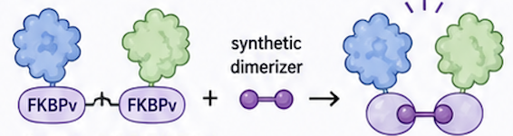
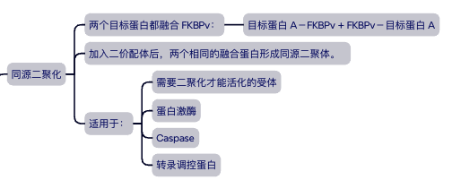
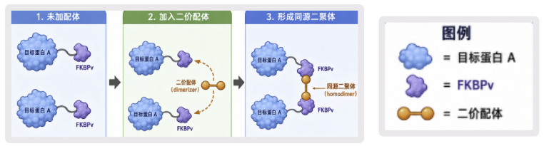
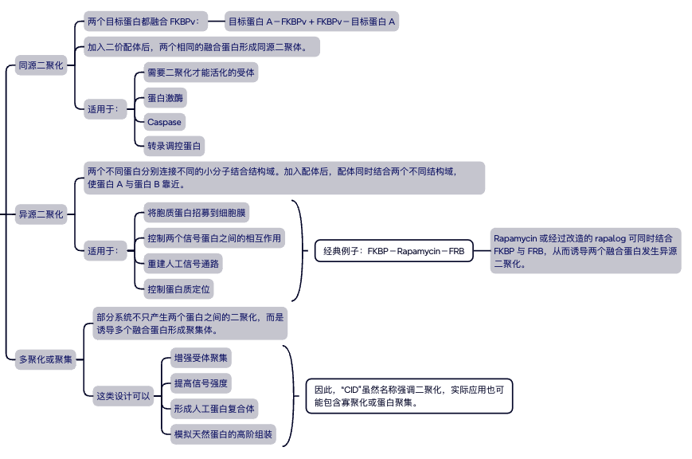
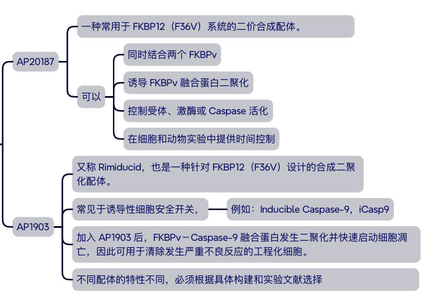
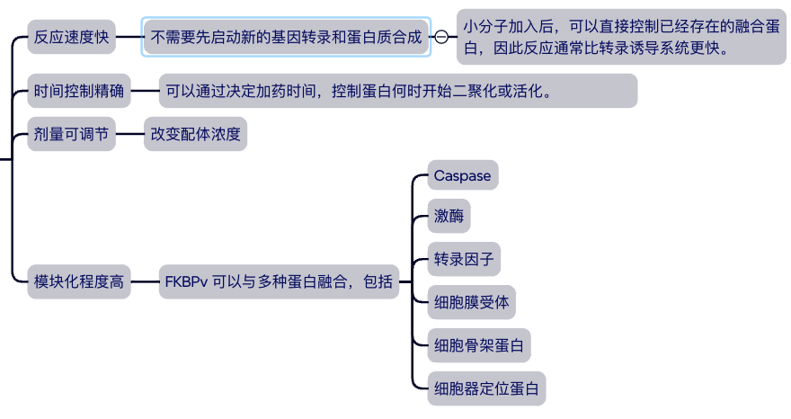
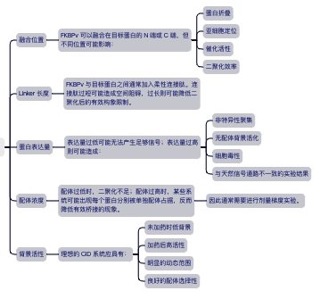
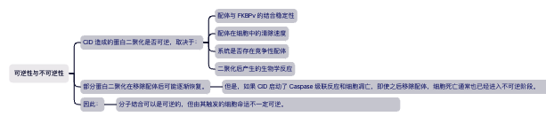

## Chemical-induced dimerization，简称：**CID**

### 基本设计：

1. 将 FKBPv 分别融合至一个或多个目标蛋白。
2. 加入可同时结合两个 FKBPv 的二价合成配体。
3. 合成配体作为桥梁，使两个融合蛋白快速靠近或聚集。
4. 通过空间接近控制目标蛋白的功能。

> 二聚化配体通常不是直接进入目标蛋白的催化位点，而是通过提高两个目标蛋白的局部有效浓度，促使它们发生相互作用。

### 系统

#### 一般经历以下步骤：

1. 细胞预先表达 FKBPv 融合蛋白。
2. 在未加药时，融合蛋白主要以分散状态存在。
3. 加入可穿过细胞膜的二聚化配体。
4. 配体分别结合两个 FKBPv 结构域。
5. 两个目标蛋白被拉近并形成二聚体或更高阶聚集体。
6. 目标蛋白发生构象变化、磷酸化、酶活化或位置转移。
7. 下游信号通路被启动。
8. 细胞产生相应的生物学反应。

#### 产生的反应(可能包括)：

- 基因转录启动
- 激酶活化
- 受体聚集
- 蛋白转位
- 细胞分化
- 细胞增殖
- 细胞凋亡
- 工程化免疫细胞功能启动

#### 常见构型

### CID 与 Caspase 活化

CID 经常用于构建可控制的细胞凋亡开关。
以 Caspase 为例，可以将 FKBPv 与 Caspase 的催化区域融合：
FKBPv－Caspase 催化域在未加入配体时，融合蛋白彼此分散，Caspase 活性较低。

#### 加入二聚化配体后：

1. 配体结合两个 FKBPv。
2. 两个 Caspase 催化域被拉近。
3. Caspase 发生诱导二聚化。
4. 催化结构域形成活性构象。
5. Caspase 发生自身切割或相互切割。
6. 下游执行者 Caspases 被活化。
7. 细胞进入 apoptosis。

#### 可简化为：

FKBPv－Caspase + Dimerizer
↓
Caspase 二聚化
↓
Caspase 活化
↓
Caspase 级联反应
↓
细胞凋亡

> - 天然系统：DISC 负责使 Caspase-8 靠近。
> - 工程系统：FKBPv 与小分子配体负责使 Caspase 靠近。

#### 举例

#### 主要优点

#### 实验设计中的关键因素

#### 可逆性与不可逆性

