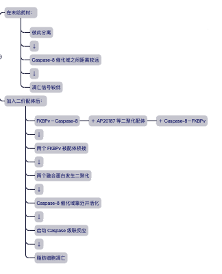

### Fusion protein（融合蛋白）

把两段不同蛋白的编码序列在同一个阅读框（in-frame）内拼接，翻译出一条"二合一"的蛋白。
这里是 caspase 8 – FKBP – FKBP（带两个 FKBP 以便二聚），并额外挂上一个 FLAG 标签 便于检测。

#### 基本组成

一个工程化融合蛋白通常包含：

- 功能结构域：负责催化或执行主要生物学功能。
- 调控结构域：负责响应药物、光或其他刺激。
- 定位序列：把蛋白送到细胞膜、细胞核或线粒体等位置。
- Linker（连接肽）：连接不同结构域，并提供合适的空间和柔性。

例如膜定位序列－FKBPv－Caspase-8 催化域

各部分的作用分别是：
| 组成部分 | 作用 |
| --- | --- |
| 膜定位序列 | 将融合蛋白定位在细胞膜附近 |
| FKBPv | 结合二价化学二聚剂 |
| Caspase-8 催化域 | 二聚化后启动细胞凋亡 |

#### FAT-ATTAC 小鼠中的融合蛋白

FAT-ATTAC 小鼠在脂肪细胞中特异表达一种人工设计的、膜相关的 FKBPv–Caspase-8 融合蛋白；
该转基因受到脂肪细胞选择性启动子的控制。

> 这种药物诱导的融合蛋白二聚化，是 FAT-ATTAC 小鼠能够在特定时间诱导脂肪细胞死亡的核心。

#### 注意

融合蛋白：
FKBPv 与 Caspase-8 已经通过肽键连接成同一条蛋白链。
这是由融合基因直接表达出来的。
二聚体：
两个完整的 FKBPv–Caspase-8 融合蛋白，在二价配体作用下彼此靠近。

> 一个融合蛋白不是一个二聚体；两个融合蛋白被配体桥接后，才形成二聚体。

可表示为：
融合蛋白单体:FKBPv－Caspase-8
化学诱导二聚体：FKBPv－Caspase-8 ⇄ 二价配体 ⇄ FKBPv－Caspase-8
最终是融合蛋白提供模块化功能，CID 提供时间控制。
