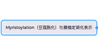
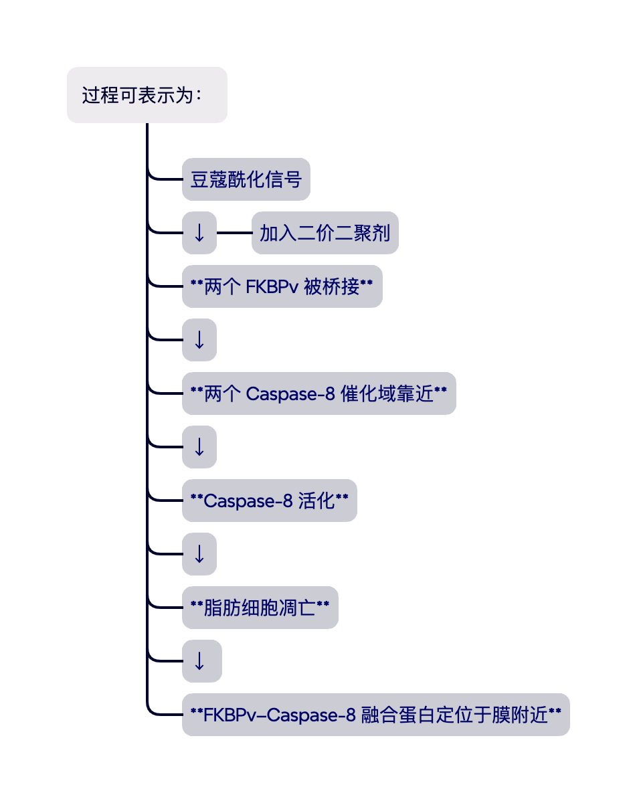

### Myristoylation（豆蔻酰化）与膜锚定

**N-myristoylation（N-豆蔻酰化）**是一种蛋白质脂质修饰：
细胞中的 N-myristoyltransferase（NMT）将一条含有 14 个碳原子的豆蔻酸，
以共价键连接到蛋白质 **N 端的甘氨酸 Gly** 上。
该修饰通常发生在起始甲硫氨酸被移除之后。

可简化表示为：

豆蔻酰基具有疏水性，可以插入细胞膜的脂质双层，
因此能够提高蛋白质与细胞膜的结合倾向，
使原本位于胞质中的蛋白富集在膜表面。

需要注意的是，单独一个豆蔻酰基提供的膜结合力有时较弱；
许多天然蛋白还需要带正电的氨基酸区域、棕榈酰化或其他蛋白相互作用，
才能实现稳定的膜定位。
因此，豆蔻酰化更准确地说是**促进膜结合或提供膜锚定信号**，不一定在所有蛋白中都足以单独完成永久膜定位。

#### 在 FAT-ATTAC 模型中的作用

FAT-ATTAC 小鼠的脂肪细胞会表达经过豆蔻酰化、定位于细胞膜附近的 **Caspase-8–FKBP 融合蛋白**。
加入化学二聚剂后，两个膜相关融合蛋白被拉近，促使 Caspase-8 催化结构域发生二聚化并启动细胞凋亡。

膜锚定的意义包括：

1. **限制融合蛋白的位置**
   使其主要位于细胞膜内侧，而不是自由分散在整个胞质中。

2. **提高局部有效浓度**
   蛋白从三维胞质空间被限制到近似二维的膜表面后，两个融合蛋白相遇和被二聚剂桥接的机会通常会增加。

3. **促进邻近诱导活化**
   Caspase-8 是启动型 Caspase，其活化依赖分子间的空间靠近和二聚化。膜定位有利于形成适合二聚化的局部环境。

4. **模拟天然死亡受体信号平台**
   天然外在性凋亡途径中，Caspase-8 会被招募到细胞膜上的 DISC。FAT-ATTAC 系统通过膜定位和化学二聚化，人为模拟这种“在膜附近集中并活化 Caspase-8”的过程。

因此，可以用一句话理解：

> **豆蔻酰化像是给融合蛋白加上一个疏水性的膜锚，使其聚集在细胞膜内侧；二聚剂再像桥梁一样将两个 FKBPv–Caspase-8 分子拉到一起，从而激活凋亡信号。**
