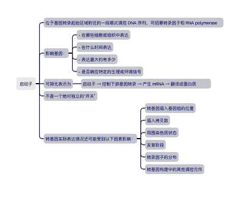

## Promoter（启动子）与组织特异性表达

### 启动子（promoter）

是位于基因转录起始区域附近的一段顺式调控 DNA 序列，可招募转录因子和 RNA polymerase

#### 影响基因：

- 在哪些细胞或组织中表达
- 在什么时间表达
- 表达量大约有多少
- 是否响应特定的生理或环境信号

#### 可简化表示为：

    启动子 → 控制下游基因转录 → 产生 mRNA → 翻译成蛋白质

启动子不是一个绝对独立的“开关”。转基因实际表达情况还可能受到以下因素影响：

转基因插入基因组的位置
插入拷贝数
周围染色质状态
发育阶段
转录因子的分布
转基因构建中的其他调控元件

### Fabp4／aP2 promoter

Fabp4 是 fatty acid-binding protein 4 的基因名称，过去也常称为aP2（adipocyte protein 2）

FAT-ATTAC 研究使用了由 B. Spiegelman 实验室提供的 5.4 kb minimal Fabp4 promoter，用来驱动下游 FKBPv–Caspase-8 融合蛋白的表达。该启动子在当时被广泛用于促进转基因在脂肪细胞中表达。

构建可简化为：
5.4 kb Fabp4 promoter
↓
Myristoylation sequence－Caspase-8－FKBPv－FKBPv－FLAG
↓
主要在脂肪组织中表达融合蛋白

研究者首先利用 Northern blot 检查转基因 mRNA。
最终选中的品系中，转基因表达出现在所检测的各个白色脂肪组织，以及肩胛间棕色脂肪组织；
在论文检查的其他组织中没有检测到明显表达。
研究者随后使用 RT-PCR 进一步验证，
并通过抗 FLAG 的 Western blot 证明融合蛋白只在所检测的白色和棕色脂肪组织中可被检测到。
在该论文选定的 FAT-ATTAC 转基因品系及其检测灵敏度下，转基因 mRNA 和融合蛋白主要局限于白色与棕色脂肪组织，在其他受检组织中未检测到明显表达。

研究发现，Fabp4/aP2 本身并非在所有条件下都绝对限于成熟脂肪细胞；它也可在巨噬细胞、部分内皮细胞及某些脂肪前体细胞群中表达。因此，现代实验中通常不会只凭启动子的名称判断特异性，而是需要对每一个转基因品系进行实际验证。

#### “作用域限定”的理解

##### 把 Fabp4 启动子理解为 FAT-ATTAC 系统中的第一层作用域控制：

只有表达 Fabp4 启动子活性的细胞
↓
才能制造 FKBPv–Caspase-8 融合蛋白
↓
才具备响应 AP20187 的凋亡开关

AP20187 本身可以进入许多组织，但没有表达该融合蛋白的细胞缺少相应的人工执行模块，因此不会因为这一 ATTAC 构建而启动 Caspase-8 二聚化。

##### 该系统同时具有：

空间控制：主要由 Fabp4 启动子提供。
时间控制：主要由 AP20187 给药时间提供。
