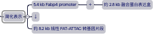
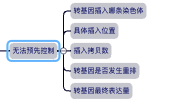
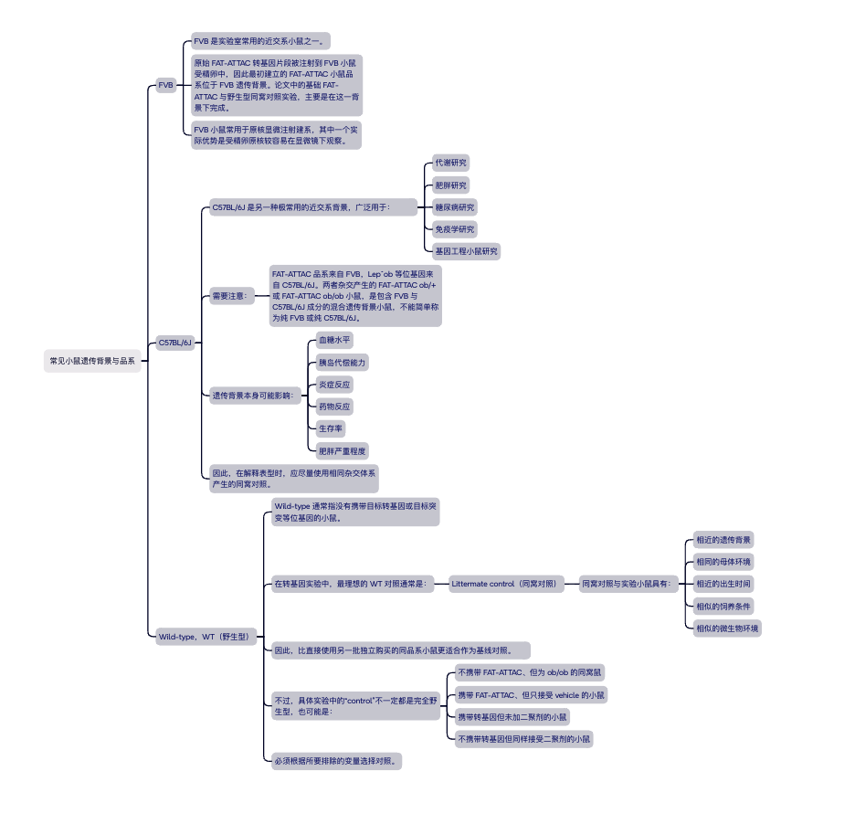
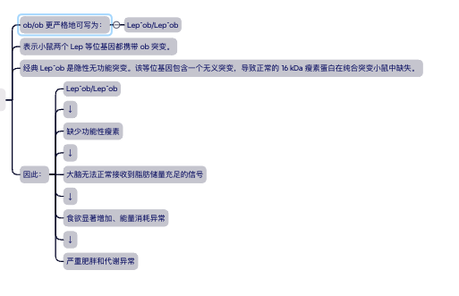

## Transgene / Transgenic mouse（转基因 / 转基因小鼠）

**Transgene（转基因片段）**是研究者在体外人工设计并组装的一段 DNA。
将该 DNA 导入小鼠基因组，并使其进入生殖系后，转基因便可以稳定遗传给下一代；
携带这种外源 DNA 的小鼠称为 transgenic mouse（转基因小鼠）。

FAT-ATTAC 小鼠采用传统的受精卵原核显微注射法建立，其过程如下。

### 1. 构建转基因表达盒

研究者首先构建能够在脂肪细胞中表达诱导性凋亡蛋白的 DNA 片段，主要包含：

5.4 kb Fabp4／aP2 启动子
豆蔻酰化定位序列
人 Caspase-8 的 p20／p10 催化结构域
两个串联的 FKBPv 结构域
FLAG 检测标签
兔 β-globin intron
Polyadenylation sequence
3′ untranslated region

融合蛋白表达盒约为 2.8 kb，与 5.4 kb Fabp4 启动子连接后，去除质粒载体骨架，得到约 8.2 kb 的线性转基因 DNA 片段。

当该 DNA 片段整合进入生殖系细胞后，转基因就可以通过精子或卵细胞遗传给下一代。稳定携带并表达该转基因的小鼠称为：

可简化表示为：

这里的 8.2 kb 指用于显微注射的线性 DNA 片段，而不是完整质粒载体。

### 2. 原核显微注射

研究者将约 8.2 kb 的线性 DNA 注射到来自 FVB 近交系小鼠受精卵的原核中。精卵继续发育后，外源 DNA 可能随机整合到小鼠某条染色体中。将胚胎移植并出生的小鼠称为潜在的Founder mouse（创始鼠）

> 因此必须建立并筛选多个独立品系。

### 3. 确认转基因整合

最初的转基因后代使用 Southern blot 检测。

研究者以一段约 800 bp 的人 Caspase-8 DNA 作为探针，判断小鼠基因组中是否整合了 FAT-ATTAC 转基因。

### 4. 后代快速基因分型

转基因品系建立后，后续世代采用尾组织基因组 DNA 进行 PCR。
PCR 使用人 Caspase-8 特异性引物，预期扩增产物为：600 bp

检测到 600 bp 条带：该小鼠携带 FAT-ATTAC 转基因。
没有检测到条带：在该 PCR 条件下未检测到转基因。

需要注意，PCR 只能证明转基因 DNA 是否存在，不能证明：

转基因是否产生 mRNA
是否产生融合蛋白
表达量是否足够
表达组织是否符合预期

### 5. 筛选实际表达的品系

研究者共得到六个能够将转基因传递给后代的独立品系，即六个具有 **germline transmission（生殖系传递）**的品系。
但是，Northern blot 检测显示，只有一个品系表现出明显的转基因 mRNA 表达，因此后续全部实验均使用这个品系。

这说明：

转基因成功整合并可以遗传，不等于转基因一定能够有效表达。

不同品系之间的表达差异可能来自：

基因组插入位置不同
周围染色质开放程度不同
插入拷贝数不同
转基因发生重排
基因组中的位置效应

## 常见小鼠种类

### ob/ob 小鼠（瘦素缺陷性肥胖模型）

ob 基因是过去称为 ob 的基因，现在正式名称为Lep，leptin gene

该基因主要由脂肪细胞表达，编码：Leptin（瘦素）

瘦素可以向中枢神经系统传递身体能量储备的信息，正常情况下具有：

- 抑制食欲
- 调节能量消耗
- 影响神经内分泌功能
- 参与葡萄糖和脂质代谢

### ob/ob 的基因型

### ob/ob 小鼠通常表现为：

- 食欲亢进
- 严重肥胖
- 胰岛素抵抗
- 高胰岛素血症
- 糖耐量异常
- 脂肪肝
- 生殖功能异常
- 体温和能量代谢异常

表型会明显受到遗传背景影响。在 C57BL/6J 背景上，ob/ob 小鼠早期可以出现高血糖，但随着胰岛肥大和胰岛素代偿，血糖可能在年龄增长后下降；其严重肥胖、胰岛素抵抗和糖耐量异常仍然存在。

更准确的说法为C57BL/6J ob/ob 是严重瘦素缺陷性肥胖和胰岛素抵抗模型，可出现高血糖，但糖尿病严重程度和持续性取决于年龄与遗传背景。

### 为什么建立 FAT-ATTAC ob/ob 小鼠？

普通 FAT-ATTAC 小鼠在二聚剂处理后大量失去脂肪细胞，因此血液中的瘦素水平也大幅下降。
随后观察到小鼠进食增加，就会出现一个问题：进食增加是否只是因为脂肪减少导致瘦素下降？

为区分这一点，研究者通过涉及 ob/+ 携带者的杂交，生成：
FAT-ATTAC ob/ob
不携带 FAT-ATTAC 的 ob/ob 同窝对照

这两组小鼠从一开始都缺少功能性瘦素，因此两组之间的区别主要在于：

- 是否携带 FAT-ATTAC 转基因
- 二聚剂处理后是否发生脂肪细胞消融

论文的研究问题是：
在两组小鼠都已经没有瘦素的情况下，进一步消除脂肪组织是否仍会改变进食及代谢？
实验结果显示，脂肪消融后的 FAT-ATTAC ob/ob 小鼠仍进一步增加食物摄取，并出现更高的血糖、甘油三酯和更严重的肝脂肪变性。

因此作者认为：
脂肪组织对进食行为和全身代谢的调节，并不能完全由瘦素一个因子解释；脂肪细胞还可能产生其他具有调节作用的信号。
不过，这项实验并不能仅凭结果直接确定“究竟是哪一种脂肪因子”，只能说明存在瘦素以外的脂肪组织效应。

### ob/+ 小鼠

ob/+ 更严格地写为：Lep^ob/Lep^+

表示一条染色体携带 ob 突变，另一条携带正常的 Lep 等位基因。

由于 Lep^ob 属于隐性突变，ob/+ 小鼠通常能够由正常等位基因产生足够的瘦素，因此一般表现为：

- 不发生 ob/ob 型严重肥胖
- 血糖相对正常
- 基本保留正常的瘦素调节功能

但 ob/+ 并不等于真正的遗传学 WT，因为它仍携带一个突变等位基因。

### 为什么用 FAT-ATTAC ob/+ 检测 GSIS？

> GSIS （Glucose-stimulated insulin secretion）（葡萄糖刺激性胰岛素分泌）

#### 核心问题：当血糖快速升高时，胰岛 β 细胞能否相应增加胰岛素分泌？

ob/ob 小鼠本身已经具有：

- 严重肥胖
- 胰岛素抵抗
- 高胰岛素血症
- 血糖异常
- 胰岛代偿性改变

这些因素会干扰对 GSIS 的直接判断。
因此，作者使用血糖相对正常的 FAT-ATTAC ob/+ 小鼠，在同一批小鼠脂肪消融前后进行葡萄糖灌胃比较。

实验结果为：

脂肪消融前：葡萄糖升高后，血清胰岛素正常增加。
脂肪消融后：尽管血糖急性升高，血清胰岛素未出现预期增加。
胰岛面积和形态没有明显异常。
精氨酸刺激仍可诱导胰岛素分泌。

因此，研究者推测：

脂肪组织可能提供一种或多种支持最大程度 GSIS 的信号；脂肪细胞消失后，β 细胞对葡萄糖的特异性分泌反应下降。
但作者也谨慎指出，不能完全排除没有明显组织学变化的 β 细胞内在功能异常。

> FAT-ATTAC 提供“什么时候清除脂肪细胞”的控制；ob/ob 提供“先把瘦素变量拿掉”的遗传背景；ob/+ 则提供代谢相对稳定的条件，用来更清楚地观察脂肪组织对葡萄糖刺激性胰岛素分泌的影响。
