# 细胞凋亡机制与 FAT-ATTAC 诱导性脂肪细胞消融系统笔记

> **笔记信息 / Note Information**
>
> **作者 / Author**：蔡靖熹
> 福州大学 数据科学与大数据技术专业 本科生
> Fuzhou University, Data Science and Big Data Technology, Undergraduate
>
> **内容说明**：本笔记由本人根据学习整理撰写。
>
> **参考资料**：

> **AI辅助说明**：本笔记 Markdown 排版结构与逻辑整理借助 AI 工具辅助完成，AI 未参与专业内容的判断与生成，核心知识内容以本人撰写为准。如有内容错误，责任由本人承担。
>
> **联系方式 / Contact**：
> tchinchina@outlook.com
> cjx941008@qq.com

## 目录

1. [Apoptosis（细胞凋亡，程序性细胞死亡）](#1-apoptosis细胞凋亡程序性细胞死亡)
2. [Caspase（半胱天冬酶）家族](#2-caspase半胱天冬酶家族)
3. [FKBP 与 FKBPv（Phe36Val 突变体）](#3-fkbp-与-fkbpvphe36val-突变体结构配体选择性与常见应用)
4. [Chemical-induced Dimerization（CID，化学诱导二聚化）](#4-chemical-induced-dimerizationcid化学诱导二聚化)
5. [Fusion Protein（融合蛋白）](#5-fusion-protein融合蛋白)
6. [Myristoylation（豆蔻酰化）与膜锚定](#6-myristoylation豆蔻酰化与膜锚定)
7. [Promoter（启动子）与组织特异性表达](#7-promoter启动子与组织特异性表达)
8. [Transgene / Transgenic Mouse（转基因动物）](#8-transgene--transgenic-mouse转基因动物)
9. [常见小鼠模型（ob/ob、ob/+ 等）](#9-常见小鼠模型obobob-等)

---

## 1. Apoptosis（细胞凋亡，程序性细胞死亡）

细胞按照内置"程序"有序自杀的过程，不同于因创伤而爆裂的坏死（necrosis）。
凋亡是受严格调控的、"干净"的死亡，细胞会皱缩、DNA 断裂，最后被清理。

### 主要特征

- 程序性死亡（Programmed）
- 需要 ATP
- 不会引起明显炎症反应
- DNA 发生规律性断裂
- 细胞膜保持完整
- 最终形成凋亡小体（Apoptotic bodies）
- 被巨噬细胞吞噬清除

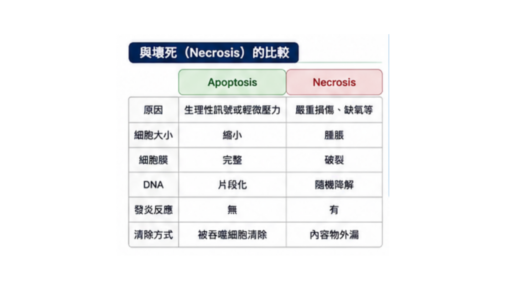

### 细胞凋亡的两条主要途径

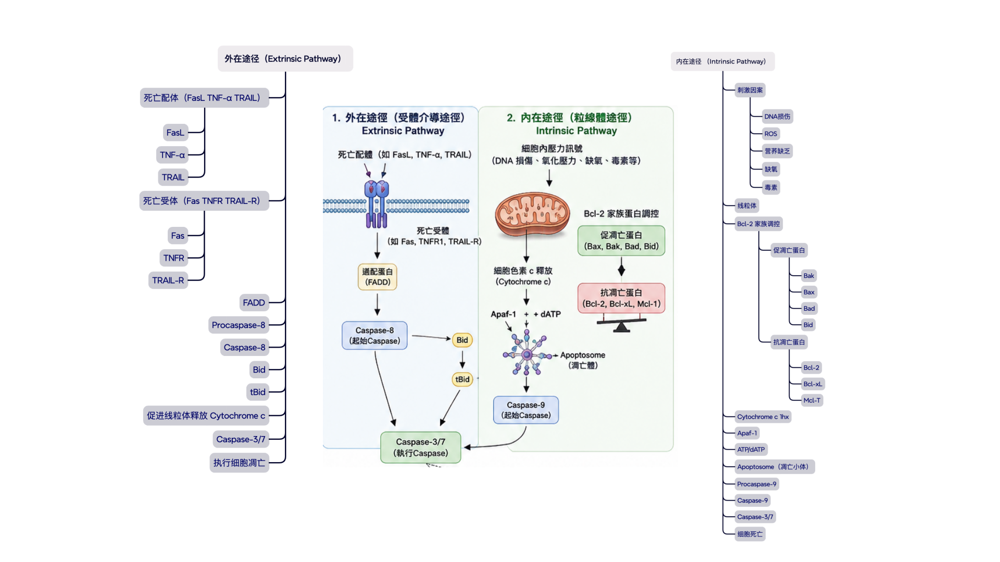
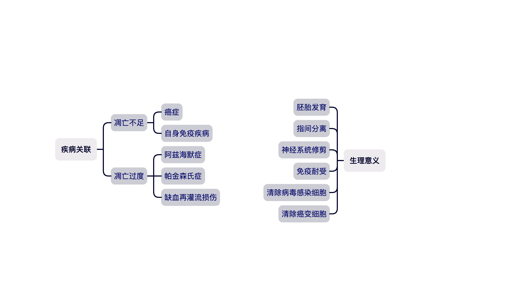
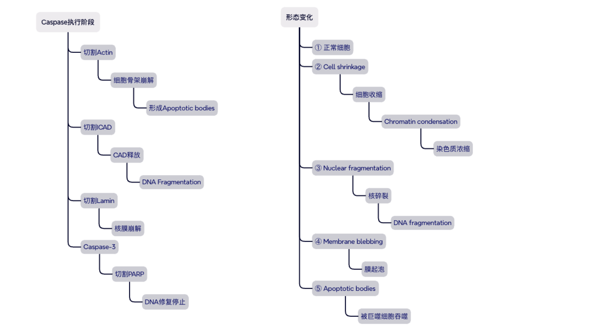
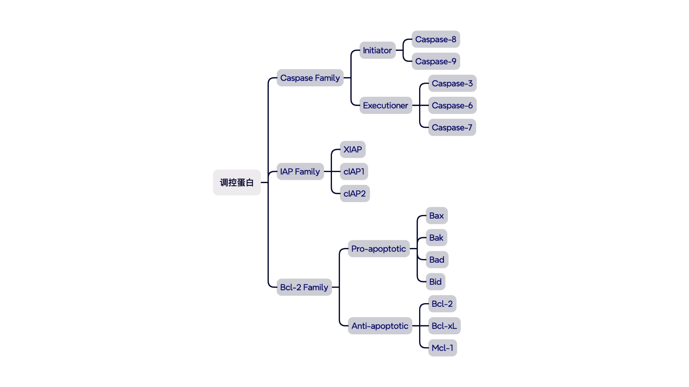
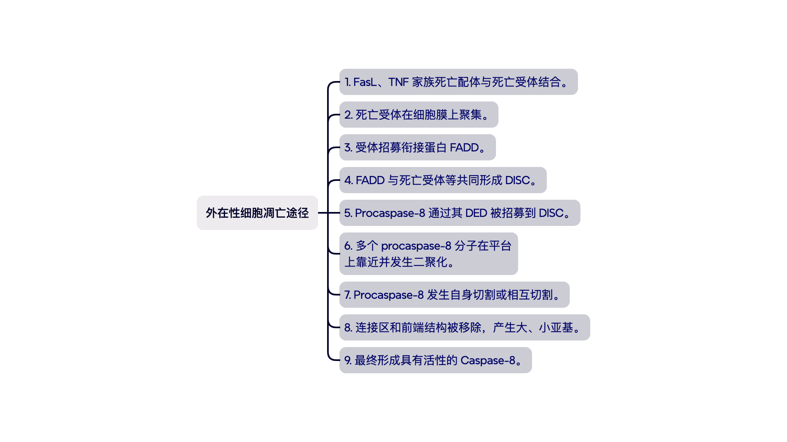

> 外在、内在途径最终都会活化 Caspase-3/7。
> Caspase 是执行细胞凋亡的核心蛋白酶。
> Bcl-2 家族决定线粒体是否释放 Cytochrome c。
> 细胞凋亡是一种主动且有序的死亡方式，不会引发明显炎症。

---

## 2. Caspase（半胱天冬酶）家族

Caspase（Cysteine-dependent Aspartate-directed Protease）是一群半胱氨酸蛋白酶，特点：

- Active-site Cys
- 切割 Asp 之后的肽键
- 以前体（Procaspase）存在
- 活化后才能发挥功能

分两类角色：

- **Initiator caspase（起始）**：如 caspase 8，负责"点火"，一旦激活就启动级联反应。它需要二聚化才能激活——这正是本系统利用的开关点。
- **Effector / executioner caspase（效应/执行）**：如 caspase 3，是级联下游的"执行者"，真正去切割细胞里的关键蛋白导致死亡。文中检测"细胞真的在凋亡"的证据之一，就是死亡细胞同时对 activated caspase 3（活化的 caspase 3）染色阳性——说明级联确实从 8 传到了 3。
  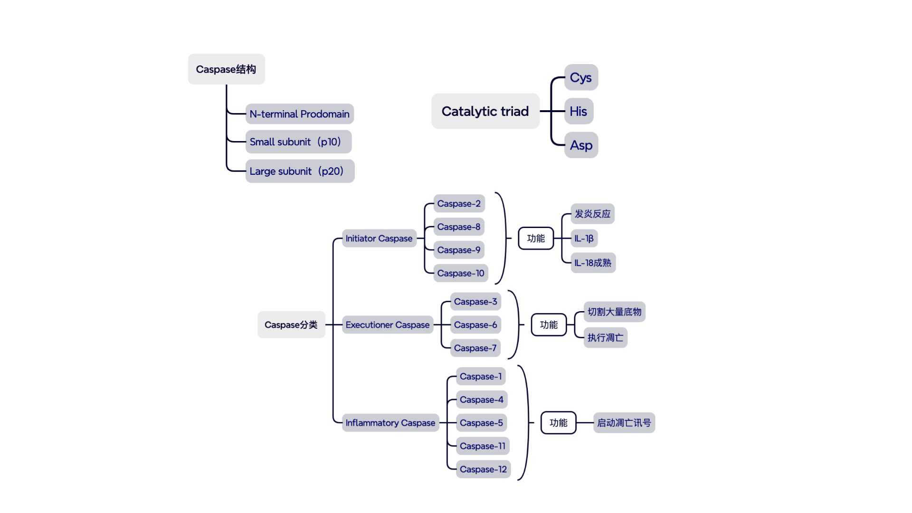
  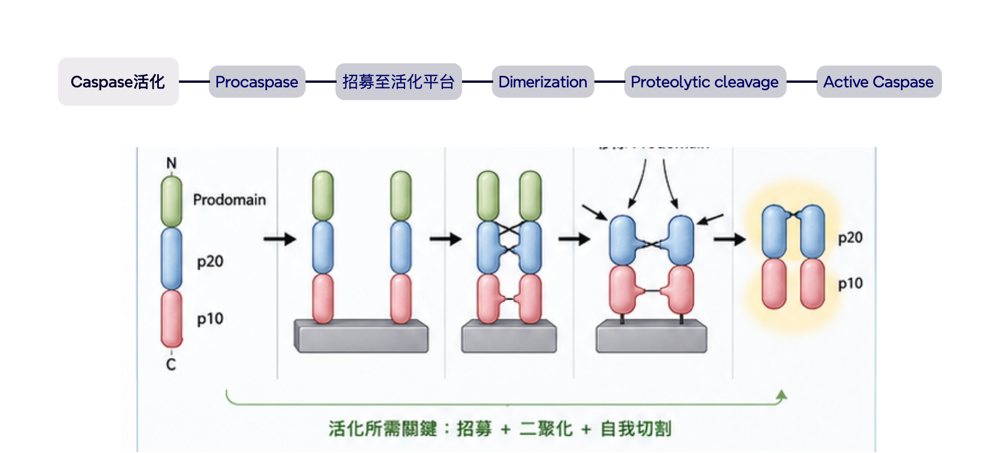
  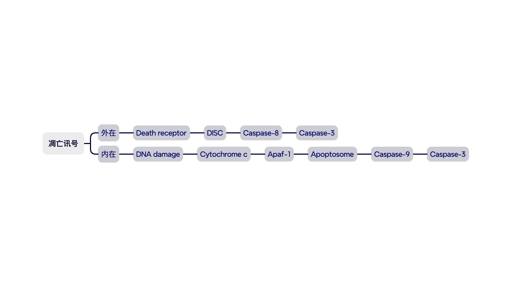
  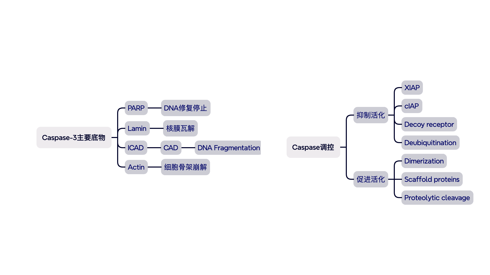
  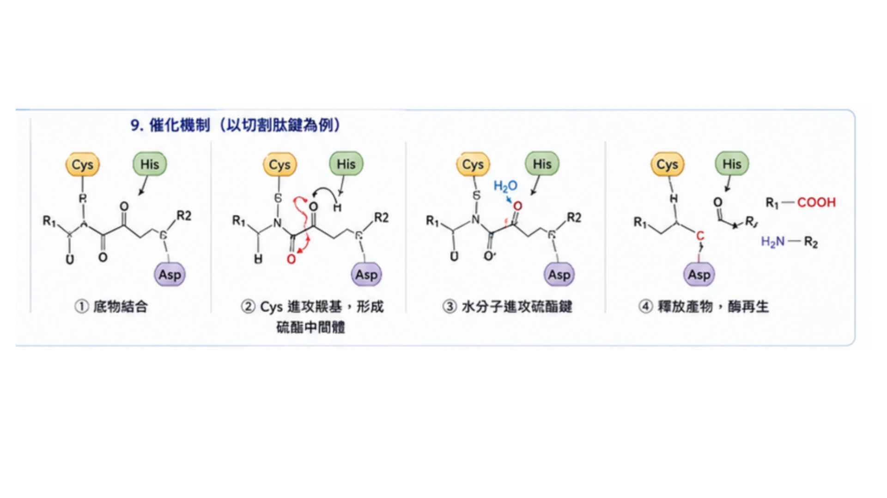

### Caspase 8 的 p20 / p10 催化域

caspase 8 被切割后形成两个亚基 **p20** 和 **p10**（数字是分子量，约 20/10 kDa），它们组成有活性的催化核心。文中用的是人源 caspase 8 的活化片段（对应氨基酸 **Ser217–Asp479**），即"已经准备好干活、只差二聚化"的版本。

#### Caspase-8 的基本结构

N 端 → DED1 → DED2 → p20 大催化亚基 → p10 小催化亚基 → C 端

- DED1 与 DED2 合称 **DED 区域**。
- p20 与 p10 共同构成 **催化域（catalytic domain）**。
- Caspase-8 最初以前体形式 **procaspase-8** 存在。
- N 端含有两个 DED（Death Effector Domains，死亡效应结构域），主要负责将 procaspase-8 招募到 DISC，而不是直接执行催化作用。

#### p20：大亚基（large subunit）

- 包含催化半胱氨酸附近的重要氨基酸残基。
- 是 Caspase-8 催化核心的主要组成部分。
- 成熟 Caspase-8 中的大亚基实际常接近 **p18**，但教学和结构描述中经常统称为 p20。

#### p10：小亚基（small subunit）

- 协助形成稳定、正确的活性构象。
- 参与构成底物结合沟槽和催化区域。
- 对酶活性维持及底物识别十分重要。

> p20 与 p10 并不是两个独立的酶，而是共同组成一个具有功能的 Caspase-8 催化单元。

### 活性位点与催化核心

- p20：大催化亚基。
- p10：小催化亚基。
- 活性位点主要包含：
  - **Catalytic Cys**：催化半胱氨酸
  - **Catalytic His**：协助催化的组氨酸
- Caspase 属于 **cysteine protease（半胱氨酸蛋白酶）**。
- Caspase 通常识别特定四肽序列，并切割位于天冬氨酸 Asp（D）残基之后的肽键。

### Caspase-8 常见识别序列

**IETD↓X**

- I：Isoleucine，异亮氨酸
- E：Glutamate，谷氨酸
- T：Threonine，苏氨酸
- D：Aspartate，天冬氨酸
- ↓：切割位置
- X：任意氨基酸

可概括为：**XXXD↓X**，其中 P1 位点通常必须是 Asp。

### Caspase-8 如何被活化？

#### 外在性细胞凋亡途径

> 关键：先招募 → 再二聚化 → 再发生蛋白水解切割。
>
> 更准确地说，**邻近诱导的二聚化是活化的关键步骤，切割通常用于进一步稳定及成熟活性酶。**

### 成熟酶的组成

一个活化的 Caspase-8 酶复合体通常可表示为：**（p20／p10）× 2**，即由两个 p20／p10 异源二聚单元组成的二聚体。

结构示意：

- 第一套：p20 + p10
- 第二套：p20 + p10
- 两套共同形成具有完整催化活性的 Caspase-8。

更严格地描述，成熟形式常记作：**（p18／p10）₂**

### p20／p10 催化域的功能

#### 切割下游执行者 Caspase

Caspase-8 可切割并活化：

- Procaspase-3
- Procaspase-7

从而启动执行者 Caspases，进入细胞凋亡的执行阶段。

#### 切割 Bid

Caspase-8 可将 Bid 切割为 tBid。tBid 转位至线粒体，促进线粒体外膜通透化，从而连接：

- 外在性凋亡途径
- 线粒体内在性凋亡途径

#### 放大凋亡信号

通过活化执行者 Caspases 以及线粒体途径，Caspase-8 可放大并扩散细胞凋亡信号。

#### 推动细胞进入 apoptosis

最终造成：

- 细胞收缩
- 染色质凝集
- DNA 断裂
- 细胞骨架分解
- 细胞膜起泡
- 形成凋亡小体
- 被吞噬细胞清除

---

## 3. FKBP 与 FKBPv（Phe36Val 突变体）：结构、配体选择性与常见应用

FKBP 是 **FK506-binding protein（FK506 结合蛋白）** 的缩写，是一类 immunophilin（免疫亲和蛋白）。经典成员：**FKBP12**。

FKBP12 具有 PPIase（**Peptidyl-prolyl cis-trans isomerase activity**，肽基脯氨酰顺反异构酶活性），其功能是催化蛋白质中脯氨酸相关肽键的顺式与反式构象转换，因此可参与蛋白质折叠和构象调控。

FKBP12 可与 FK506（tacrolimus）、Rapamycin（sirolimus）结合，FKBP 与这些配体形成复合物后，可进一步影响细胞信号通路。

### FKBPv 是什么？

FKBPv 通常是指经过工程化改造的 FKBP12（F36V），也就是 FKBP12 的第 36 位氨基酸由 **Phenylalanine，Phe，F** 突变为 **Valine，Val，V**（可表示为 **Phe36Val** 或简写为 **F36V**）。

因此：

- FKBP12 WT：第 36 位为 Phe。
- FKBP12（F36V）／FKBPv：第 36 位为 Val。

这一突变会改变 FKBP12 配体结合口袋的形状和理化性质，因此常用于设计具有选择性的 chemical biology 工具系统。

### F36V 突变带来的改变

#### 野生型 FKBP12

第 36 位为 Phe：

- 侧链体积较大。
- 含有芳香环。
- 适合与 FK506、rapamycin 等经典 FKBP 配体相互作用。
- 对野生型 FKBP 配体具有天然结合偏好。

#### FKBPv／FKBP12（F36V）

第 36 位为 Val：

- 侧链体积比 Phe 小。
- 不含芳香环。
- 改变并扩展原有配体结合口袋中的局部空间。
- 通常会降低对部分天然配体或经典配体的结合偏好。
- 可提高对专门设计的合成配体的选择性识别。

#### 核心概念

口袋微调 → 配体选择性改变

这种设计通常称为 **Orthogonal binding，正交结合**，意思是工程化蛋白与工程化配体之间形成相对专一的配对，同时尽量减少对内源性野生型 FKBP 的影响。

### 配体选择性的比较

#### 天然配体，例如 FK506

- 对 WT FKBP12：通常具有较强结合能力。
- 对 FKBP12（F36V）：结合特性可能降低或发生改变。

#### 合成选择性配体

- 对 WT FKBP12：通常尽量降低结合。
- 对 FKBP12（F36V）：通过填补或利用 F36V 形成的新口袋，提高选择性结合能力。

> 因此，F36V 突变本身并不一定直接产生新的功能，而是提供了一个可以被专用小分子选择性识别的工程化结合位点。

### 常见应用：CID

详见下一节「Chemical-induced Dimerization（CID）」。

### 常见应用：dTAG／选择性蛋白降解

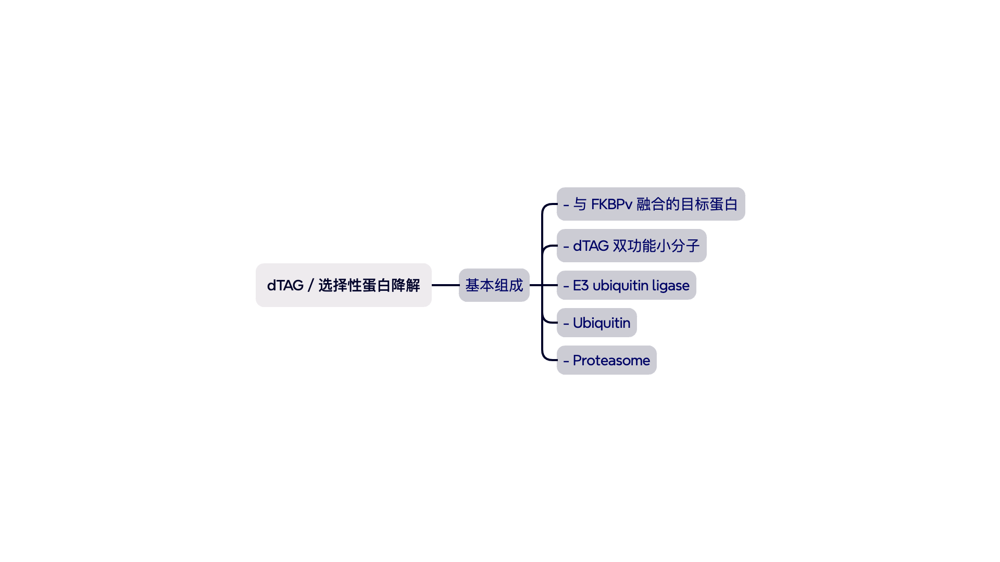

过程如下：
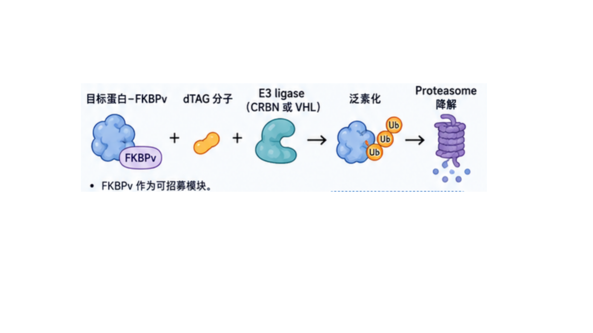

其中：

- FKBPv 作为可被小分子识别的招募标签。
- dTAG 分子的一端结合 FKBP12（F36V）。
- 另一端招募 E3 泛素连接酶。
- E3 ligase 促使融合目标蛋白发生泛素化。
- 泛素化目标蛋白随后进入蛋白酶体降解。

这一系统可以实现：

- 快速蛋白去除
- 相对可逆的实验控制
- 剂量依赖性降解
- 急性蛋白耗竭
- 蛋白功能验证
- 区分蛋白的即时功能与长期适应性效应

### FKBP 与 FKBPv 比较

| 项目         | FKBP／FKBP12 WT                | FKBPv／FKBP12 F36V             |
| ------------ | ------------------------------ | ------------------------------ |
| 来源         | 天然蛋白                       | 工程化突变体                   |
| 第 36 位残基 | Phe                            | Val                            |
| 结合口袋     | 野生型天然口袋                 | 经 F36V 调整的口袋             |
| 配体偏好     | FK506、rapamycin 等经典配体    | 针对 F36V 设计的选择性合成配体 |
| 常见用途     | 基础生物学、蛋白折叠与药理研究 | 二聚化、蛋白降解及可控细胞工程 |
| 研究场景     | 天然功能研究                   | 工具蛋白系统与化学生物学       |

---

## 4. Chemical-induced Dimerization（CID，化学诱导二聚化）

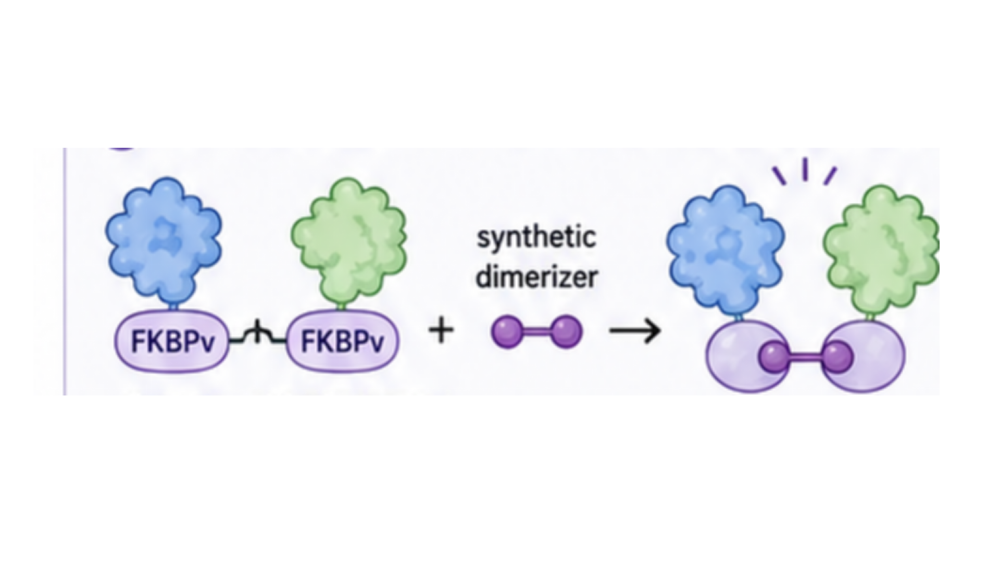
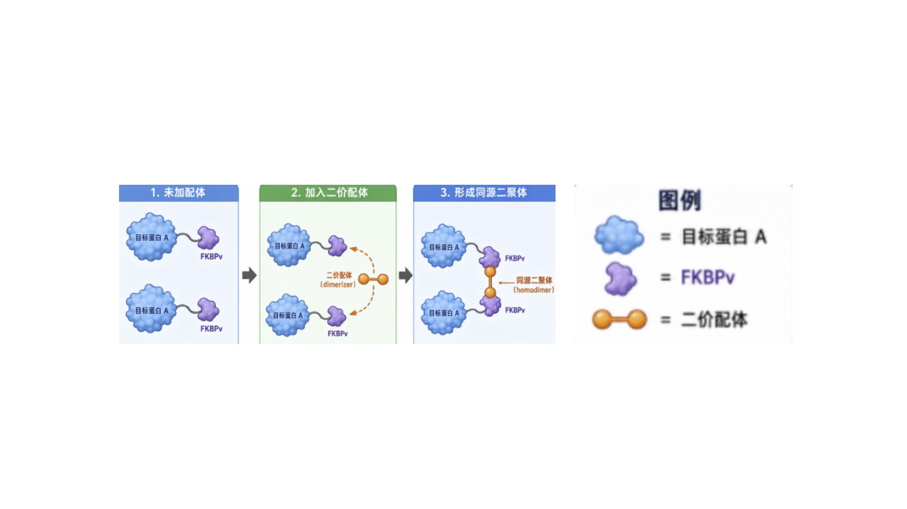

### 基本设计

1. 将 FKBPv 分别融合至一个或多个目标蛋白。
2. 加入可同时结合两个 FKBPv 的二价合成配体。
3. 合成配体作为桥梁，使两个融合蛋白快速靠近或聚集。
4. 通过空间接近控制目标蛋白的功能。

> 二聚化配体通常不是直接进入目标蛋白的催化位点，而是通过提高两个目标蛋白的局部有效浓度，促使它们发生相互作用。

### 系统

#### 一般经历以下步骤

1. 细胞预先表达 FKBPv 融合蛋白。
2. 在未加药时，融合蛋白主要以分散状态存在。
3. 加入可穿过细胞膜的二聚化配体。
4. 配体分别结合两个 FKBPv 结构域。
5. 两个目标蛋白被拉近并形成二聚体或更高阶聚集体。
6. 目标蛋白发生构象变化、磷酸化、酶活化或位置转移。
7. 下游信号通路被启动。
8. 细胞产生相应的生物学反应。

#### 产生的反应（可能包括）

- 基因转录启动
- 激酶活化
- 受体聚集
- 蛋白转位
- 细胞分化
- 细胞增殖
- 细胞凋亡
- 工程化免疫细胞功能启动

#### 常见构型

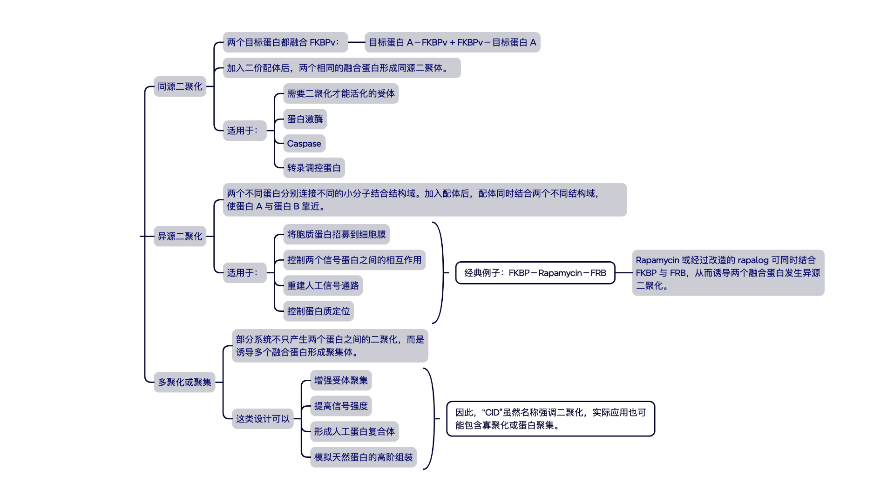

### CID 与 Caspase 活化

CID 经常用于构建可控制的细胞凋亡开关。以 Caspase 为例，可以将 FKBPv 与 Caspase 的催化区域融合：FKBPv－Caspase 催化域在未加入配体时，融合蛋白彼此分散，Caspase 活性较低。

#### 加入二聚化配体后

1. 配体结合两个 FKBPv。
2. 两个 Caspase 催化域被拉近。
3. Caspase 发生诱导二聚化。
4. 催化结构域形成活性构象。
5. Caspase 发生自身切割或相互切割。
6. 下游执行者 Caspases 被活化。
7. 细胞进入 apoptosis。

#### 可简化为

FKBPv－Caspase + Dimerizer
→ Caspase 二聚化
→ Caspase 活化
→ Caspase 级联反应
→ 细胞凋亡

> - 天然系统：DISC 负责使 Caspase-8 靠近。
> - 工程系统：FKBPv 与小分子配体负责使 Caspase 靠近。

#### 举例

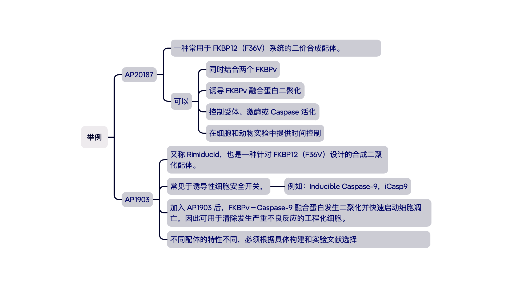

#### 主要优点

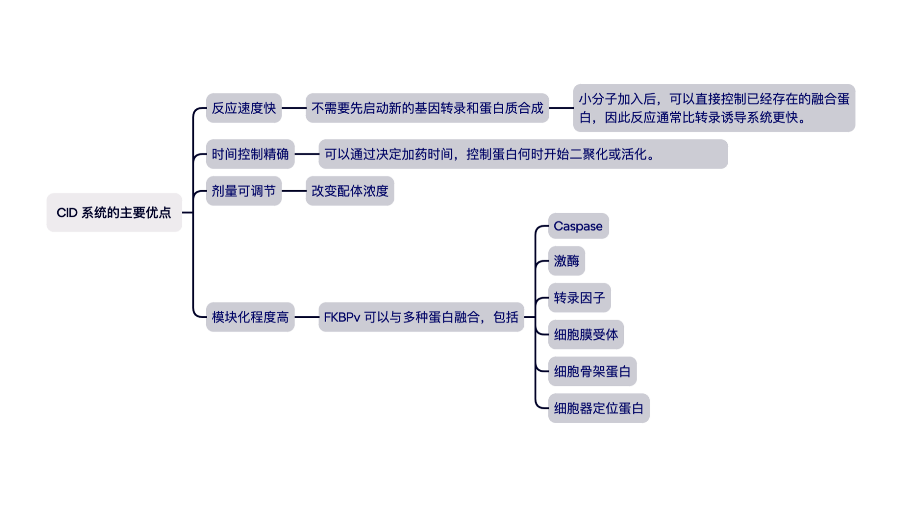

#### 实验设计中的关键因素

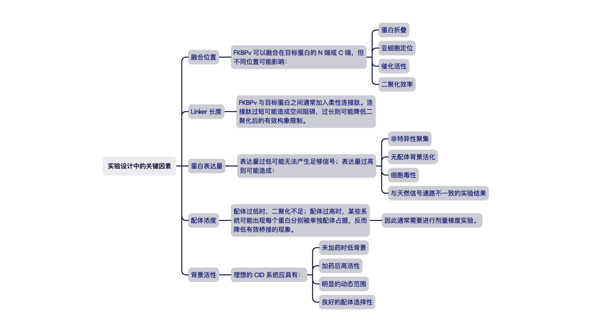

#### 可逆性与不可逆性

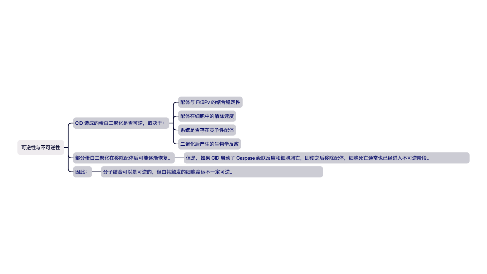

---

## 5. Fusion Protein（融合蛋白）

把两段不同蛋白的编码序列在同一个阅读框（in-frame）内拼接，翻译出一条"二合一"的蛋白。这里是 caspase 8 – FKBP – FKBP（带两个 FKBP 以便二聚），并额外挂上一个 FLAG 标签便于检测。

### 基本组成

一个工程化融合蛋白通常包含：

- **功能结构域**：负责催化或执行主要生物学功能。
- **调控结构域**：负责响应药物、光或其他刺激。
- **定位序列**：把蛋白送到细胞膜、细胞核或线粒体等位置。
- **Linker（连接肽）**：连接不同结构域，并提供合适的空间和柔性。

例如：膜定位序列－FKBPv－Caspase-8 催化域

| 组成部分         | 作用                       |
| ---------------- | -------------------------- |
| 膜定位序列       | 将融合蛋白定位在细胞膜附近 |
| FKBPv            | 结合二价化学二聚剂         |
| Caspase-8 催化域 | 二聚化后启动细胞凋亡       |

### FAT-ATTAC 小鼠中的融合蛋白

FAT-ATTAC 小鼠在脂肪细胞中特异表达一种人工设计的、膜相关的 FKBPv–Caspase-8 融合蛋白；该转基因受到脂肪细胞选择性启动子的控制。

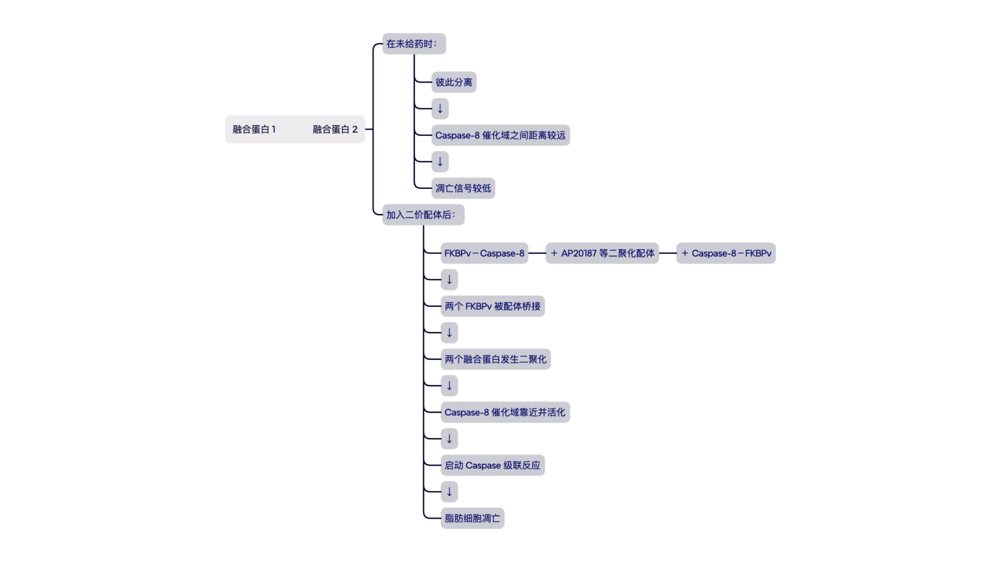

> 这种药物诱导的融合蛋白二聚化，是 FAT-ATTAC 小鼠能够在特定时间诱导脂肪细胞死亡的核心。

### 注意

**融合蛋白**：FKBPv 与 Caspase-8 已经通过肽键连接成同一条蛋白链。这是由融合基因直接表达出来的。

**二聚体**：两个完整的 FKBPv–Caspase-8 融合蛋白，在二价配体作用下彼此靠近。

> 一个融合蛋白不是一个二聚体；两个融合蛋白被配体桥接后，才形成二聚体。

可表示为：

- 融合蛋白单体：FKBPv－Caspase-8
- 化学诱导二聚体：FKBPv－Caspase-8 ⇄ 二价配体 ⇄ FKBPv－Caspase-8

最终是融合蛋白提供模块化功能，CID 提供时间控制。

---

## 6. Myristoylation（豆蔻酰化）与膜锚定

**N-myristoylation（N-豆蔻酰化）**是一种蛋白质脂质修饰：细胞中的 N-myristoyltransferase（NMT）将一条含有 14 个碳原子的豆蔻酸，以共价键连接到蛋白质 **N 端的甘氨酸 Gly** 上。该修饰通常发生在起始甲硫氨酸被移除之后。

可简化表示为：
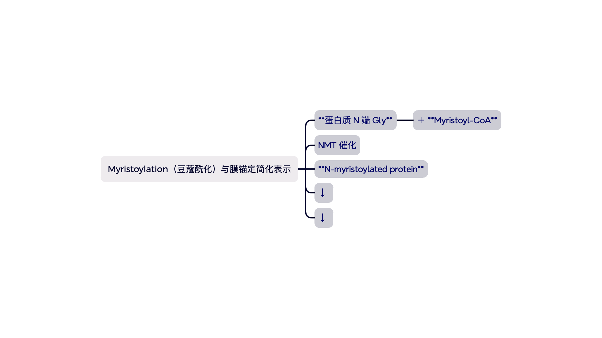

豆蔻酰基具有疏水性，可以插入细胞膜的脂质双层，因此能够提高蛋白质与细胞膜的结合倾向，使原本位于胞质中的蛋白富集在膜表面。

需要注意的是，单独一个豆蔻酰基提供的膜结合力有时较弱；许多天然蛋白还需要带正电的氨基酸区域、棕榈酰化或其他蛋白相互作用，才能实现稳定的膜定位。因此，豆蔻酰化更准确地说是**促进膜结合或提供膜锚定信号**，不一定在所有蛋白中都足以单独完成永久膜定位。

### 在 FAT-ATTAC 模型中的作用

FAT-ATTAC 小鼠的脂肪细胞会表达经过豆蔻酰化、定位于细胞膜附近的 **Caspase-8–FKBP 融合蛋白**。加入化学二聚剂后，两个膜相关融合蛋白被拉近，促使 Caspase-8 催化结构域发生二聚化并启动细胞凋亡。
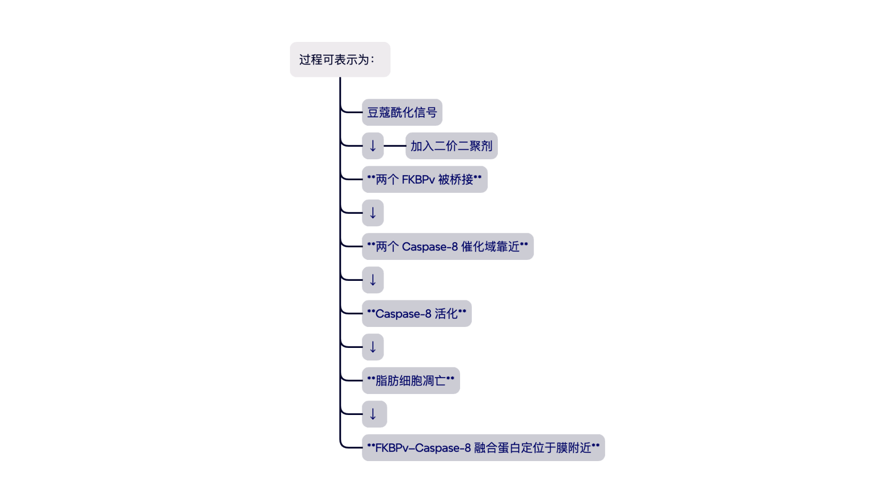

膜锚定的意义包括：

1. **限制融合蛋白的位置**：使其主要位于细胞膜内侧，而不是自由分散在整个胞质中。
2. **提高局部有效浓度**：蛋白从三维胞质空间被限制到近似二维的膜表面后，两个融合蛋白相遇和被二聚剂桥接的机会通常会增加。
3. **促进邻近诱导活化**：Caspase-8 是启动型 Caspase，其活化依赖分子间的空间靠近和二聚化。膜定位有利于形成适合二聚化的局部环境。
4. **模拟天然死亡受体信号平台**：天然外在性凋亡途径中，Caspase-8 会被招募到细胞膜上的 DISC。FAT-ATTAC 系统通过膜定位和化学二聚化，人为模拟这种"在膜附近集中并活化 Caspase-8"的过程。

因此，可以用一句话理解：

> **豆蔻酰化像是给融合蛋白加上一个疏水性的膜锚，使其聚集在细胞膜内侧；二聚剂再像桥梁一样将两个 FKBPv–Caspase-8 分子拉到一起，从而激活凋亡信号。**

---

## 7. Promoter（启动子）与组织特异性表达

### 启动子（promoter）

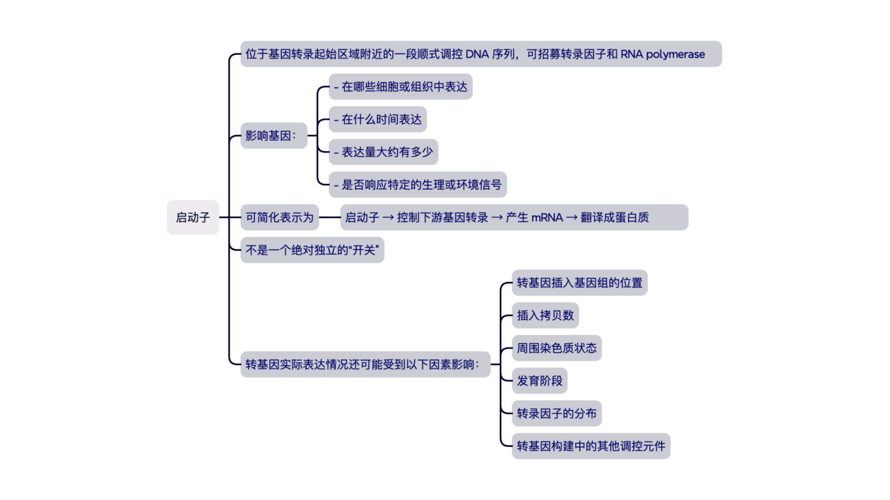

是位于基因转录起始区域附近的一段顺式调控 DNA 序列，可招募转录因子和 RNA polymerase。

#### 影响基因

- 在哪些细胞或组织中表达
- 在什么时间表达
- 表达量大约有多少
- 是否响应特定的生理或环境信号

#### 可简化表示为

启动子 → 控制下游基因转录 → 产生 mRNA → 翻译成蛋白质

启动子不是一个绝对独立的"开关"。转基因实际表达情况还可能受到以下因素影响：

- 转基因插入基因组的位置
- 插入拷贝数
- 周围染色质状态
- 发育阶段
- 转录因子的分布
- 转基因构建中的其他调控元件

### Fabp4／aP2 promoter

Fabp4 是 fatty acid-binding protein 4 的基因名称，过去也常称为 aP2（adipocyte protein 2）。

FAT-ATTAC 研究使用了由 B. Spiegelman 实验室提供的 5.4 kb minimal Fabp4 promoter，用来驱动下游 FKBPv–Caspase-8 融合蛋白的表达。该启动子在当时被广泛用于促进转基因在脂肪细胞中表达。

构建可简化为：

5.4 kb Fabp4 promoter
→ Myristoylation sequence－Caspase-8－FKBPv－FKBPv－FLAG
→ 主要在脂肪组织中表达融合蛋白

研究者首先利用 Northern blot 检查转基因 mRNA。最终选中的品系中，转基因表达出现在所检测的各个白色脂肪组织，以及肩胛间棕色脂肪组织；在论文检查的其他组织中没有检测到明显表达。研究者随后使用 RT-PCR 进一步验证，并通过抗 FLAG 的 Western blot 证明融合蛋白只在所检测的白色和棕色脂肪组织中可被检测到。在该论文选定的 FAT-ATTAC 转基因品系及其检测灵敏度下，转基因 mRNA 和融合蛋白主要局限于白色与棕色脂肪组织，在其他受检组织中未检测到明显表达。

研究发现，Fabp4/aP2 本身并非在所有条件下都绝对限于成熟脂肪细胞；它也可在巨噬细胞、部分内皮细胞及某些脂肪前体细胞群中表达。因此，现代实验中通常不会只凭启动子的名称判断特异性，而是需要对每一个转基因品系进行实际验证。

#### "作用域限定"的理解

把 Fabp4 启动子理解为 FAT-ATTAC 系统中的第一层作用域控制：

只有表达 Fabp4 启动子活性的细胞 → 才能制造 FKBPv–Caspase-8 融合蛋白 → 才具备响应 AP20187 的凋亡开关

AP20187 本身可以进入许多组织，但没有表达该融合蛋白的细胞缺少相应的人工执行模块，因此不会因为这一 ATTAC 构建而启动 Caspase-8 二聚化。

该系统同时具有：

- **空间控制**：主要由 Fabp4 启动子提供。
- **时间控制**：主要由 AP20187 给药时间提供。

---

## 8. Transgene / Transgenic Mouse（转基因动物）

**Transgene（转基因片段）**是研究者在体外人工设计并组装的一段 DNA。将该 DNA 导入小鼠基因组，并使其进入生殖系后，转基因便可以稳定遗传给下一代；携带这种外源 DNA 的小鼠称为 transgenic mouse（转基因小鼠）。

FAT-ATTAC 小鼠采用传统的受精卵原核显微注射法建立，其过程如下。

### 1. 构建转基因表达盒

研究者首先构建能够在脂肪细胞中表达诱导性凋亡蛋白的 DNA 片段，主要包含：

- 5.4 kb Fabp4／aP2 启动子
- 豆蔻酰化定位序列
- 人 Caspase-8 的 p20／p10 催化结构域
- 两个串联的 FKBPv 结构域
- FLAG 检测标签
- 兔 β-globin intron
- Polyadenylation sequence
- 3′ untranslated region

融合蛋白表达盒约为 2.8 kb，与 5.4 kb Fabp4 启动子连接后，去除质粒载体骨架，得到约 8.2 kb 的线性转基因 DNA 片段。

当该 DNA 片段整合进入生殖系细胞后，转基因就可以通过精子或卵细胞遗传给下一代。稳定携带并表达该转基因的小鼠称为 transgenic mouse，可简化表示为：

这里的 8.2 kb 指用于显微注射的线性 DNA 片段，而不是完整质粒载体。

### 2. 原核显微注射

研究者将约 8.2 kb 的线性 DNA 注射到来自 FVB 近交系小鼠受精卵的原核中。精卵继续发育后，外源 DNA 可能随机整合到小鼠某条染色体中。将胚胎移植并出生的小鼠称为潜在的 Founder mouse（创始鼠）。

> 因此必须建立并筛选多个独立品系。

### 3. 确认转基因整合

最初的转基因后代使用 Southern blot 检测。研究者以一段约 800 bp 的人 Caspase-8 DNA 作为探针，判断小鼠基因组中是否整合了 FAT-ATTAC 转基因。

### 4. 后代快速基因分型

转基因品系建立后，后续世代采用尾组织基因组 DNA 进行 PCR。PCR 使用人 Caspase-8 特异性引物，预期扩增产物为：600 bp。

- 检测到 600 bp 条带：该小鼠携带 FAT-ATTAC 转基因。
- 没有检测到条带：在该 PCR 条件下未检测到转基因。

需要注意，PCR 只能证明转基因 DNA 是否存在，不能证明：

- 转基因是否产生 mRNA
- 是否产生融合蛋白
- 表达量是否足够
- 表达组织是否符合预期

### 5. 筛选实际表达的品系

研究者共得到六个能够将转基因传递给后代的独立品系，即六个具有 **germline transmission（生殖系传递）**的品系。但是，Northern blot 检测显示，只有一个品系表现出明显的转基因 mRNA 表达，因此后续全部实验均使用这个品系。

这说明：转基因成功整合并可以遗传，不等于转基因一定能够有效表达。

不同品系之间的表达差异可能来自：

- 基因组插入位置不同
- 周围染色质开放程度不同
- 插入拷贝数不同
- 转基因发生重排
- 基因组中的位置效应

---

## 9. 常见小鼠模型（ob/ob、ob/+ 等）

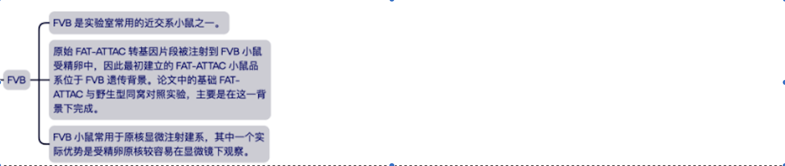
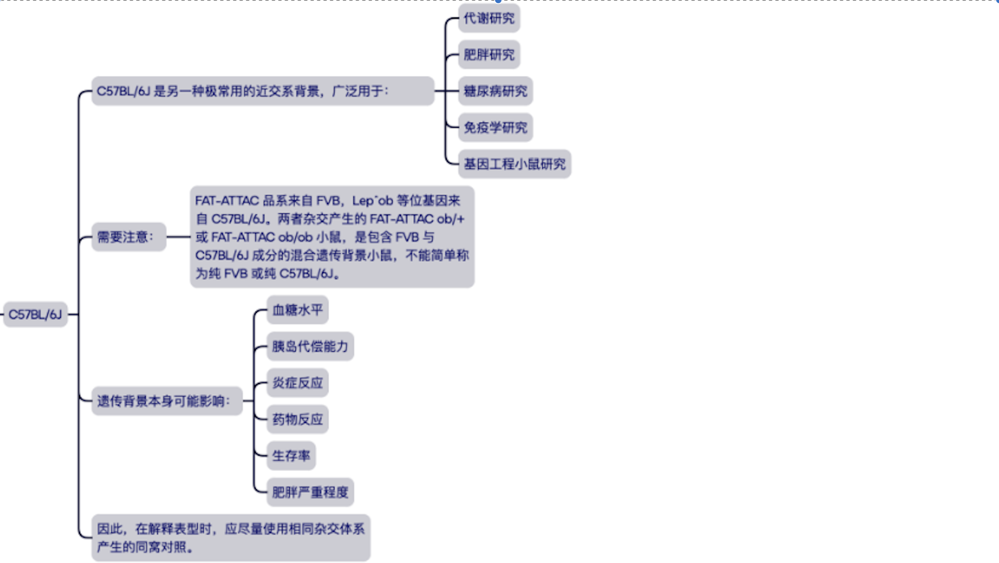
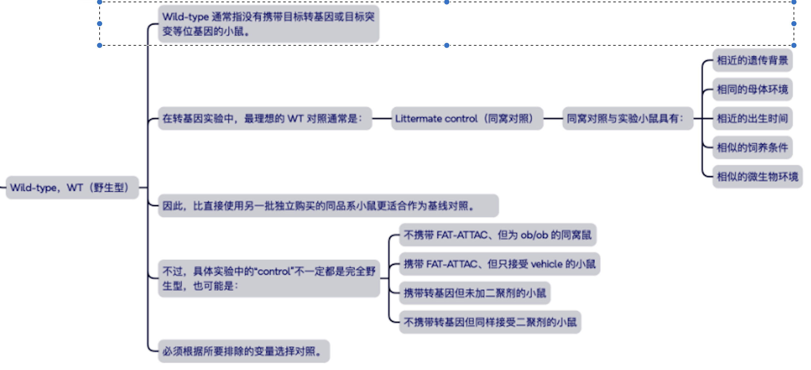

### ob/ob 小鼠（瘦素缺陷性肥胖模型）

ob 基因是过去称为 ob 的基因，现在正式名称为 Lep，leptin gene。该基因主要由脂肪细胞表达，编码：Leptin（瘦素）。

瘦素可以向中枢神经系统传递身体能量储备的信息，正常情况下具有：

- 抑制食欲
- 调节能量消耗
- 影响神经内分泌功能
- 参与葡萄糖和脂质代谢

### ob/ob 的基因型

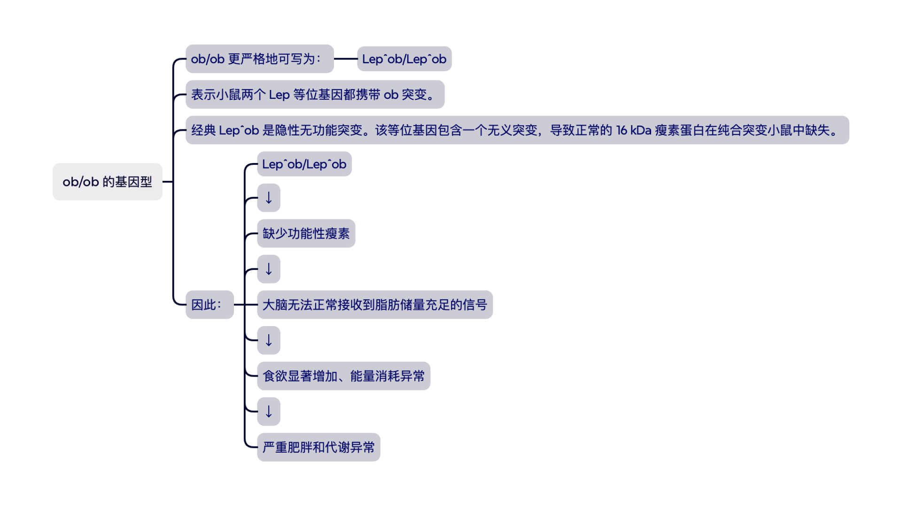

### ob/ob 小鼠通常表现为

- 食欲亢进
- 严重肥胖
- 胰岛素抵抗
- 高胰岛素血症
- 糖耐量异常
- 脂肪肝
- 生殖功能异常
- 体温和能量代谢异常

表型会明显受到遗传背景影响。在 C57BL/6J 背景上，ob/ob 小鼠早期可以出现高血糖，但随着胰岛肥大和胰岛素代偿，血糖可能在年龄增长后下降；其严重肥胖、胰岛素抵抗和糖耐量异常仍然存在。

更准确的说法为：C57BL/6J ob/ob 是严重瘦素缺陷性肥胖和胰岛素抵抗模型，可出现高血糖，但糖尿病严重程度和持续性取决于年龄与遗传背景。

### 为什么建立 FAT-ATTAC ob/ob 小鼠？

普通 FAT-ATTAC 小鼠在二聚剂处理后大量失去脂肪细胞，因此血液中的瘦素水平也大幅下降。随后观察到小鼠进食增加，就会出现一个问题：进食增加是否只是因为脂肪减少导致瘦素下降？

为区分这一点，研究者通过涉及 ob/+ 携带者的杂交，生成：

- FAT-ATTAC ob/ob
- 不携带 FAT-ATTAC 的 ob/ob 同窝对照

这两组小鼠从一开始都缺少功能性瘦素，因此两组之间的区别主要在于：

- 是否携带 FAT-ATTAC 转基因
- 二聚剂处理后是否发生脂肪细胞消融

论文的研究问题是：在两组小鼠都已经没有瘦素的情况下，进一步消除脂肪组织是否仍会改变进食及代谢？实验结果显示，脂肪消融后的 FAT-ATTAC ob/ob 小鼠仍进一步增加食物摄取，并出现更高的血糖、甘油三酯和更严重的肝脂肪变性。

因此作者认为：脂肪组织对进食行为和全身代谢的调节，并不能完全由瘦素一个因子解释；脂肪细胞还可能产生其他具有调节作用的信号。不过，这项实验并不能仅凭结果直接确定"究竟是哪一种脂肪因子"，只能说明存在瘦素以外的脂肪组织效应。

### ob/+ 小鼠

ob/+ 更严格地写为：Lep^ob/Lep^+，表示一条染色体携带 ob 突变，另一条携带正常的 Lep 等位基因。

由于 Lep^ob 属于隐性突变，ob/+ 小鼠通常能够由正常等位基因产生足够的瘦素，因此一般表现为：

- 不发生 ob/ob 型严重肥胖
- 血糖相对正常
- 基本保留正常的瘦素调节功能

但 ob/+ 并不等于真正的遗传学 WT，因为它仍携带一个突变等位基因。

### 为什么用 FAT-ATTAC ob/+ 检测 GSIS？

> GSIS（Glucose-stimulated insulin secretion，葡萄糖刺激性胰岛素分泌）

核心问题：当血糖快速升高时，胰岛 β 细胞能否相应增加胰岛素分泌？

ob/ob 小鼠本身已经具有：

- 严重肥胖
- 胰岛素抵抗
- 高胰岛素血症
- 血糖异常
- 胰岛代偿性改变

这些因素会干扰对 GSIS 的直接判断。因此，作者使用血糖相对正常的 FAT-ATTAC ob/+ 小鼠，在同一批小鼠脂肪消融前后进行葡萄糖灌胃比较。

实验结果为：

- 脂肪消融前：葡萄糖升高后，血清胰岛素正常增加。
- 脂肪消融后：尽管血糖急性升高，血清胰岛素未出现预期增加。
- 胰岛面积和形态没有明显异常。
- 精氨酸刺激仍可诱导胰岛素分泌。

因此，研究者推测：脂肪组织可能提供一种或多种支持最大程度 GSIS 的信号；脂肪细胞消失后，β 细胞对葡萄糖的特异性分泌反应下降。但作者也谨慎指出，不能完全排除没有明显组织学变化的 β 细胞内在功能异常。

> FAT-ATTAC 提供"什么时候清除脂肪细胞"的控制；ob/ob 提供"先把瘦素变量拿掉"的遗传背景；ob/+ 则提供代谢相对稳定的条件，用来更清楚地观察脂肪组织对葡萄糖刺激性胰岛素分泌的影响。
