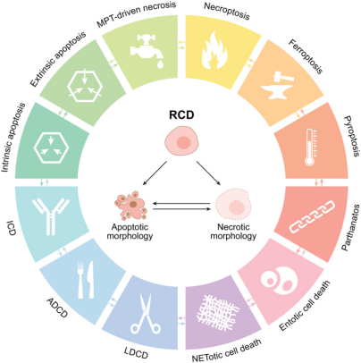
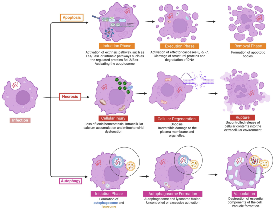
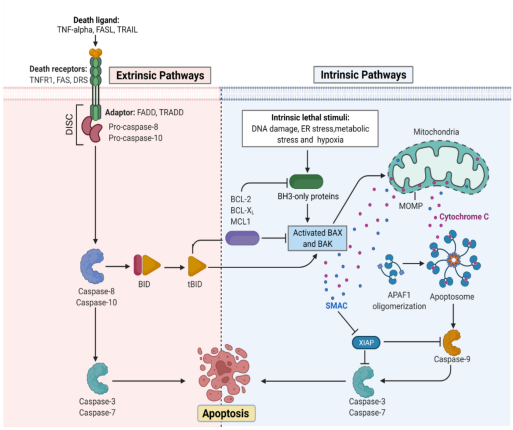
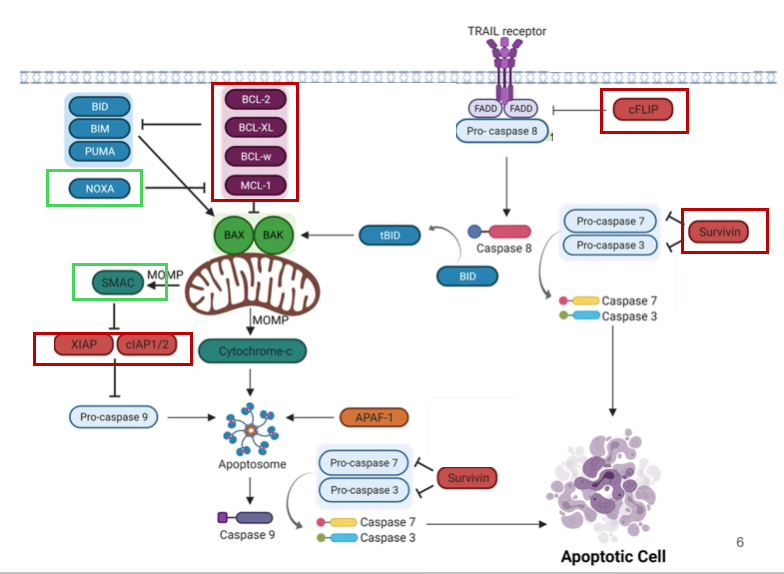
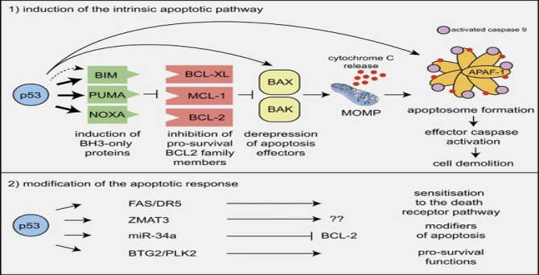
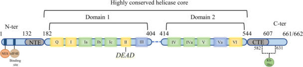
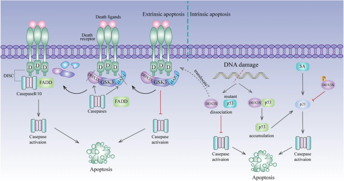

# The Function of DDX3 in the Apoptosis Pathway and Related Research

- DDX3在細胞凋亡途徑中的功能及相關研究。

## Cell Death細胞死亡

指細胞在生理或病理狀態下，喪失基本功能且不可逆地終止生命活動的過程

### 第一種 Regulated cell death

指廣義所有可以被基因或訊號通路調控的細胞死亡，包括生理性以及病理性。

哺乳動物細胞受到胞內或胞外微環境的不可逆擾動時，就會活化pathway，最終導致細胞死亡。每種受調控的細胞死亡 (RCD) 模式均由表現出高度互聯性的分子機制啟動和傳播。
此外，每種 RCD 類型均可表現出從完全壞死到完全凋亡的一系列形態特徵，以及從抗炎和耐受性到促炎和免疫原性的免疫調節特性。

要說明Why選擇Apoptosis：
Apoptosis 是被研究最深入、技術最成熟、與疾病關聯最直接的細胞死亡路徑，具備良好的應用性與治療潛力，是生物醫學研究首選的切入點。
Apoptosis 是最早被發現和系統化研究的 RCD 類型
Apoptosis 不會引發免疫反應或細胞內容物外洩，利於控制細胞去除、不破壞周圍組織。比起 necrosis 或 pyroptosis（會造成細胞膜破裂與發炎），apoptosis 較安全、可預期、可調控。
癌細胞常有抗凋亡特性，例如：p53 突變、Bcl-2 過度表現、caspase 活性缺失。
實驗技術成熟、試劑充足、標準化高

> ADCD ：自噬依賴性細胞死亡
> ICD ：免疫原性細胞死亡
> LDCD：溶小體依賴性細胞死亡
> MPT：粒線體通透性轉換

### 第二种 Programmed cell death

程序性死亡，為狹義的 RCD，是發育過程中出現的細胞死亡
主要目的是透過生物體內基因或調控因子來調控細胞死亡，協助個體正常發育或維持體內恆定，不受外源性環境所干擾。
Apoptosis即屬於PCD的一種

## Cell Death Morphotypes

- Type I : apoptosis細胞凋亡
  特徵為細胞膜膜泡化（blebbing）、細胞質皺縮、染色質濃縮與邊集（chromatin margination）、DNA 片段化、細胞質收縮
  最後斷裂為凋亡小體（apoptotic bodies），活化內部caspase誘導apoptosis產生。
  不引發發炎反應，被鄰近的吞噬細胞吞噬並降解。
- Type II : autophagy細胞自噬
  特徵為細胞質內形成大量自噬泡（autophagosomes）和溶酶體（lysosomes）
  兩者融合後形成「自噬溶體（autolysosomes）」，進行胞器降解
  細胞最終消耗完內部結構而死亡。
- Type III : necrosis細胞壞死
  當細胞遭受劇烈損傷（如缺血、中毒、機械傷害），細胞膜受損 → Ca²⁺ 從細胞外大量流入，會活化內部降解酵素及破壞粒線體功能，使細胞腫脹破裂，內部物質流出後引發強烈的發炎反應。


[^1] Prata, R. B. d. S., & Pinheiro, R. O. Cell Death Mechanisms in Mycobacterium abscessus Infection: A Double-Edged Sword. Pathogens, 14(4), 391. (2025).

目前Apoptosis 是被研究最深入、技術最成熟、與疾病關聯最直接的細胞死亡pathway
並且如同剛才所說Apoptosis 不會引發免疫反應或細胞內容物外洩
利於控制細胞去除、不破壞周圍組織，是比較安全、可預期、可調控的分子機制。

具備良好的應用性與治療潛力，是生物醫學研究首選的切入點。

1. Apoptosis 是最早被發現和系統化研究的 RCD 類型
2. Apoptosis 不會引發免疫反應或細胞內容物外洩，利於控制細胞去除、不破壞周圍組織。比起 necrosis 或 pyroptosis（會造成細胞膜破裂與發炎），apoptosis 較安全、可預期、可調控。
3. 癌細胞常有抗凋亡特性，例如：p53 突變、Bcl-2 過度表現、caspase 活性缺失。
4. 實驗技術成熟、試劑充足、標準化高

透過產生氧化應激，這種功能障礙導致粒線體膜電位喪失，從而導致細胞色素c釋放到細胞質中。細胞色素c的釋放使得凋亡小體形成，從而募集並活化caspase-9。隨後的級聯反應導致效應胱天蛋白酶（如caspase-3）的激活，從而促進必需蛋白質的裂解和細胞死亡

## apoptosis細胞凋亡

細胞在受到細胞壓力或DNA損傷的情況下，會啟動細胞凋亡來淘汰受損細胞。
主要分為兩種途徑，內源性和外源性。

### 外源性pathway

1. 由細胞外的訊號所觸發，進而啟動分子機制調控：
   他的作用途徑首先是由細胞外的Death Ligands（死亡配體）
   如 TNF-α、FASL、TRAIL作為訊號，接到細胞膜的 Death Receptors（死亡受體）：TNFR1、FAS、DR5

2. 接著這些接上ligands的 receptors會與 FADD / TRADD adaptor 蛋白、Pro-caspase-8 結合形成死亡誘導訊號複合體（DISC）
3. DISC會活化 Caspase-8，這種酵素有兩種作用：
   1. 活化 Caspase-3 / Caspase-7 進一步導致細胞凋亡
   2. 或caspase-8活化量不足以直接殺死細胞
      因此caspase-8切割 BID → 形成 tBID，tBID 刺激粒線體釋放cytochrome c，再透過內源性pathway回饋強化 caspase 活化。

### 內源性pathway

是由細胞內壓力或損傷觸發，如 DNA 損傷、缺氧、內質網壓力等。

1. 細胞在受到壓力或損傷後，會啟動促凋亡蛋白BH3-only ，接著他會活化孔蛋白 BAX 與 BAK
2. BAX 與 BAK在粒線體膜造成穿孔
   使粒線體外膜通透性增加，也就是Mitochondrial Outer Membrane Permeabilization（MOMP）

3. 接著因為MOMP增加，會使Cytochrome c 從粒線體內膜釋出到細胞質中，與 APAF1 結合形成 Apoptosome（凋亡體）
4. Apoptosome 活化 Caspase-9
5. Caspase-9 接著活化 Caspase-3 與 Caspase-7 → 執行凋亡



```
TNF (Tumor necrosis factor),
FASL (FS-7-associated surface antigen ligand),
TRAIL (Targeting TNF-related apoptosis-inducing ligand),
TNFR1 (Tumor necrosis factor receptor 1),
DRS (Death receptors),
DISC (death-inducing signaling complex),
BID (BH3 interacting-domain),
MCL (myeloid leukemia cell differentiation protein),
ER (Endoplasmic reticulum),
BAX (Bcl-2-associated X protein),
BAK (B-cell lymphoma 2 killer),
SMAC (Second mitochondria-derived activator of caspase),
XIAP (X-linked inhibitor of apoptosis protein),
MOMP (mitochondrial outer membrane permeabilization)

```

[^2] Wani, A. K., Akhtar, N . et al. Targeting Apoptotic Pathway of Cancer Cells with Phytochemicals and Plant-Based Nanomaterials. Biomolecules, 13(2), 194. (2023).

## Apoptosis-related proteins

- 一些抗凋亡蛋白，對於調控apoptosis扮演關鍵作用，

### Bcl-2 family 蛋白，

像是BCL-2、BCL-XL、MCL-1，
主要透過兩個途徑抑制內源性apoptosis：

1. 與 BH3-only 蛋白（如 BIM, BID, PUMA）結合 → 阻止其活化 BAX/BAK
2. 與 BAX/BAK 結合 → 阻止它們在粒線體膜形成孔洞（抑制 MOMP）

### c-FLIP（cellular FLICE-inhibitory protein）

類似 caspase-8 結構，
但缺乏催化活性，在外源性apoptosis中扮演 caspase-8 抑制劑的角色。
主要功能為阻止 caspase-8 在死亡誘導訊號複合體（DISC）中活化、干擾 Fas/TNF 死亡訊號，以及抑制 TRAIL、TNF-α 誘導的細胞凋亡。

### Survivin

屬於 IAP（Inhibitor of Apoptosis Protein）家族，功能為抑制caspase-3 與 caspase-9 活化，阻斷外源性apoptosis進行。
在正常成人組織中幾乎不表現，但在癌細胞中大量表現，同時也具有促進腫瘤細胞增殖與放射/化療抗性的特性。

### IAP蛋白

為細胞中的抗凋亡蛋白，
像是：XIAP（X-linked IAP）或cIAP1 / cIAP2，
這些 IAP 蛋白會抑制 caspase 的活性，防止細胞進入凋亡。
因此MOMP發生時，除了會釋放Cytochrome c外，也會釋放SMAC（Second Mitochondria-derived Activator of Caspases），
SMAC會結合到 IAP蛋白上，抑制其功能，使apoptosis途徑可以順利進展下去。

### 促凋亡蛋白NOXA

是一種小型的 BH3-only 蛋白質，是 p53 的直接下游標靶基因，
主要抑制 MCL-1的作用，使BAX/BAK可以被活化並進行更進一步的細胞凋亡。
（在 DNA 損傷或應激狀況下，p53 活化 → 上調 NOXA 表現。）


```
TNF（腫瘤壞死因子）、FASL（FS-7相關表面抗原配體）、TRAIL（靶向TNF相關凋亡誘導配體）、TNFR1（腫瘤壞死因子受體1）、DRS（死亡受體）、DISC（死亡誘導訊號複合物）、BID（BH3相互作用結構域）、MCL（髓性白血病細胞分化蛋白）、ER（內質網）、BAX（Bcl-2相關X蛋白）、BAK（B細胞淋巴瘤2殺手細胞）、SMAC（第二粒線體衍生的胱天蛋白酶活化劑）、XIAP（X連鎖凋亡蛋白抑制劑）、MOMP （粒線體外膜通透性）和 APAF（凋亡蛋白酶活化因子）
```

[^3] Fitzgerald, MC., O’Halloran, P.J., Connolly, N.M.C. et al. Targeting the apoptosis pathway to treat tumours of the paediatric nervous system. Cell Death Dis 13, 460 (2022).

## p53-induced Apoptosis

癌症都含有突變的 p53，
它是一種腫瘤抑制轉錄因子，可由多種細胞壓力激活，特別是 DNA 損傷，
p53平常表現量低，受到DNA損傷刺激後活化，並在細胞核中累積，啟動細胞凋亡途徑。

p53 在apoptosis中上調多種 BH3-only 蛋白（促凋亡蛋白）：BIM、PUMA、NOXA，
特別是研究發現p53直接標靶 PUMA 和 NOXA，這些促凋亡蛋白會結合並抑制 BCL-2、MCL-1、BCL-xL，
使BAX/BAK 可以被活化，促進MOMP的產生，使apoptosis可以進行。

p53 是一種快速週轉蛋白，通常透過泛素依賴性蛋白水解的快速降解維持在低水平 。
翻譯後修飾（如磷酸化）和與其他蛋白質的相互作用是穩定和激活通常壽命較短的 p53 的重要調節因素。
活化導致 p53 在細胞核中積累，在那裡它調節基因表達，並最終導致兩種明確的細胞反應，即細胞週期停滯和細胞凋亡。


[^4]Aubrey, B., Kelly, G., Janic, A. et al. How does p53 induce apoptosis and how does this relate to p53-mediated tumour suppression?. Cell Death Differ 25, 104–113 (2018).

## DEAD-box RNA Helicase 3 (DDX3)

一種 DEAD-box RNA 解旋酶，長度為 661 或 662 個胺基酸，分子量約 55 kDa。
為多功能蛋白質，參與RNA 轉譯、基因轉錄、細胞週期調控，以及腫瘤形成與發展。

結構是由兩個RecA-like 結構域所組成，
裡面包含12 個高度保守的基序（motifs），
這些motifs的功能主要為解旋 RNA 雙股、水解 ATP、調控 RNA 轉譯（如 Cyclin E1、Rac1）、以及調節基因轉錄（如 P21）

另外在N端和C端各有一段Extensions區域，
裡面有NTE和CTE協助Domain1/2解旋 RNA 雙股、水解 ATP，
另外在N端第 40 號胺基酸附近有一個eIF4E 結合位點（其他 DEAD-box 解旋酶沒有），
可以將特定 mRNA 引導至 eIF4E，促進其轉譯起始。

- NES 負責將 DDX3X 及其結合的 RNA 從細胞核輸出，RS-like 區則強化其與 RNA 和核輸出複合體（如 TAP）的互動，
  是 DDX3X 執行 RNA 輸出與轉譯功能的兩個關鍵結構元件。
- ATP binding & hydrolysis: Motifs Q, I, II (DEAD), VI
- RNA binding: Motifs Ia, Ib, Ic, IV, IVa, V, VI
- RNA–ATP communication: Motifs III, Iva
- 「DEAD」代表一段高度保守的胺基酸序列：D–E–A–D = Asp–Glu–Ala–Asp，這是 DEAD-box 蛋白中 ATP 結合/水解區的重要特徵，位於 motif II



#### General Information

DEAD-box RNA helicase family.
661–662 amino acids, ~72 kDa.
Plays critical roles in RNA metabolism, cell cycle control, and tumorigenesis.

#### Structure

Consists of two RecA-like domains (Domain 1 & 2).
Contains 12 conserved helicase motifs.
N-terminal Extensions (NTE)
Important for ATP hydrolysis
Nuclear export signal (NES)
eIF4E binding site (unique, ~aa 40)
C-terminal Extensions (CTE) :
Crucial for RNA duplex unwinding
RS-like domain (Arg/Ser-rich)
Interacts with TAP nuclear export receptor

[^5]Mo, J., Liang, H., Su, C. et al. DDX3X: structure, physiologic functions and cancer. Mol Cancer 20, 38 (2021).

## The Function of DDX3 in the Apoptosis Pathway

1. 外源性凋亡（Extrinsic Apoptosis）– 正常情況

- 死亡配體（Death ligands） 和 死亡受體（Death receptor） 結合。
- 受體內部的 死亡結構域（DD） 招募 FADD，組成 DISC（Death-inducing signaling complex）。
- FADD 活化 Caspase-8/10，啟動下游 caspase cascade → 細胞凋亡（Apoptosis）。

2. 外源性凋亡 – 被抑制的情況（DDX3X/GSK3/cIAP-1 複合體）

- 死亡受體被 DDX3X、GSK3、cIAP-1 組成的抗凋亡複合體覆蓋。
- 此複合體會阻止 FADD 結合 → 抑制 DISC 組成 → 抑制 caspase 活化。
- 若移除此複合體（例如 GSK3 抑制劑、DDX3X knockdown），凋亡訊號得以恢復。

3. 內源性凋亡（Intrinsic Apoptosis）– DNA 損傷觸發

- DNA 損傷（DNA damage） 可活化 p53。
- 活化的 p53 會誘導 p21、BAX 等促凋亡基因 表現 → 活化 caspase → 凋亡。

4. DDX3X 對 p53 路徑的調控

- DDX3X 可與 mutant p53 結合，抑制其凋亡活性（右中）。
- DDX3X 的磷酸化（P）可能干擾 SA（Stress Agent）→ p21 路徑。
- 這些作用會抑制 caspase cascade，降低凋亡發生。
  

[^6]Mo, J., Liang, H., Su, C. et al. DDX3X: structure, physiologic functions and cancer. Mol Cancer 20, 38 (2021).

## Apoptosis 檢測

Annexin V / PI：膜磷脂外翻（早期） / 破裂（晚期）
TUNEL assay：DNA 末端標記（晚期）
Western blot：Cleaved caspase-3、cleaved PARP
Hoechst / DAPI 染色：核濃縮與碎裂
