# Related Research of DDX3 and Apoptosis

介紹有關DDX3如何作用在Apoptosis pathway的相關研究

## Identification of an antiapoptotic protein complex at death receptors

[^1]Sun M, Song L, Li Y. et al. Cell Death Differ 15(12):1887-900. (2008). IF (2024): 15.4
死亡受體上抗凋亡蛋白複合物的鑑定，
這篇研究主要是想鑑定出一種與死亡受體相關的抗凋亡蛋白複合物，
這種蛋白複合物是由GSK3、DDX3 和cIAP-1所組成。
透過拮抗死亡訊號傳導來達到抑制凋亡的作用。
這篇的主要重點是想提及DDX3對外源性apoptosis的抗凋亡作用，
只會說到GSK3 和 DDX3 是否協同作用以抑制 TRAIL-R2 誘導的凋亡訊號傳導，
後面有關TRAIL-R2對GSK3的結合與活性影響不會做太多說明。
進一步研究了GSK3和DDX3拮抗死亡受體訊號傳導從而抑制凋亡訊號傳導的可能性，並專注於TRAIL-R2介導的訊號傳導。

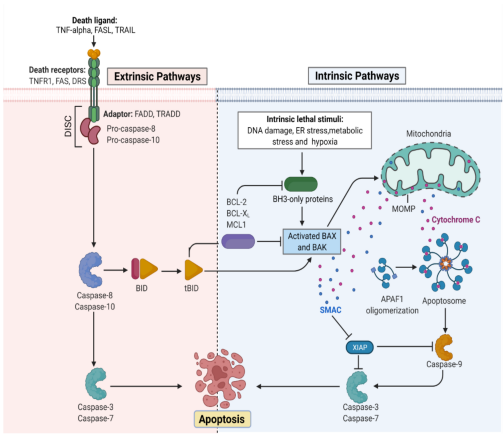

### Extrinsic Apoptosis

外源性凋亡的訊號傳遞，是由活化死亡受體啟動，導致細胞死亡。
最常見的能夠誘導細胞凋亡的死亡受體是 Fas 、TNF-R1、相關凋亡誘導配體受體 (TRAIL-R1/TRAIL-R2)。
這些死亡受體的刺激會導致受體三聚化，隨後募集 FADD和 caspase-8，形成死亡誘導訊號複合物 (DISC)。
DISC 的形成促進了 caspase-8/10 的自身激活，以及隨後效應 caspase（主要是 caspase-3、-6 和 -7）的激活，從而執行細胞死亡程序。
於是研究團隊想鑑定出一種與死亡受體相關的抗凋亡蛋白複合物，可用來抵銷死亡受體誘導的凋亡訊號傳遞。

進一步研究了GSK3和DDX3拮抗死亡受體訊號傳導從而抑制凋亡訊號傳導的可能性，並專注於TRAIL-R2介導的訊號傳導。
GSK3抑制DISC的形成，且GSK3與TRAIL-R2、DDX3和cIAP-1在受體上結合。
這些發現表明，GSK3、DDX3和cIAP-1在死亡受體上形成一種拮抗死亡訊號傳導的複合物，從而抑制凋亡訊號傳導。

該複合物包含糖原合成酶激酶3 (GSK3)、DDX3 和細胞凋亡抑制蛋白1 (cIAP-1)。是 Fas (CD95/Apo1)、TNF-R1 (p55/CD120a)、TNF 相關凋亡誘導配體受體1 (TRAIL-R1/DR4) 和 TRAIL-R2

### GSK3 impedes death receptor-induced caspase-3 activation

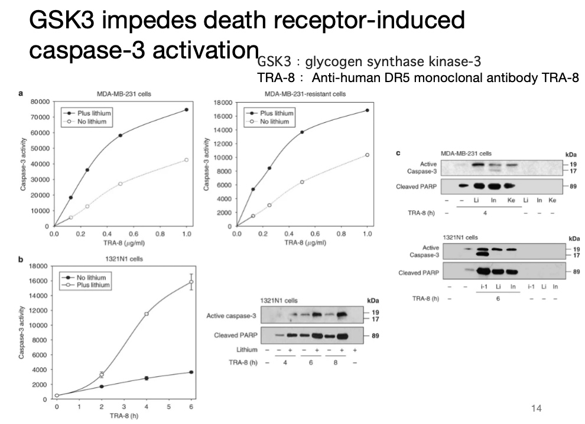
首先他們想先確定GSK3是否對外源性apoptosis 途徑具有抗凋亡作用

簡單介紹一下GSK3，
由 GSK3 α 和 GSK3 β 同功酶組成的激素，對死亡受體誘導的凋亡訊號具有抗凋亡作用，
並且根據現前的研究發現，鋰可以選擇性地抑制 GSK3，作為GSK3的抑制劑。
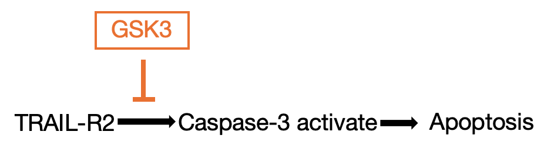

#### GSK3 impedes death receptor-induced caspase-3 activation

- A左：他們的實驗設計是先利用TRA-8 特異性刺激 MDA-MB-231 細胞中的 TRAIL-R2，誘導外源性apoptosis的產生。
  接著將實驗分成有添加GSK3鋰抑制劑和沒添加的組別，可以發現在抑制GSK3的組別中， caspase-3 活性提高 2 至 4 倍，且在較低濃度的 TRA-8 下增強效果最明顯。
- A右：另外他們設計了TRA-8抗藥性MDA-MB-231細胞的組別，也得到和左邊類似的結果，抑制GSK3仍能使TRA-8誘導的caspase-3活化增加約三倍。
  因此，不論是在抗藥性還是非抗藥性的MDA-MB-231細胞中，抑制GSK3均能顯著促進TRAIL-R2刺激所誘導的外源性凋亡訊號傳導。

- B：接著他們還用了另一種細胞1321N1 細胞，得到了和MDA-MB-231 細胞類似的結果，從western也可看見抑制GSK3的情況下，caspase3活化量相較非抑制的組別明顯增加。

- C：先前是利用鋰可作為GSK3的抑制劑，另外他們也用了一組結構多樣的GSK3選擇性抑制劑，來增強TRAIL-R2誘導caspase-3活化，結果顯示添加抑制劑的組別中會caspase3活化量增加。
  這些結果證明內源性GSK3對TRAIL-R2介導的凋亡訊號傳導具有強大的抗凋亡調控作用。

```
TRA-8 與 DR5（TRAIL-R2）結合
引發 DR5 的構型改變 → 聚合（trimerization）
招募 FADD（Fas-associated death domain protein）
活化 caspase-8（initiator caspase）
啟動外在性細胞凋亡途徑 → 活化 caspase-3, -7 等執行 caspase

20 mM鋰（Li）、5  μ M靛玉紅-3′-單肟（In）、5  μ M肯保酮（Ke）或50  μ M GSK3抑制劑1（i-1）。
```

#### GSK3 impedes death receptor-induced caspase-3 activation

- D: 前面他們探討抑制GSK3在刺激TRAIL-R2誘導的細胞凋亡中會促進caspase-3活化，接著他們想探討抑制 GSK3 會不會在刺激其他死亡受體後促進 caspase-3 活化。

1. 第一種為用 2E-12 刺激 TRAIL-R1 ，只會輕微活化 caspase-3 並導致 PARP 裂解，但在加了抑制劑後會明顯增強活化量。
2. 第二種為刺激 1321N1 細胞中的 Fas ，添加抑制劑會增強 caspase-3 活化和 PARP 裂解。
3. 第三種是以 TNF α刺激 MDA-MB-231 細胞，會導致微弱地隨著作用時間增加使 caspase-3 活化和 PARP 裂解，但這樣的結果在添加抑制劑後表現量大幅增強。

- E: 用鋰抑制GSK3可增強TRAIL-R2和TRAIL-R1介導的凋亡訊號，可以看到在細胞死亡測量的圖中可以看到，抑制GSK3的細胞死亡數是對照組的好幾倍

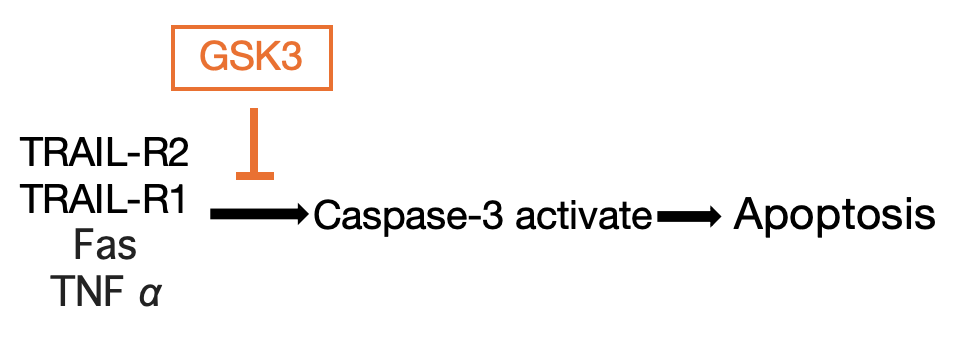

表明內源性GSK3可抑制由四種主要死亡受體（TRAIL-R2、TRAIL-R1、Fas、TNF α）刺激引起的caspase-3活化。

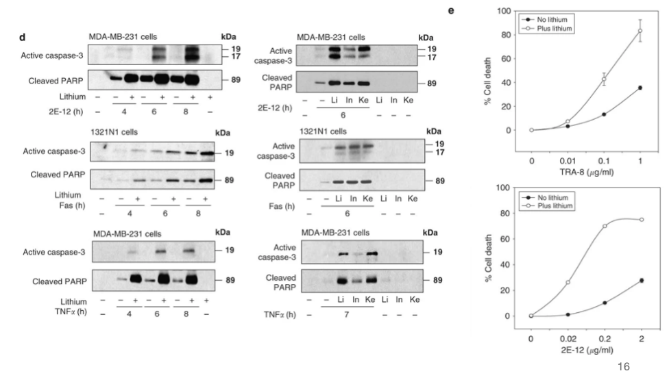

#### Inhibition of GSK3 promotes death receptor-induced caspase-8 activation and DISC formation

內源性GSK3對TRAIL-R2介導的凋亡訊號傳導具有強大的抗凋亡調控作用。

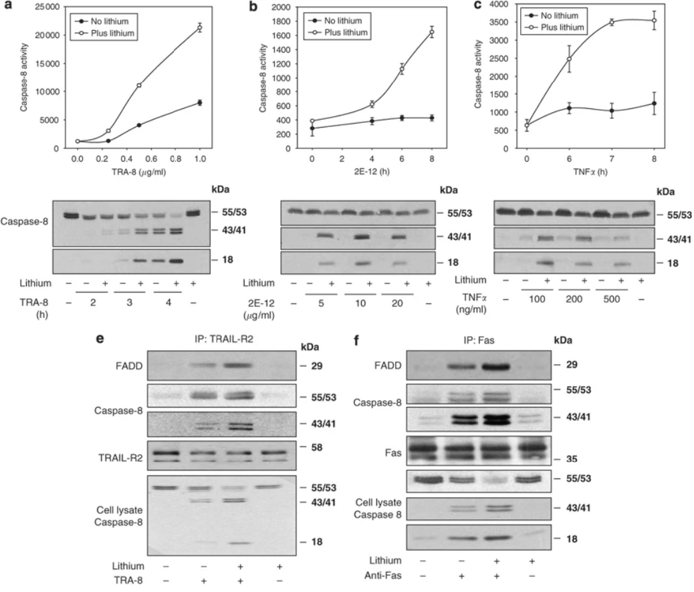

抑制 GSK3 可促進死亡受體誘導的 DISC 形成。

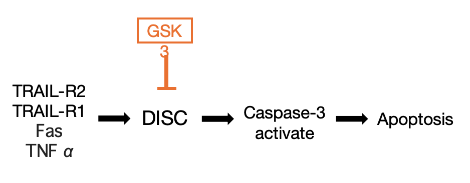

#### GSK3 associates with the antiapoptotic proteins DDX3 and cIAP-1

檢測了GSK3是否與外源性凋亡訊號路徑中可能具有抗凋亡作用的其他蛋白質（特別是DDX3和cIAP-1）結合，
這些蛋白質可能協同作用控制細胞凋亡。

- 圖3a：他們用來自各種細胞的GSK3β或GSK3α來進行共免疫沉澱實驗（親本和抗性MDA-MB-231細胞、1321N1、Jurkat和HeLa）， 發現DDX3和這些GSK3β或GSK3α均發生共免疫沉澱。證明DDX3可以和GSK3結合作用

但是他們查資料發現TRAIL-R2 刺激有可能會影響 GSK3 β與 DDX3的結合，透過破壞GSK3 β與 DDX3形成的抗凋亡複合物或使一種或多種蛋白質失活，從而使細胞凋亡可以繼續進行。
因此他們進行來確保這部分不對他們接下來要探討的實驗結果造成影響，結果發現TRAIL-R2 刺激會隨著時間誘導 caspase-3 的活化，並同時引起 DDX3 的裂解，導致完整的 DDX3 幾乎完全消除（圖 3b），但在裂解後，大量的 DDX3 片段仍然可以和GSK3β或GSK3α結合（圖 3c）。

- 圖 3d: 在抗性 MDA-MB-231 細胞中，效果明顯不同，因為 TRAIL-R2 刺激不會引起 DDX3 的裂解（）。

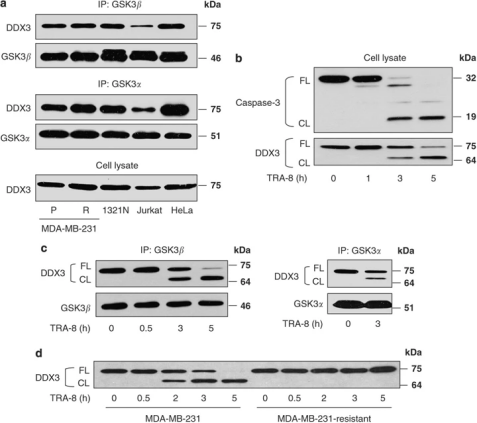

#### Apoptosis induced by DNA damage is selectively affected by DDX3

他們想更進一步了解TRAIL-R2 活化是否會經由 caspase 裂解 DDX3

- 圖3e：為了測試TRAIL-R2刺激後，DDX3的切割是否依賴caspase，我們將MDA-MB-231細胞與一種抑制劑BAF一起培養。
  BAF處理可阻斷TRAIL-R2刺激後兩種已知caspase底物PARP和Bid的切割，並完全阻斷DDX3的切割。
  這些結果表明，可以在圖中看到，有添加BAF的組別，DDX3和PARP都不再被切割。這證明TRAIL-R2刺激誘導的caspase依賴性DDX3切割，可能減輕DDX3對凋亡訊號的抑制。

考慮到全長DDX3在TRAIL-R2活化後會被消耗，我們檢測了GSK3β - DDX3複合物的動態。我們用BAF培養以阻斷細胞中DDX3的裂解，經TRAIL-R2刺激後，完整的DDX3仍然與GSK3β結合，並且額外的DDX3會和GSK3β結合 （圖3f）。
因此可以得出，抗凋亡蛋白GSK3和DDX3結合形成一個蛋白複合物，TRAIL-R2刺激會將DDX3募集到GSK3β - DDX3複合物中，並且在死亡受體活化後，DDX3被caspase裂解，導致全長DDX3被消耗。

接著他們想找出DDX3 與 GSK3β 結合的區域

圖3g：接著透過在NIH3T3細胞中表達DDX3的截短突變體，然後進行免疫共沉澱，檢查了DDX3與GSK3結合的區域。Co-IP GSK3β，可以看到 FL 和 ND2 都能被 pull-down，代表 DDX3-FL 和 ND2 都可以和 GSK3β 結合。
CD2、CD3、CD4都無法與 GSK3β 結合。因此研究團隊認為DDX3 C端的截短，會消除DDX3與GSK3 β的結合，因此前面DDX3降解後還可以和GSK3β共免疫沈澱，是因為caspase是透過裂解DDX3的N端，從而使含有C端的DDX3片段能夠繼續與GSK3結合。

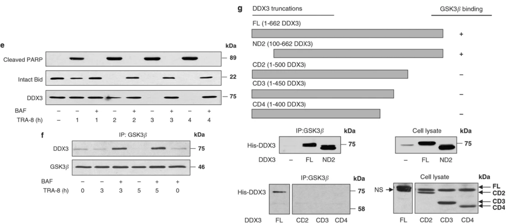

證明DDX3可以和GSK3結合作用，但TRAIL-R2 活化會經由 caspase裂解DDX3的N端，從而使含有C端的DDX3片段能夠繼續與GSK3結合。

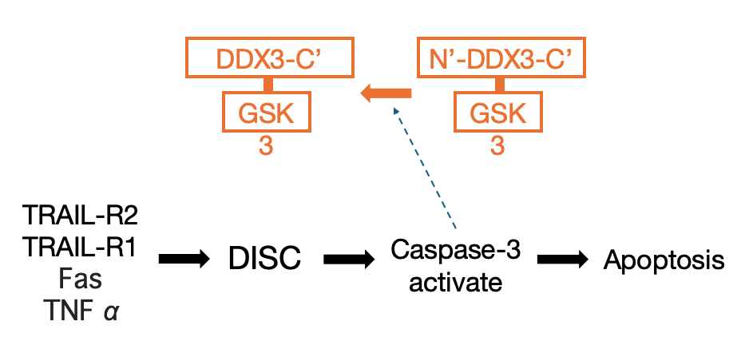
並且後續的研究中更進一步證明，GSK3 與 DDX3 和 cIAP-1 結合，在 TRAIL-R2 活化後，這些結合會被 GSK3 相關蛋白的裂解所破壞，但在抗凋亡細胞中，這些結合不會因 TRAIL-R2 刺激而改變。

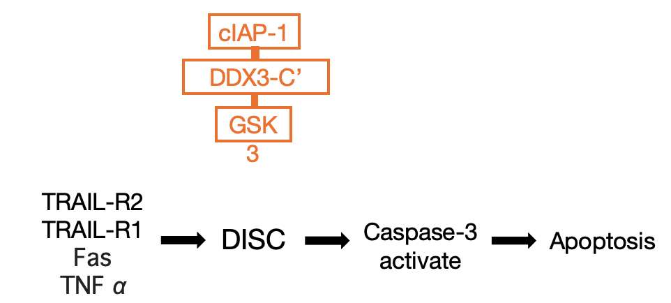

GSK3、DDX3 與 cIAP-1 可在未受刺激前覆蓋 TRAIL-R2 死亡受體，形成一個抗凋亡複合物。TRAIL-R1、TRAIL-R2、Fas 和 TNF 等死亡受體均受到此抗凋亡複合物的調控。
阻斷 GSK3 活性或降低 DDX3 表現可釋放死亡受體，使其在受刺激時產生更強的凋亡訊號。
TRAIL-R2 刺激會使 GSK3 失活、DDX3 和 cIAP-1 被裂解，解除對凋亡訊號的抑制。
TRAIL-R2 的活化快速導致 DDX3 被切割，可能是為了移除其抗凋亡功能。
靶向 GSK3 與 DDX3 可作為一種策略，提升癌細胞對死亡受體誘導之凋亡的敏感性。

我們發現死亡受體被一個包含GSK3、DDX3和cIAP-1的抗凋亡蛋白複合物所覆蓋。刺激死亡受體會使這些蛋白質失去活性，導致GSK3失去活性以及DDX3和cIAP-1的裂解，從而允許凋亡訊號繼續進行。
