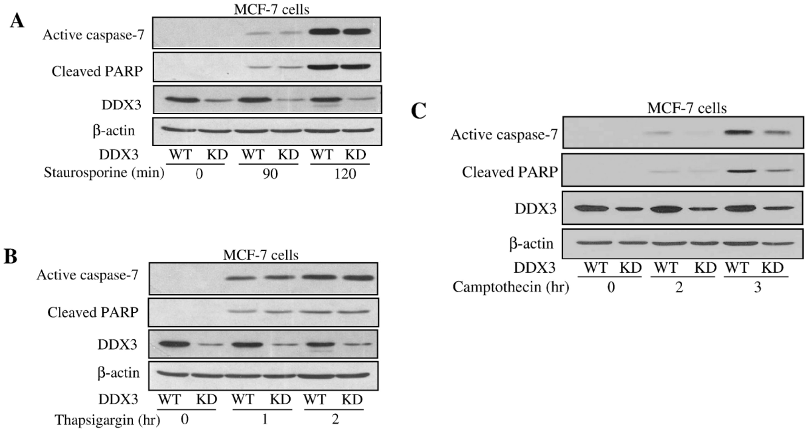
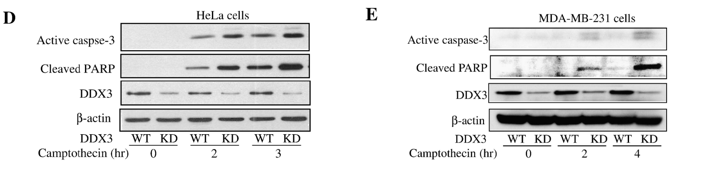
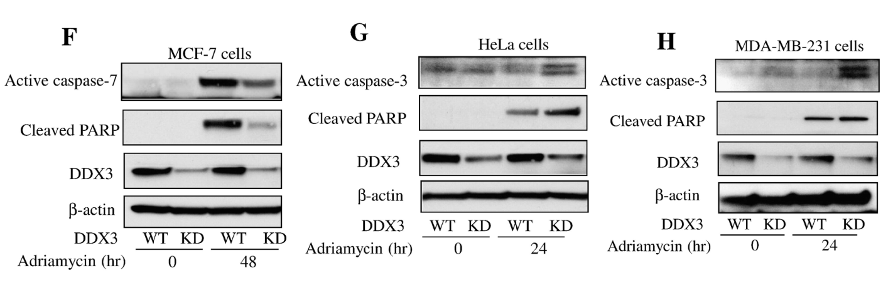
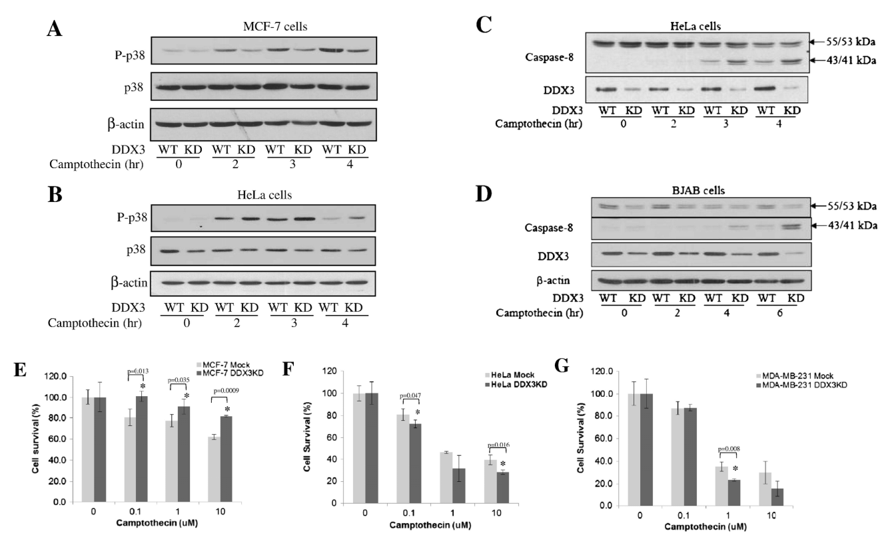

## DDX3 regulates DNA damage-induced apoptosis and p53 stabilization

[^1]Sun M, Zhou T, Jonasch E. et al. Biochimica et Biophysica Acta-Molecular Cell Research 1833(6):1489-97.(2013). IF (2024): 3.7

接DDX3 調控 DNA 損傷所誘導的細胞凋亡和 p53 穩定性，
這篇研究主要是想證明DDX3如何參與DNA damage後對內源性 apoptosis訊號傳導的調控，以及是否促進p53在細胞核內的滯留和累積，
重點主要在DDX3對Apoptosis的影響，關於DDX3對p53的累積和穩定性的部分就不會特別說。

### Apoptosis induced by DNA damage is selectively affected by DDX3

MCF-7 細胞：人類乳腺癌細胞

首先他們想測試DDX3 是否參與調控內源性 apoptosis。
他們先利用三種刺激內源性apoptosis的刺激物 ： staurosporine、thapsigargin、camptothecin來誘導內源性apoptosis，透過測量caspase 3或 7 的活化和PARP的裂解來檢測apoptosis訊號，並且實驗和對照組分別用WT KD DDX3 的細胞來檢查 DDX3 的調控作用。

- 從圖ａ和圖ｂ可以看見：
  不論是用1 μM staurosporine或是用 1 μM thapsigargin處理，都導致 MCF-7 細胞中 caspase-7 活化和PARP的裂解會隨時間增加，並且在 KD DDX3 並不會改變這樣的結果。
- 從圖c可以看見：
  與其他兩種相反，在 10 μM 喜樹鹼處理後，敲低 DDX3反而會導致 MCF-7 細胞中 caspase-7 活化和 PARP 裂解降低

> PARP: Poly (ADP-ribose) polymerase

這些結果表明，DDX3 並不像影響外在凋亡訊號那樣會普遍影響內在凋亡訊號，但 DDX3 選擇性地調控由 DNA damage引起的內在凋亡訊號 。

星形孢菌素，一種激酶抑制劑，眾所周知，它可以誘導幾乎所有類型細胞的內在細胞凋亡
毒胡蘿蔔素，它抑制內質網(ER)中的Ca ++ -ATPase ，導致 ER 壓力誘導的細胞凋亡

他們選用Hela細胞來進行實驗（含非功能性p53：該細胞含有野生型 p53由於人類乳頭瘤病毒E6 蛋白的存在，其功能被破壞）。而 MCF-7 細胞則負責表達野生型功能性p53。

- 從圖d和圖e可以看見：
  用10 μM camptothecin處理，導致 Hela細胞中 caspase-3 活化和PARP的裂解會隨時間增加，並且在 KD DDX3 的組別中表現量更加明顯。這與先前報告的 DDX3 抑制外在凋亡訊號傳導相似
  接著他們選用另一種和hela細胞一樣含有突變p53的細胞，MDA-MB-231，也得到和Hela細胞類似的結果。
  證明 DDX3 可以抑制 nonfunctional p53 細胞中 DNA damage所誘導的凋亡。

接著他們以10  μM 阿黴素處理含有 DDX3 或敲低 DDX3 的 MCF-7、HeLa 和 MDA-MB-231 細胞 24 或 48 小時。
在 MCF-7 細胞中敲低 DDX3 可減少細胞凋亡，
但在 HeLa 和 MDA-MB-231 細胞中敲低 DDX3則會增加細胞凋亡。
這些結果表明，DDX3會因為p53為 functional 或 nonfunctional 來選擇性調控 DNA damage誘導的caspase活化。

為了進一步研究 DDX3 在如何調控具有functional 和 nonfunctional p53的細胞中的細胞凋亡，他們檢查了 p38 的活化，因為 p38 和 p53信號通路可以在DNA損傷反應中相互調節，根據先前的研究曾發現，p38 參與了外在凋亡pathway，而 DDX3 調節在該通路中喜樹鹼處理後，以免疫印跡法測定 p38 的活性磷酸化水平，發現 DDX3 敲低減弱了MCF-7 細胞（functional p53）中 p38 的活化（圖 2 A），但增強了 HeLa 細胞（nonfunctional p53）中p38 的活化（圖 2 B）。

DDX3 的消耗會促進死亡受體刺激引起的 caspase-8 活化。先前研究已經證實 caspase-8 介導的外在凋亡途徑會在 DNA 損傷後被激活，所以他們想測試了這是否受 DDX3 的調節。
在 HeLa 細胞（圖 2 C）和表達突變型、無功能性 p53 的 I 型 BJAB 細胞（圖 2 D）中，DNA 損傷後，Caspase-8 被激活，且 DDX3 消耗會增加。雖然這不太可能是 DDX3 的唯一作用，因為檢測到 caspase-3 活化增加的時間早於 caspase-8 活化的時間，但這些結果與先前的報告一致，即死亡受體可以在 DNA 損傷後被激活，而敲低 DDX3 會促進死亡受體誘導的凋亡訊號傳導。

另外他們還測量了 MCF-7（圖 2 E）、HeLa（圖 2 F）和 MDA-MB-231 細胞（圖 2 G）的細胞存活率。KD DDX3 可增加具有功能性 p53 的 MCF-7 細胞的細胞存活率，但會降低具有非功能性 p53 的 HeLa 細胞和具有突變 p53 的 MDA-MB-231 細胞的細胞存活率。這也更加應證了DDX3 會促進喜樹鹼誘導的表達功能性野生型 p53 的細胞凋亡，但阻礙非功能性 p53 的細胞凋亡

p38 ➝ p53：磷酸化 p53、穩定與活化轉錄功能，p38 可透過磷酸化增強 p53 活性與穩定性
p53 ➝ p38：誘導上游激酶、壓力感知蛋白（如 GADD45），p53 可促進 p38 的活化，也可能引入負回饋機制
相互回饋：透過 MAPK phosphatase（MKP-1）調控p53 表現產物可抑制過度活化的 p38，維持細胞穩定
