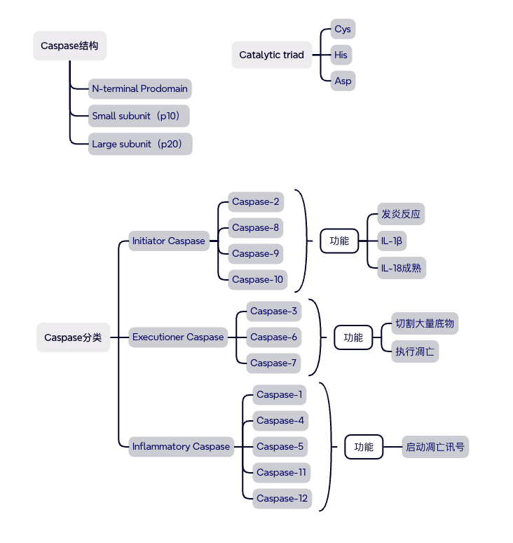

### Caspase（半胱天冬酶）家族

Caspase(Cysteine-dependent Aspartate-directed Protease)是一群半胱氨酸蛋白酶
特点

- Active-site Cys
- 切割Asp之后的肽键
- 以前体（Procaspase）存在
- 活化后才能发挥功能

分两类角色：

- Initiator caspase（起始）：
  如 caspase 8，负责"点火"，一旦激活就启动级联反应。它需要二聚化才能激活——这正是本系统利用的开关点。
- Effector / executioner caspase（效应/执行）：如 caspase 3，是级联下游的"执行者"，真正去切割细胞里的关键蛋白导致死亡。
  文中检测"细胞真的在凋亡"的证据之一，就是死亡细胞同时对 activated caspase 3（活化的 caspase 3） 染色阳性——说明级联确实从 8 传到了 3。

