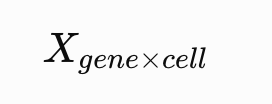

## 确认几个最关键的信息：

- 每个 sample 是一条鱼还是多条鱼 pooling？
- Control / Treatment 怎么分？
- 有几个 biological replicates？
- 斑马鱼什么组织？
- 什么发育时期，hpf / dpf / adult？
- 数据是 10x scRNA-seq 吗？
- reference genome / annotation 用的什么版本？
- 是否有 GFP、mCherry 或其他 transgene？

理解：
Barcode + UMI + Count matrix
↓
检查数据目录
↓
确定数据类型
↓
整理 sample metadata
↓
确定分析起点

## tree

### tree -L 3

├── rawdata
│   ├── bmE3.7z
│   ├── cdk_13_filter_matrix.7z
│   ├── filter_matrix_KI.7z
│   ├── healthbmy.7z
│   ├── KIO3_filterd_matrix.7z
│   ├── zebra_Ag-mof
│   │   ├── 01.data
│   │   ├── 02.count
│   │   ├── 03.analysis
│   │   ├── 04.report
│   │   └── output
│   ├── zebra_Zif-67
│   │   ├── 01.data
│   │   ├── 02.count
│   │   ├── 03.analysis
│   │   ├── 04.report
│   │   ├── log
│   │   └── output
│   └── 坏疽病.tar
└── zif-8
├── md5.md5
├── ProductionTable.xls
├── Report_F24A040005442_DANxqedN_cn.pdf
├── Report_F24A040005442_DANxqedN_en.pdf
├── zebra_ZIF-8
│   ├── 01.data
│   ├── 02.count
│   ├── 03.analysis
│   ├── 04.report
│   ├── log
│   └── output
├── ZIF-8_cDNA
│   ├── E150040550_L01_54_1.fq.gz
│   ├── E150040550_L01_54_2.fq.gz
│   ├── E150040550_L01_54.base.png
│   ├── E150040550_L01_54.qual.png
│   ├── E150040550_L01_62_1.fq.gz
│   ├── E150040550_L01_62_2.fq.gz
│   ├── E150040550_L01_62.base.png
│   ├── E150040550_L01_62.qual.png
│   ├── E150040550_L01_70_1.fq.gz
│   ├── E150040550_L01_70_2.fq.gz
│   ├── E150040550_L01_70.base.png
│   └── E150040550_L01_70.qual.png
└── ZIF-8_oligo
├── ZIF-8_oligo_1.fq.gz
├── ZIF-8_oligo_2.fq.gz
├── ZIF-8干预胚胎\_oligo.base.png
└── ZIF-8干预胚胎\_oligo.qual.png

### tree -L 4 zif-8/zebra_ZIF-8/02.count

zif-8/zebra_ZIF-8/02.count
├── barcodeTranslate.hex.txt
├── barcodeTranslate.txt
├── beads_barcodes.txt
├── cellNumber.merge.png
├── filter_matrix
│   ├── barcodes.tsv.gz
│   ├── features.tsv.gz
│   └── matrix.mtx.gz
├── raw_matrix
│   ├── barcodes.tsv.gz
│   ├── features.tsv.gz
│   └── matrix.mtx.gz
├── saturation_cDNA.png
├── saturation_cDNA.xls
├── similarity.all.csv
├── similarity.droplet.csv
└── singlecell.csv

### tree -L 3 zif-8/zebra_ZIF-8/output

zif-8/zebra_ZIF-8/output
├── anno_decon_sorted.bam
├── anno_decon_sorted.bam.bai
├── attachment
│   ├── RNAvelocity_matrix
│   │   ├── barcodes.tsv.gz
│   │   ├── features.tsv.gz
│   │   ├── spanning.mtx.gz
│   │   ├── spliced.mtx.gz
│   │   └── unspliced.mtx.gz
│   └── splice_matrix
│   ├── barcodes.tsv.gz
│   ├── features.tsv.gz
│   └── matrix.mtx.gz
├── filter_feature.h5ad
├── filter_matrix
│   ├── barcodes.tsv.gz
│   ├── features.tsv.gz
│   └── matrix.mtx.gz
├── metrics_summary.xls
├── raw_matrix
│   ├── barcodes.tsv.gz
│   ├── features.tsv.gz
│   └── matrix.mtx.gz
├── singlecell.csv
└── zebra_ZIF-8_scRNA_report.html

### tree -L 3 zif-8/zebra_ZIF-8/03.analysis

zif-8/zebra_ZIF-8/03.analysis
├── cluster.csv
├── cluster.png
├── filter_feature.h5ad
├── filter_QCplot.png
├── marker.csv
├── QC_Clutser.h5ad
├── raw_qc.xls
└── raw_QCplot.png

## 学这四个即可：

FASTQ
↓ 比对 + barcode/UMI 处理
Gene × Cell count matrix
↓
filtered matrix
↓
Seurat 分析

## 数据分类

| 目录/文件             | 大概率是什么                 | 现在重要度 |
| --------------------- | ---------------------------- | ---------: |
| `ZIF-8_cDNA/*.fq.gz`  | cDNA 原始测序 reads          |   暂时不用 |
| `ZIF-8_oligo/*.fq.gz` | barcode/oligo 相关原始 reads |   暂时不用 |
| `*.base.png`          | 碱基组成 QC                  |   暂时不用 |
| `*.qual.png`          | 测序质量 QC                  |   暂时不用 |
| `01.data`             | 上游整理后的输入/数据        |         ★★ |
| `02.count`            | **表达定量 / count matrix**  |      ★★★★★ |
| `03.analysis`         | 已做的聚类、marker 等分析    |        ★★★ |
| `04.report`           | 分析报告                     |       ★★★★ |
| `output`              | 汇总输出                     |       ★★★★ |
| `ProductionTable.xls` | 样本/建库/测序信息           |      ★★★★★ |
| PDF report            | 测序及分析报告               |      ★★★★★ |

## 前期知识

### matrix.mtx.gz

核心表达矩阵：

gene×cell
​

里面就是 UMI counts。

### features.tsv.gz

每一行对应一个 gene / feature。

通常类似：

ENSDARG00000000001 geneA Gene Expression
ENSDARG00000000002 geneB Gene Expression

所以它决定：

matrix 的每一行是谁。

### barcodes.tsv.gz

类似：

AAACCCAAG...
AAACCCAAG...
AAACCCAAG...

每一行代表一个 cell barcode。

也就是：

matrix 的每一列是谁。

### raw_matrix 和 filter_matrix 有什么区别？

#### raw_matrix

包含大量 droplet barcode：

```
raw_matrix

真正有细胞的 droplets
+
空 droplets
+
低质量 droplets
+
背景 RNA
```

#### filter_matrix

经过 cell calling：

```
raw droplets
↓
判断哪些 barcode 像真正细胞
↓
filter_matrix
```

所以：

filtered 不等于“已经完成所有 QC”。

它只是说：

上游软件认为这些 droplets 很可能包含细胞。

你后面仍然需要做：

nFeature
nCount
mitochondrial %
doublet

等 QC。

## 先不动的知识

filter_feature.h5ad 是什么？

这是：

AnnData 格式的单细胞对象。

主要是 Python / Scanpy 使用：

adata

它可能已经包含：

```
expression
metadata
QC
PCA
UMAP
cluster
```

但你准备走 Seurat/R 的话：

暂时不需要它。

RNAvelocity_matrix 是什么？

你这里：

spliced.mtx.gz
unspliced.mtx.gz
spanning.mtx.gz

这是后面做：RNA velocity用的。

可以粗略理解为：

```
unspliced RNA
↓
spliced RNA
↓
推测细胞状态变化方向
```

现在完全不要碰。

等你：

QC
→ clustering
→ annotation

做完以后，如果实验问题需要 trajectory / differentiation，再回来研究。

splice_matrix 也先不要碰

同理，这是额外的 RNA splicing information。

第一轮标准 scRNA workflow 不需要。

anno_decon_sorted.bam 呢？

这是上游 reads alignment 的 BAM 文件。

大概率是已经：

reads
→ genome alignment

后的结果。

第一次学习分析：

暂时不需要。

保留就行。

03.analysis 反而非常有价值，但现在把它当“参考答案”

你现在有：

cluster.csv
cluster.png
marker.csv
filter_QCplot.png
raw_QCplot.png

## 学习方式：

### 先自己做，然后再跟测序公司的结果比较。

例如：

你自己：
QC → 23,500 cells

公司：
QC → 24,100 cells

然后问：

为什么差 600？

再比较：

cluster number
marker genes
UMAP structure

这会比纯看教程学得快很多。

### 暂时只关注这几个文件

zif-8/zebra_ZIF-8/02.count/filter_matrix/
├── barcodes.tsv.gz
├── features.tsv.gz
└── matrix.mtx.gz

zif-8/zebra_ZIF-8/02.count/singlecell.csv

zif-8/zebra_ZIF-8/output/metrics_summary.xls

#### 前三个用于真正分析。

#### 后两个用于了解测序公司上游 QC 信息。

## 第一个真正的操作

在终端先执行：

zcat zif-8/zebra_ZIF-8/02.count/filter_matrix/features.tsv.gz | head

然后：

zcat zif-8/zebra_ZIF-8/02.count/filter_matrix/barcodes.tsv.gz | head

再：

zcat zif-8/zebra_ZIF-8/02.count/filter_matrix/barcodes.tsv.gz | wc -l

还有：

zcat zif-8/zebra_ZIF-8/02.count/filter_matrix/features.tsv.gz | wc -l

这样我们会立刻知道：

genes = ?
cells = ?
再检查 features 怎么命名

这个对斑马鱼尤其重要。

例如如果结果是：

ENSDARG00000101234 kdrl
ENSDARG00000012345 mpx

很好。

### 如果只有：

ENSDARG00000...

那以后 annotation 就需要额外做 ID mapping。

然后你就可以第一次打开 Seurat 了

建立一个新的 R 脚本：

scripts/00_import.R

代码暂时只写到这里：

library(Seurat)

data_dir <- "zif-8/zebra_ZIF-8/02.count/filter_matrix"

counts <- Read10X(
data.dir = data_dir
)

zif8 <- CreateSeuratObject(
counts = counts,
project = "ZIF8",
min.cells = 0,
min.features = 0
)

zif8

注意这里我特意写：

min.cells = 0
min.features = 0

### 当前阶段不希望导入的时候偷偷过滤任何东西。

我要你先看原始 filtered matrix 长什么样，然后再自己决定 QC。

接着只执行这些检查
dim(zif8)

应该得到：

genes × cells

然后：

head(rownames(zif8))

再：

head(colnames(zif8))

以及：

head(zif8[[]])

这一步非常重要。

zif8[[]] 会看到类似：

orig.ident nCount_RNA nFeature_RNA
ZIF8 6231 1840
ZIF8 10542 2922
ZIF8 ... ...

然后你第一次真正接触：

nCount_RNA

这个 cell 总共有多少 UMI：

nCount
cell
​

=
gene
∑
​

count
nFeature_RNA

这个 cell 有多少 gene 的 count > 0：

nFeature
cell
​

=#{gene:x>0}

## 需要学习的理论

### 只理解

一个液滴里有没有细胞？
↓
Cell barcode：这个 RNA 属于哪个液滴/细胞
↓
UMI：这个细胞里有多少个原始 RNA 分子
↓
把所有基因、所有细胞统计起来
↓
Gene × Cell matrix
↓
所有可能液滴组成 raw matrix
↓
cell calling 判断哪些液滴真的有细胞
↓
留下来的组成 filtered matrix
↓
对每个细胞统计：
nCount_RNA
nFeature_RNA

#### Cell barcode

Cell barcode 是“细胞身份证”。

准确一点说，是：

给同一个液滴中的 RNA 都打上同一组 barcode，从而知道这些 RNA 来自同一个捕获事件/细胞。

假设有三个细胞：
Cell A / Cell B / Cell C

系统可能给它们：

```
Cell A → AAACGTA...
Cell B → ACTGTCA...
Cell C → GGTACCA...
```

之后你看到一条 RNA read：

```
Cell barcode = AAACGTA
Gene         = kdrl
```

就知道：

kdrl 这条 RNA 来自 Cell A。
测序的时候，并不是：

Cell A / Cell B / Cell C 单独测序

最后其实大量细胞的 DNA/cDNA 会混在一起测。

所以必须提前在分子上留下标签：

你来自 Cell A / Cell B / Cell C

否则测完以后根本分不出来。

barcodes.tsv.gz

里面大概是：

```
AAACCCAAGT...
AAACCCACAA...
AAACCCAGTC...
```

每一行就是一个 cell barcode。

因此：barcodes.tsv.gz 行数=filtered matrix 中的细胞数

#### UMI

#### Gene × Cell matrix

#### raw matrix

#### filtered matrix

#### cell calling

#### nCount_RNA

#### #### nFeature_RNA

这 8 个概念。

### 学完马上在自己的 ZIF-8 数据上看它们。

我还建议你先验证两份 filter_matrix 是不是重复文件

你这里同时有：

02.count/filter_matrix

和：

output/filter_matrix

非常可能只是同一份结果复制了一份。

可以运行：

md5 \
zif-8/zebra_ZIF-8/02.count/filter_matrix/matrix.mtx.gz \
zif-8/zebra_ZIF-8/output/filter_matrix/matrix.mtx.gz

再比较：

md5 \
zif-8/zebra_ZIF-8/02.count/filter_matrix/features.tsv.gz \
zif-8/zebra_ZIF-8/output/filter_matrix/features.tsv.gz
md5 \
zif-8/zebra_ZIF-8/02.count/filter_matrix/barcodes.tsv.gz \
zif-8/zebra_ZIF-8/output/filter_matrix/barcodes.tsv.gz

如果 MD5 分别一致：

就是同样的数据。

以后固定用：

02.count/filter_matrix

即可，避免混乱。

## 整个项目现在可以标成：

FASTQ ✅ 公司做完
↓
Alignment ✅ 公司做完
↓
UMI counting ✅ 公司做完
↓
Cell calling ✅ 公司做完
↓
filtered matrix ← ★ 你现在在这里
↓
QC 下一阶段
↓
Normalization
↓
HVG
↓
PCA
↓
Clustering
↓
UMAP
↓
Marker
↓
Annotation
↓
DE

## 结束后

下一次把这两个终端输出：

zcat .../features.tsv.gz | head
zcat .../barcodes.tsv.gz | wc -l

以及 R 中：

zif8
dim(zif8)
head(zif8[[]])

贴给我。下一步我们就正式开始你的第一次真实斑马鱼 scRNA-seq QC。
