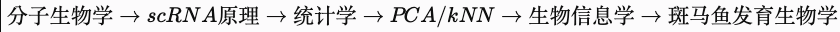

# 前置准备

## GPT建议

## 《分子生物学》：转录与 RNA 加工

只学：

DNA
↓
transcription
RNA
↓
RNA processing
mRNA

## 《细胞生物学》：细胞分化 + 细胞周期

cell type

为什么不同细胞表达不同 gene。

differentiation
stem cell
→ progenitor
→ differentiated cell
cell cycle
G1
S
G2
M

因为以后会做 cell-cycle scoring。

apoptosis / stress

知道细胞死亡、应激可能产生异常 expression profile。

这就够了。

## 《概率统计》：假设检验 + p-value + 多重检验

## 《线性代数/机器学习》：PCA + kNN + clustering

## 《生物信息学》：RNA-seq + reference genome + gene annotation

## scRNA-seq 基本原理

至少必须能解释：

cell barcode
UMI
read / count
gene × cell matrix
droplet
doublet
ambient RNA
sequencing depth
dropout / sparsity

## QC

必须理解：

nFeature_RNA
nCount_RNA
percent.mt
doublet
ambient RNA
low-quality cell

## Normalization

至少理解：
为什么不能直接拿 raw count 比较。

知道：
raw counts
↓
normalization
↓
log transform

## PCA

这反而是你大数据背景的优势。

建议你认真掌握：

vector
feature
variance
covariance
PCA
loading
PC score

## kNN + graph clustering

这一块你应该比生物工程学生更熟。

重点：

PCA
↓
k nearest neighbors
↓
graph
↓
Leiden / Louvain
↓
cluster

## UMAP

dimensionality reduction / visualization

## 重点

Statistics
↑↑↑

Linear algebra / PCA
↑↑

Machine learning
↑↑

Data visualization
↑↑

R / Seurat
↑↑↑

Linux
↑↑

Reproducible analysis
↑↑↑

特别是：

QC threshold 的数据驱动判断
batch effect
integration
PCA
clustering
resolution selection
differential expression
pseudobulk
multiple testing
confounding
visualization
reproducibility
