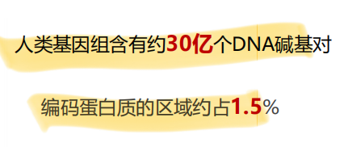
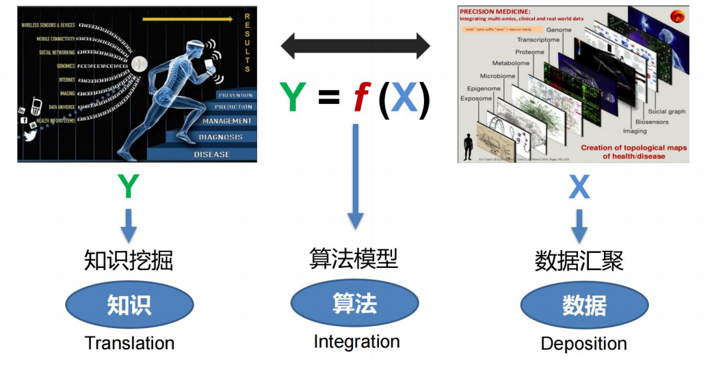

生物信息学是一门收集、分析遗传数据以及分发给研究机构的新学科
特指数据库类的工作，

Biology + Informatics = Bioinformatics
生物信息学是一门交叉学科，它包含了生物信息的获取、处
理、存储、分发、分析和解释等在内的所有方面，它综合运
用数学、计算机科学和生物学的各种工具，来阐明和理解大
量数据所包含的生物学意义

2001：生物信息学是在大分子方
面的概念型的生物学，并且使用了
信息学的技术，这包括了从应用数
学、计算机科学以及统计学等学科
衍生而来各种方法，并以此在大尺
度上来理解和组织与生物大分子相
关的信息

广义生物信息学观点：生物学研究可以
被看成是研究信息的传递：从DNA经
转录翻译到蛋白质，从细胞质中到细胞
核内，从母细胞到子细胞，从一个细胞
或一个组织到另一个细胞或另一个组织，
从一代到下一代，

生物
拉马克
--用进废退
--获得性遗传
达尔文
《物种起源》
--自然选择
--适者生存
孟德尔
--豌豆杂交
米歇尔
--分离出核酸
约翰森
--首次提出基因
摩尔根
--染色体的遗传理论
艾弗里、麦克劳德和麦卡蒂
--dna为遗传物质

信息
帕斯卡
--压强，三角，计算机
莱布尼兹
--计算机概念
摩尔斯
--摩尔斯电码
图铃
--计算机之父

数据库建设与工具开发：生物数据的检索、下载、整合与共享。
组学数据分析与解释：包括基因组、转录组、蛋白质组等组学
生物系统及网络分析
算法、方法开发：开发新的算法及统计学方法来揭示大数据之间的联系

生物信息学的应用
基础研究：机体的生理病理机制
• 衰老、癌症发病机制
临床研究：疾病诊断，预后评估
• 利用病原核酸序列诊断疾病
药物开发：新药筛选，药靶设计，老药新用
• 肿瘤免疫检查点抑制剂

