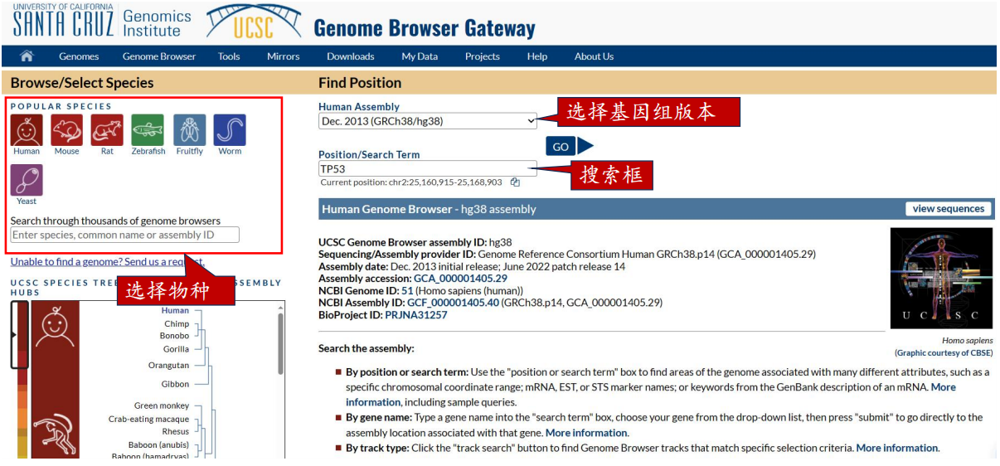
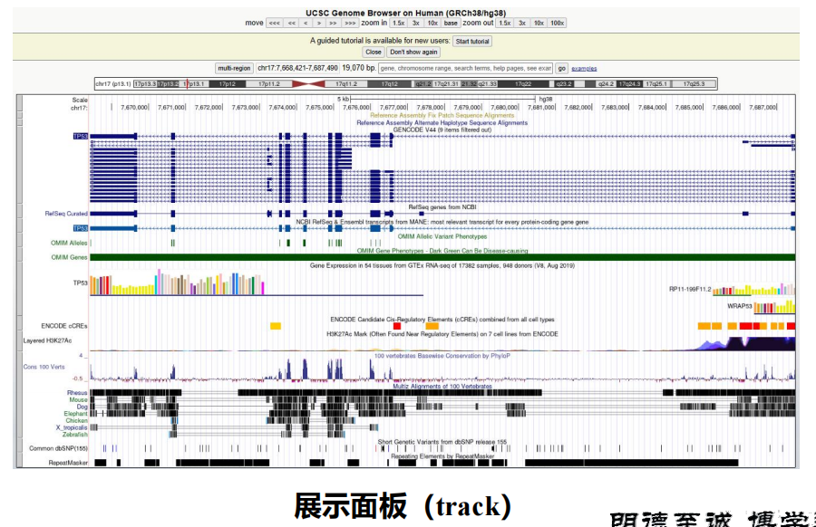
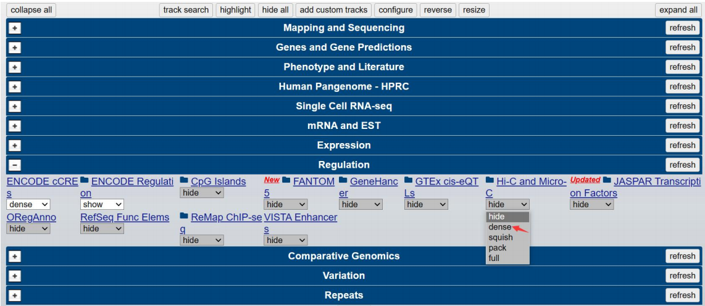
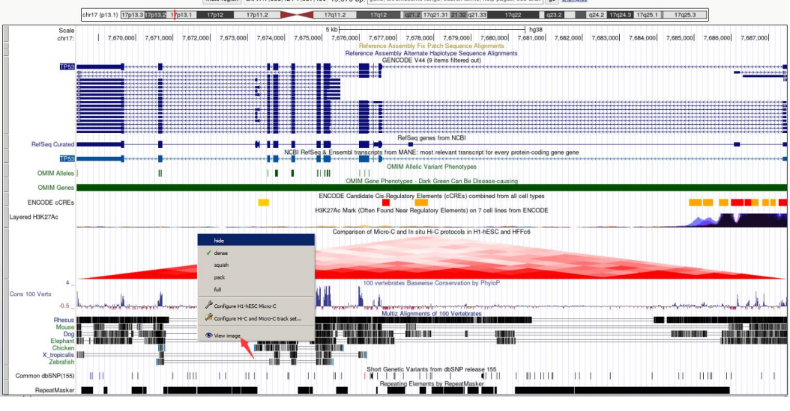

# UCSC

## 简介

Ø UCSC Genome Browser是美国加利福尼亚大学Santa Cruz分校的Jim Kent等建立的人类基因组图谱三大门户网站之一。
Ø 收录了包括人类基因组在内的48种哺乳动物（mammal）、19种其他脊椎动物（vertebrate）、3种后口动物 (deuterostome)、20种昆虫（insect）、线虫（nematode）等众多动物，及病毒（virus）、酵母等微生物全基因组数据。
Ø 采用NCBI拼接整合的人类基因组序列作为平台，提供了多种类型的基因组定位数据，包括染色体区带、连续子和间隙、mRNA和表达序列标签(EST)、预测基因、单核苷酸多态（SNPs）、 Sequence Tagged Site (STS) 的遗传和放射杂交图谱、重复序列、鼠同源序列、斑马鱼（Tetraodon nigroviridis）同源序列等。

## 经典工具

Ø Genome Browser：以缩放和滚动的方式查看染色体的注释。
Ø Blat：快速将用户输入的序列以图像的方式在基因组中显示。
Ø Table Browser：提供下载Genome Browser数据库数据的便捷链接。
Ø LiftOver：基因组坐标转换。不同版本的基因组坐标。
Ø Variant Annotation Integrator ：预测变异的功能影响。

## 网站

展示面板（track）/隐藏不需要的track

控制面板/添加感兴趣的track（hide -> full, 展示结构逐渐详细）

下载图片

