# 常用生物信息学数据库笔记

> **笔记信息 / Note Information**
>
> **作者 / Author**：蔡靖熹
> 福州大学 数据科学与大数据技术专业 本科生
> Fuzhou University, Data Science and Big Data Technology, Undergraduate
>
> **内容说明**：本笔记由本人根据学习整理撰写。
>
> **参考资料**：
>
> - 部分知识点参考自福州大学医工交叉研究院熊壮博士《生物信息学》课程课件

> **AI辅助说明**：本笔记 Markdown 排版结构与逻辑整理借助 AI 工具辅助完成，AI 未参与专业内容的判断与生成，核心知识内容以本人撰写为准。如有内容错误，责任由本人承担。
>
> **联系方式 / Contact**：
> tchinchina@outlook.com
> cjx941008@qq.com

---

## 一、数据库基础知识

**数据库**是一类用于存储和管理数据的计算机文档，将数据以结构化记录的形式组织，以便于信息检索。

- **记录（record）**：数据库的每一条数据，也叫**条目（entry）**
- **字段（field）**：描述某一类数据特性或属性的组成部分

### 数据库分类

| 类型           | 定义                                                                        | 特点                                          | 举例                                                                 |
| -------------- | --------------------------------------------------------------------------- | --------------------------------------------- | -------------------------------------------------------------------- |
| **一级数据库** | 数据直接来源于实验获得的原始数据，只经过简单归类整理和注释                  | 存储原始测序数据，通常由测序中心/研究机构提供 | NCBI SRA、ENA（欧洲）、DDBJ（日本）、GSA（中国，组学原始数据归档库） |
| **二级数据库** | 在一级数据库、实验数据和理论分析基础上，针对特定应用目标建立的整理/分类结果 | 经过分析处理，形成特色专题数据库              | dbSNP（SNP数据）、GEO（基因表达数据）、GWH（基因组数据库）           |

---

## 二、NCBI（美国国立生物技术信息中心）

NCBI 充分利用了公共数据库各记录间本身存在的逻辑关系，可从多种类型数据的文本信息中交叉检索所需信息。

### 1. GenBank 数据库

包含所有已知的核酸序列及相关文献著作、生物学注释。每条记录代表一个单独、连续、带注释的 DNA 或 RNA 片段。

**数据来源三类：**

1. 测序工作者直接提交的序列
2. 与其他数据机构协作交换的数据
3. 美国专利局提供的专利数据

**记录描述符：**

| 字段       | 缩写 | 含义                          |
| ---------- | ---- | ----------------------------- |
| LOCUS      | ID   | 序列名称                      |
| DEFINITION | DE   | 序列简单说明                  |
| ACCESSION  | AC   | 序列编号                      |
| VERSION    | —    | 序列版本号                    |
| KEYWORDS   | KW   | 相关关键词                    |
| SOURCE     | OS   | 序列来源物种名                |
| ORGANISM   | OC   | 物种学名及分类学位置          |
| REFERENCE  | RN   | 相关文献编号/递交序列注册信息 |
| AUTHORS    | RA   | 相关文献作者/递交序列作者     |
| TITLE      | RT   | 相关文献题目                  |
| JOURNAL    | RL   | 相关文献刊物/递交序列作者单位 |
| MEDLINE    | —    | 相关文献 Medline 引文代码     |
| REMARK     | —    | 相关文献注释                  |
| COMMENT    | OC   | 关于序列的注释信息            |

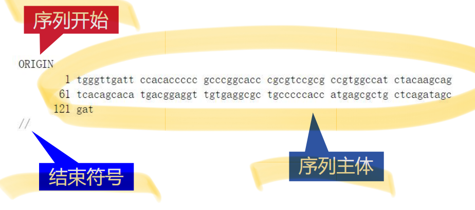

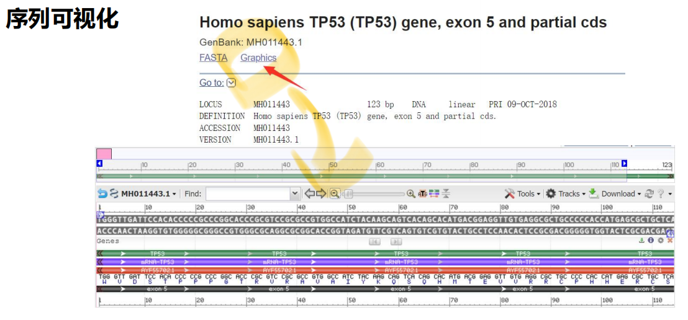

### 2. FASTA 格式（序列文件标准格式）

基于文本、用于表示核酸或多肽序列的通用格式，已成为生物信息学领域的标准。

- 序列标题以 `>` 开头，下一行为具体序列
- 核苷酸符号大小写均可，氨基酸一般大写
- 一般每行字符数不超过 80 个
- 无特殊的序列结束标志
- 多条序列即将该格式连续列出

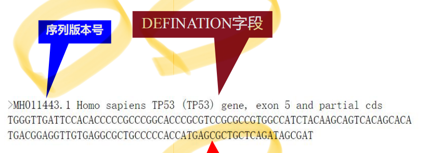

### 3. Gene 数据库

收录全部已测序物种的基因注释信息，包括基因名称、染色体定位、基因序列及编码产物（mRNA、蛋白质）情况，并与 GenBank、OMIM 等 NCBI 子库及 KEGG、Gene Ontology 等外部数据库交叉引用。

- **标识符**：即 Entrez gene ID，唯一（unique），依基因发现顺序由 1 至多位数字组成。例如 TP53 的基因标识符为 **7157**。
- **收录内容**：Entrez gene ID、基因概括与转录本信息表、基因完整/官方名字、基因类型、基因别名、基因信息表、染色体位置、文献注释、相关疾病信息、参与通路、互作分子信息、Gene Ontology 功能注释等。

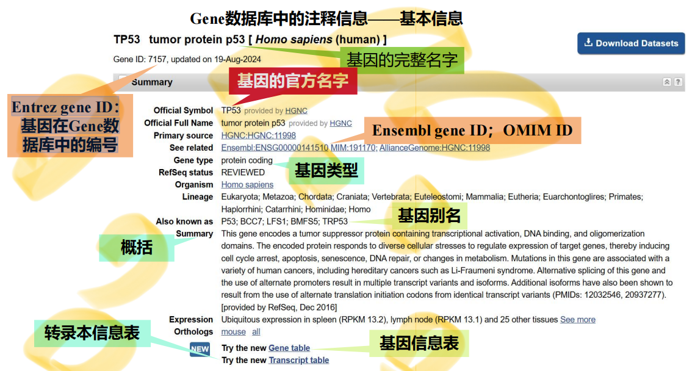

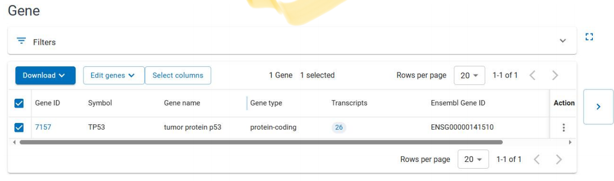

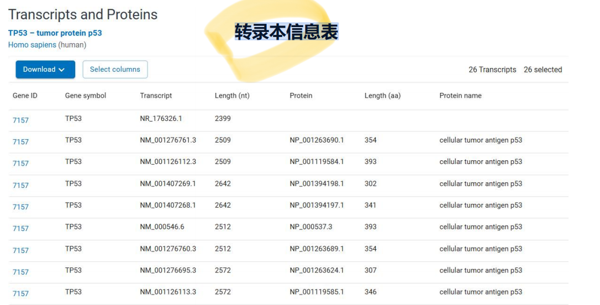

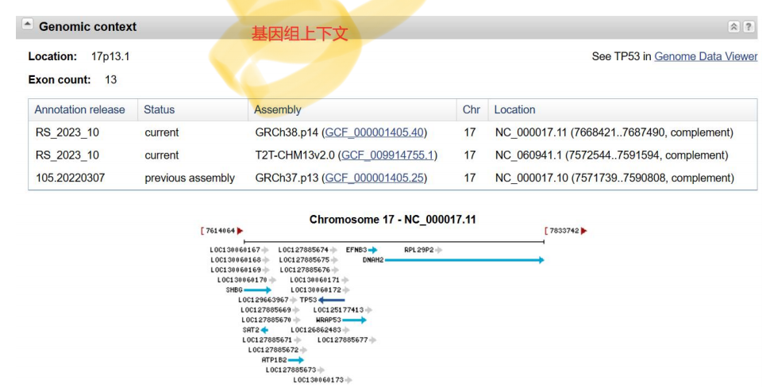

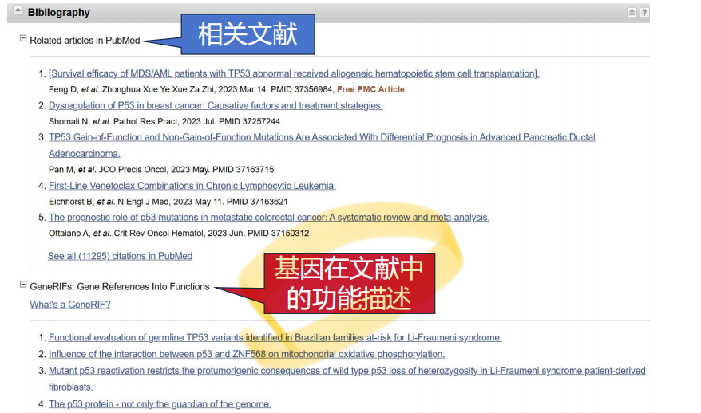

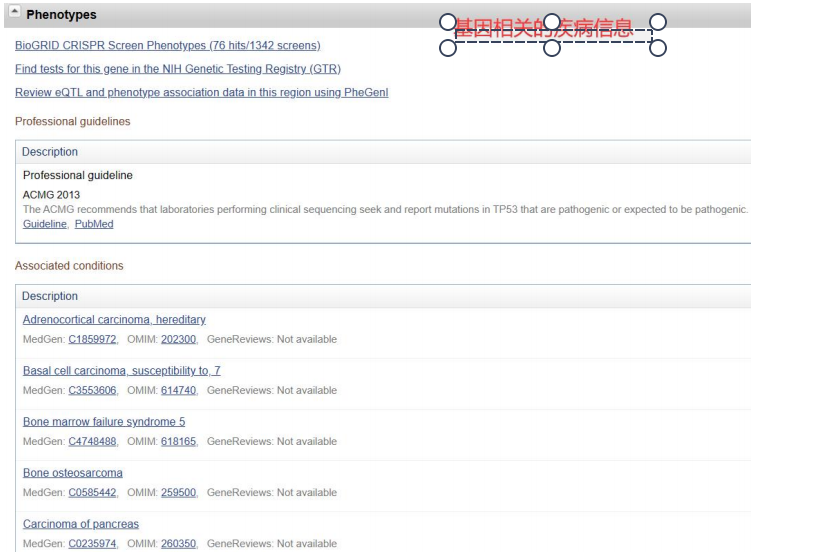

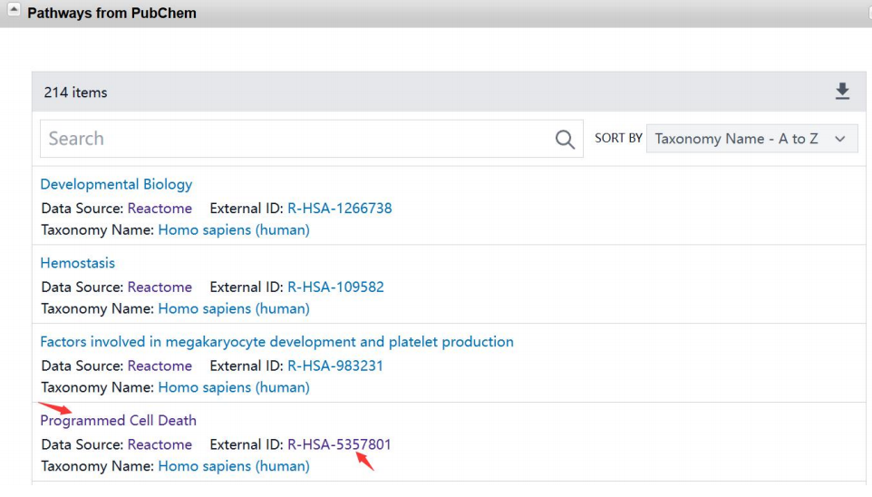

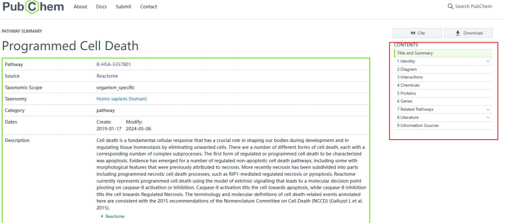

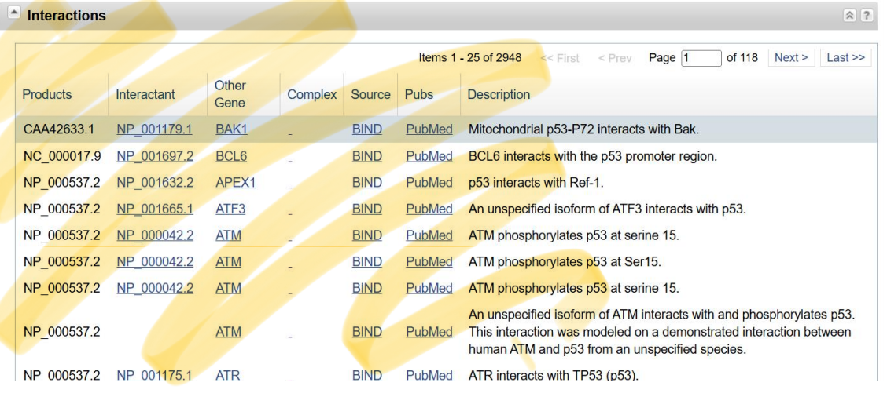

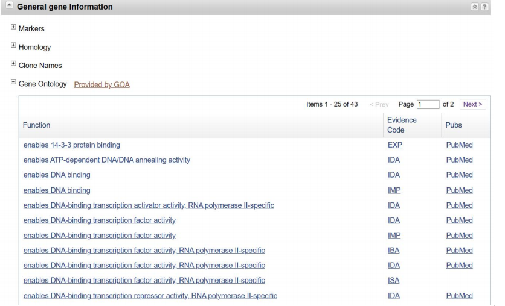

### 4. PubMed 数据库

收录生命科学相关的已发表期刊文献。

**关键词检索逻辑（适用于所有数据库）：**

| 逻辑符 | 示例                       | 含义                             |
| ------ | -------------------------- | -------------------------------- |
| AND    | ("single cell" AND cancer) | 同时包含两个关键词               |
| OR     | ("single cell" OR cancer)  | 包含任意一个即可（也可同时包含） |
| NOT    | ("single cell" NOT cancer) | 包含前者但不包含后者             |

**双引号规则：**

- 单个单词关键词（如 cancer）可不加引号
- 多个单词组成的词组（如 "single cell"）必须加双引号，否则搜索结果可能只包含其中一个词，或两个词分散出现在文本各处，而非作为完整词组出现

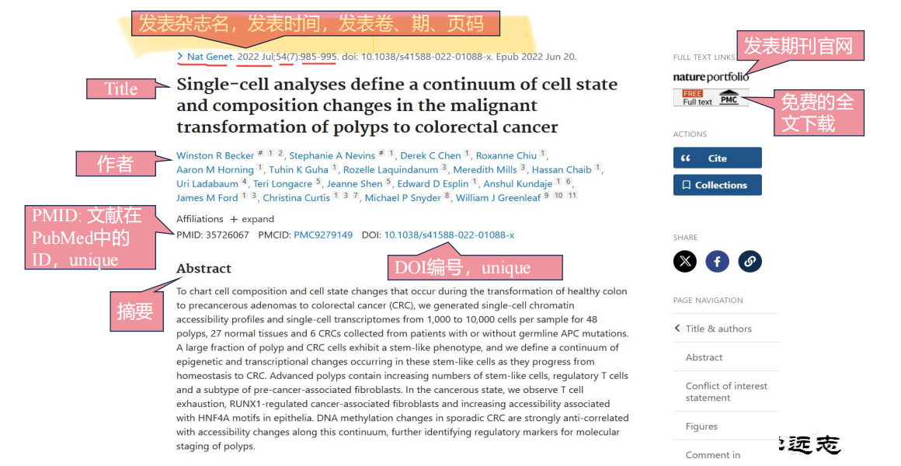

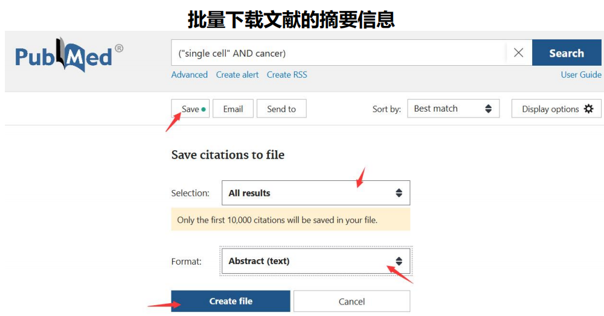

### 5. GEO（Gene Expression Omnibus）数据库

接收和管理基因芯片或测序技术获得的表达数据。

**注释信息层级：**

| 代码 | 全称     | 含义                                 |
| ---- | -------- | ------------------------------------ |
| GPL  | Platform | 特定的芯片/测序平台类型              |
| GSM  | Sample   | 参与表达测序的样本/个体信息          |
| GSE  | Series   | 一组相关样本实验测定的基因表达谱数据 |

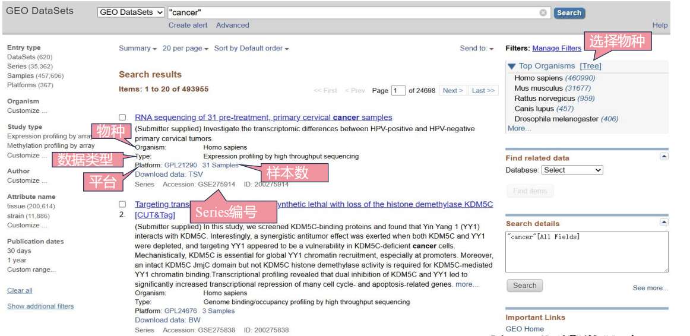
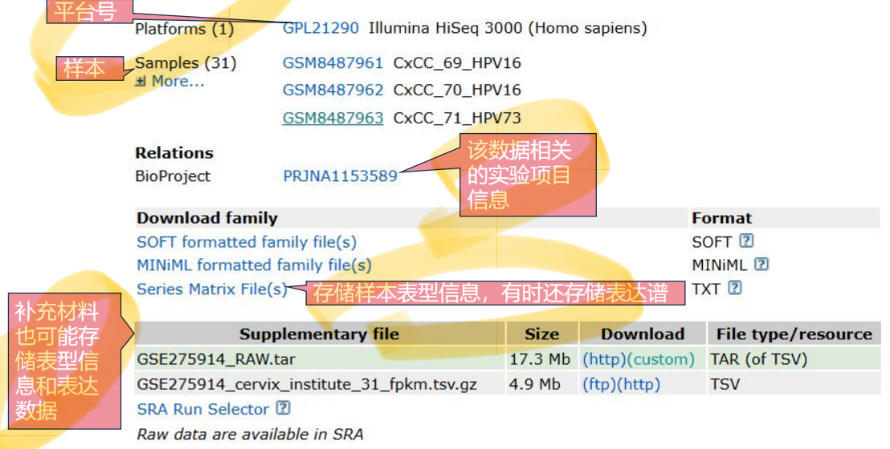

**Series Matrix 文件结构：**

- `!Series*`：数据集信息
- `!Sample*`：样本信息
- 中间部分：存储的表达数据（表达谱矩阵）

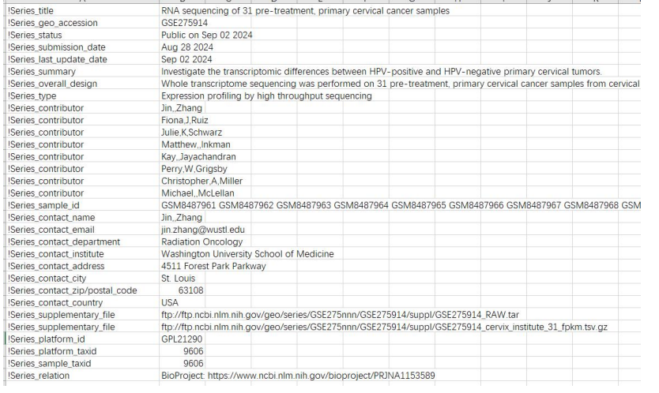
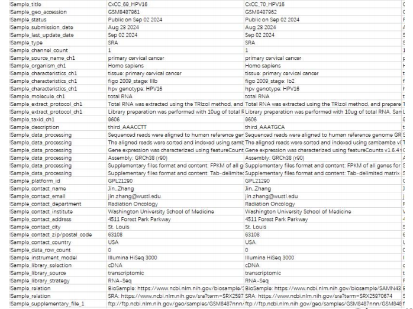
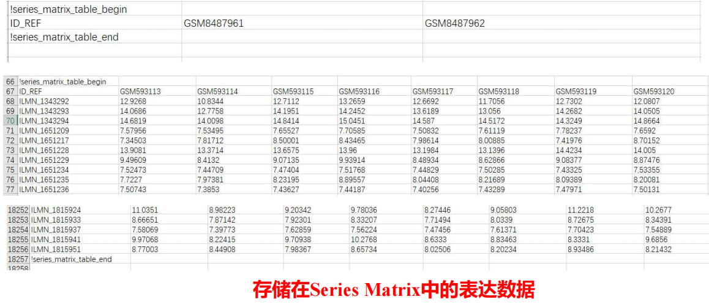

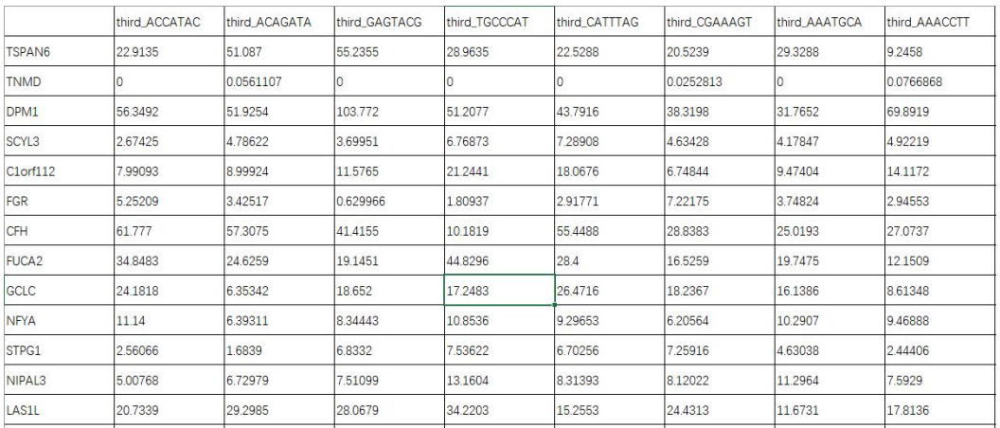

### 6. 其他重要 NCBI 数据库

| 数据库 | 说明                                                                         |
| ------ | ---------------------------------------------------------------------------- |
| RefSeq | 在 GenBank 基础上，为每个基因不同数据类型提取一个可靠注释条目作为参考条目    |
| Genome | 收录已完成测序物种的全部基因组序列、定位数据及正在测序物种的阶段性基因组信息 |
| SRA    | 存储原始测序数据                                                             |
| PMC    | 收集已发表、免费获取的生物医学与生命科学期刊文献                             |
| OMIM   | 以疾病和基因为中心，阐述遗传变异介导的疾病（表型）相关基因情况               |

**遗传多态数据库：**

- **dbSNP**：收录所有物种中发现的短序列多态和突变信息
- **dbVar**：收录较大规模的基因组变异
- **dbGaP**：收录以遗传多态为分子标记物的基因型与表型（疾病）关联性研究数据
- **ClinVar**：收录临床中发现/报道的、有证据支持的与人类疾病或健康状态相关的变异位点

**蛋白质数据库：**

- **Protein**：收录来源于 GenPept、RefSeq、Swiss-Prot、PIR、PRF、PDB 等资源的蛋白质序列和注释数据
- **Protein Cluster**：提供存在联系的蛋白质集合信息，并与注释、结构、结构域、家族相关数据库交互访问
- **Structure**：提供蛋白质三维结构信息及相关可视化、结构比对工具

---

## 三、EMBL-EBI（欧洲分子生物学实验室－欧洲生物信息学研究所）

### 简介

- **EMBL** 实验室 **1980 年**于德国海德堡成立，是世界上最早的核酸序列数据管理机构之一
- **1992 年** EMBL 理事会投票决定于英国威康信托基因组科学园建立**欧洲生物信息学研究所（EBI）**，并于 **1995 年**完成迁移
- 当时 EBI 拥有两个数据库：核酸序列数据库 **EMBL-Bank** 和蛋白质序列数据库 **UniProt**

网址：https://www.ebi.ac.uk/

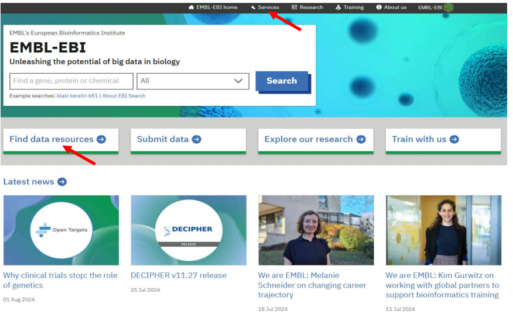
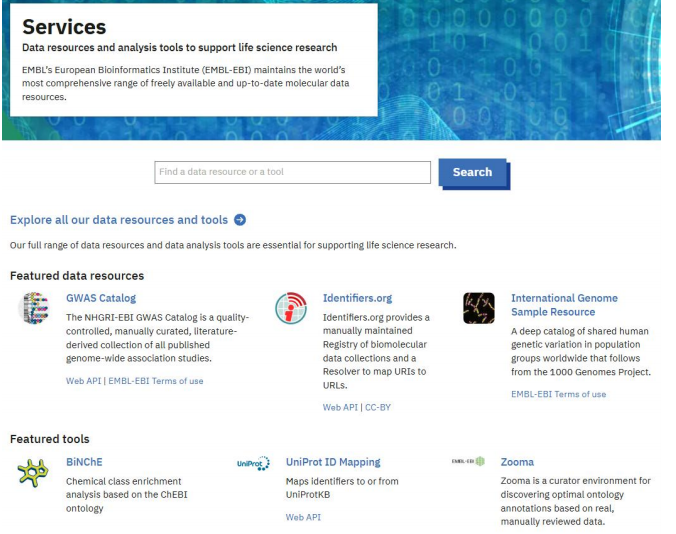
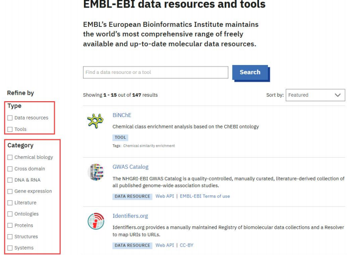

### 主要生物分子数据资源

| 数据库       | 内容                   |
| ------------ | ---------------------- |
| EMBL-Bank    | 核酸（DNA 和 RNA）序列 |
| Ensembl      | 基因组                 |
| ArrayExpress | 微阵列基因表达         |
| UniProt      | 蛋白质序列和注释       |
| Reactome     | 细胞通路               |

### 1. Ensembl 数据库

提供高质量、综合注释的**脊椎动物**基因组数据。

- 提供基因表达组织差异性分析、基因序列提取、变异位点效应预测、基因多态性定位、跨物种基因比较、用户数据分析等功能模块
- 基因编码以 **"ENSG"** 开头；转录本以 **"ENST"** 开头
- 网址：http://www.ensembl.org/index.html
- **Ensembl Genomes** 数据库：提供非脊椎动物全基因组数据

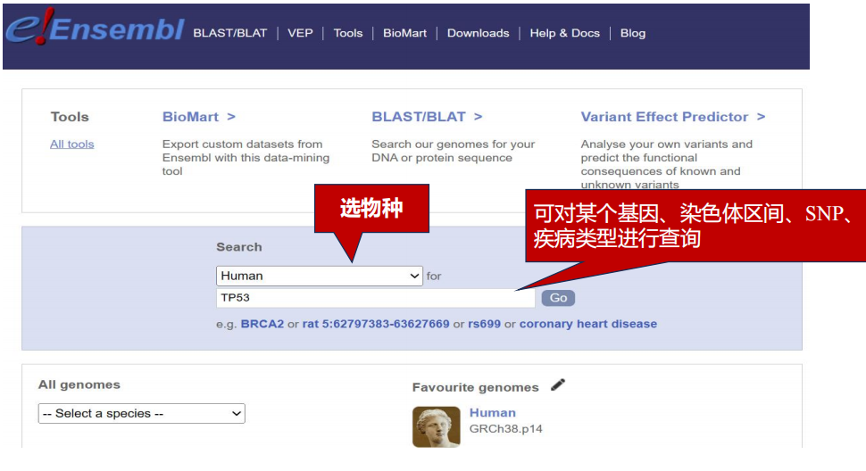
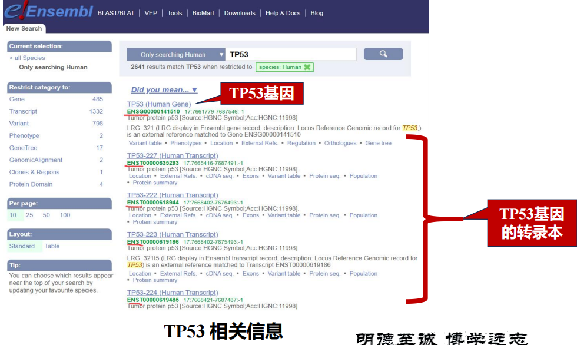
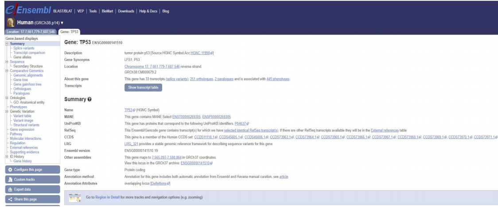
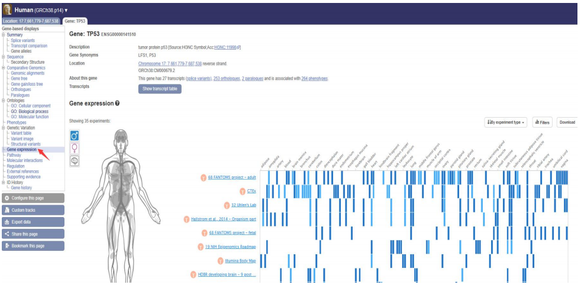

### 2. BioMart 数据检索平台

- 将储存在不同数据库中的基因、蛋白等序列和注释信息进行整合
- 查询不同数据库来源的基因 ID、基因组定位、表达、结构等信息
- 支持不同数据资源条目代码转换、功能富集，可批量获取相关数据
- 方便获取一个物种全部基因组或局部区域的核酸、蛋白序列及各种注释信息
- **功能模块**：数据查询、ID 转换、序列数据提取、富集分析
  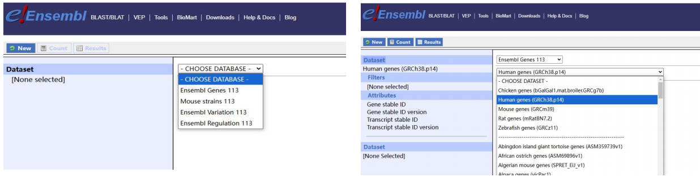
  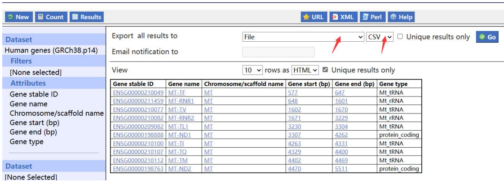

### 3. UniProt 蛋白质数据资源

网址：http://www.uniprot.org/
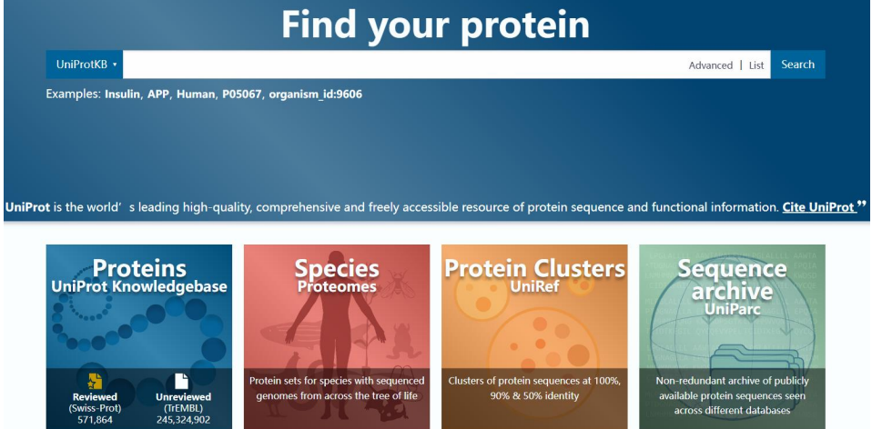

**UniProtKB —— UniProt 的核心资源**，主要包括两部分：

| 组成部分       | 特点                                                                                                                                                           |
| -------------- | -------------------------------------------------------------------------------------------------------------------------------------------------------------- |
| **Swiss-Prot** | 收录非冗余、高质量的**专家手动注释**数据；每条记录尽可能从文献、其他数据库搜集每个物种每个蛋白质的所有注释信息，包括选择性剪接、多态、翻译后修饰、蛋白质家族等 |
| **TrEMBL**     | 收录经高质量**计算分析获得的自动注释**信息                                                                                                                     |

**检索流程**：输入关键字 → 结果筛选（分 Swiss-Prot / TrEMBL）→ 结果查看（进入蛋白质注释词条）

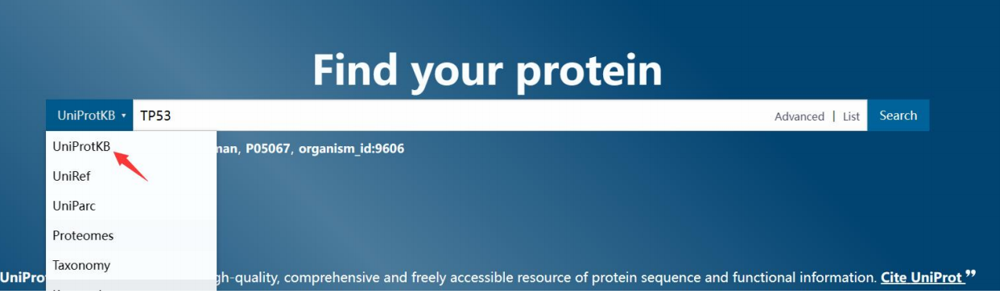
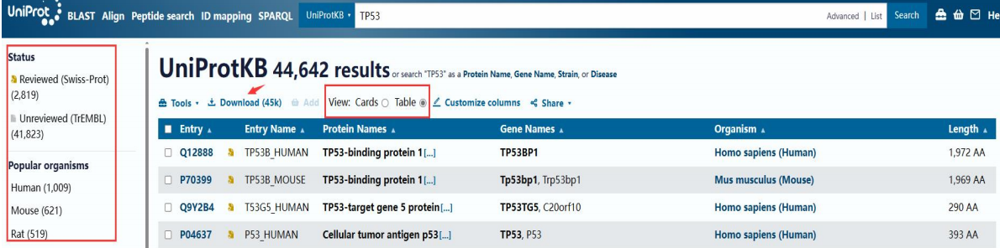
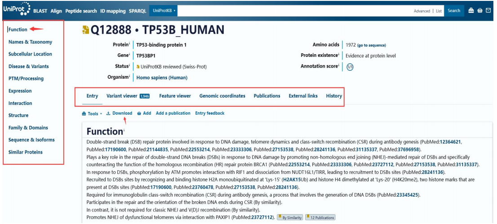
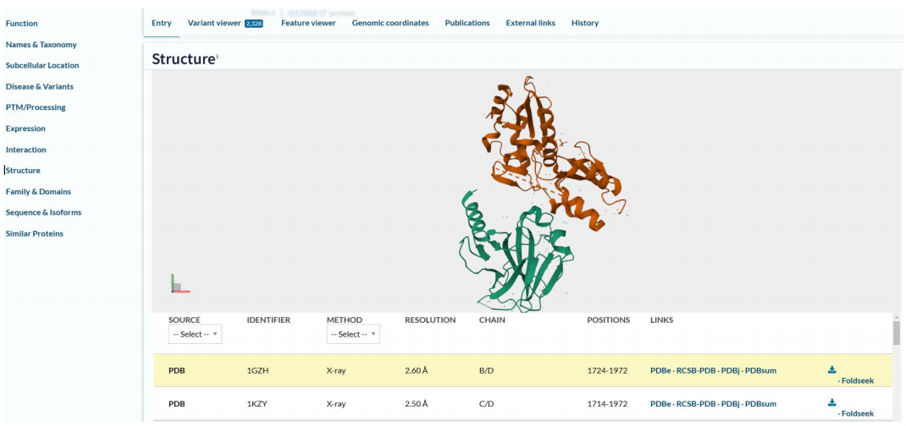

**UniProt 其他资源：**

| 数据库    | 内容                                                         |
| --------- | ------------------------------------------------------------ |
| UniRef    | 根据蛋白质序列在不同物种中的相似性进行分簇                   |
| UniParc   | 非冗余蛋白质序列仓库，收集全部公开发布或文献发表的蛋白质序列 |
| Proteomes | 收集已完全测序物种的蛋白质组                                 |

---

## 四、CNCB / NGDC（国家生物信息中心）

- **CNCB 首页**：https://www.cncb.ac.cn/
- **NGDC 首页**：https://ngdc.cncb.ac.cn/

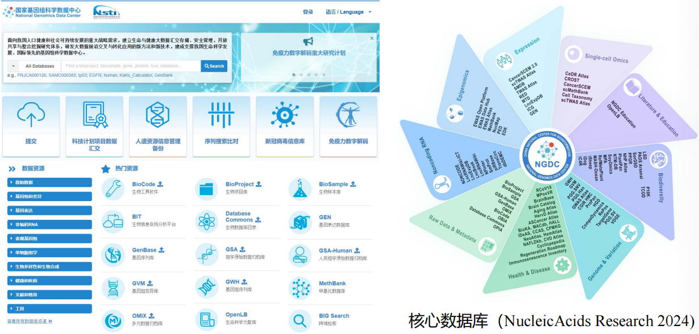

### 主要数据库资源

| 数据库                         | 全称/说明                                   | 链接                              |
| ------------------------------ | ------------------------------------------- | --------------------------------- |
| **GSA**                        | Genome Sequence Archive，原始组学数据归档库 | —                                 |
| **Genome Warehouse**           | 基因组序列库                                | http://bigd.big.ac.cn/gwh         |
| **Genome Variation Map**       | 基因组变异库                                | https://ngdc.cncb.ac.cn/gvm       |
| **Gene Expression Nebulas**    | 基因表达数据库                              | https://ngdc.cncb.ac.cn/gen       |
| **MethBank**                   | 甲基化数据库                                | https://ngdc.cncb.ac.cn/methbank/ |
| **多组学知识库**               | 整合多组学数据的知识库                      | —                                 |
| **Open Library of Bioscience** | 生命科学文献库                              | https://ngdc.cncb.ac.cn/openlb    |

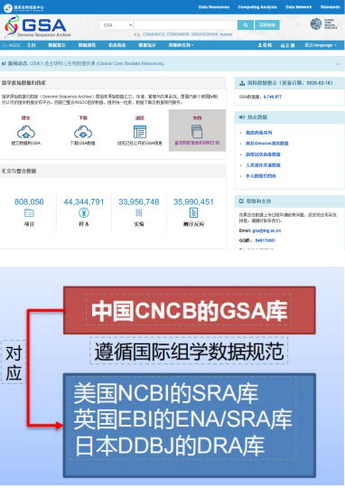
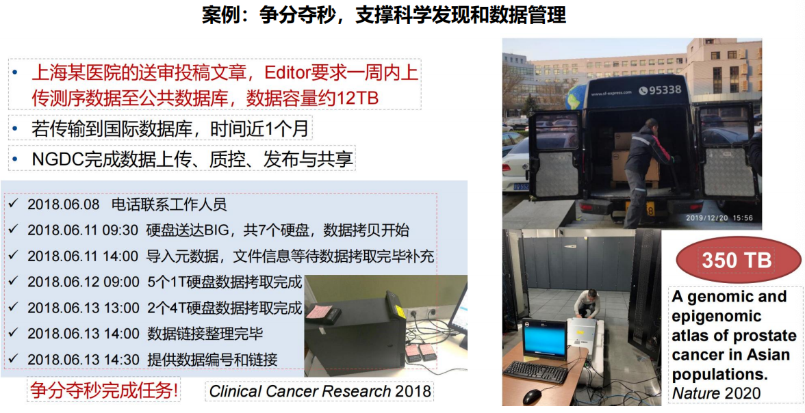
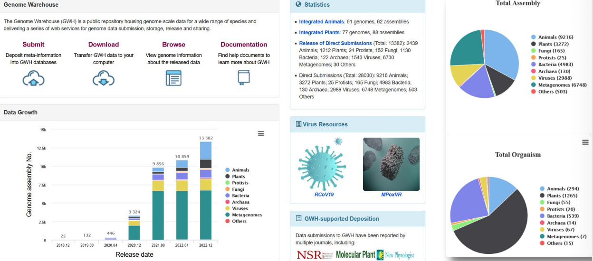
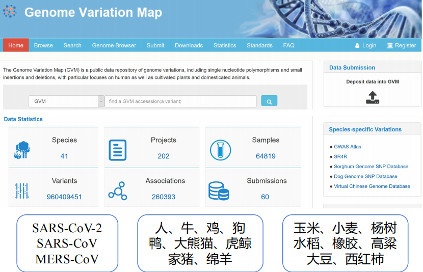
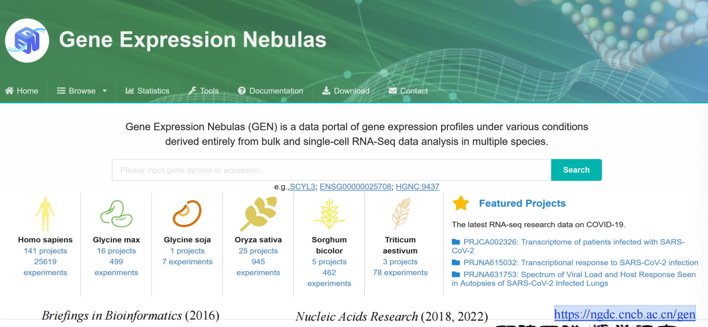
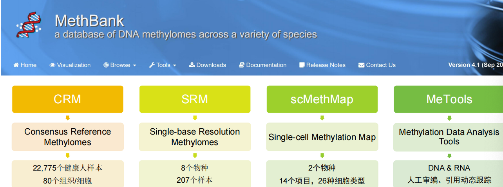
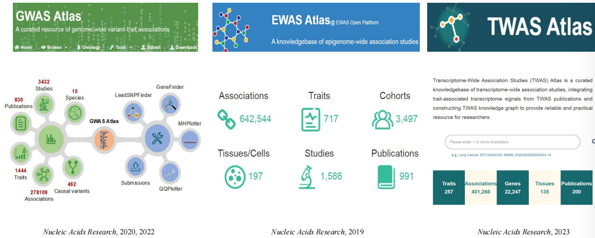

### 特色资源库

- **癌症单细胞表达图谱数据库**：收录癌症相关单细胞表达数据
- **iDog**：犬类资源库
- **Aging Atlas**：衰老知识库
- **Database Commons**：数据库集成/导航平台

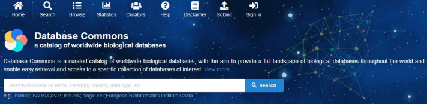

### 生物大数据跨库搜索引擎

**Big Search**：支持在国家生物信息中心多个数据库间进行跨库统一检索。

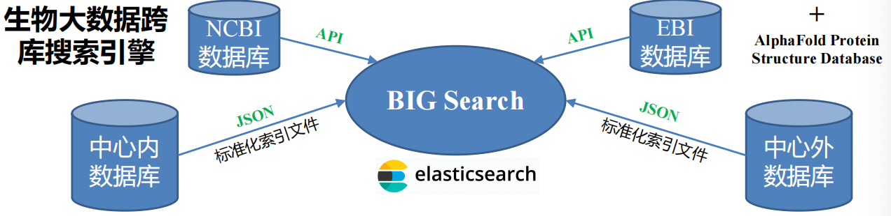
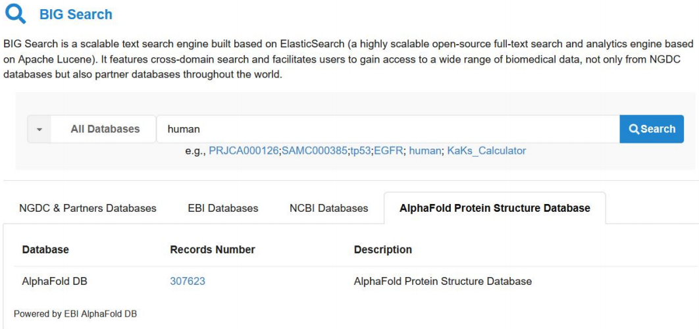

**生命科学文献库：Open Library of Bioscience**（https://ngdc.cncb.ac.cn/openlb）

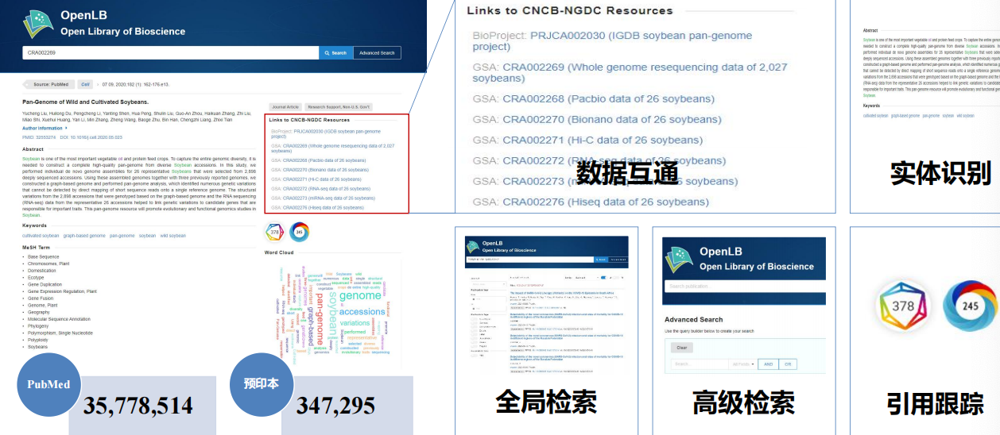

---

## 五、TCGA（肿瘤基因组图谱）

### 简介

**The Cancer Genome Atlas（TCGA）** 计划由美国 **National Cancer Institute（NCI）** 和 **National Human Genome Research Institute（NHGRI）** 于 **2006 年**联合启动。

- 目前收录来自 **11,000** 个病人、**33** 个癌症类型的数据，数据量达 **2.5 PB**
- Home 页：https://cancergenome.nih.gov/

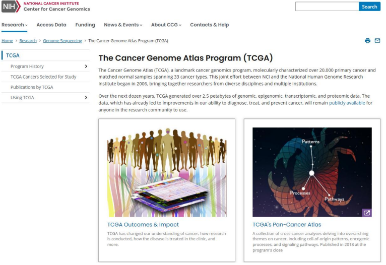

### 包含的 5 类组学数据

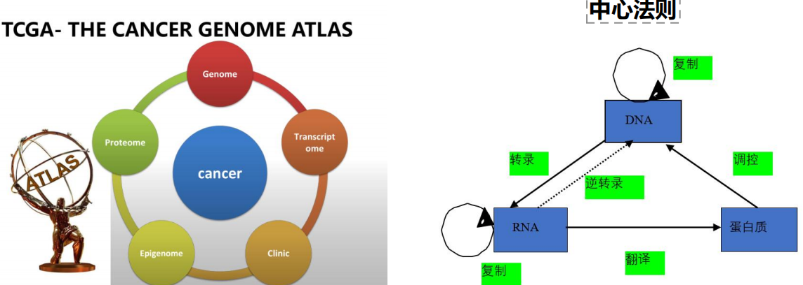

| 组学类型                       | 定义                                                             | 数据内容                                                               |
| ------------------------------ | ---------------------------------------------------------------- | ---------------------------------------------------------------------- |
| **基因组**                     | 一种生物所有遗传信息的总和，或载有遗传信息的全体核酸             | 核酸序列组成、基因组结构（基因突变、拷贝数变异）                       |
| **转录组**                     | 细胞中所有 RNA 分子的总和，包括 mRNA、rRNA、tRNA、ncRNA 等       | RNA 分子表达水平（基因表达水平改变、可变剪切）                         |
| **蛋白质组**                   | 一个基因、一种生物或一种细胞/组织所表达的全套蛋白质              | 蛋白质序列、表达水平（序列比较、表达水平改变）                         |
| **表观基因组**                 | 所有参与细胞基因调控过程的化学修饰，是表观遗传信息的重要组成部分 | DNA 甲基化、组蛋白修饰（化学修饰和空间结构如何影响基因功能与表达调控） |
| （第五类，原文未列出具体名称） | —                                                                | —                                                                      |

### TCGA 数据下载 —— UCSC Xena

- **UCSC Xena** 不仅包含 TCGA 数据，还包含 **ICGC**、**CCLE** 等其他数据资源
- 网址：https://xena.ucsc.edu/public/
- 通过 "Launch Xena" 进入数据下载页面，选择数据中心和癌症类型

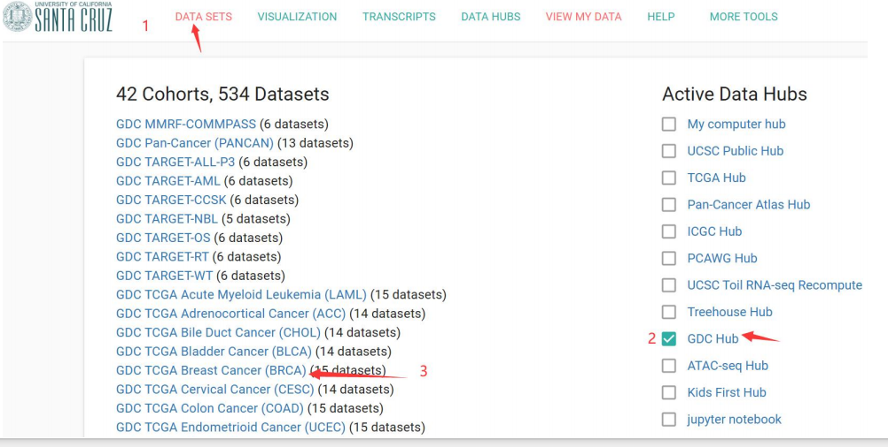
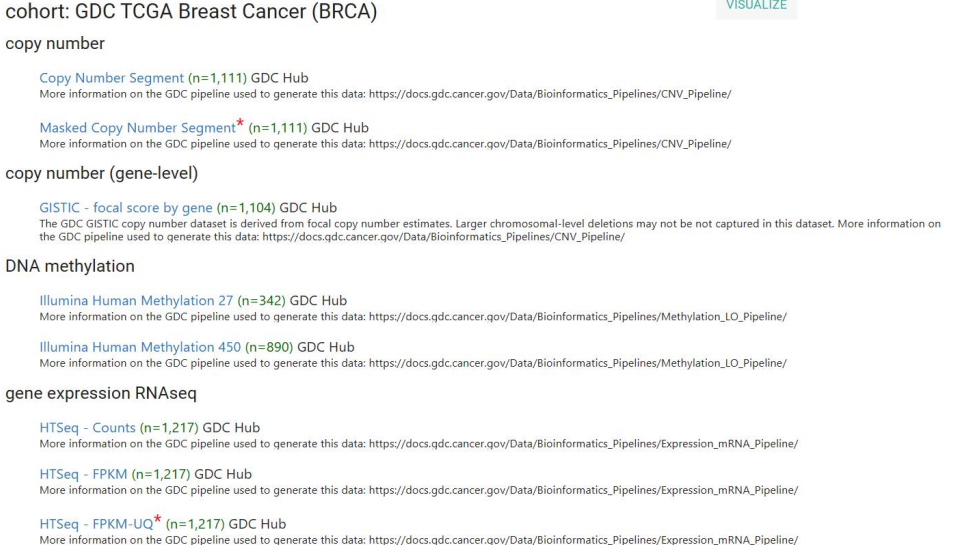
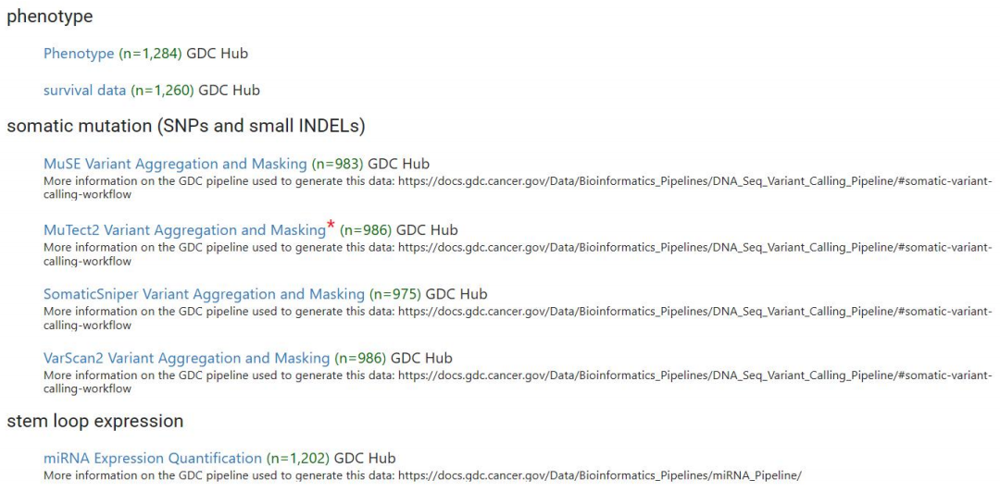
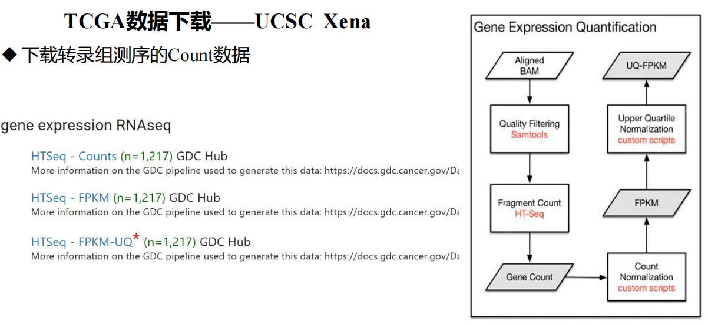
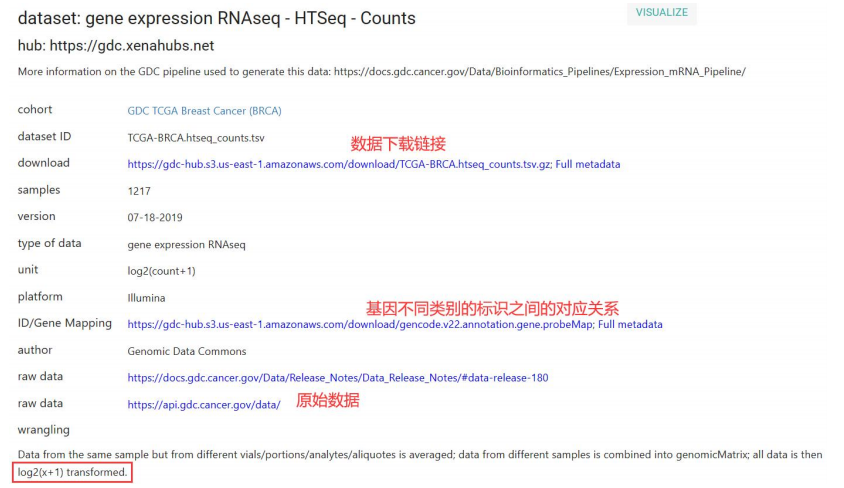

**下载数据要点：**

- **表达数据（count）**：行（row）为基因，列（col）为样本
- **样本编号**规则：最后一部分数字用于区分正常与肿瘤样本
  - **01–09**：肿瘤样本（tumor）
  - **10 及以上**：正常/癌旁样本（normal）
- 可下载：基因标识对应信息、患者表型数据（phenotype）、患者生存数据（**OS: Overall Survival**，其中 1 = dead）

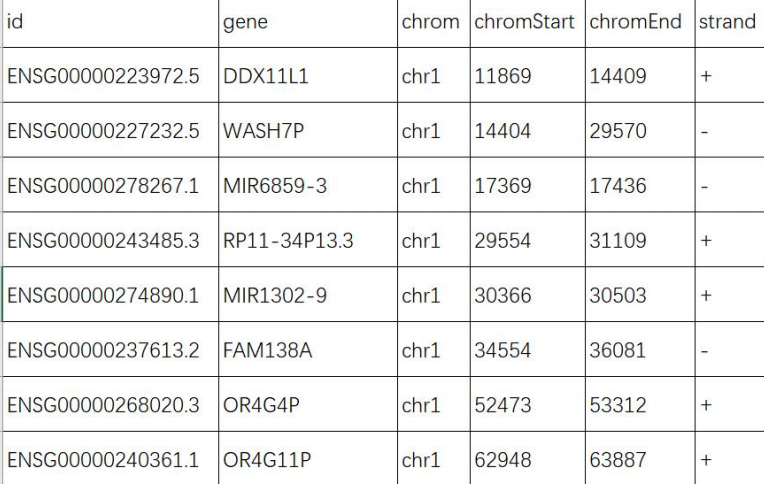
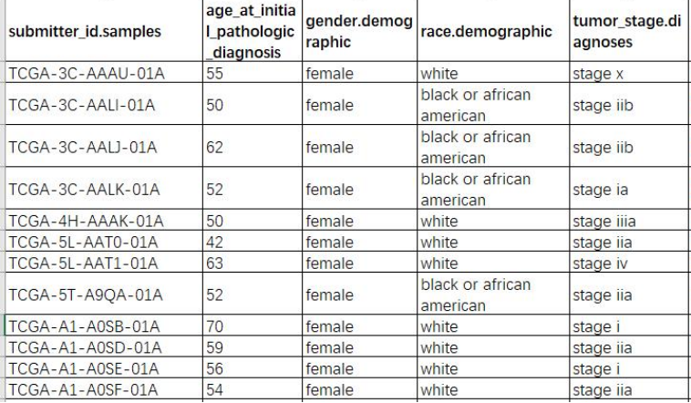
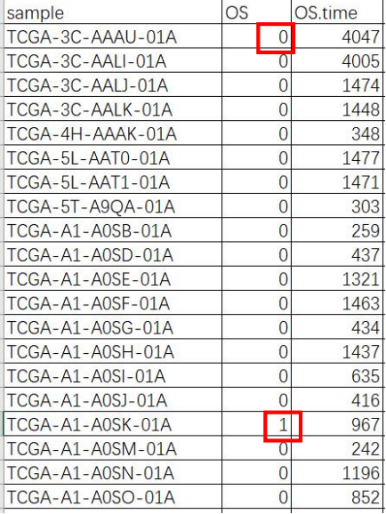

---

## 六、UCSC 基因组浏览器

### 简介

- **UCSC Genome Browser** 由美国加州大学 Santa Cruz 分校的 Jim Kent 等人建立，是人类基因组图谱三大门户网站之一
- 收录物种范围广泛：**48 种哺乳动物、19 种其他脊椎动物、3 种后口动物、20 种昆虫**及线虫等众多动物，以及病毒、酵母等微生物全基因组数据
- 采用 NCBI 拼接整合的人类基因组序列作为平台，提供多种基因组定位数据：染色体区带、连续子和间隙、mRNA 和表达序列标签（EST）、预测基因、单核苷酸多态（SNPs）、STS 遗传/放射杂交图谱、重复序列、鼠同源序列、斑马鱼同源序列等

### 经典工具

| 工具                              | 功能                                               |
| --------------------------------- | -------------------------------------------------- |
| **Genome Browser**                | 以缩放和滚动的方式查看染色体注释                   |
| **Blat**                          | 快速将用户输入序列以图像方式在基因组中显示比对位置 |
| **Table Browser**                 | 提供下载 Genome Browser 数据库数据的便捷链接       |
| **LiftOver**                      | 不同版本基因组坐标之间的转换                       |
| **Variant Annotation Integrator** | 预测变异的功能影响                                 |

### 网站与使用要点

- **展示面板（track）**：可显示/隐藏不需要的 track
  

- **控制面板**：添加感兴趣的 track，展示层级从 hide → full，结构逐渐详细

- 支持将当前浏览器视图下载为图片
  

---

## 七、三大数据库门户小结

| 平台          | 所属地区 | 核心数据库                                                   |
| ------------- | -------- | ------------------------------------------------------------ |
| **NCBI**      | 美国     | GenBank、Gene、PubMed、GEO、SRA、RefSeq、OMIM 等             |
| **EMBL-EBI**  | 欧洲     | EMBL-Bank、Ensembl、UniProt、ArrayExpress、Reactome、BioMart |
| **CNCB/NGDC** | 中国     | GSA、Genome Warehouse、Genome Variation Map、MethBank 等     |

三者数据资源常互相协作、交换共享（如国际核酸序列数据库联盟 INSDC），是生物信息学数据获取的核心枢纽。

---

## 再次致谢

本笔记内容整理自：
福州大学医工交叉研究院熊壮博士《生物信息学》课程课件，福州大学
部分内容结合课件内容与个人理解重新整理，如有出入以老师课件原文为准。
