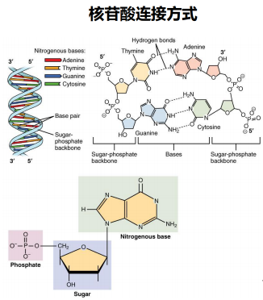
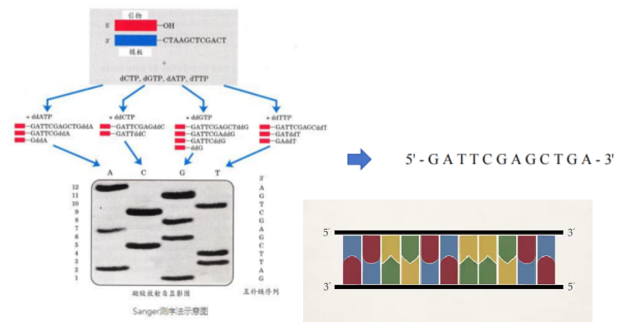

# 第三章 测序技术

## 第一代测序技术

### 背景

#### 何为测序？

测序（sequencing）又称定序，是对多聚体中单体排列顺序进行测定的技术，亦即测出目标分子一级结构的序列。
例如：测定DNA、RNA、多肽、多糖链基本
组成单位残基（核苷酸、氨基酸、单糖）的排列顺序。测序意味着确定无分支的生物聚合物的一级结构（有时被误称为一级序列）。
测序结果是一个符号化的线性描述，简明地总结了被测序的分子的大部分原子级结构的序列

### Maxam-Gilbert化学降解法

#### 常用化学试剂

- 标记：将一个DNA片段的5'端磷酸基作放射性标记。
- 降解：再分别采用不同的化学方法修饰和裂解特定碱基，从而产生一系列长度不一而5'端被标记的DNA片段。
- 电泳：这些以特定碱基结尾的片段群通过凝胶电泳分离。
- 自显影：再经放射线自显影，确定各片段末端碱基。
  从而得出目的DNA的碱基序列。

#### 序列读取方法

1、从胶片底部一个个向顶部读。
2、如果G+A中出现1条带，就看G列中是否有同样大小的条带，若有即为G碱基，无则为A碱基。
3、如果C+T中出现1条带，就看C列中是否有同样大小的条带，若有即为C碱基，无则为T碱基。

#### 优点

·所测序列来自原DNA分子而不是酶促合成所产生的拷贝，因此不会产生由于酶促反应而带来的误差

#### 缺点

·没有改进，操作繁琐
·化学试剂毒性大
·放射性同位素标记效率偏低以致需要较长的放射自显影曝光时间
·人工读取数据费时费力

### 双脱氧链终止法

> Fred sanger（1918-2013）

#### 原理

- 生物体内，在DNA聚合酶作用下，以单链DNA为模板合成互补的DNA链。
- u根据碱基配对的原则，将脱氧核糖核苷(dNTP)底物加到引物的3′－OH末端，使引物延伸链的延长通过引物的3’-OH基，与脱氧核糖核苷酸底物的5’-磷酸基因，生成磷酸二酯键而实现，其合成方向由5’→3’
- uSanger发现在DNA聚合反应过程中，掺入一种双脱氧核糖核苷酸（ddNTP）底物时，它的5’-磷酸基团是正常的，能够加到正常核苷酸的3’-OH基末端，但其自身3’-OH基团由于脱氧而不存在，下一个核苷酸不能通过5’-磷酸与之形成磷酸二酯键，使DNA链的延伸被终止于这个双脱氧核糖核苷酸处。
  
  

#### dNTP的连接/ddNTP的连接

> ddNTP不能与后一个核苷酸连接

##### 声明

#### 优点

- 方法简便，质量控制好；
- 分辨率高，结果直观；
- 测序片段长（ 700 – 1000bp）；
- 准确性高，因此成为基因测序的“金标准”

#### 缺点

- 通量低，试剂昂贵，成本高，耗时耗力

### 荧光自动测序技术

#### 由来

- Sanger测序：手工测序
  1985年，Lloyd Smith 等提出通过荧光标记替代同位素标记，发展了荧光自动测序技术。
- DNA测序的自动化是在Sanger的双脱氧链末端终止法的基础上由美国应用生物系统公司进一步发展起来的荧光测序法，其基本原理与末端终止法一样，都是通过ddNTP竞争性的终止新合成的DNA链。
- 自动化测序主要差别在于非放射性标记方式和反应产物分析系统。

#### 单一荧光自动测序系统

- 用单一的Cy5荧光染料标记测序引物或dNTP进行测序。
- 用Sanger法原理进行测序反应，分别生成四组终止于4种不同碱基、带有Cy5荧光素标记的DNA片段。
- A、T、G和C四组反应产物在不同的泳道上电泳，用激光激发荧光探测光信号，计算机分析，得出样品DNA的序列。

#### 多色荧光自动测序系统

- 早在1987 年Perkin Elmer (PE) Applied Biosystems 公司就推出DNA 自动测序仪，其专利
  是分别采用 4 种荧光染料进行标记且在同一个泳道测序，具有极大的优越性

- 其原理是采用四种荧光染料标记终止物ddNTP或引物，经Sanger 测序反应后，产物 3′端(标记终止物ddNTP 法)或 5′ 端(标记引物法)带有不同荧光标记，一个样品的 4 个测序可以在一个泳道内电泳，从而降低了测序泳道间迁移率差异对精确性的影响。
- 可一次测定 96 个或更多样品。
- 比常规电泳的测序速度提高了 9倍 ，显著提高了DNA测序的速度和准确性

#### 四色荧光标记物

## 第二代测序技术

## 第三代测序技术

## 序列比对
