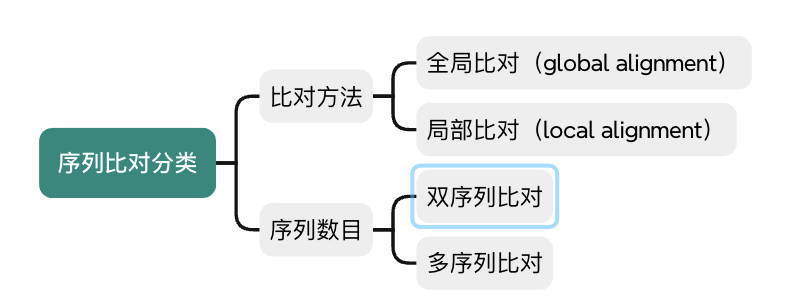
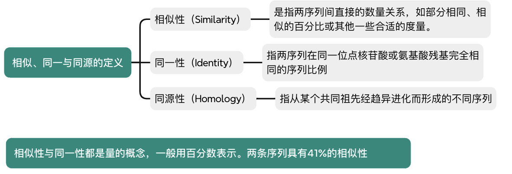
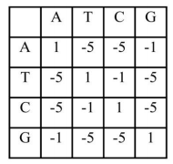
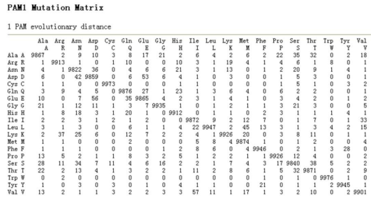
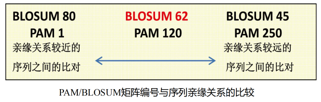
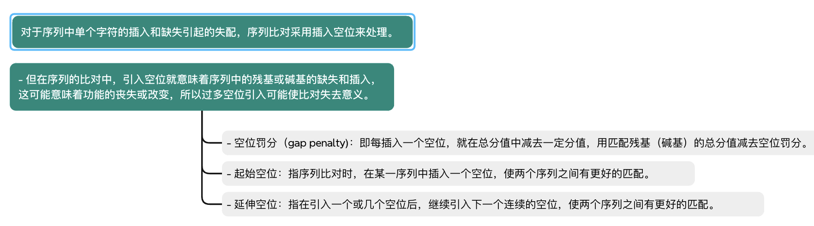
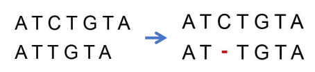
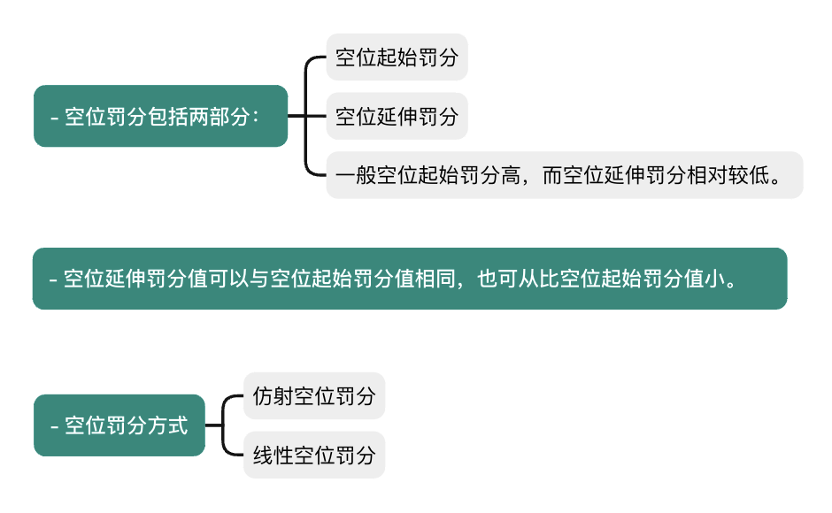
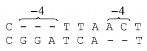
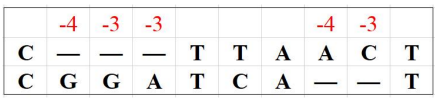

## 测序比较

### 序列比对相关概念

#### 定义

序列比对（sequence alignment）就是运用某种特定的数学模型或算法，找出两个或多个序列之间的最大匹配碱基或残基数，比对的结果反映了算法在多大程度上提供序列之间的相似性关系及它们的生物学特征。序列比对是序列分析和数据库搜索的基础。

#### 目的

通过比较两条或多条序列之间是否具有足够的相似性，从而判定它们之间是否具有同源性

#### 分类

#### 相似/同一/同源

#### 直系/旁系

#### 作用

##### 获得共性序列

- 共性序列（Consensus sequence，一致/共有序列）的概念用来描述一组DNA 或者蛋白质序列，通常这组序列互相之间非常相似但又不完全相同，共性序列就由这组相似序列中每个位置最常出现的碱基或者氨基酸组成
- 共性序列常用于数据库搜索、探针设计、识别高度相似的序列

##### 突变分析

- 与参考基因组比较，识别序列中变异位点

##### 种系分析

- 根据基因或基因组序列的差异判断种系关系
- 多序列比对通常是构造种系树的第一步。

##### 保守区段分析

- 保守区段：某一段序列在进化演变过程中，在不同的物种中都被保留
- 多序列比对是识别进化上保守的这些区段的基本方法

##### 基因和蛋白质功能分析

- 通过与已知功能的同源基因和蛋白质进行多序列比对来推断新基因和蛋白质的功能。

### 序列比对打分方法

#### 序列比对替换打分矩阵

> 掌握替换打分矩阵的定义
> 构建替换打分矩阵的两种手段

- 在序列比对中一般需要给出一个定量的数值来描述两者的一致性和相似性。在此过程中，替换打分矩阵用来评价碱基或残基之间的相似性。
- 在长期实践中，发现一些特定的碱基替换或者残基替换的频率是要高于另一些替换的，因此可以通过统计方法或者基于进化的突变模型来给每一种替换定义不同的分值，从而体现出不同碱基或残基之间发生替换的可能性。
- 替换打分矩阵
  - 即是一种打分规则，其数学本质是统计权重，它定量地描述了不同替换的意义
  - 替换打分矩阵包括核酸序列替换打分矩阵和蛋白质序列替换打分矩阵。

- 对于序列中单个字符的替换引起的失配，需要考虑不同字符间的替换具有不同的概率和意义

##### 等价矩阵（Unitary matrix）

- 相同核苷酸间的匹配得分为1，不同核苷酸间的替换得分为0
  

##### 转换-颠换矩阵（Transition-transversion matrix）

- 转换：嘌呤(A, G)之间的替换，或者嘧啶(C, T)之间的替换
- 颠换：嘌呤与嘧啶间的替换。
- 转换的发生概率远高于颠换
- 转换得分为-1，颠换得分为-5
  

##### BLAST矩阵

• 基于大量实际比对
• 匹配得分为+5，反之为-4

#### 二、 核酸序列替换打分矩阵

> 知道常用的三种打分矩阵

#### 三、蛋白质序列替换打分矩阵

> 知道常用的打分矩阵
> 掌握PAM矩阵和BLOSUM矩阵的差别

##### 等价矩阵

- 匹配得分为1，反之为0

##### 遗传密码矩阵（Genetic code matrix）

- 通过计算一个氨基酸转变成另一个氨基酸所需的密码子变化的数目而得到，矩阵元素的值对应于代价。
- 常用于进化距离的计算，优点是计算结果可以直接用于绘制进化树。
- 当蛋白质序列相似度较低时，不适用

##### 疏水性矩阵（Hydrophobic matrix ）

- 根据氨基酸侧链基团疏水性的不同以及氨基酸替换前后理化性质改变的大小
- 若一次氨基酸替换后疏水特性不发生大的变化，则这种替换的得分高，否则得分
  低
- 适用于偏重蛋白质功能方面的序列比对

##### PAM矩阵（ Dayhoff 突变数据矩阵）

- 根据对氨基酸之间的相互替换率计算得到的PAM矩阵，即可接受点突变（Point accepted mutation）或可接受突变百分比（ Percent of accepted mutation ）矩阵。（可接受：突变不会因自然选择而被淘汰）
- PAM基于氨基酸进化的点突变模型，即如果两种氨基酸替换频繁，说明自然界易接受这种替换，那么这对氨基酸替换得分就应该高。
- PAM-1：一条序列1%的氨基酸发生突变，这一过程发生1次后，氨基酸之间的相对突变概率。PAM-1是基于相似性较高（通常为 85%以上）的序列比对后计算所得。
- PAM-n ：PAM-1 自乘 n 次可以得到 PAM-n ，即发生了n次，取对数即为其替换记分矩阵。
- n越小表示氨基酸变异的可能性越小（进化距离越近）
- 在实际使用中，需要根据待比较序列之间的亲缘关系远近，来选择适合的 PAM 矩阵。
- 如果序列亲缘关系远，也就是说序列间会有很多突变，那就选 PAM 后面跟一个大数字的矩阵。
- 如果亲缘关系近，也就是突变比较少，序列间大多数地方都是一样的，那就选 PAM后面跟一个小数字的矩阵。
  
  

##### BLOSUM（Block Substitution Matrix）矩阵

- BLOSUM矩阵的相似度是根据真实数据产生的。
- 基于蛋白质序列块（短序列）比对进行推断
- BLOSUM-80代表该矩阵由一致性 >= 80% 的序列计算而来
- BLOSUM-62是指矩阵由一致性 >= 62% 的序列计算而来
- BLOSUM-n：n越小，氨基酸相似的可能性越小
- BLOSUM矩阵的优点是符合实际观测结果，不足之处是它不考虑进化距离，不能提供进化信息。
  

#### 四、空位罚分

> 知道什么是起始空位和延伸空位
> 能利用线性空位罚分和仿射空位罚分计算具体的罚分值

##### 线性空位罚分（Constant gap penalty）

- 最简单的罚分方式，仅考虑起始空位罚分，连续的空位不罚分。
- 如下图所示，设起始空位罚分值为－4，序列应罚8 分。
  

##### 仿射空位罚分（Affine gap penalty）

- 起始空位对应着一个罚分，延伸空位则对应一个相对较低的罚分。
- ·仿射空位罚分采用线性函数 **g(k)=a+b\*(k-1)** 计算连续空位罚分(a为起始空位罚分；b为空位延伸罚分；k为空位数量)。

- 罚分与空位的长度成比例
- 如下图所示，采用仿射空位罚分，a＝－4、b＝－3，则共罚 17分（−17 = −4 + −3 × 3 − 1 + −4 + −3 × 2 − 1）
  

### 双序列比对算法

### 比对的统计学显著性

### 数据库搜索

### 多序列比对
