## 测序比较

### 序列比对相关概念

#### 定义

序列比对（sequence alignment）就是运用某种特定的数学模型或算法，找出两个或多个序列之间的最大匹配碱基或残基数，比对的结果反映了算法在多大程度上提供序列之间的相似性关系及它们的生物学特征。序列比对是序列分析和数据库搜索的基础。

#### 目的

通过比较两条或多条序列之间是否具有足够的相似性，从而判定它们之间是否具有同源性

#### 分类

#### 相似/同一/同源

#### 直系/旁系

#### 作用

##### 获得共性序列

- 共性序列（Consensus sequence，一致/共有序列）的概念用来描述一组DNA 或者蛋白质序列，通常这组序列互相之间非常相似但又不完全相同，共性序列就由这组相似序列中每个位置最常出现的碱基或者氨基酸组成
- 共性序列常用于数据库搜索、探针设计、识别高度相似的序列

##### 突变分析

- 与参考基因组比较，识别序列中变异位点

##### 种系分析

- 根据基因或基因组序列的差异判断种系关系
- 多序列比对通常是构造种系树的第一步。

##### 保守区段分析

- 保守区段：某一段序列在进化演变过程中，在不同的物种中都被保留
- 多序列比对是识别进化上保守的这些区段的基本方法

##### 基因和蛋白质功能分析

- 通过与已知功能的同源基因和蛋白质进行多序列比对来推断新基因和蛋白质的功能。

### 序列比对打分方法

#### 序列比对替换打分矩阵

> 掌握替换打分矩阵的定义
> 构建替换打分矩阵的两种手段

- 在序列比对中一般需要给出一个定量的数值来描述两者的一致性和相似性。在此过程中，替换打分矩阵用来评价碱基或残基之间的相似性。
- 在长期实践中，发现一些特定的碱基替换或者残基替换的频率是要高于另一些替换的，因此可以通过统计方法或者基于进化的突变模型来给每一种替换定义不同的分值，从而体现出不同碱基或残基之间发生替换的可能性。
- 替换打分矩阵
  - 即是一种打分规则，其数学本质是统计权重，它定量地描述了不同替换的意义
  - 替换打分矩阵包括核酸序列替换打分矩阵和蛋白质序列替换打分矩阵。

- 对于序列中单个字符的替换引起的失配，需要考虑不同字符间的替换具有不同的概率和意义

##### 等价矩阵（Unitary matrix）

- 相同核苷酸间的匹配得分为1，不同核苷酸间的替换得分为0
  

##### 转换-颠换矩阵（Transition-transversion matrix）

- 转换：嘌呤(A, G)之间的替换，或者嘧啶(C, T)之间的替换
- 颠换：嘌呤与嘧啶间的替换。
- 转换的发生概率远高于颠换
- 转换得分为-1，颠换得分为-5
  

##### BLAST矩阵

• 基于大量实际比对
• 匹配得分为+5，反之为-4

#### 核酸序列替换打分矩阵

> 知道常用的三种打分矩阵

#### 蛋白质序列替换打分矩阵

> 知道常用的打分矩阵
> 掌握PAM矩阵和BLOSUM矩阵的差别

##### 等价矩阵

- 匹配得分为1，反之为0

##### 遗传密码矩阵（Genetic code matrix）

- 通过计算一个氨基酸转变成另一个氨基酸所需的密码子变化的数目而得到，矩阵元素的值对应于代价。
- 常用于进化距离的计算，优点是计算结果可以直接用于绘制进化树。
- 当蛋白质序列相似度较低时，不适用

##### 疏水性矩阵（Hydrophobic matrix ）

- 根据氨基酸侧链基团疏水性的不同以及氨基酸替换前后理化性质改变的大小
- 若一次氨基酸替换后疏水特性不发生大的变化，则这种替换的得分高，否则得分
  低
- 适用于偏重蛋白质功能方面的序列比对

##### PAM矩阵（ Dayhoff 突变数据矩阵）

- 根据对氨基酸之间的相互替换率计算得到的PAM矩阵，即可接受点突变（Point accepted mutation）或可接受突变百分比（ Percent of accepted mutation ）矩阵。（可接受：突变不会因自然选择而被淘汰）
- PAM基于氨基酸进化的点突变模型，即如果两种氨基酸替换频繁，说明自然界易接受这种替换，那么这对氨基酸替换得分就应该高。
- PAM-1：一条序列1%的氨基酸发生突变，这一过程发生1次后，氨基酸之间的相对突变概率。PAM-1是基于相似性较高（通常为 85%以上）的序列比对后计算所得。
- PAM-n ：PAM-1 自乘 n 次可以得到 PAM-n ，即发生了n次，取对数即为其替换记分矩阵。
- n越小表示氨基酸变异的可能性越小（进化距离越近）
- 在实际使用中，需要根据待比较序列之间的亲缘关系远近，来选择适合的 PAM 矩阵。
- 如果序列亲缘关系远，也就是说序列间会有很多突变，那就选 PAM 后面跟一个大数字的矩阵。
- 如果亲缘关系近，也就是突变比较少，序列间大多数地方都是一样的，那就选 PAM后面跟一个小数字的矩阵。
  
  

##### BLOSUM（Block Substitution Matrix）矩阵

- BLOSUM矩阵的相似度是根据真实数据产生的。
- 基于蛋白质序列块（短序列）比对进行推断
- BLOSUM-80代表该矩阵由一致性 >= 80% 的序列计算而来
- BLOSUM-62是指矩阵由一致性 >= 62% 的序列计算而来
- BLOSUM-n：n越小，氨基酸相似的可能性越小
- BLOSUM矩阵的优点是符合实际观测结果，不足之处是它不考虑进化距离，不能提供进化信息。
  

#### 空位罚分

> 知道什么是起始空位和延伸空位
> 能利用线性空位罚分和仿射空位罚分计算具体的罚分值

##### 线性空位罚分（Constant gap penalty）

- 最简单的罚分方式，仅考虑起始空位罚分，连续的空位不罚分。
- 如下图所示，设起始空位罚分值为－4，序列应罚8 分。
  

##### 仿射空位罚分（Affine gap penalty）

- 起始空位对应着一个罚分，延伸空位则对应一个相对较低的罚分。
- ·仿射空位罚分采用线性函数 **g(k)=a+b\*(k-1)** 计算连续空位罚分(a为起始空位罚分；b为空位延伸罚分；k为空位数量)。

- 罚分与空位的长度成比例
- 如下图所示，采用仿射空位罚分，a＝－4、b＝－3，则共罚 17分（−17 = −4 + −3 × 3 − 1 + −4 + −3 × 2 − 1）
  

### 双序列比对算法

#### 一、dotplot 算法

> 了解dotplot 算法的基本步骤

- dotplot 法或对角线作图由Gibb提出。
- 将两条待比较的序列分别放在矩阵的X/Y轴上
- 依次比较两条序列的每个字符，当对应行与列的字符匹配时，则在矩阵对应的位置上打点，得到点矩阵。
- 在点阵矩阵中，将位于对角线方向上相邻的点连接起来，这些直线所对应的矩形区域就是这两条序列的相似性片段。
  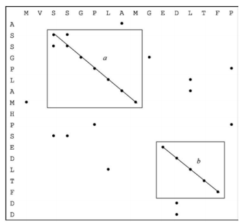

- 两条序列完全相同，点矩阵的主对角线各位置都被标记。
  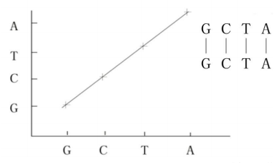
- 两条序列有共同的子序列，对每一个子序列有一条与对角线平行的由一系列点组成的斜线。
  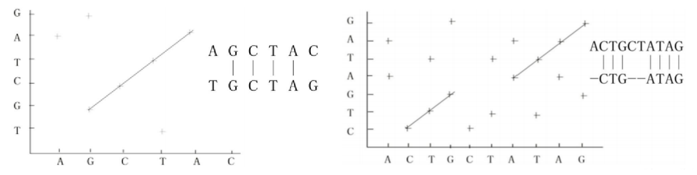

#### 二、双序列全局比对

> 掌握全局比对时适用场景
> 熟练使用Needleman-Wunsch算法进行序列全局比对

- 主要用途：寻找关系密切的序列；鉴别或证明新序列与已知序列家族的同源性，是进行分子进化分析的重要前提。
- 代表算法：Needleman-Wunsch算法（动态规划）。

##### Needleman-Wunsch算法

- a,b是两条待比对序列
- la|=m,|b|=n
- S(i,j)是按照指定替换打分矩阵得到的前缀a[1..]与b[1….j]的最大相似性得分
- w(c,d)是字符c和d按照替换计分矩阵计算的得分
- S(0,0)=0
  

###### 计算比对得分

- w(匹配)=+2
- w(a,-)=w(-,b)=w(失配)=-1

###### 回溯路径

- 从右下角向元素开始，回溯到当前单元格来源的单元格中值最大的单元格。

###### 范例

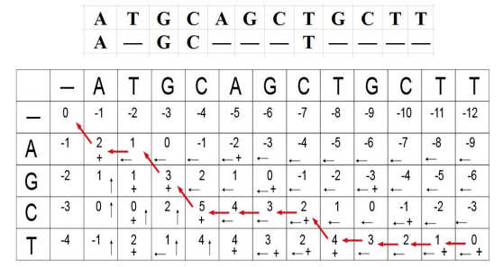

#### 三、双序列局部比对

> 掌握局部比对时适用场景
> 熟练使用Smith-Waterman算法进行序列局部比对

- 对一条长序列和短序列进行全局比对，整体相似性得分可能不高，找不到相似的序列。
- 局部比对：在每个序列中使用某些局部区域片段进行比对，找出两个序列间高相似度的片段。
- 适用于亲缘关系较远、整体上不具有相似性而在一些较小的区域上存在局部相似性的两个序列
- 代表算法：Smith-Waterman算法

###### Smith-Waterman算法

- a,b是两条待比对序列
- la|=m,|b|=n
- S(i,j)是按照指定替换打分矩阵得到的前缀a[1….]与b[1….]的最大相似性得分
- w(c,d)是字符c和d按照替换计分矩阵计算的得分
- S(i,0)=0,0≤i≤m;S(0,j)=0,0≤j≤n
  
- 回溯：从矩阵得分的最大分值的元素开始回溯直至分数为0的元素
  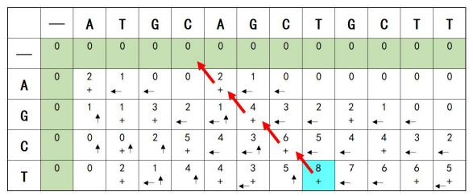

#### 双序列比对工具

##### 全局比对

> https://www.ebi.ac.uk/jdispatcher/psa/emboss_needle

##### 局部比对

> https://www.ebi.ac.uk/jdispatcher/psa/emboss_water

### 比对的统计学显著性

#### 典型方法

##### 目的

- 确定由比对算法计算的相似性是否可靠，是否偶然
- 假定序列A和B的比对得分是S，为判断S的可靠性

##### 方法

- 法1：将序列A或B与大量非同源的序列做比对，得到比对得分集合S1，然后将S与S1进行比较。
- 法2：把序列A或B与一组随机产生的序列进行比对，得到比对得分集合S2，然后将S与S2进行比较。
- 法3：首先随机将序列A与B中的一个打乱重组，比如说重组100次，并与另一个序列比对，得到一组比对得分S3；接着计算S3的均值M和标准差D，并计算Z值：Z=（S-M）/D；最后根据Z值判断两个序列相似得分的显著性
  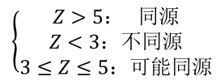

### 数据库搜索

#### 经典BLAST

- 理解BLAST算法的基本原理

##### BLAST在线工具

- 掌握BLAST的不同检索模式
- 会使用BLAST算法在指定数据库中搜索相似序列

##### BLAST：basic local alignment search tool

- 数据库搜索是双序列局部比对的特例
- 查询序列 (Query)：希望通过数据库搜索确定其性质或功能的序列
- 目标序列 (Hits)：通过数据库搜索得到的和查询序列具有一定相似性的序列
- 是目前最常用的数据库搜索算法
- 要点是片段对（segment pair）的概念，它是指两个给定序列中的一对子序列，它们的长度相等，且可以形成无空格的完全匹配

##### 基本步骤

- 找出某些“种子”(Word)，即查询序列和目标序列间非常短的片段对，他们的比对得分大于或等于某个阈值
- 向两端不带空格地扩展种子，并使用替换计分矩阵计算得分，当得分低于某个既定阈值时停止扩展（改进后的BLAST允许空位的插入）
- 给出扩展后的片段对，即为高分值片段对（High-scoring pairs，HSPs）
  

##### BLAST的查询序列和数据库的类型

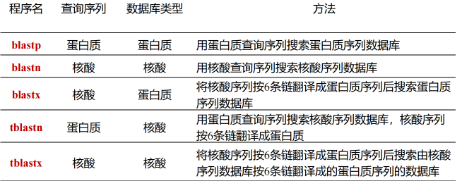

##### 在线工具

> https://blast.ncbi.nlm.nih.gov/Blast.cg
> 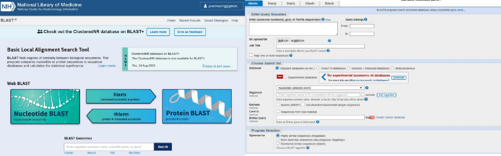

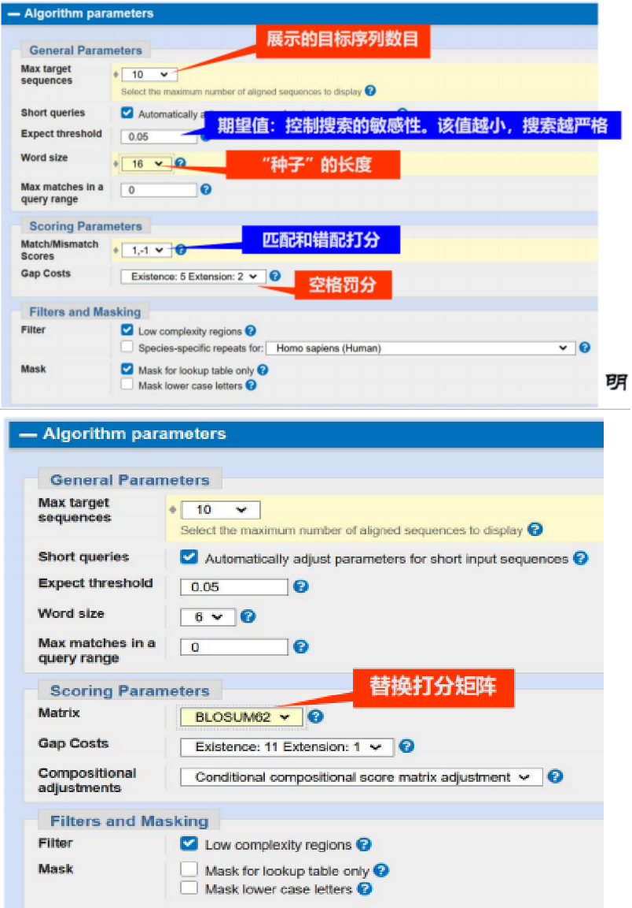

###### E value

- 表示随机匹配的可能性，E值越大，随机匹配的可能性也越大。E值接近零或为零时，基本上就是完全匹配了。
  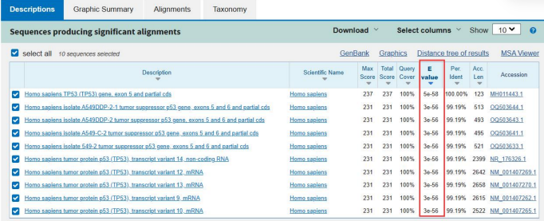

##### 三种BLAST算法

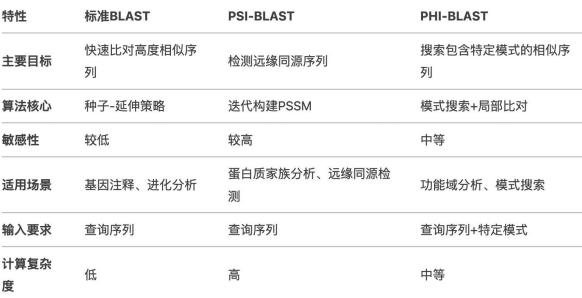

### 多序列比对

对两个以上字符序列进行比对，逐列比较其字符的异同，使得每一列的字符尽可能一致，以发现其共同的结构特征的方法

#### 目标

使参与比对的序列间有尽可能多的列具有相同的字符，即，使得相同残基的位点位于同一列，以便于发现不同序列间的相似部分，从而推断它们在结构和功能上的相似关系，主要用于分子进化关系，预测蛋白质的二级结构和三级结构、估计蛋白质折叠类型的总数，基因组序列分析等。

#### 主要涉及四个要素：

- 选择一组能进行比对的序列（要求是同源序列）；
- 选择一个实现比对与计分的算法与软件；
- 确定软件的参数；
- 合理地解释比对的结果；

#### 多序列全局比对

- 假定序列中所有对应字符均可以匹配，所有字符具有同等的重要性，空格的插入是为了使整个序列得到比对，包括使两端对齐。
- 把整个序列当成一个保守的区段，关心的是序列整体上的可比性与相似度，常用于外显子测序、RNA序列和蛋白质序列的比对。

##### 动态规划法

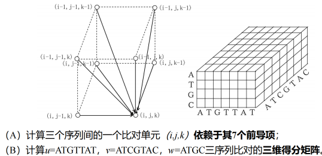

##### 渐进多序列比对

- 步骤
  1. 使用动态规划法对每两个序列进行配对比对，该步多使用距离矩阵来描述序列间的关联性
  2. 由距离矩阵构造一棵指导树(guide tree),反映序列间的关联情况
  3. 以计分最高的配对比对作为“种子”，根据指导树逐渐向多序列比对中加入序列
- 代表算法： ClustalW/ ClustalX
- 优点：能处理高达数百个序列的比对
- 缺点：不保证产生全局最优的比对，容易陷入局部最优解（坏种子；序列加入顺序；失配传播）
  

##### 迭代法

- 基本过程：先用渐进多序列比对产生一个初始结果，再对序列的不同子集进行反复比对并利用这些结果重新进行多序列比对，目标是改进多序列比对的总计分值。
- 迭代法常使用随机搜索或者通过对比对结果进行重排来寻找更优的解，直到计分值不再提高
- 常用算法：MAFFT

##### 基于一致性的方法

- 一致性：对于序列 $X$、$Y$ 和 $Z$，若 $X_i$ 比对于 $Z_k$ 且 $Z_k$ 比对于 $Y_j$，则 $X_i$ 应比对于 $Y_j$。
- 基本特点：充分利用多个序列间的比对信息对配对比对进行更合理的计分。
- 代表算法：ProbCons，T-Coffee

#### 多序列局部比对

- 不假定整个序列可以匹配，重在考虑序列中能够高度匹配的一个区段，可赋予该区段更大的计分权值，空格的插入是为了使高度匹配的区段得到更好的比对。
- 关心序列中某个保守区段之间的可比性与相似度，常用于揭示多个序列中的一个保守区段。

- 待比对的多个序列长度相当且高度相似，全局比对与局部比对的结果基本相同
- 待比对的多个序列长度差异较大或亲缘关系较远，全局比对与局部比对的结果相差较大。
  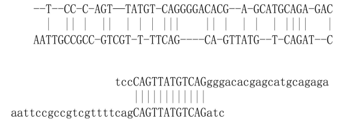

##### 常用多序列局部比对软件

- SAM：基于隐马尔可夫模型，蛋白质结构预测
- Mulan：发现进化上保守的功能元件

###### Clustal Omega

> https://www.ebi.ac.uk/Tools/msa/clustalo/

- ClustalX和ClustalW是两个使用最广泛的多序列比对工具，均采用渐进式多序列比对算法。
- Clustal Omega是欧洲生物信息研究所（EBI）开发的多序列比对工具，现已经完全取代了之前ClustalW 的地位

