# 测序技术历史

> **笔记信息 / Note Information**
>
> **作者 / Author**：蔡靖熹
> 福州大学 数据科学与大数据技术专业 本科生
> Fuzhou University, Data Science and Big Data Technology, Undergraduate
>
> **内容说明**：本笔记由本人根据学习整理撰写。
>
> **参考资料**：
>
> - 部分知识点参考自福州大学医工交叉研究院熊壮博士《生物信息学》课程课件

> **AI辅助说明**：本笔记 Markdown 排版结构与逻辑整理借助 AI 工具辅助完成，AI 未参与专业内容的判断与生成，核心知识内容以本人撰写为准。如有内容错误，责任由本人承担。
>
> **联系方式 / Contact**：
> tchinchina@outlook.com
> cjx941008@qq.com

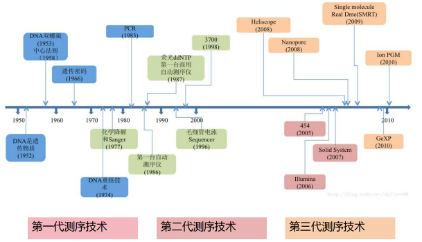

## 第一代测序技术

### 背景

#### 何为测序？

测序（sequencing）又称定序，是对多聚体中单体排列顺序进行测定的技术，亦即测出目标分子一级结构的序列。
例如：测定DNA、RNA、多肽、多糖链基本
组成单位残基（核苷酸、氨基酸、单糖）的排列顺序。测序意味着确定无分支的生物聚合物的一级结构（有时被误称为一级序列）。
测序结果是一个符号化的线性描述，简明地总结了被测序的分子的大部分原子级结构的序列

### Maxam-Gilbert化学降解法

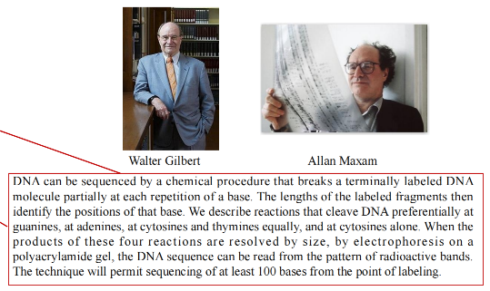

#### 常用化学试剂

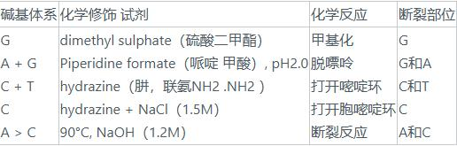

- 标记：将一个DNA片段的5'端磷酸基作放射性标记。
- 降解：再分别采用不同的化学方法修饰和裂解特定碱基，从而产生一系列长度不一而5'端被标记的DNA片段。
- 电泳：这些以特定碱基结尾的片段群通过凝胶电泳分离。
- 自显影：再经放射线自显影，确定各片段末端碱基。
  从而得出目的DNA的碱基序列。

#### 序列读取方法

1、从胶片底部一个个向顶部读。
2、如果G+A中出现1条带，就看G列中是否有同样大小的条带，若有即为G碱基，无则为A碱基。
3、如果C+T中出现1条带，就看C列中是否有同样大小的条带，若有即为C碱基，无则为T碱基。

#### 优点

·所测序列来自原DNA分子而不是酶促合成所产生的拷贝，因此不会产生由于酶促反应而带来的误差

#### 缺点

·没有改进，操作繁琐
·化学试剂毒性大
·放射性同位素标记效率偏低以致需要较长的放射自显影曝光时间
·人工读取数据费时费力

### 双脱氧链终止法

> Fred sanger（1918-2013）

#### 原理

- 生物体内，在DNA聚合酶作用下，以单链DNA为模板合成互补的DNA链。
- u根据碱基配对的原则，将脱氧核糖核苷(dNTP)底物加到引物的3′－OH末端，使引物延伸链的延长通过引物的3’-OH基，与脱氧核糖核苷酸底物的5’-磷酸基因，生成磷酸二酯键而实现，其合成方向由5’→3’
- uSanger发现在DNA聚合反应过程中，掺入一种双脱氧核糖核苷酸（ddNTP）底物时，它的5’-磷酸基团是正常的，能够加到正常核苷酸的3’-OH基末端，但其自身3’-OH基团由于脱氧而不存在，下一个核苷酸不能通过5’-磷酸与之形成磷酸二酯键，使DNA链的延伸被终止于这个双脱氧核糖核苷酸处。
  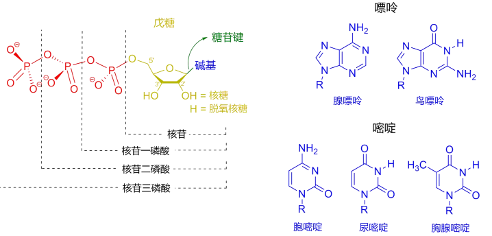
  

#### dNTP的连接/ddNTP的连接

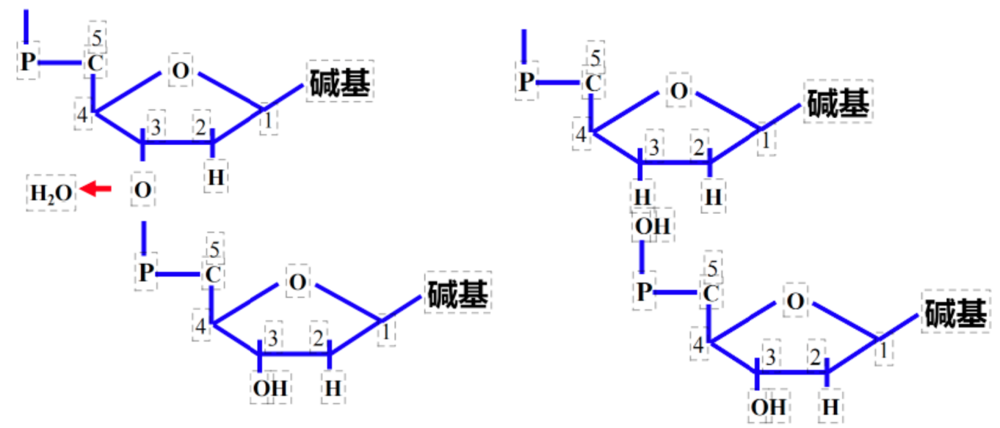

> ddNTP不能与后一个核苷酸连接

##### 声明

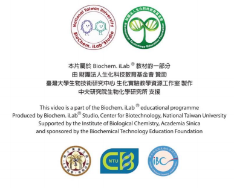

#### 优点

- 方法简便，质量控制好；
- 分辨率高，结果直观；
- 测序片段长（ 700 – 1000bp）；
- 准确性高，因此成为基因测序的“金标准”

#### 缺点

- 通量低，试剂昂贵，成本高，耗时耗力

### 荧光自动测序技术

#### 由来

- Sanger测序：手工测序
  1985年，Lloyd Smith 等提出通过荧光标记替代同位素标记，发展了荧光自动测序技术。
- DNA测序的自动化是在Sanger的双脱氧链末端终止法的基础上由美国应用生物系统公司进一步发展起来的荧光测序法，其基本原理与末端终止法一样，都是通过ddNTP竞争性的终止新合成的DNA链。
- 自动化测序主要差别在于非放射性标记方式和反应产物分析系统。

#### 单一荧光自动测序系统

- 用单一的Cy5荧光染料标记测序引物或dNTP进行测序。
- 用Sanger法原理进行测序反应，分别生成四组终止于4种不同碱基、带有Cy5荧光素标记的DNA片段。
- A、T、G和C四组反应产物在不同的泳道上电泳，用激光激发荧光探测光信号，计算机分析，得出样品DNA的序列。

#### 多色荧光自动测序系统

- 早在1987 年Perkin Elmer (PE) Applied Biosystems 公司就推出DNA 自动测序仪，其专利
  是分别采用 4 种荧光染料进行标记且在同一个泳道测序，具有极大的优越性

- 其原理是采用四种荧光染料标记终止物ddNTP或引物，经Sanger 测序反应后，产物 3′端(标记终止物ddNTP 法)或 5′ 端(标记引物法)带有不同荧光标记，一个样品的 4 个测序可以在一个泳道内电泳，从而降低了测序泳道间迁移率差异对精确性的影响。
- 可一次测定 96 个或更多样品。
- 比常规电泳的测序速度提高了 9倍 ，显著提高了DNA测序的速度和准确性

#### 四色荧光标记物

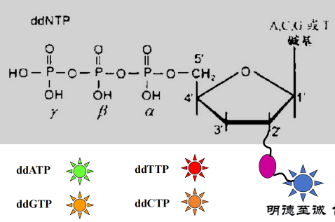

## 第二代测序技术

### 二代测序技术概述

- 二代测序也叫“下一代测序技术”The Next-generation Sequencing,（NGS）
- NGS解决了一代测序只能测一条序列的缺陷，之所以称其为高通量测序就是因为它一次能够同时测很多的序列。
- 也叫“循环芯片测序法” （Cyclic-arraySequencing） ，即对布满DNA样品的芯片重复进行基于DNA的聚合酶链式反应（模板变性、引物退火杂交及延伸）以及荧光序列读取反应

### NGS步骤

#### Step1：文库（library）制备

- A sequencing library is, by definition, a pool of DNA fragments with adapters attached.
- 将核酸序列利用酶方法、化学或物理方法打碎小片段（ fragments ），只选取特定大小的fragments，然后在这些fragments的两端加上测序接头（adapter），形成测序的library。
- adapter是一段已知的短核苷酸序列，用于链接fragments，为后续的library扩增、区分序列来源等

#### Step2：文库PCR扩增

聚合酶链式反应(Polymerase Chain Reaction, PCR)：是一种用于放大扩增特定的DNA片段的分子生物学技术，它可看作是生物体外的特殊DNA制，PCR的最大特点是能将微量的DNA大幅增加

#### Step3：测序

对扩增后的library进行上机测序，测定每个fragment的序列，这些测出来的碱基序列叫做 读段 或 读长（read）

- 测序深度（depth）：目标序列中平均每个碱基被检测的次数
- 覆盖度（coverage）：测序获得的序列占整个目标序列的比例

#### NGS深度和覆盖度

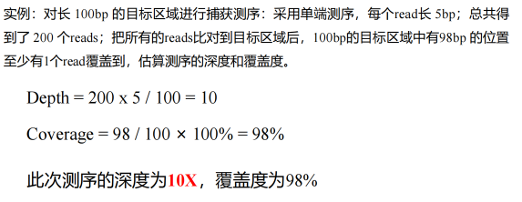

#### NGS测序策略

##### 单末端（Single-end）测序：

• 引物结合位点只连接到DNA或cDNA片段的一端，然后未端加上接头，扩增并测序。
• 单末端测序建库简单，操作步骤少，比双末端测序速度更快一些，价格低
• 常用于小基因组、转录组、宏基因组测序等

##### 双末端测序——Pair-end

- 在DNA或cDNA 片段两端都加上接头和测序引物结合位点，第一轮测序完成后，去掉模板链，然后引导互补链在原位置重新产生并扩增，以获得第二轮测序所需模板，并进行第二轮合成测序。
- 两端的序列形成“一对”，中间的距离叫插入长度。距离信息可以用来判定组装后成对 reads 间的序列是否准确，也可用来帮助组装。这种测序方式可以用来解决基因组中的重复序列难题，被广泛采用。
- 双末端测序则会产生成对的 reads，有利于基因注释和转录本异构体的发现。

##### 单/双末端测序图示

### 二代测序仪及公司

#### 高通量测序技术的问世

- 2003年，随着人类基因组计划的完成，遗传学研究正式进入了基因组学时代。
- 用Sanger法测序一个人的基因组，成本高达5000多万美元。
- 2003年NIH发起了“5年内实现10万美元=1个基因组”和“10年实现1000美元=1个基因组”的两步走战略计划。
- 在鸟枪法的原理基础上，科学家发明了高通量测序技术，提高单位时间内产生的数据量。

#### 测序公司的三强争霸

- 2005年第一台商用高通量测序仪454横空出世，由美国的454Life Sciences公司于2005年开发，后被罗氏收购。
- 2006年英国剑桥的Solexa公司推出基于SBS技术的高通量测序仪，后被Illumina公司收购。
- Sanger法时代的霸主ABI晚了半个身位，于2007也推出了自己的SoLiD高通量测序仪。

#### Roche 454

##### Roche 454 测序原理

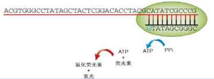

- 焦磷酸测序技术 (Pyrosequencing) 是由Nyren等人于1987年发展起来的一种新型的酶级联测序技术。
- 每当掺入一个碱基 (蓝色的G) 时，就会释放出焦磷酸 (PPi)， PPi在硫化酶 (sulfurylase，蓝色箭头) 催化下生成ATP。然后荧光素酶 (红色箭头) 在ATP参与下将荧光素转变成氧化荧光素同时发光。
- 测序反应是通过释放PPi，经过ATP硫酸化酶和荧光素酶作用发光，向反应体系中加入1种dNTP，如果它刚好能和DNA模板的下一个碱基配对，则会在DNA 聚合酶的作用下，添加到测序引物的 3’ 末端，同时释放出一个分子的PPi，CCD捕捉荧光拍照。

##### Roche 454 测序流程

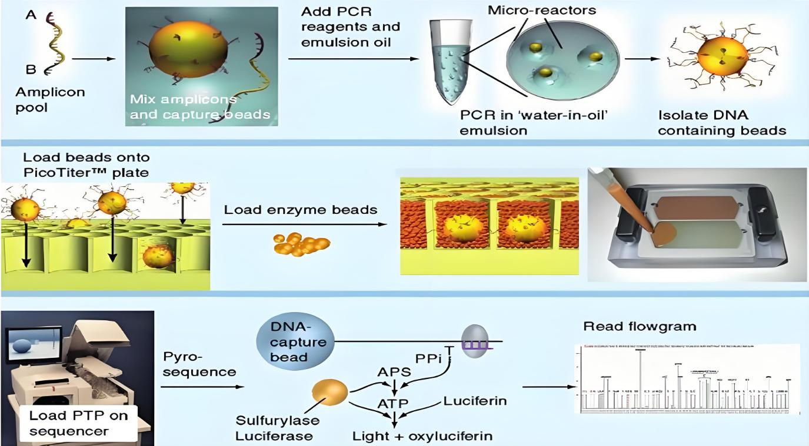

- Step1：文库构建。产生单链模板DNA文库
- Step2：对文库进行乳液PCR（ emulsion PCR, em-PCR ）扩增
- Step3：测序。边合成边测序，焦磷酸测序

##### DNA 文库的制备

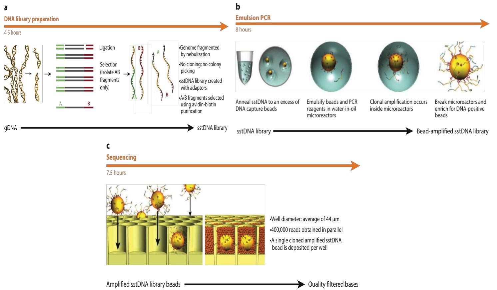
454测序系统中的DNA文库构建与Illumina的构建方法不同，它是利用喷雾法将DNA样本打断成300-800bp的小片段，并在两端加入不同的接头，或者将DNA变性后用引物进行扩增，克隆到特定的载体中，最终构建单链DNA文库

##### 乳液 PCR

Roche 454系统的DNA扩增过程与Illumina不同，这些单链DNA会被28um的珠子固定，并埋入乳液中。
乳剂PCR最大的特点是形成大量独立的DNA扩增反应空间，其关键技术是利用乳剂的特性将不同的珠子分开。
其基本过程为：在进行样本DNA扩增前，将含有PCR反应所有组分的水溶液注入高速旋转的矿物油表面，形成无数被矿物油包裹的小水滴，每一个小水滴形成一个独立的PCR反应空间，理想情况下，每一小滴水滴中只含有一个DNA模板和一个珠子。
磁珠表面包裹着小水滴，上面有与接头相匹配的互补寡核苷酸，使单链DNA能特异性地结合在磁珠上。同时，孵育体系含有PCR试剂，确保固定在磁珠上的每一个小片段DNA都能作为唯一的模板进行扩增。此外，PCR产物还能与磁珠结合。反应完成后，乳化体系被破坏，目标DNA开始聚集。最终，每一个小片段将被扩增约100万倍，从而达到测序过程所需的量级。

##### 焦磷酸测序

测序之前需要用聚合酶和单链DNA结合蛋白将带有DNA的珠子处理好，然后把这些珠子放在PTP板上，这个板上有很多直径为44um的特殊纳米孔，每个纳米孔只能容纳一个珠子，通过这种方式可以固定每个珠子的位置，方便测序。
此测序过程采用的方法是焦磷酸测序（pyrosequencing）。将较小的磁珠放入纳米孔中，开始测序反应。DNA测序反应是以扩增并固定后的单链DNA为基础的，如果一个dNTP能与模板DNA配对，则合成后会释放出焦磷酸基团，释放出的焦磷酸基团与ATP硫酸化学酶发生反应，产生ATP。ATP与荧光素酶共同氧化使荧光素分子被触发而发出荧光，PTP板另一侧的CCD相机记录下荧光信号，最后通过计算机软件对结果进行处理。由于每种dNTP在反应中都会产生独特的荧光颜色，因此可以根据荧光颜色测出DNA序列。反应结束后，ATP被二磷酸酶降解，导致荧光猝灭，测序反应进入下一个循环。

##### Roche 454 测序的特点与主要应用

- 特点
  - read较长，400－800bp
  - 由于454测序技术中，每个测序反应都在PTP板上独立的小孔中进行，因而能大大降低相互间的干扰和测序偏差
  - 通量较低，1Run 1M 序列，400－600Mb
  - 相对成本较高
  - 可以对未知基因组进行从头测序de novo sequencing
  - 当遇到polymer时，如AAAAAA等，荧光强度和碱基个数不成线性关系，判定重复碱基个数有困难
- 主要应用
  - de novo测序

#### Illumina Solexa

##### Illumina Solexa 测序发展历史

- 1997年夏天，Shankar Balasubramanian和David Klenerman提出了合成测序（Sequencing bySynthesis，简称SBS），并成为一种创新的DNA测序方法的基础。1998年，Balasubramanian和Klenerman找到了风险投资公司Abingworth Management，并获得最初的种子资金来成立Solexa。
- 2005年，对噬菌体phiX-174进行了完整基因组的测序，单次运行中带来了超过300万个碱基。
- 2006年，第一代Solexa测序仪，即Genome Analyzer于2006年面世，使科学家能够在单次运行内测序1 Gb的数据。
- 2007年，Illumina收购了Solexa（6亿美元）。

##### Illumina Solexa 测序原理

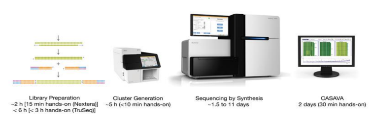
**核心原理：可逆终止反映**
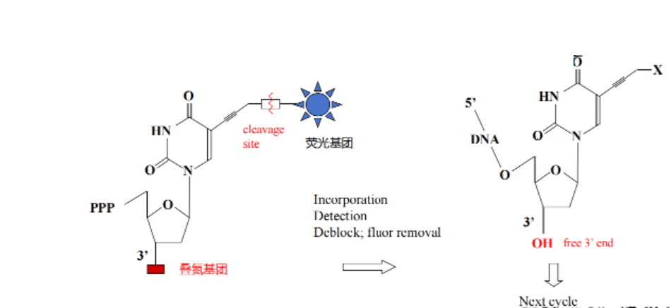

- 四种颜色的荧光基团用叠氮连接到四种相应的碱基上，同时核苷酸 3' 末端也用一个叠氮基堵住，避免后续配对
- 叠氮基团在遇到巯基试剂时，会发生断裂，并在原来的位置留下一个羟基

##### Illumina Solexa 测序流程

- Step1：文库构建。产生单链模板DNA文库
- Step2：对文库进行桥式PCR（ bridge PCR）扩增
- Step3：测序。边合成边测序，可逆终止测序
  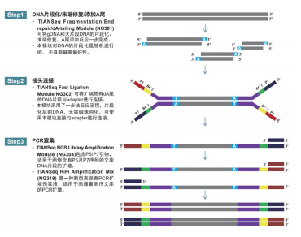

##### 接头（adapter）是一系列特定的寡核苷酸序列，包括：

- P5 和 P7 适配器序列：
  这些是 Illumina 平台上使用的两种常见适配器。P5 适配器位于测序读取的一端，而 P7适配器位于另一端。在测序时，flowcell oligo会与 DNA片段上的 P5 和 P7 适配器序列结合，使 DNA 片段固定在 flowcell上，从而允许进行测序反应。
- DNA barcode 或 index 序列：
  DNA barcode 也称为index（复数为 indices），是一个独特的短序列，用于将不同样本标识，允许在同一测序流程中混合多个样本。这对于高通量测序非常有用，因为它允许同时处理多个样本，而不需要单独测序。
- PCR 引物结合序列：
  接头还包含用于引物结合的序列。PCR 引物是在扩增步骤中使用的特定 DNA 序列，有助于将 DNA 片段进行增加复制，使其在测序过程中变得更加丰富。

##### 流动池：Flowcell

- 是一种载玻片形状大小的半导体芯片,我们也可以把它叫做芯片，像一个载玻片，上面有一行字母，是这个flowcell 的编号。
- 中间的通道，我们把它们叫做 lane，这里就是我们测序反应发生的地方
- lane 又被分成了好多行，每一行我们把它叫做 swath，
- 每行 swath 又被分成好多小格子，每个小格叫做 tile
  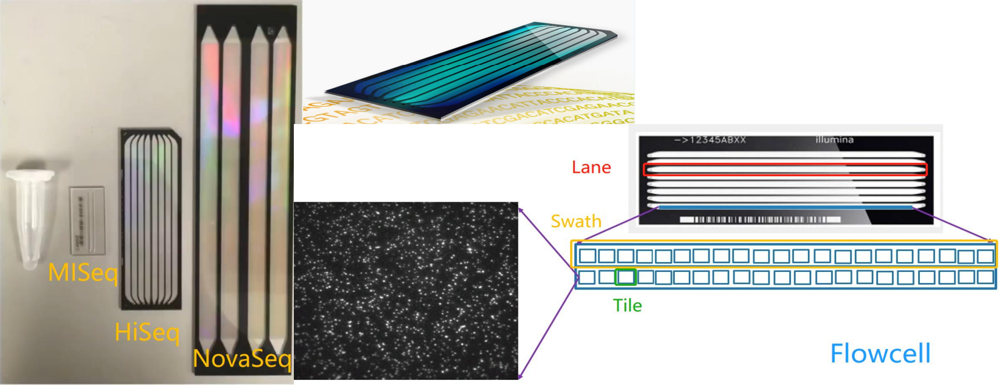
- 在 lane 的内表面其实做了专门的化学修饰，主要有用 2 种不同的寡聚核苷酸引物，它们被种在 flowcell 的表面，也就是我们前面提到的 flowcell oligo，它们会与 DNA 片段上的 P5 和 P7 适配器序列结合，使即将被测序的 DNA 片段可以被固定在 flowcell 上。
  > 图中的一个小圆球就代表一个碱基， 它们是通过共价键连接到 flowcell 上的。

##### 桥式 PCR 扩增

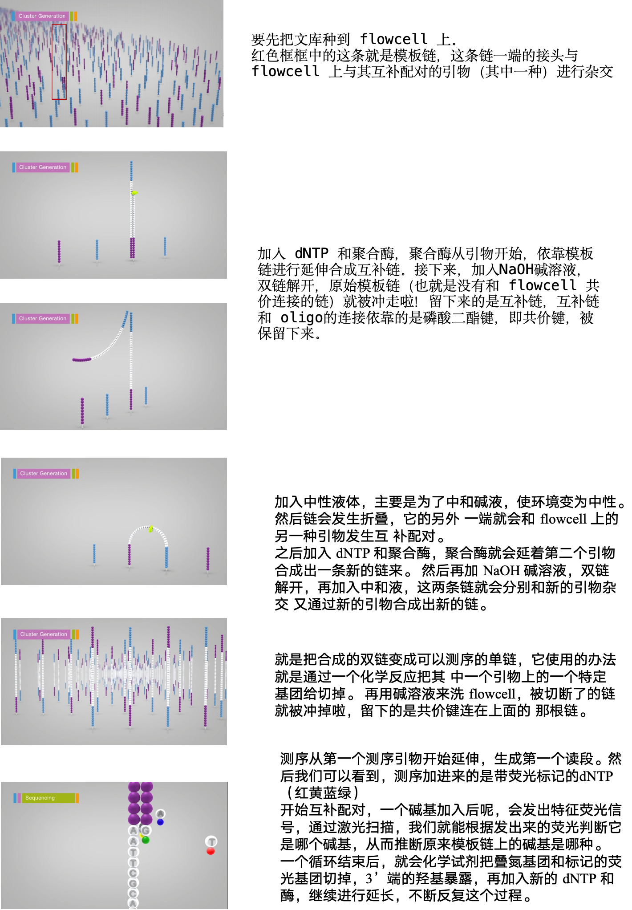

##### 特点

• 高度自动化的系统
• read较短，100－150bp
• 通量高，25G每天，120-150G每Run
• 读取片段多，适合进行大量小片段的测序，如microRNA profiling
• 基于可逆反应，随反应轮数增加，效率降低，信号衰减

##### 主要应用

• RNA测序
• 表观遗传学研究

#### ABI SOLiD (Sequencing by Oligonucleotide Ligation and Detection)

##### Oligo连接测序：

通过连接酶连接，再对oligo上荧光基团进行检测两碱基测序法
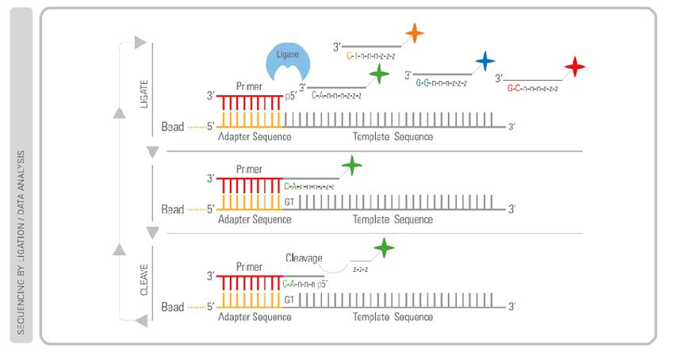
• 前2个碱基是真实的碱基。组合起来可以有16种可能，AA\AT\AG\AC, GG\GA\GT\GC...... 每种排列对一种荧光颜色（红、绿、蓝、黄）。

> 也就是说每种颜色可以对应4种排列。

• 中间3个通用碱基，
• 后3个有荧光标记的碱基
• 前2个碱基是真实的碱基。组合起来可以有16
种可能，AA\AT\AG\AC, GG\GA\GT\GC...... 每种排列对应一种荧光颜色（红、绿、蓝、
黄）。注意！也就是说每种颜色可以对应4种
排列。
• 中间3个通用碱基，
• 后3个有荧光标记的碱基

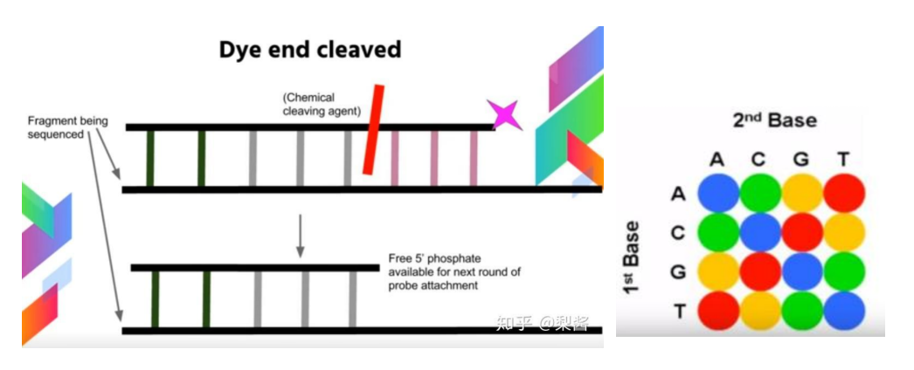
加上8碱基探针后：
• 用激光excite 发荧光。
• 用化学方法剪切掉后面3个荧光标记的碱基，只留下前5个碱
基和游离的磷酸基团，以便加上第二个探针。
• 前两个步骤循环，直到合成整条链。
• 接下来，偏移1个、2个、3个、4个碱基，重复步骤1。也就
是会测5轮
• 最后通过荧光颜色来判断
• 第一个已知的碱基来自5’或3’的adapter，又已知荧光颜色，
就可以推出另外一个碱基
• 可以从5'到3'推测一次序列，反过来也可以从3'到5'再推测一
次序列，这样就可以大大提升测序准确性。

##### SOLiD 测序流程

- Step1：文库构建。产生单链模板DNA文库
  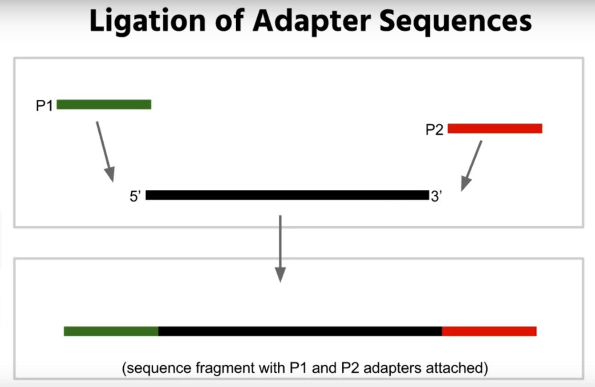
- Step2：对文库进行emPCR扩增 - emPCR：磁珠连接 - fragment可以结合特定bead，不是所有bead都有结合的fragment - 结合有fragment的bead，通过离心筛选出来，然后结合到glass slide
  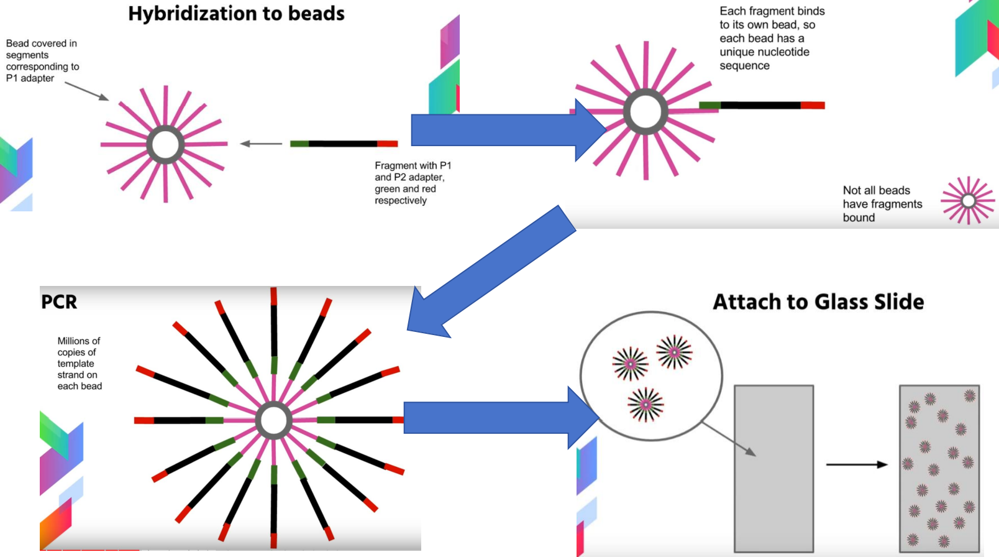
- Step3：连接测序
  - 链接法则
    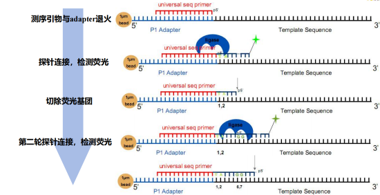
    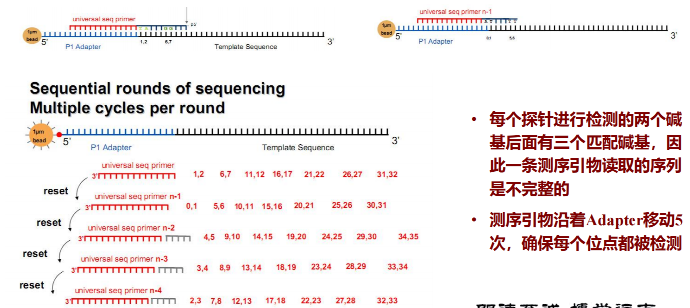
  - 荧光信号映射到字符
    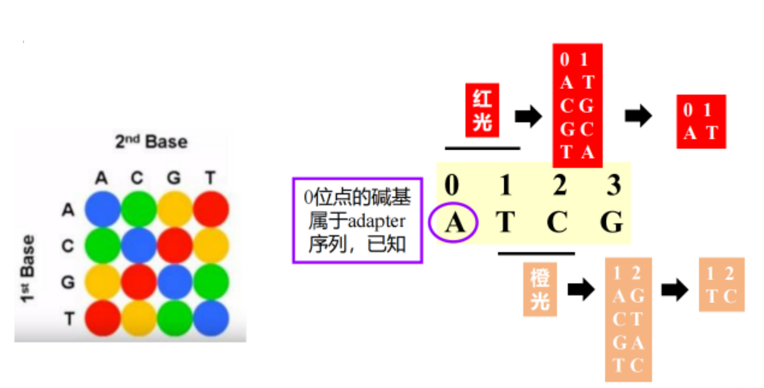

##### 特点

- 读长较短，50-75bp
- 精度高，每个碱基读取两次非常高的准确性，特别是对于SN的检测
- 通量高， 20-30G每天，1Run 可达120G

##### 主要应用

- 基因组重测序
- SNP检测

### 二代测序常见测序平台的差异

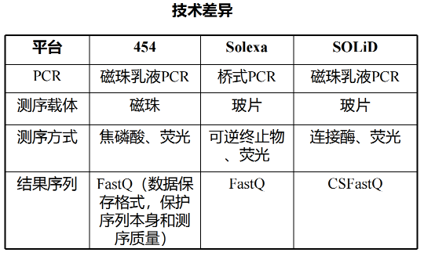

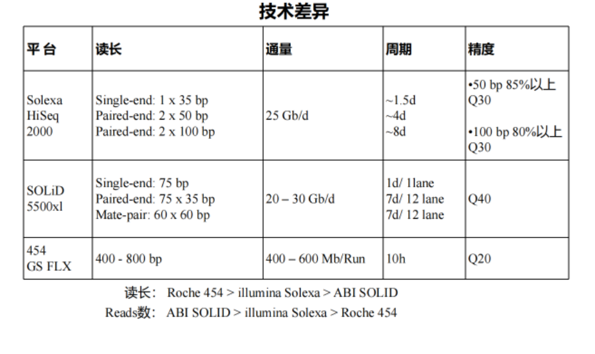

## 第三代测序技术

### 第三代测序技术概述

- 测序技术经过第一代、第二代的发展，读长从一代测序的近1000bp，降到了二代测序的几百bp，通量和速度大幅提升，那么第三代测序的发展思路在于保持二代测序的速度和通量优势同时，弥补其读长较短的劣势。
- 三代测序与前两代相比，最大的特点就是单分子测序，所以又叫单分子测序技术(Single-molecule Sequencing，SMS)，测序过程无需进行PCR扩增，实现了对每一条分子的单独测序。
- 分为两大技术阵营
  - 单分子荧光测序：代表为美国螺旋生物(Helicos)的tSMS技术和美国太平洋生物(Pacific Bioscience)的SMRT技术
  - 纳米孔测序：代表为英国牛津纳米孔公司的新型纳米孔测序法（nanoporesequencing）

### Helicos Heliscope单分子测序技术

#### 原理

- HeliScope测序仪是由Quake团队设计开发的（2008年），实际上是一种循环芯片测
  序设备。
- HeliScope 测序仪最大的特点是无需对测序模板进行扩增，它使用了一种高灵敏度
  的荧光探测仪直接对单链DNA模板进行合成法测序。
  - 首先，将基因组DNA切割成随机的小片段DNA分子（200bp），并且在每个片段末端加上poly- A尾。
  - 然后通过poly-A尾和固定在芯片上的poly-T杂交，将待测模板固定到芯片上，制成测序芯片。最后借助聚合酶将荧光标记的单核苷酸掺入到引物上。
  - 采集荧光信号，切除荧光标记基团，进行下一轮测序反应， 如此反复，最终获得完整的序列信息。

#### 技术特点

- Read 长度约为30-35 bp，每个循环的数据产出量为21-28 Gb；
- 在测序完成前，各小片段的测序进度不同；
- 可根据同聚物的合成会导致荧光信号的减弱（荧光淬灭）这一特点来推测同聚物的长度；
- 可通过二次测序来提高准确度。

### PacBio SMRT单分子测序技术

#### 原理

- Pacific Biosciences (PacBio) 推出的单分子实时 (single molecular real time,SMRT) DNA测序技术基于边合成边测序的思想（使用4色荧光标记 4 种碱基），其超长读长的关键在于使用了活性持久且高保真的DNA聚合酶，并以SMRT Cell作为测序载体。
- 以 RSII 测序平台为例，SMRT Cell是一张厚度为100nm的金属芯片，一面带有15万个（2014年数据）直径为几十纳米的小孔，称为零模波导（zero-mode waveguide,ZMW），也可以简称为纳米孔。
  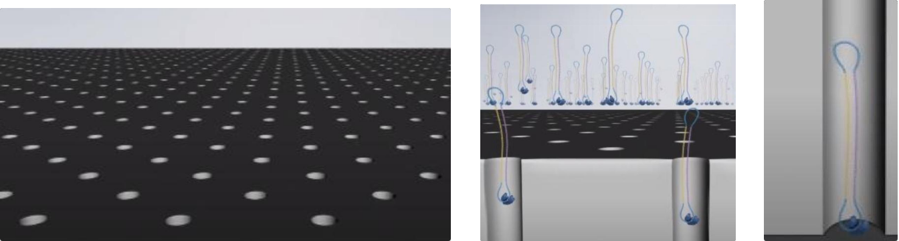
- 固定测序复合物。
  - 将测序复合物（聚合酶，测序模板，测序引物）撒入测序小孔。
  - 由于聚合酶加了生物素，在芯片玻璃底板有链酶亲和素。利用生物素和链酶亲和素的亲和力，包含聚合酶的测序复合物会被固定在玻璃底板。
- 带有荧光基团的dNTP
  - 在芯片溶液中含有许多游离的ATGC四种碱基的dNTP，在磷酸基团上分别带有四种颜色的荧光基团。
    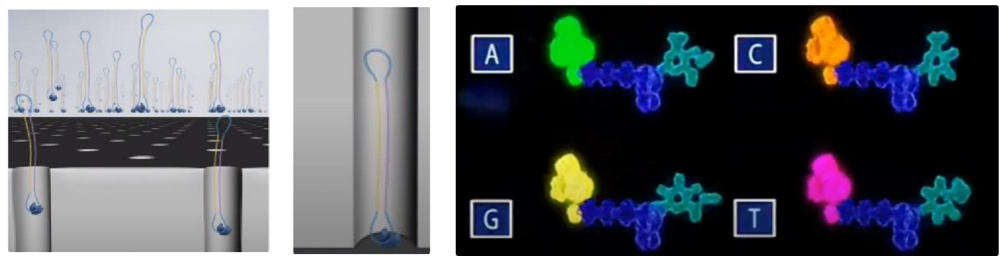

- 边合成边测序。测序时，DNA聚合酶催化相应的dNTP与测序模板互补配对，当一个dNTP被加入到DNA合成链的同时，它也进入了零模波导孔的荧光信号检测区，能够在激发光的激发下发出荧光，光学系统记录所发出的荧光信号，并将其转化为核苷酸序列信息。

#### 特点

- 在不会影响吞吐量和准确性的前提下，提供目前最长的读取长度，可达10 kb；
- 测序速度很快，每秒约10个dNTP；
- 可测取富含AT或GC区域，高度重复序列，回文序列等，不会产生GC的较大偏差；
- 错误率较高，达到15%，出错随机，可通过多次测序来进行有效的纠错；如果不含系统误差，准确度可达 99.999％；
- 原始DNA不被破坏；
- 可以直接测取化学修饰，在表观遗传学中有重要应用
- 在不会影响吞吐量和准确性的前提下，提供目前最长的读取长度，可达10 kb；
- 测序速度很快，每秒约10个dNTP；
- 可测取富含AT或GC区域，高度重复序列，回文序列等，不会产生GC的较大偏差；
- 错误率较高，达到15%，出错随机，可通过多次测序来进行有效的纠错；如果不含系统误差，准确度可达 99.999％；
- 原始DNA不被破坏；
- 可以直接测取化学修饰，在表观遗传学中有重要应用
  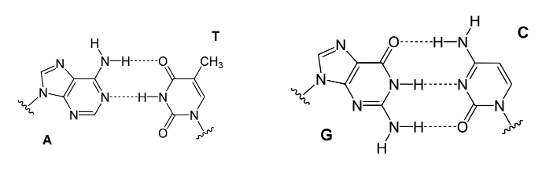

### Oxford Nanopore单分子测序技术

#### 原理

- Reader ：在自然界中，有一种可以嵌入到细胞膜中作为离子或分子通道的跨膜蛋白，具有天然的蛋白纳米孔。经过人为基因工程修饰后，得到的就是 Nanopore 测序所需的纳米孔蛋白Reader。
  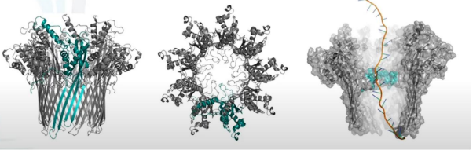
- 多聚物薄膜(Membrane)：纳米孔蛋白会被嵌入到高电阻率的 Membrane （人工合成的多聚物膜），膜两侧是离子溶液，在两侧加不同的电位，离子就会在孔中流动，形成电流。
  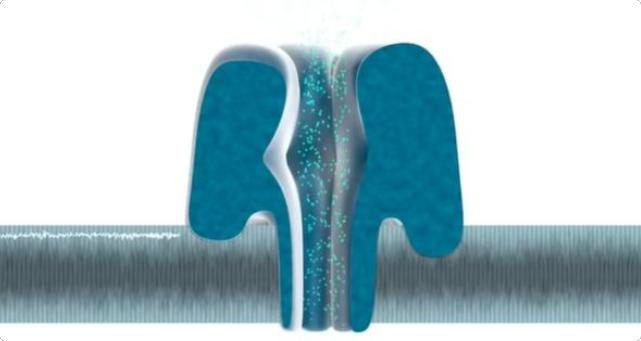
- 马达蛋白（Motor）：在 Nanopore 文库构建时，需要在接头上连接一种动力蛋白，用于将DNA或RNA分子推入纳米孔中。以DNA解螺旋酶作为 Motor（动力蛋白）为例，它除了可以解开双螺旋，使之变为单链，还可以提供推动力。
  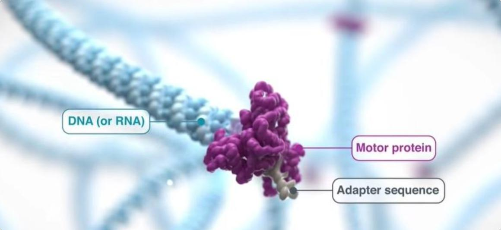
- 连接臂（Tether）：该蛋白用于锚定DNA或RNA链，防止在溶液中飘动，并使其进入纳米孔中。
  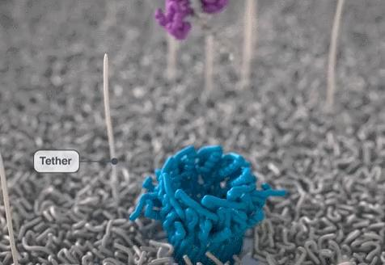

- 纳米孔技术的基本原理
  - 在充斥着电解液的容器中，放置镶嵌有纳米孔蛋白的分子膜，膜上只有纳米孔可以使离子通过。
  - 利用外加电源在纳米孔两侧提供稳定的电势差，使得纳米孔中通过稳定的电流。
  - 由于纳米孔的直径（2.6nm）很小，只能容纳一个核苷酸通过，所以当有核苷酸通过时，纳米孔被阻断，通过的电流强度随之发生变化。
  - 四种核苷酸的空间构象不一样，因此当它们通过纳米孔时，所引起的电流变化不一样。由多个核苷酸组成的DNA或RNA链通过纳米孔时，检测通过纳米孔电流的强度变化，即可判断通过的核苷酸类型，从而进行实时测序。

#### 特点

- 读长很长，大约在几十kb，甚至100 kb；
- 错误率目前相比较高，是随机错误，而不是聚集在读取的两端；
- 数据可实时读取；
- 通量很高(30x人类基因组有望在一天内完成)；
- 起始DNA在测序过程中不被破坏；
- 样品制备简单又便宜；
- 可直接测序RNA。

### 单分子测序技术优缺点

#### 三代测序优势：

- 第三代基因测序read较长，可以减少拼接成本，节省内存和计算时间；
- 真正实现了单分子测序，无PCR扩增偏好性和GC偏好性
- 可直接检测碱基修饰

#### 三代测序缺陷：

- read的错误率偏高，需重复测序以纠错（增加测序成本）；
- 依赖DNA聚合酶的活性；
- 成本较高（二代Illumina的测序成本是每100万个碱基0.05-0.15$，三代测序成本是每100万个碱基0.33-1.00$）
