# 基因组学

## 测序数据存储格式与质量控制

### FASTA

- fasta格式是一种非常简单的储存序列的格式，可以储存核酸序列（DNA/RNA）也可以储存蛋白质的氨基酸序列（Amino Acid sequence，简称AA序列）
- “>”为开始的一行主要储存的是序列的描述信息；剩下的是序列部分，中间，前后都可以有空格。
- 第一行：以”>”,包含了序列的描述信息。
  - sp：代表该序列来自Swiss-Prot 数据库；gi开头代表来自NCBI
  - P69905是这个序列在Swiss-Prot中的编号
  - HBA_HUMAN是这个序列的简称
  - Hemoglobin subunit alpha是全称
- 序列部分按照官方文档的说明应该是小于120就行，一般70到80左右。
  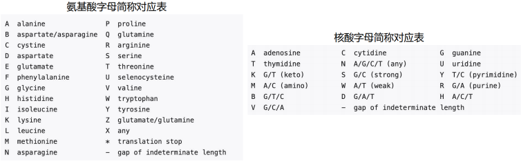

### FASTQ

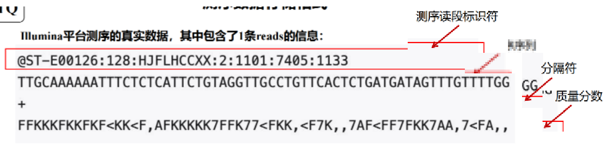
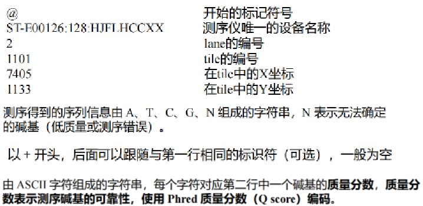

- 在测序仪进行测序的时候，会自动根据荧光信号的强弱给出一个参考的测序错误概率（error probility，P）。
- P值肯定是越小越好。

```
例如：某一个碱基的错误概率为P=0.01
1.将P取log10之后再乘以-10，得到的结果为Q。
  P=1%，那么对应的Q=-10*log10（0.01）=20
2.把这个Q加上33或者64转成一个新的数值，称为Phred，
  最后把Phred对应的ASCII字符对应到这个碱基。
  如Q=20，Phred = 20 + 33 = 53，对应的符号是”5”
```

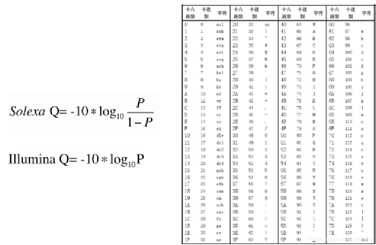

- 测序结果的好坏会影响后续数据分析的可靠性，测序完成后的第一个步骤是对原始读段（raw read）进行质量评价，包括移除、修剪或校正不满足给定标准的read
- 一般情况下，质量控制包括碱基质量得分及核苷酸分布的可视化和基于碱基质量得分及序列质量（如引物污染、控制N含量和GC偏性等）进行read的修剪和过滤。
- 评估Illumima 测序结果的常用工具为 FastQC，工具 NGSQC 适用于所有测序平台

### 评估测序数据质量——FastQC

一款基于Java的软件，一般都是在linux环境下使用命令行运行，它可以快速多线程地对测序数据进行质量评估（Quality Control）

- -o --outdir FastQC生成的报告文件的储存路径，生成的报告的文件名是根据输入来定的
- --extract 生成的报告默认会打包成1个压缩文件，使用这个参数是让程序不打包
- -t --threads 选择程序运行的线程数，每个线程会占用250MB内存，越多越快咯
- -c --contaminants 污染物选项，输入的是一个文件，格式是Name [Tab] Sequence，里面是可能的污染序列，如果有这个选项，FastQC会在计算时候评估污染的情况，并在统计的时候进行分析，一般用不到

- FastQC 可通过输出摘要图表快速进行数据质量的评价
- 输出结果包含12个部分
  - 绿色 √ ：质量达标，PASS
  - 橙色 ！：轻微失常，WARN
  - 红色 x ：严重失常，FAIL

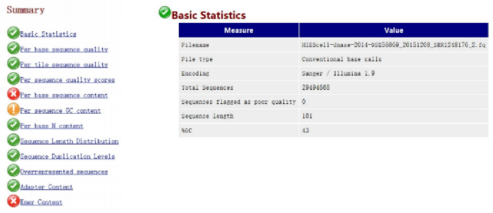

- Encoding
  指测序平台的版本和相应的编码版本号，这个在计算Phred反推error P的时候有用
- Total Sequences
  记录了输入文本的reads的数量
- Sequence length
  是测序的长度
- %GC
  是我们需要重点关注的一个指标，这个值表示的是整体序列中的GC含量，这个数值一般是物种特异的，比如人类细胞就是42%左右

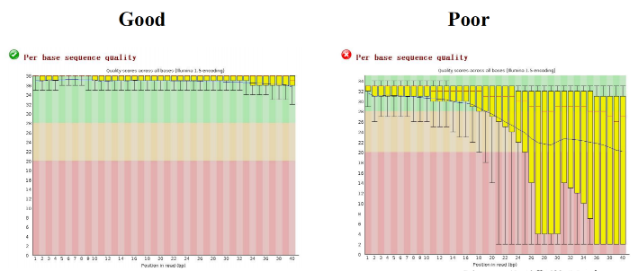

- 图中蓝色的细线是各个位置的平均值的连线
- 一般要求此图中，所有位置的10%分位数大于20,也就是我们常说的Q20过滤
- WARN 如果任何碱基质量低于10,或者是任何中位数低于25
- FAIL 如果任何碱基质量低于5,或者是任何中位数低于20

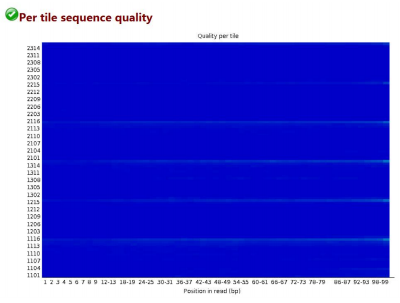

- 横轴和之前一样，代表101个碱基的每个不同位置;纵轴是tile的Index编号
- 这个图主要是为了防止，在测序过程中，某些tile受到不可控因素的影响而出现测序
  质量偏低
- 蓝色代表测序质量很高，暖色代表测序质量不高，如果某些tile出现暖色，可以在后续分析中把该tile测序的结果全部都去除

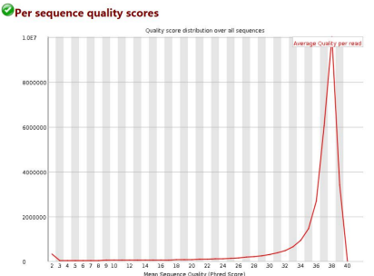

- 假如我测的1条序列长度为101bp，那么这101个位置每个位置Q之的平均值就是这条reads的质量值
- 该图横轴是0-40,表示Q值;纵轴是每个值对应的reads数目
  - WARN：峰值小于27
  - FAIL：峰值小于20
- 我们的数据中，测序结果主要集中在高分中，证明测序质量良好！

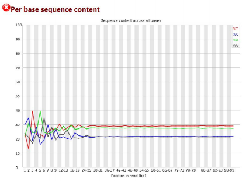
横轴是1 - 101 bp；
纵轴是百分比图中四条线代表A T C G在每个位置平均含量。

- WARN：任一位置的A/T比例或者G/C
  比例相差超过10%
- FAIL：任一位置的A/T比例或者G/C比
  例相差超过20%

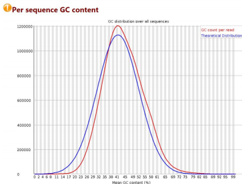

- 横轴是0 - 100%； 纵轴是每条序列GC含量对应的数量
- 蓝色的线是程序根据经验分布给出的理论值，红色是真实值，两个应该比较接近才比较好
- 当红色的线出现双峰，基本肯定是混入了其他物种的DNA序列
  - WARN：偏离理论分布的read超过15%
  - FAIL：偏离理论分布的read超过30%

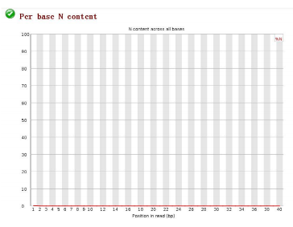

- 当测序仪器不能辨别read的某个位置到底是什么碱基时，就会产生“N”。
- 对所有read的每个位置，统计N的比例
- 正常情况下，N的比例应该很小
- WARN：任一位置N的比例超过5%
- FAIL：任一位置N的比例超过20%

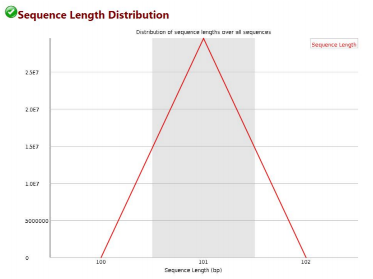
每次测序仪测出来的长度在理论上应该是完全相等的，但是总会有一些偏差
此图中，101bp是主要的，但是还是有少量的100和102bp的长度，不过数量比较少，不影响后续分析
当测序的长度不同时，如果很严重，则表明测序仪在此次测序过程中产生的数据不可信

- WARN：read长度不一致
- FAIL： 有长度为0的read

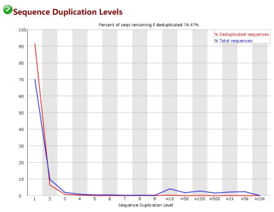

- 低水平的重复可能表明目标序列的覆盖率非常高，但高水平的重复更有可能表明某种富集偏差（例如 PCR过度扩增）
- 统计序列完全一样的read的比例
- 测序深度越高，越容易产生一定程度的duplication，这是正常现象；但如果duplication程度很高，就提示可能有bias
- 横轴表示duplication的次数，纵轴表示duplicated read数目与unique read 总数的百分比
- WARN：duplicated read的比例超过20%
- FAIL：duplicated read的比例超过50%

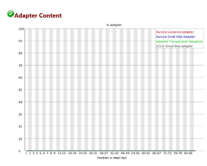

- Read中含有adapter的情况
- WARN：含有adapter的read占总read的比例超过5%
- FAIL：含有adapter的read占总read的比例超过5%
- 横轴：read的位置
- 纵轴：含有adapter的序列占总序列的比例

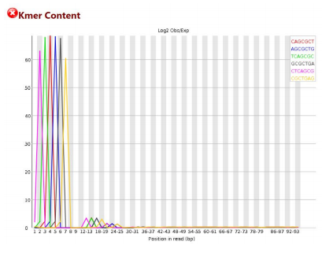

- 这个图统计的是，在序列中某些特征的短序列重复出现的次数
- 1-8bp的时候图例中的几种短序列都出现了非常多的次数，一般来说，出现这种情况，
  要么是adapter没有去除干净，而又没有使用-a参数；
  要么就是序列本身可能重复度比较高，如建库PCR的时候出现了bias

#### 控制方法

- 根据质量评估的结果来决定是否需要采取相关的手段，如去接头、过滤低质量reads、截短序列(主要截断序列起始的接头或者低质量reads)等。
- 常用的工具有 FASTX-Toolkit 和 Trimmomatic 等。
- 如果经过处理之后测序结果评估仍然较差，说明该样本的测序质量较低，应慎重考虑是否用于后续数据分析

## 基因与基因组的基本概念

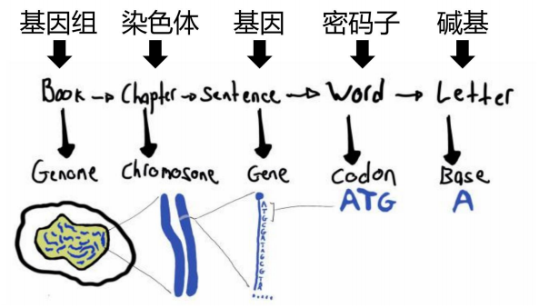

> https://inacrutshell.com/2017/08/21/genetics-the-real-book-of-life/

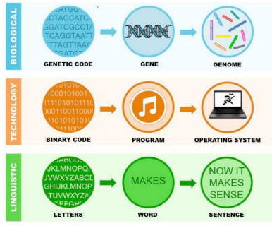

> https://ib.bioninja.com.au/standard-level/topic-3-genetics/31-genes/genome.html

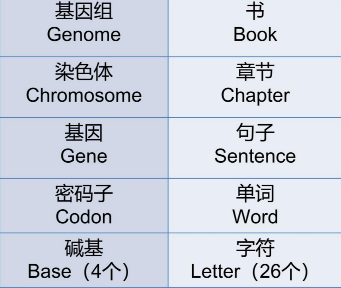

- 基因（Gene）：产生一条编码蛋白或RNA产物的核苷酸序列
- 基因组（Genome）：生物体所有遗传物质的总和
- 基因组学（Genomics）：以生物体全部基因为研究对象，研究基因组结构、功能、演化、组装、编辑等方面的交叉学科。
  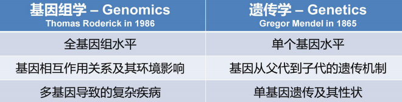

## 基因与基因组结构

### 基因组结构

#### 基因组大小

基因组：A T G C四种，脱氧核苷酸排列组成
人类基因组是由30亿个碱基（base pair）组成
30亿个碱基 = 3,000,000,000 = 3x109 = 3Gbp
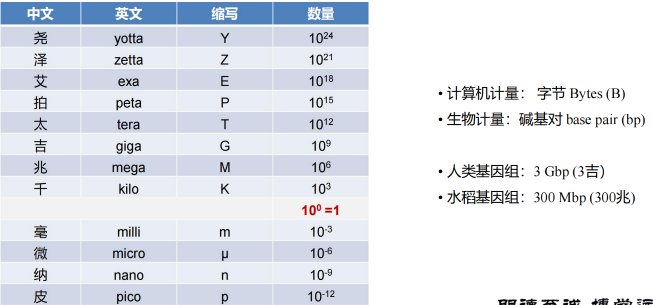
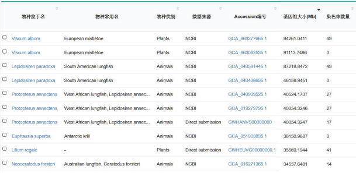

> https://ngdc.cncb.ac.cn/gwh/browse/assembly (as of March 27, 2026)

#### 人体基因组

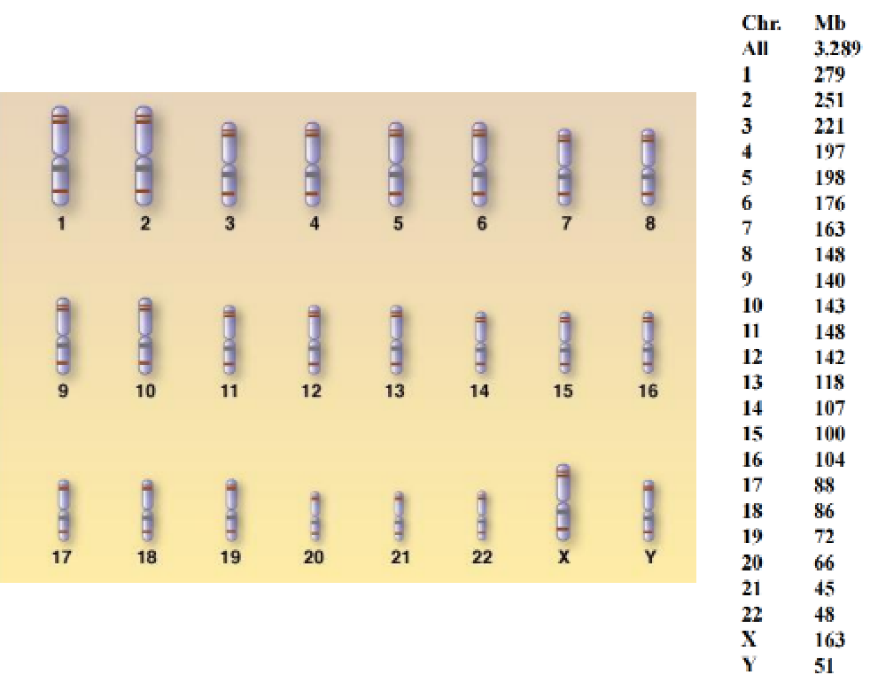
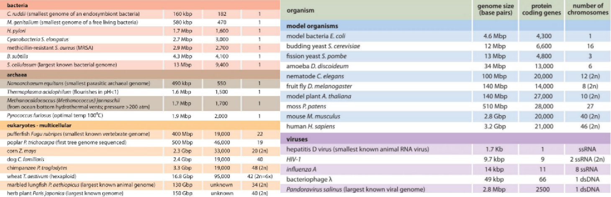

#### 病毒基因组

- 病毒基因组是由核酸构成，核酸是病毒遗传和感染的物质基础。
- 迄今所发现的各种病毒仅含有一种核酸，要么是DNA，要么是RNA。
- 地球上病毒数量极多，文献报道总量达1031，已知的仅有5000 余种。
- 研究病毒基因组的核酸组成和基因组结构，可揭示病毒基因组转录、复制和表达的调控机制，阐明病毒感染和致病的分子基础。

##### 分类

- 巴尔的摩病毒分类系统：一种由美国病毒学家David Baltimore建立的以基因组和病毒转录mRNA方式为区分的病毒分类系统。
  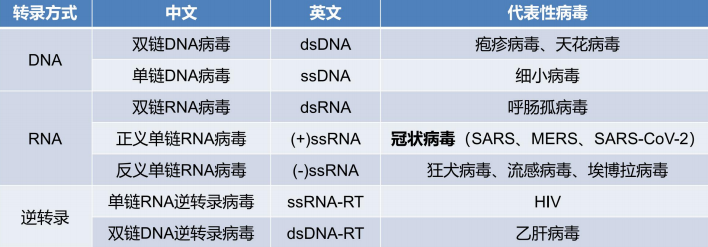

##### 大小

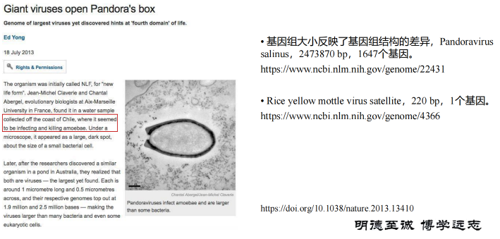

##### 结构及其宿主分布

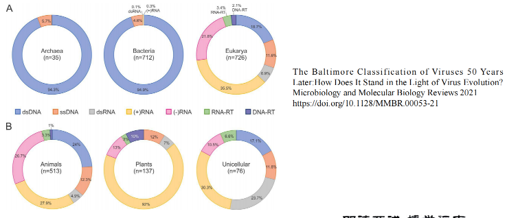

#### 原核生物基因组

##### 结构

- 原核生物(Prokaryote) =细菌(Bacteria)+古细菌(Archaea)
- 基因组大小和基因数目远少于真核生物
- 基因组结构
  - 基因组紧凑
  - 基因连续编码，不含内含子（Intron）
  - 极少出现重复序列
  - 重复基因数量也远小于真核生物
- 遗传物质
  - 染色体：大多数为环状DNA，位于细菌核质区，包含细菌生存的必需基因，只有一个复制起始点，大多数只含有单条染色体
  - 质粒：也是双链环状DNA，能在同种或异种细菌中转移，是附加遗传物质

##### 质粒

- 质粒（Plasmid）一般是小分子DNA，通常为环状，与细菌染色体共存于细胞内
- 有些质粒可整合于主基因组，有的独立存在
- 通常情况下，质粒携带非必需基因，可以跨种属从一个细胞转移到另一个细胞
- 细菌中存在超大型质粒

#### 细菌基因组

##### 大小：free-living vs. parasitic

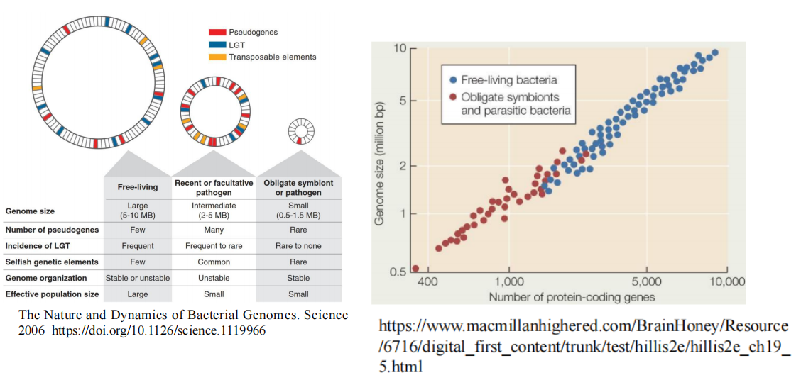

#### 真核生物基因组结构

- 真核生物：动物、植物、真菌、原生生物
  - 有数量不等的染色体
  - 几乎所有的真核生物都有线粒体
  - 植物细胞中有叶绿体
  - 线粒体基因组和叶绿体基因组都呈环状
  - 基因组中有大量重复序列
- 线粒体和叶绿体都是半自主性细胞器
  - 含有各自基因组能够独立复制
  - 可以均等分裂，产生完全相同子代
  - 有相对独立的复制体系和翻译系统
  - 复制和翻译体系不完全独立，受核基因组控制
- 人类基因组：核基因组+线粒体基因组
  - 核基因组DNA呈线性，总长为~3Gbp，由46条染色体构成，22对为常染色体(autosome)，一对性染色体(X、Y)
  - 线粒体基因组为环状DNA分子，长度为16569bp，编码37个基因，每个细胞有约800个线粒体，每个线粒体含2~10个拷贝
- 植物线粒体基因组
  - 高等植物线粒体中含有多个线性和环状DNA
  - 不同种属之间线粒体基因组变化很大，在120-2500kb之间
  - 含有大量短序列的正向、反向重复序列
- 叶绿体基因组
  - 叶绿体基因组较紧凑，基因间很少非编码序列
  - 种属间基因组恒定，约120kb，很少发生重组

##### 基因组大小计量方式

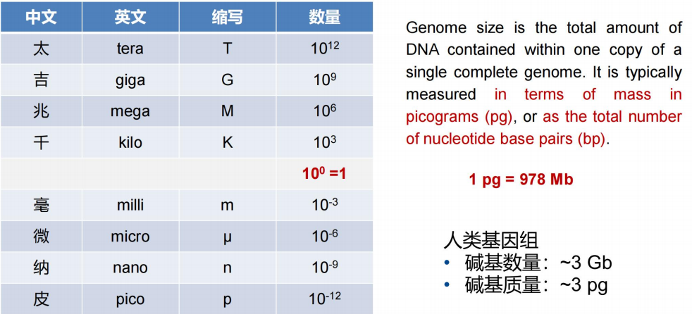

##### 动物基因组

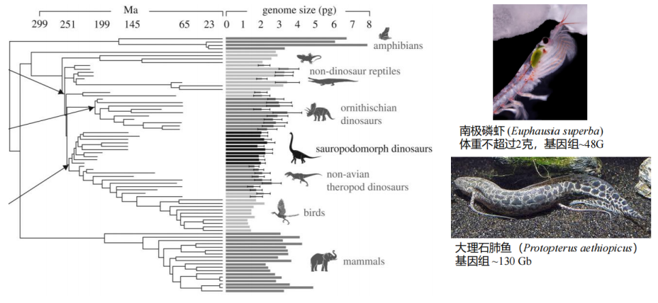

##### 植物基因组

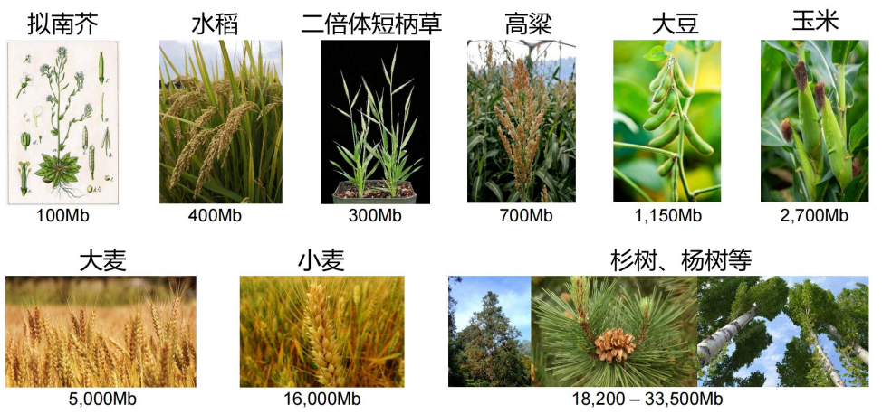

#### 基因数目

- 真核生物核基因组均由一定数目的染色体组成
- 单倍体细胞所含有的全套染色体称为染色体组
- 真核生物染色体数与生物复杂性及其在进化中的地位没有必然联系
- 瓶尔小草属（Ophioglossum ）是已知生物中染色体最多的，有高达1,260条染色体

#### 染色体

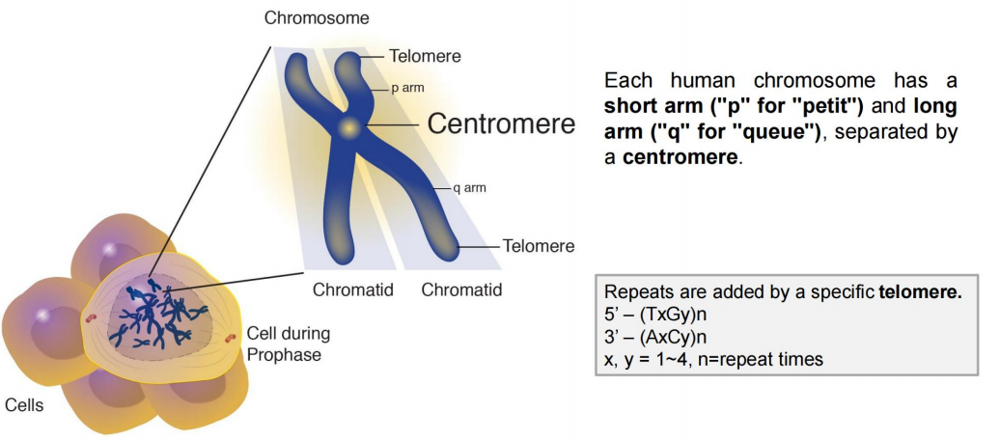
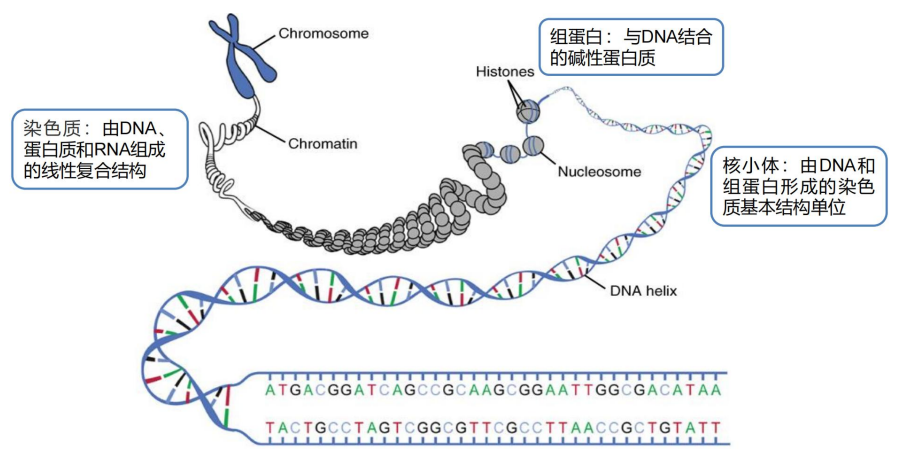

##### 染色体带型命名方法

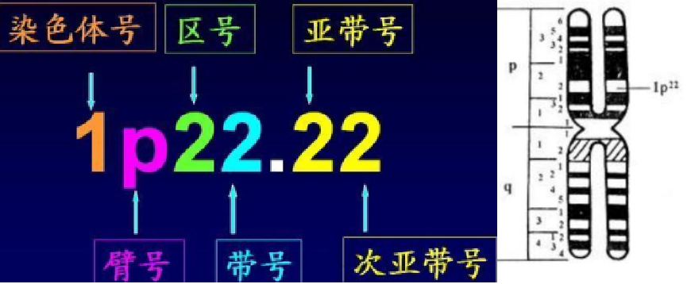

- 深色区与浅色区相间分布
- 以着丝粒为中心向两侧延伸
- 长短臂：短臂p，长臂q
- 区-亚区
- 带-亚带-次亚带

### 基因结构

#### 什么是基因

• One gene – one enzyme (Beadle & Tatum 1940):“Every gene encodes the information for one enzyme”
• One gene – one protein:“One gene contains information for one protein (structural proteins included) one gene – one polypeptide
• Current definition: A piece of DNA (or in some cases RNA) that contains the primary sequence to produce a functional biological gene product (RNA, protein).

> 储存有功能的蛋白质多肽链或RNA序列信息，以及表达这些信息所必需的全部核苷酸序列所构成的遗传单位。

#### 结构

内含子Intron

- Non-coding DNA
- Present between two exons
- Removed by RNA splicing

外显子Exon

- Coding DNA
- Encode a part of the final mature RNA
- Translate into amino acids and proteins

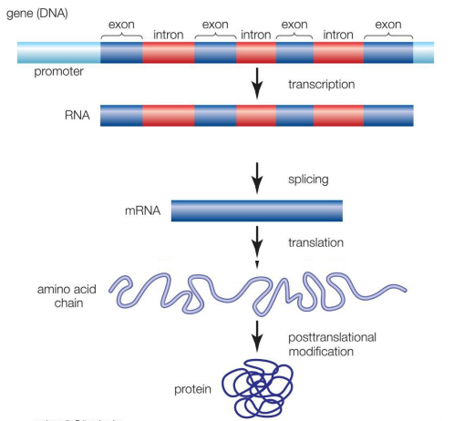

#### 内含子vs外显子

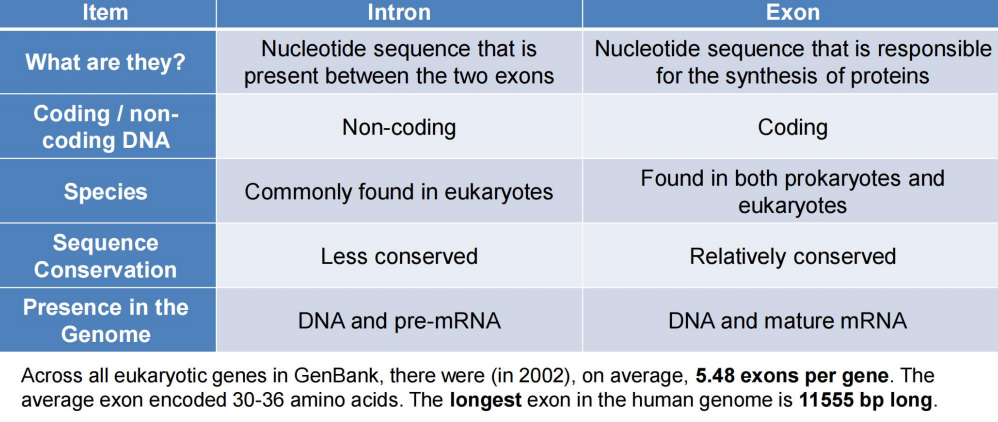
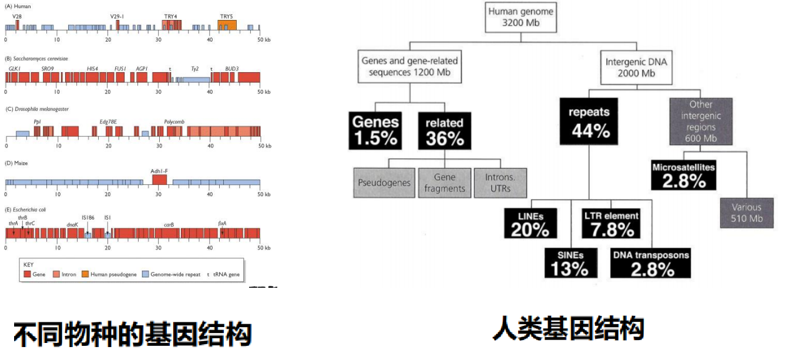

#### 重复序列

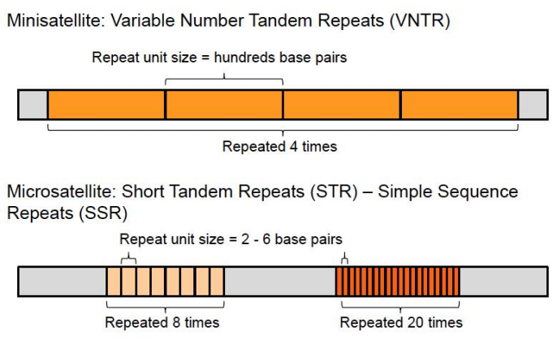

#### 假基因

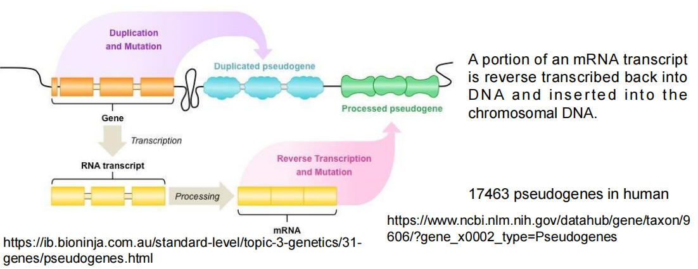

#### 转座子Transposon

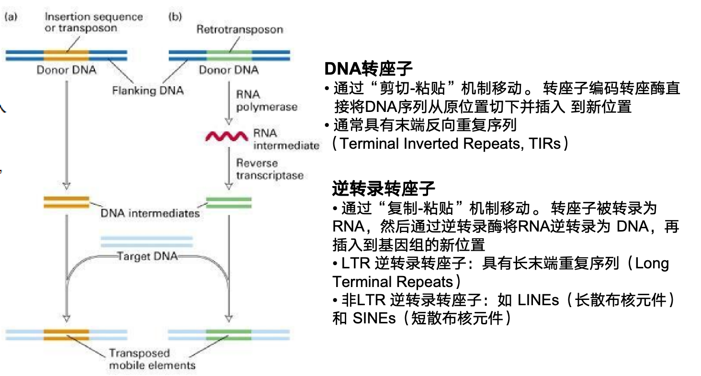

#### 可变剪切（alternative splicing）

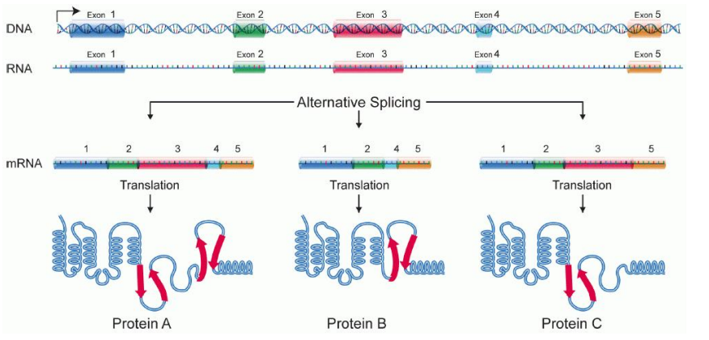

> Alternative splicing is a regulated process during gene expression that results in a single gene coding for multiple proteins.

- "One gene-many polypeptides":aD.melanogaster gene called Dscam,which could potentially have 38,016 splice variants.
- Higher efficiency:information can be stored much more economically.

- Evolutionary flexibility:vertebrates have higher rates of alternative splicing than invertebrates
- Functional diversity:reflected by a rich diversity of expression patterns by coding and non-coding splice variants
- Phenotypic complexity:preceded multicellularity in evolution,aiding in the development of multicellular organisms.
- Human diseases:caused by RNA mis-splicing
  > Alternative splicing of Drosophila Dscam generates axon guidance receptors that exhibit isoform-specific homophilic binding. Cell 2004

#### CpG岛（CpG island）

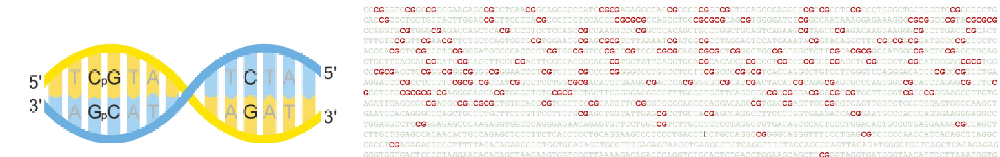

##### CpG区域易发生甲基化

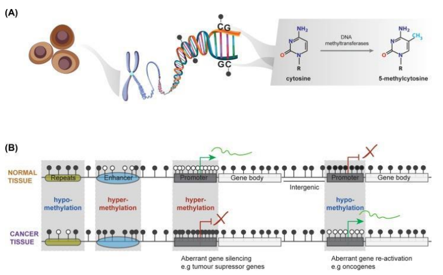
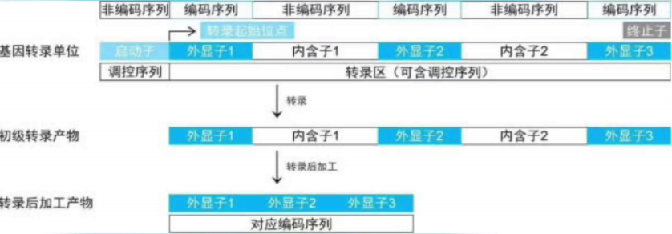

## 基因组测序 DNA-seq

## 基因组变异

## 基因组注释
