# 基因组学

## 测序数据存储格式与质量控制

### FASTA

- fasta格式是一种非常简单的储存序列的格式，可以储存核酸序列（DNA/RNA）也可以储存蛋白质的氨基酸序列（Amino Acid sequence，简称AA序列）
- “>”为开始的一行主要储存的是序列的描述信息；剩下的是序列部分，中间，前后都可以有空格。
- 第一行：以”>”,包含了序列的描述信息。
  - sp：代表该序列来自Swiss-Prot 数据库；gi开头代表来自NCBI
  - P69905是这个序列在Swiss-Prot中的编号
  - HBA_HUMAN是这个序列的简称
  - Hemoglobin subunit alpha是全称
- 序列部分按照官方文档的说明应该是小于120就行，一般70到80左右。
  

### FASTQ


- 在测序仪进行测序的时候，会自动根据荧光信号的强弱给出一个参考的测序错误概率（error probability，P）。
- P值肯定是越小越好。

```
例如：某一个碱基的错误概率为P=0.01
1.将P取log10之后再乘以-10，得到的结果为Q。
  P=1%，那么对应的Q=-10*log10（0.01）=20
2.把这个Q加上33或者64转成一个新的数值，称为Phred，
  最后把Phred对应的ASCII字符对应到这个碱基。
  如Q=20，Phred = 20 + 33 = 53，对应的符号是”5”
```


- 测序结果的好坏会影响后续数据分析的可靠性，测序完成后的第一个步骤是对原始读段（raw read）进行质量评价，包括移除、修剪或校正不满足给定标准的read
- 一般情况下，质量控制包括碱基质量得分及核苷酸分布的可视化和基于碱基质量得分及序列质量（如引物污染、控制N含量和GC偏性等）进行read的修剪和过滤。
- 评估Illumima 测序结果的常用工具为 FastQC，工具 NGSQC 适用于所有测序平台

### 评估测序数据质量——FastQC

一款基于Java的软件，一般都是在linux环境下使用命令行运行，它可以快速多线程地对测序数据进行质量评估（Quality Control）

- -o --outdir FastQC生成的报告文件的储存路径，生成的报告的文件名是根据输入来定的
- --extract 生成的报告默认会打包成1个压缩文件，使用这个参数是让程序不打包
- -t --threads 选择程序运行的线程数，每个线程会占用250MB内存，越多越快咯
- -c --contaminants 污染物选项，输入的是一个文件，格式是Name [Tab] Sequence，里面是可能的污染序列，如果有这个选项，FastQC会在计算时候评估污染的情况，并在统计的时候进行分析，一般用不到

- FastQC 可通过输出摘要图表快速进行数据质量的评价
- 输出结果包含12个部分
  - 绿色 √ ：质量达标，PASS
  - 橙色 ！：轻微失常，WARN
  - 红色 x ：严重失常，FAIL


- Encoding
  指测序平台的版本和相应的编码版本号，这个在计算Phred反推error P的时候有用
- Total Sequences
  记录了输入文本的reads的数量
- Sequence length
  是测序的长度
- %GC
  是我们需要重点关注的一个指标，这个值表示的是整体序列中的GC含量，这个数值一般是物种特异的，比如人类细胞就是42%左右


- 图中蓝色的细线是各个位置的平均值的连线
- 一般要求此图中，所有位置的10%分位数大于20,也就是我们常说的Q20过滤
- WARN 如果任何碱基质量低于10,或者是任何中位数低于25
- FAIL 如果任何碱基质量低于5,或者是任何中位数低于20


- 横轴和之前一样，代表101个碱基的每个不同位置;纵轴是tile的Index编号
- 这个图主要是为了防止，在测序过程中，某些tile受到不可控因素的影响而出现测序
  质量偏低
- 蓝色代表测序质量很高，暖色代表测序质量不高，如果某些tile出现暖色，可以在后续分析中把该tile测序的结果全部都去除


- 假如我测的1条序列长度为101bp，那么这101个位置每个位置Q之的平均值就是这条reads的质量值
- 该图横轴是0-40,表示Q值;纵轴是每个值对应的reads数目
  - WARN：峰值小于27
  - FAIL：峰值小于20
- 我们的数据中，测序结果主要集中在高分中，证明测序质量良好！


横轴是1 - 101 bp；
纵轴是百分比图中四条线代表A T C G在每个位置平均含量。

- WARN：任一位置的A/T比例或者G/C比例相差超过10%
- FAIL：任一位置的A/T比例或者G/C比例相差超过20%


- 横轴是0 - 100%； 纵轴是每条序列GC含量对应的数量
- 蓝色的线是程序根据经验分布给出的理论值，红色是真实值，两个应该比较接近才比较好
- 当红色的线出现双峰，基本肯定是混入了其他物种的DNA序列
  - WARN：偏离理论分布的read超过15%
  - FAIL：偏离理论分布的read超过30%


- 当测序仪器不能辨别read的某个位置到底是什么碱基时，就会产生“N”。
- 对所有read的每个位置，统计N的比例
- 正常情况下，N的比例应该很小
- WARN：任一位置N的比例超过5%
- FAIL：任一位置N的比例超过20%


每次测序仪测出来的长度在理论上应该是完全相等的，但是总会有一些偏差
此图中，101bp是主要的，但是还是有少量的100和102bp的长度，不过数量比较少，不影响后续分析
当测序的长度不同时，如果很严重，则表明测序仪在此次测序过程中产生的数据不可信

- WARN：read长度不一致
- FAIL： 有长度为0的read


- 低水平的重复可能表明目标序列的覆盖率非常高，但高水平的重复更有可能表明某种富集偏差（例如 PCR过度扩增）
- 统计序列完全一样的read的比例
- 测序深度越高，越容易产生一定程度的duplication，这是正常现象；但如果duplication程度很高，就提示可能有bias
- 横轴表示duplication的次数，纵轴表示duplicated read数目与unique read 总数的百分比
- WARN：duplicated read的比例超过20%
- FAIL：duplicated read的比例超过50%


- Read中含有adapter的情况
- WARN：含有adapter的read占总read的比例超过5%
- FAIL：含有adapter的read占总read的比例超过5%
- 横轴：read的位置
- 纵轴：含有adapter的序列占总序列的比例


- 这个图统计的是，在序列中某些特征的短序列重复出现的次数
- 1-8bp的时候图例中的几种短序列都出现了非常多的次数，一般来说，出现这种情况，
  要么是adapter没有去除干净，而又没有使用-a参数；
  要么就是序列本身可能重复度比较高，如建库PCR的时候出现了bias

#### 控制方法

- 根据质量评估的结果来决定是否需要采取相关的手段，如去接头、过滤低质量reads、截短序列(主要截断序列起始的接头或者低质量reads)等。
- 常用的工具有 FASTX-Toolkit 和 Trimmomatic 等。
- 如果经过处理之后测序结果评估仍然较差，说明该样本的测序质量较低，应慎重考虑是否用于后续数据分析

## 基因与基因组的基本概念


> https://inacrutshell.com/2017/08/21/genetics-the-real-book-of-life/


> https://ib.bioninja.com.au/standard-level/topic-3-genetics/31-genes/genome.html


- 基因（Gene）：产生一条编码蛋白或RNA产物的核苷酸序列
- 基因组（Genome）：生物体所有遗传物质的总和
- 基因组学（Genomics）：以生物体全部基因为研究对象，研究基因组结构、功能、演化、组装、编辑等方面的交叉学科。
  

## 基因与基因组结构

### 基因组结构

#### 基因组大小

基因组：A T G C四种，脱氧核苷酸排列组成
人类基因组是由30亿个碱基（base pair）组成
30亿个碱基 = 3,000,000,000 = 3x10^9 = 3Gbp


> https://ngdc.cncb.ac.cn/gwh/browse/assembly (as of March 27, 2026)

#### 人体基因组


#### 病毒基因组

- 病毒基因组是由核酸构成，核酸是病毒遗传和感染的物质基础。
- 迄今所发现的各种病毒仅含有一种核酸，要么是DNA，要么是RNA。
- 地球上病毒数量极多，文献报道总量达10^31，已知的仅有5000 余种。
- 研究病毒基因组的核酸组成和基因组结构，可揭示病毒基因组转录、复制和表达的调控机制，阐明病毒感染和致病的分子基础。

##### 分类

- 巴尔的摩病毒分类系统：一种由美国病毒学家David Baltimore建立的以基因组和病毒转录mRNA方式为区分的病毒分类系统。
  

##### 大小


##### 结构及其宿主分布


#### 原核生物基因组

##### 结构

- 原核生物(Prokaryote) =细菌(Bacteria)+古细菌(Archaea)
- 基因组大小和基因数目远少于真核生物
- 基因组结构
  - 基因组紧凑
  - 基因连续编码，不含内含子（Intron）
  - 极少出现重复序列
  - 重复基因数量也远小于真核生物
- 遗传物质
  - 染色体：大多数为环状DNA，位于细菌核质区，包含细菌生存的必需基因，只有一个复制起始点，大多数只含有单条染色体
  - 质粒：也是双链环状DNA，能在同种或异种细菌中转移，是附加遗传物质

##### 质粒

- 质粒（Plasmid）一般是小分子DNA，通常为环状，与细菌染色体共存于细胞内
- 有些质粒可整合于主基因组，有的独立存在
- 通常情况下，质粒携带非必需基因，可以跨种属从一个细胞转移到另一个细胞
- 细菌中存在超大型质粒

#### 细菌基因组

##### 大小：free-living vs. parasitic


#### 真核生物基因组结构

- 真核生物：动物、植物、真菌、原生生物
  - 有数量不等的染色体
  - 几乎所有的真核生物都有线粒体
  - 植物细胞中有叶绿体
  - 线粒体基因组和叶绿体基因组都呈环状
  - 基因组中有大量重复序列
- 线粒体和叶绿体都是半自主性细胞器
  - 含有各自基因组能够独立复制
  - 可以均等分裂，产生完全相同子代
  - 有相对独立的复制体系和翻译系统
  - 复制和翻译体系不完全独立，受核基因组控制
- 人类基因组：核基因组+线粒体基因组
  - 核基因组DNA呈线性，总长为~3Gbp，由46条染色体构成，22对为常染色体(autosome)，一对性染色体(X、Y)
  - 线粒体基因组为环状DNA分子，长度为16569bp，编码37个基因，每个细胞有约800个线粒体，每个线粒体含2~10个拷贝
- 植物线粒体基因组
  - 高等植物线粒体中含有多个线性和环状DNA
  - 不同种属之间线粒体基因组变化很大，在120-2500kb之间
  - 含有大量短序列的正向、反向重复序列
- 叶绿体基因组
  - 叶绿体基因组较紧凑，基因间很少非编码序列
  - 种属间基因组恒定，约120kb，很少发生重组

##### 基因组大小计量方式


##### 动物基因组


##### 植物基因组


#### 基因数目

- 真核生物核基因组均由一定数目的染色体组成
- 单倍体细胞所含有的全套染色体称为染色体组
- 真核生物染色体数与生物复杂性及其在进化中的地位没有必然联系
- 瓶尔小草属（Ophioglossum ）是已知生物中染色体最多的，有高达1,260条染色体

#### 染色体


##### 染色体带型命名方法


- 深色区与浅色区相间分布
- 以着丝粒为中心向两侧延伸
- 长短臂：短臂p，长臂q
- 区-亚区
- 带-亚带-次亚带

### 基因结构

#### 什么是基因

- One gene – one enzyme (Beadle & Tatum 1940):“Every gene encodes the information for one enzyme”
- One gene – one protein:“One gene contains information for one protein (structural proteins included) one gene – one polypeptide
- Current definition: A piece of DNA (or in some cases RNA) that contains the primary sequence to produce a functional biological gene product (RNA, protein).

> 储存有功能的蛋白质多肽链或RNA序列信息，以及表达这些信息所必需的全部核苷酸序列所构成的遗传单位。

#### 结构

内含子Intron

- Non-coding DNA
- Present between two exons
- Removed by RNA splicing

外显子Exon

- Coding DNA
- Encode a part of the final mature RNA
- Translate into amino acids and proteins


#### 内含子vs外显子


#### 重复序列


#### 假基因


#### 转座子Transposon


#### 可变剪切（alternative splicing）


> Alternative splicing is a regulated process during gene expression that results in a single gene coding for multiple proteins.

- "One gene-many polypeptides":aD.melanogaster gene called Dscam,which could potentially have 38,016 splice variants.
- Higher efficiency:information can be stored much more economically.

- Evolutionary flexibility:vertebrates have higher rates of alternative splicing than invertebrates
- Functional diversity:reflected by a rich diversity of expression patterns by coding and non-coding splice variants
- Phenotypic complexity:preceded multicellularity in evolution,aiding in the development of multicellular organisms.
- Human diseases:caused by RNA mis-splicing

> Alternative splicing of Drosophila Dscam generates axon guidance receptors that exhibit isoform-specific homophilic binding. Cell 2004

#### CpG岛（CpG island）


##### CpG区域易发生甲基化


## 基因组测序 DNA-seq

### 全外显子组测序(Whole exome sequencing,WES)

- WES is a genomic technique for sequencing all of the protein-coding regions of genes in a genome(Wikipedia)
- 利用序列捕获技术将【全基因组的外显子区域DNA】捕获富集后进行高通量测序，能够直接发现与蛋白质功能变异相关的遗传变异SNP
- 相比全基因组测序，外显子组测序只需针对外显子区域的DNA即可，覆盖度更深、数据准确性更高，更加简便、经济、高效
- 可用于寻找复杂疾病如癌症、糖尿病、肥胖症的致病基因和易感基因等的研究

### 全基因组测序（Whole genome sequencing, WGS）

- WGS is the process of determining the entirety, or nearly the entirety, of the DNA sequence of anorganism’s genome at a single time（Wikipedia）
- 对基因组整体进行高通量测序，分析不同个体间的差异，同时完成SNP及基因组结构注释
- 覆盖全基因组，包含外显子测序不能得到的更多信息，在鉴定SNP、插入和缺失突变（Indel）时更有优势

### 全基因组重测序（Whole genome re-sequencing, WGRS）

- 对已知参考基因组和注释的物种进行不同个体间的WGS，并在此基础上对个体或群体进行差异性分析，鉴定出与某类表型相关的SNP
- 覆盖全基因组，是WGS在不同样本上的重复

### Read 比对（mapping）

- reads比对指的是将reads匹配到参考基因组上
- 当reads经过处理满足一定的质量标准后，需要将其比对到参考基因组上
- 截止到目前，研究人员已经开发出了多种比对程序及软件对数以百万记的短读段进行有效的比对
- 常用工具：Bowtie，Bowtie2，BWA，MAQ
  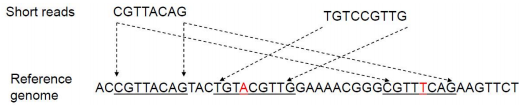

#### 算法BWT

- BWT（Burrows-Wheeler Transform） 是一种用于数据压缩和字符串匹配的算法。
- 由 Michael Burrows 和 David Wheeler 于 1994 年提出。
- BWT 的核心思想是通过对字符串进行重排，使其更易于压缩，同时保留原始字符串的所有信息。
- BWT 在生物信息学中被广泛应用于 短读段比对（如将测序 reads 比对到参考基因组），尤其是在 Bowtie、BWA 等比对工具中

- 分为编码和解码两部分：
  - 编码后，原始字符串中的相似字符会处在比较相邻的位置；
  - 解码就是将编码后的字符串重新恢复成原始字符串的过程
- BWT的一个特点就是经过编码后的字符串可以完全恢复成原始字符串

##### BWT编码

1. 输入一个字符串,假设其中所有字符都介于a-z之间。
2. 在s的末尾加上一个标记字符，该字符要比$中的所有字符都要小。比如$字符。这样将末尾加上标记的新字符串记为s。
3. 重复地将$中的最后一个字符转移到开头，每转移一次就得到一个新的字符串。
4. 将上一步得到的所有新字符串从小到大排序，排序后的字符串数组记为M。
5. M中每个字符串的第一个字符构成F列，M中每个字符串的最后一个字符构成L列。
6. 输出L列。
   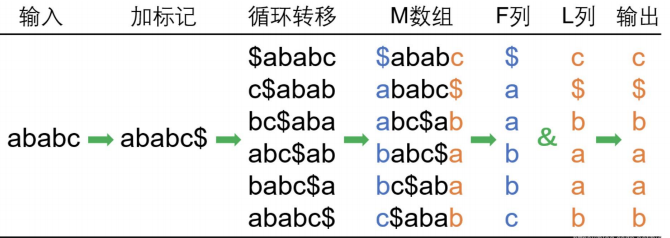

##### BWT解码

1. 输入L列。
2. 对L列进行从小到大排序得到F列。
3. L列的第一个字符是原始字符串的最后一个字符。
4. 根据L列的字符Li找到F列中的相同字符Fj，然后得到Fj所在行的最后一个字符L。将L记录下来。重复上面一步，直到Fj等于标记字符为止。
5. 按照上述步骤找到的各个Lj进行反向排列，得到字符串r。
6. 输出字符串r。
   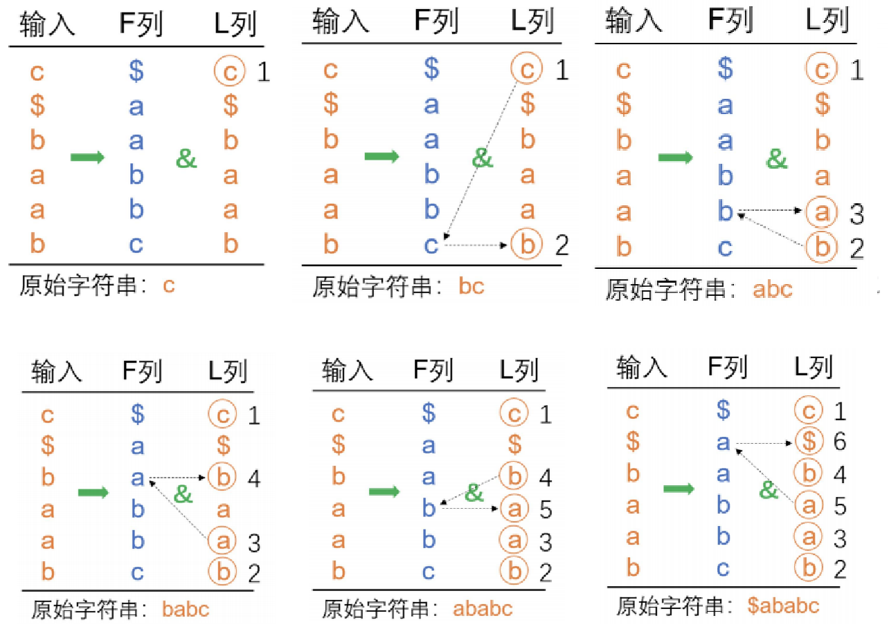

#### 比对文件格式

- reads 比对的结果文件为SAM(sequence alignment map)文件
- SAM 文件由注释信息(header section)和比对结果 (alignment section)两部分组成。
- 注释信息必须处于对齐部分之前，以“@”符号开始，与比对结果区分开来。
- 注释信息用不同的tag表示不同的信息，主要有以下几种格式：
  - @HD，说明符合标准的版本、对比序列的排列顺序。VN是格式版本；SO表示比对排序的类型，有
    unknown（default），unsorted，queryname和coordinate几种。
  - @SQ，参考序列说明。SN：参考序列名字。LN：参考序列长度。这些参考序列决定了比对结果sort的顺
    序
  - @RG，比对上的序列（read）说明。Read Group。1个sample的测序结果为1个Read Group。
  - @PG，使用的程序说明。比对所使用的软件及版本，例如hisat2、bwa等
  - @CO，任意的说明信息
- 比对结果部分由 11个顺序固定的必需字段及相应的可选字段组成
  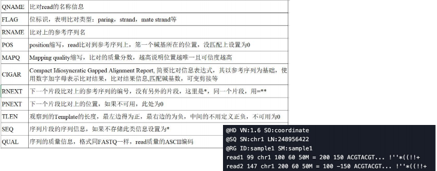
- SAM 文件的二进制形式是 BAM 文件，相当于压缩的 SAM 文件。
- 对比对结果文件进行分析和编辑：SAMtools软件
- 比对结果的可视化：IGV(integrative genomics viewer) 、Genome Maps 和 Savant

#### 比对结果评估

- reads 匹配百分比：用来评估总测序精确度和 DNA污染程度
- reads 随机性分布：以reads 在参考基因组上的分布来评估RNA打断的随机性程度，reads在参考基因组上分布比较均匀说明打断随机性较好。
- 匹配reads的GC含量与PCR偏差相关。
- 评估工具：
  - RSeQC
  - Qualimap

## 基因组变异

### 自然变异

#### 全基因组复制（Whole genome duplication）

日本遗传学家与演化生物学家Susumu Ohno(1928-2000)在1970年提出

- 基因复制(Gene Duplication)
- 全基因组复制(Whole GenomeDuplication,WGD)
- 脊椎动物两轮WGD假说(2 rounds of WGD),2R hypothesis
- 新遗传物质产生的主要机制
- 基因功能分化
- 基因丢失
- 新物种形成

> 大多数真核生物是二倍体(diploid) 以下为多倍体（Polyploid）
> Monoploid (one copy)
> Diploid (two copies)有性生殖物种
> Hexaploid(six copies)小麦
> Heptaploid(seven copies)
> Octaploid (eight copies)草莓
> Nonaploid (nine copies)
> Decaploid (ten copies)
> Triploid (three copies)无籽西瓜
> Tetraploid (four copies)马铃薯
> Pentaploid (five copies)

#### 2R全基因组复制

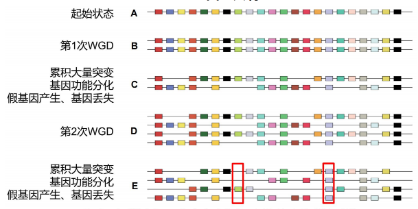

#### 整倍体基因组加倍

- 染色体组：一组完整的非同源染色体，在形态和功能上各不相同且互相协助，携带着控制生物生长、发育、遗传和变异的全部信息
- 整倍体（Euploid）变异：以染色体组（全部染色体）为单位进行复制或减少
- 多倍体（Polyploid）： 具有三个或三个以上染色体组的整倍体（普通小麦是六倍体，6x=42）
  - 同源多倍体（autopolyploid）：增加的染色体组来自同一物种
  - 异源多倍体（allopolyploid）：增加的染色体组来自不同物种，生物进化、新物种形成的重要因素
  - 古多倍体（Paleopolyploidy）：在进化历史中经历了基因组多倍化，但随后通过基因的丢失和重排重新二倍化
  - 新多倍体（Neopolyploidy）：新形成的，基因组未发生重排，仍然保持多倍体形式的物种
- 全基因组复制：又称多倍化事件，在植物、动物、真菌中都有发生

#### 多倍体

- 多倍体：具有2套以上染色体组的细胞或个体
- 染色体加倍：可自然发生，也可人工诱发（秋水仙素等）
- 显花植物中有许多物种是多倍体
- 单子叶植物中多倍体物种占90%

无籽西瓜三倍体：二倍体（2x=22）+四倍体（二倍体WGD，4x=44）

- 同源多倍体—少见：月见草（夜来香）
- 异源多倍体—常见：新种产生的重要途径，如西瓜、小麦、香蕉等 -远缘杂交：杂交种后代育性低，在减数分裂中染色体无法配对。经过染色体加倍，解决了配对的问题，改进了育性。

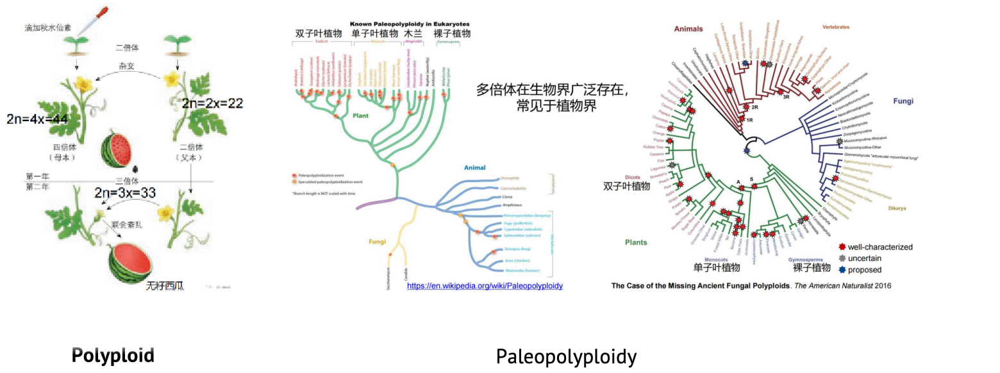

#### 全基因组复制的证据

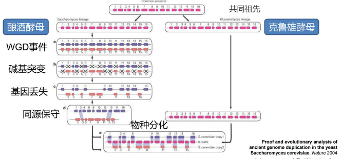

#### 全基因组复制（WGD）

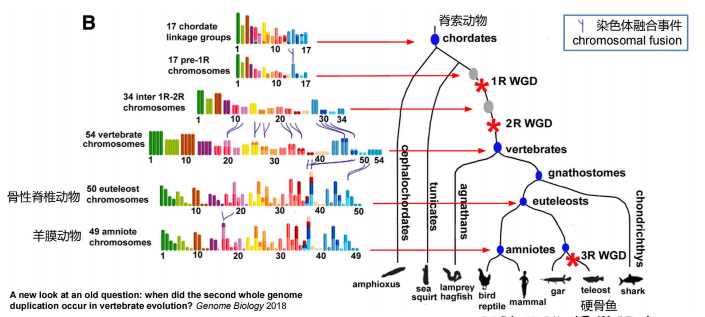

> 异源八倍体的小黑麦是我国鲍文奎用普通小麦和黑麦杂交，并经全基因组加倍而后培育而成。
> 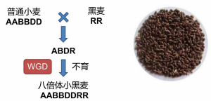

#### 染色体异常（Chromosome abnormality）

- 数量变异(Numerical Variation):非整倍体/异倍体(aneuploid)变异，染色体组非成倍增加或减少，只增加或减少一条或几条
  - 缺失：染色体数目减少
  - 增加：染色体数目增加

- 结构变异(Structural Variation)
  - 拷贝数变异(CNV)
    - 插入(Insertion)

    - 缺失(Deletion)

    - 重复(Duplication)

  - 倒位(Inversion)
  - 易位(Translocation)

#### 染色体结构变异

##### 倒位（Inversion）

- 倒位的类型：
  - 臂内倒位Paracentric
  - 臂间倒位Pericentric
- 倒位是物种进化的重要因素之一，可能导致新物种的产生

> 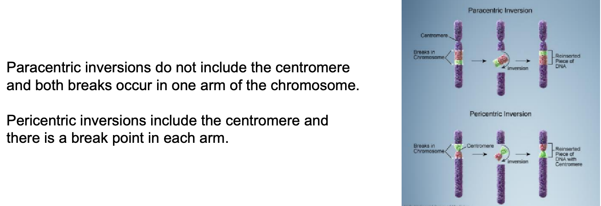
> https://en.wikipedia.org/wiki/Chromosomal_inversion

##### 易位（Translocation）

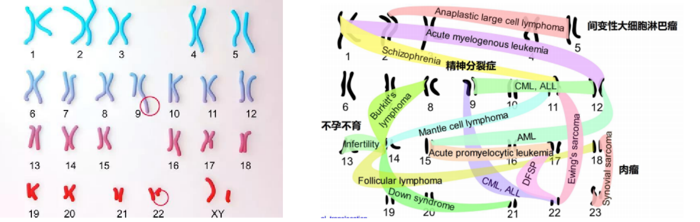

#### 染色体融合（Fusion）

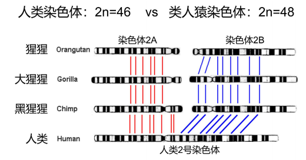

#### 基因获得和缺失（Gene gain and loss）

- 基因家族（Gene family）：来源于同一个祖先，通过复制（Duplication）而产生两个或更多的拷贝而构成的一组同源基因（Homologous genes，duplicates）
- 复制类型：基因复制、基因家族复制
- 家族成员：经过突变（Mutation）和分化（Divergence），在结构和功能上具有明显的相似性，各自具有不同的表达调控模式
- 染色体位置：分散在同一染色体的不同位置，或者存在于不同染色体上

##### 球蛋白基因家族

球蛋白(Globin)超基因家族：脊椎动物氧呼吸代谢过程，主要包括血红蛋白(Hemoglobin)、肌红蛋白(Myoglobin)
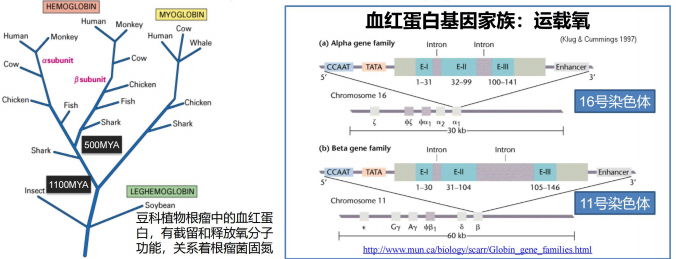

##### 血红蛋白基因家族

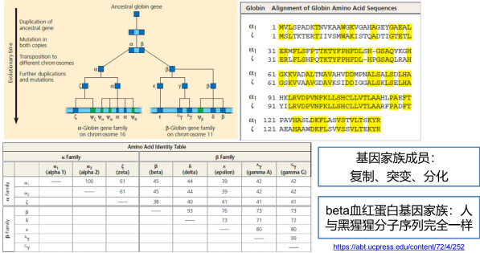

##### 同源基因：直系同源、旁系同源

- 同源基因：直系同源、旁系同源

- 直系同源基因(Ortholog/Orthologous gene):由物种分化所产生同源基因。基因功能保守，进化缓慢，且序列变化速度与进化距离相当，大多数直系同源基因功能相同或相近，调控途径也相似

- 旁系同源基因(Paralog/Paralogous gene):由同一物种内的基因复制而产生的同源基因。基因复制后，其中一条基因丢失或发生沉默，都能促使旁系同源基因分化，产生新特性或新功能
  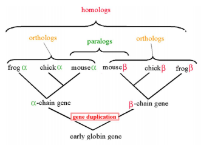

##### Hox基因家族

- 同源异形基因(Hox基因)是生物体内一类重要的发育调控基因家族，专门调控生物形体，一旦这些基因发生突变，就会使身体的一部分变形，在个体胚胎发育中起着重要调控作用。
- Hox基因是生物体形体结构“建筑师”,大多数动物皆拥有类似的Hox基因排列方式、产物与作用方式，经历了几十亿年的长期演化但功能类似。

- 进化上高度保守，在染色体上排列成簇，排列顺序与它们所控制的胚胎发育密切相关，称之为共线性规则。这些基因按顺序活化，保证器官以及各部位骨骼依据发育模式，前后轴(anterior-posterior axis,从头到脚)排列。
  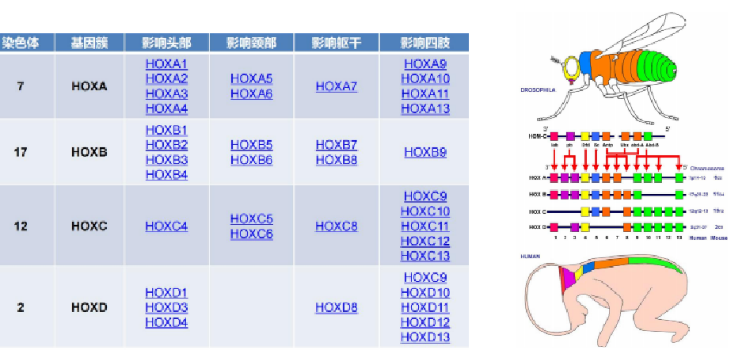

###### WGD引发基因复制

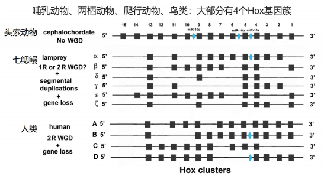

###### 多物种Hox基因

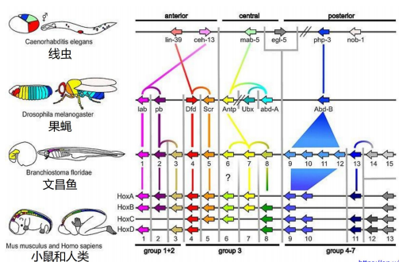

##### 序列插入

- 串联重复序列（Tandem repeat）：以相对恒定的短序列为重复单位，首尾相接，串联连接形成的重复序列，又称卫星DNA (Satellite DNA)
  - 小卫星DNA（Minisatellite）
  - 微卫星DNA（Microsatellite），又称短串联重复（Short tandem repeat，STR），简单序列重复（Simple sequence repeat，SSR）
- 散在重复序列（Interspersed repeat）——转座子（Transposon）：是一种跳跃基因，可以由基因组的一个位置跳跃（插入）到另一个位置
  - I型转座子：又叫反转座子（retrotransposon）：“复制-粘贴”型转座元件，通过RNA的媒介作用，通过RNA的反转录获得DNA，从而转移到其他基因组位置。包括：长末端重复LTR（long terminal repeat）、LINE/SINE（long/short interspersed nuclearelement ）
  - II型转座子：也叫做转座子（transposon）：“剪切-粘贴”型转座元件。在转座酶的作用下，II型转座子从原来的位置解离下来，再重新插入到染色体上

##### 散在重复序列：转座子

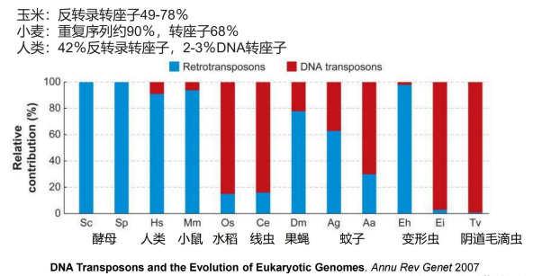

#### 碱基突变/点突变（Point mutation）

#### 基因突变

- 突变类型
  - 替换：ATG=>ACG,假如某单核苷酸替换在群体发生的频率大于1%,该替换称为单核苷酸多态性(SingleNucleotide Polymorphism,简称SNP)
  - 插入：ATG=>ATCG
  - 删除：ATG=>AG
  - 倒位：ATG=>AGT

- 替换类型
  发生频率：转换>颠换
  - 转换(Transition):嘌呤(A/G)间或嘧啶(T/C)间的替换
  - 颠换(Transversion):嘌呤与嘧啶之间的替换

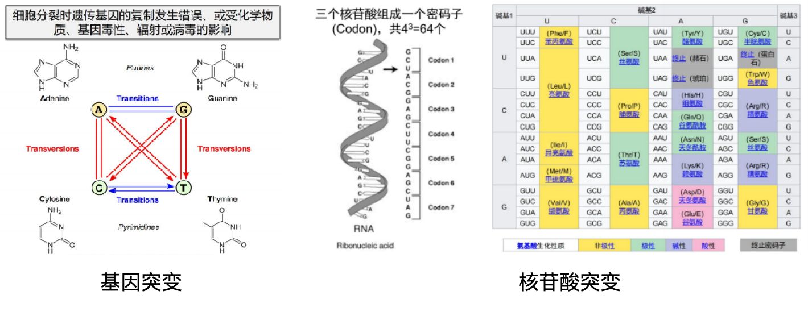

##### 点突变

- 同义突变（synonymous/silent）：不改变编码氨基酸
  TT**A** (Leu) <-> TT**G** (Leu)
- 非同义突变（nonsynonymous）：改变编码的氨基酸
  TT**A** (Leu) <-> TT**T** (Phe)
- 无义突变（nonsense）：某一氨基酸的密码子变为终止密码子
  T**T**A (Leu) <-> T**A**A (Stop)
- 连读突变（read-through）：终止密码子变成某一氨基酸的密码子
  T**A**A (Stop) <-> T**T**A (Leu)

- 突变是生物进化的基本动力
- 突变具有普遍性、随机性、低频性、可逆性等特点
- 发生条件：细胞分裂时遗传基因的复制发生错误、或受化学物质、基因毒性、辐射或病毒的影响
  - 自发突变（spontaneous mutation） ：在自然条件下，有机体由于与环境随机相互作用或偶然的复制错误而发生的突变
  - 诱发突变（induced mutation）：使用诱变剂处理生物体而产生的突变
- 每个基因都有积累突变的风险

##### 突变：生殖细胞 vs 体细胞

- 生殖细胞(germline)突变：发生在生殖细胞中的突变，可通过有性生殖遗传给后代，并存在于子代的每个细胞中。
- 体细胞(somatic)突变：发生在体细胞中的突变，不会传递给子代，但可传递给由突变细胞分裂所形成的子细胞，在局部形成突变细胞群，可能成为病变甚至癌变的基础。

##### 突变率

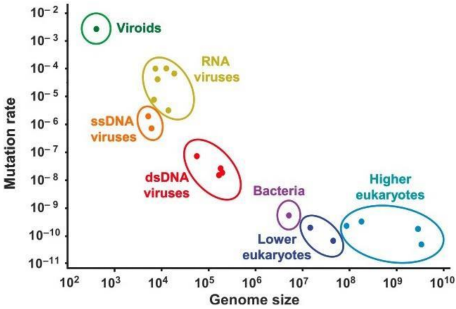

## 基因组注释

### 基因组注释的定义

> **基因组测序完成 >> 基因组注释开始**

#### 基因组注释（Genome annotation）

- 定义：利用生物信息学方法和工具，对基因组所有基因的生物学功能进行高通量注释，是当前功能基因组学研究的一个热点。
  - 结构注释（Structural annotation）：基因位置及其结构等
  - 功能注释（Functional annotation）：基因功能及其调控等
- 目的：识别基因组序列中存在的基因和其他多种功能元件（包括编码基因、非编码RNA、转座子等重复序列、调控元件等），并推测其生物学功能（例：ENCODE）。
- 意义：基因组注释是生物学研究的基础，一个基因组的价值取决于该基因组注释的质量，基因组注释建立了从未知功能的基因组序列到该物种生物学研究的桥梁。

> 识别基因组中编码基因、非编码基因及调控区域

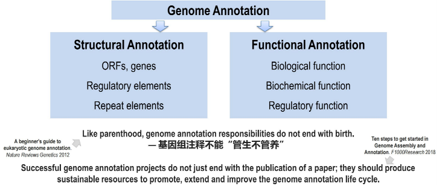

### 基因组注释的复杂性：原核生物 vs 真核生物

#### 基因结构

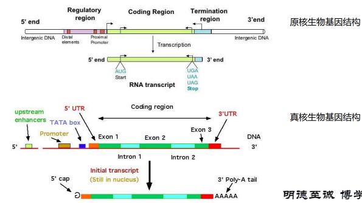

#### 原核生物基因组注释流程

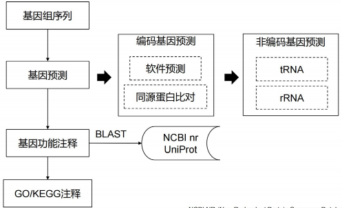

#### 真核生物基因组注释流程

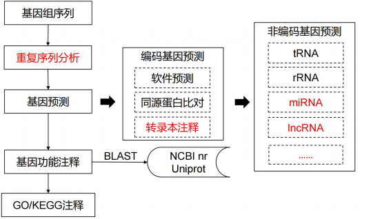

### 基因组结构注释

#### 基因预测的方法

- 湿性实验手段：通过实验分析，看其是否能表达基因产物；通量低、成本高
- 干性实验预测：通过计算机对DNA序列进行特征搜寻，分析寻找基因；通量高、成本低（生物信息学）
- 基于基因结构特征搜寻
- 基于同源基因搜索

##### 方法一：基于基因结构特征搜寻

基因的核苷酸序列并非随机排列，而是具有明显特征，可基于开放读码框（Open reading frame, ORF）预测基因。
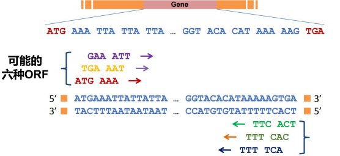

##### 方法二：基于同源基因搜索

- 通过将数据库中的基因序列与待查的基因组序列进行比较，从中查找可与之匹配的碱基序列及其比例，用于界定基因的方法称为同源搜索。

- 同源基因有以下几种情况：
  - DNA序列某些片段完全相同
  - ORF排列类似
  - ORF翻译成的氨基酸序列相同
  - 模拟多肽高级结构相似

#### 原核生物编码基因预测

- 原核生物基因的各种信号位点（如启动子和终止子信号位点）特异性较强且容易识别，因此相应的基因预测方法已经基本成熟。Prodigal和Glimmer是应用最为广泛的原核生物基因结构预测软件，准确度高。
- 原理: 通过扫描基因组，找到从ATG (少数GTG、TTG)开始的位置，直到TGA、TAG、TAA。
- 多顺反子：在原核细胞中，通常是几种不同的mRNA连在一起，位于同一转录单位内，相互之间由一段短的不编码蛋白质的间隔序列所隔开，享有同一对起点和终点。

#### 原核生物编码基因预测软件

- Glimmer：采用内插马尔科夫模型（IMM）来识别编码区域和非编码区域。一般使用三种方法创建训练模型（Delcher et al. 2007. PMID: 17237039）:
  - 用亲缘关系很近的物种基因
  - 用自身序列创建的ORF数据
  - 用基因组本身的已知信息（常采用自身数据作为训练数据）
- Prodigal：原核的动态编程基因查找算法，针对原核生物的基因预测工具，尤其是高GC的基因组，同时也适用于宏基因组（Hyatt et al. 2010. PMID: 20211023）
- GeneMark：原理是使用统计学模型的从头预测(ab initio)方法，不依赖任何先验知识和经验参数，通过描述DNA序列中核苷酸的离散模型，利用编码区和非编码区的核苷酸分布概率不同来进行基因预测（Besemer, et al. 2001. PMID: 11410670）

#### 真核生物基因组结构注释

- Kozak序列是存在于真核生物mRNA的一段序列，位于mRNA 5’端帽子结构后面的一段核酸序列，通常是GCCRCCATGG，其在翻译的起始中有重要作用。
- 起始密码子：ATG/GTG
  - 第一个ATG的确定可依据Kozak规则，即第一个ATG侧翼序列的碱基分布所满足的统计规律，若将第一个ATG中的碱基A，T，G分别标为1，2，3位，则Kozak规则可描述如下：
  1. 第4位的偏好碱基为G
  2. ATG的5’端约15bp范围的侧翼序列内不含碱基T
  3. 在-3，-6和-9位置，G是偏好碱基
  4. 除-3，-6和-9位，在整个侧翼序列区，C是偏好碱基
- 终止密码子：TAA，TAG，TGA
  - GC%=50% 终止密码子每64bp出现一次
  - GC%>50% 终止密码子每100-200bp出现一次
    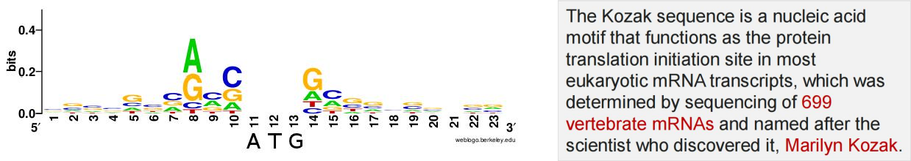

#### 重复序列

重复序列可分为串联重复序列（Tandem repeat）和散在重复序列（Interspersed repeat）两大类：

- 串联重复序列：微卫星序列、小卫星序列等
- 散在重复序列：又称转座子元件TE
  - DNA转座子
  - 反转录转座子（retrotransposon)
    - LTR
    - LINE
    - SINE

#### 重复序列注释方法

- 序列比对方法：一般采用Repeatmasker软件，识别与已知重复序列相似的序列，并对其进行分类。常用Repbase重复序列数据库。
- 从头预测方法：利用重复序列或转座子自身的序列或结构特征构建从头预测算法或软件对序列进行识别。从头预测方法的优点在于能够根据转座子元件自身的结构特征进行预测，不依赖于已有的转座子数据库，能够发现未知的转座子元件。常见的从头预测方法有Recon、RepeatModeler等。

#### 基于转录本注释基因结构

PASA是一种真核生物基因组注释工具，它利用表达的转录序列的剪接排列来自动建模基因结构，并保持基因结构注释与测序数据一致。PASA还识别并分类了转录本比对支持的所有剪接变体。

PASA的注释功能还包括：

- 注释UTR区域
- 外显子的添加、删除、边界调整
- 增加可变剪接变体
- 注释基因的ployA位点
- 识别反义转录本
- 识别并分类所有发现的剪接变异

#### 三种方法的整合

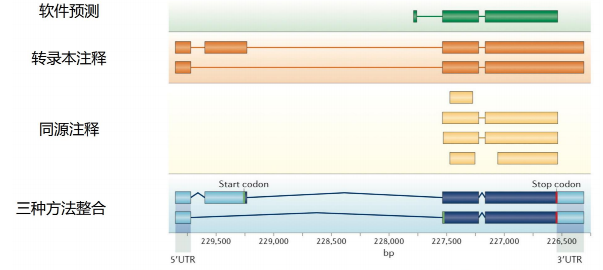

### 基因组功能注释

通过比对的方法根据已知功能的蛋白质编码基因序列预测未知蛋白质编码基因的功能。

- 功能序列（Functional Motif Detection）
- 基因本体（Gene Ontology Annotation）
- 代谢通路（KEGG Enrichment Analysis）

普遍采用BLAST比对方法对预测出来的编码基因进行功能注释，通过与各种功能数据库（NCBI nr、Swiss-Prot 等）进行蛋白质比对，获取该基因的功能信息。

- Swiss-Prot是经过注释的蛋白质序列数据库，由欧洲生物信息学研究所（EBI） 维护。数据库由蛋白质序列条目构成，每个条目包含蛋白质序列、引用文献信息、分类学信息、注释等。
- NCBI nr 是非冗余的蛋白序列数据库，主要数据来源为GenBank CDS translations+PDB+SwissProt+PIR+PRF。

#### 本体论（Ontology）

- Ontology 是特定领域信息组织的一种形式，是领域知识规范的抽象和描述，是表达、共享、重用知识的方法。
- Ontology 是知识体系构建的关键技术，知识图谱是一种人工智能技术，它的关键在于让计算机能够处理人类的知识。然而，人类脑海中的知识通常是直觉性的，我们无法将这种直觉性的知识直接输入给计算机，Ontology 就是一种对知识建模，使计算机能够识别人类知识的方法。
- 本体（Ontology）通过对于概念（Concept）、术语（Terminology）及其相互关系（Relation, Property）的规范化（Conceptualization）描述，勾画出某一领域的基本知识体系和描述语言。

#### 基因本体（Gene Ontology）

基因本体（Gene Ontology，简称GO）是一种系统地对物种基因及其产物属性进行注释的方法和过程。基因本体知识库是世界上最大的基因功能信息资源。这些知识既是人类可读的，又是机器可读的，是生物医学研究中大规模分子生物学和遗传学实验的计算分析的基础。其目标是:

- 维护和发展基因及其产物属性描述的词汇；
- 注释基因及其产物，传播注释数据；
- 提供方便的工具访问数据；
- 实现在实验数据的基础上，使用GO进行程式解析，例如基因富集组分分析。
  > http://geneontology.org

#### GO的组成

- GO中最基本的概念是term
- GO里的每条记录(entry) 都有一个唯一的编号GO:NNNNNNN，对应一个term，比如“cell”、“DNA binding”、“signal transduction”
- 每个term属于一个ontology，总共有3个ontology：
  1. 分子功能（Molecular Function）
     由基因产物进行的分子水平的活动。分子功能术语描述在分子水平上发生的活动，如“催化”或“运输”。
  2. 细胞组件（Cellular Component）
     细胞的组成（如线粒体）或稳定的大分子复合物（如核糖体）。
  3. 生物过程（Biological Process）
     由多个分子活动完成的过程，例如：DNA修复、信号转导。
     注意，一个生物过程并不等同于一个途径

#### KEGG (Kyoto Encyclopedia of Genes and Genomes)代谢路径数据库

是一组手工绘制的图形图，称为KEGG路径图，表示代谢、遗传信息处理、环境信息处理、细胞过程、组织系统、人类疾病和药物开发的分子路径。KEGG中存在三大类代谢图，每个数据路的pathway都有相应的唯一编号。

- reference pathway：根据已有的知识绘制的的具有一般参考意义的代谢图。通路图中的小框都是白色，在KEGG中名字以map开头，比map00010。
- species-specific pathway：物种特有代谢通路图。绿色小框为该物种特有的基因或酶。名字为特定物种种属英文缩写，比如人的糖酵解通路图hsa00010。
- 以ko/ec/rn开头的Reference pathway：ko通路中的节点只代表基因；ec通路中的节点只代表相关的酶；rn通路中的节点只表示该点参与的某个反应、反应物及反应类型。底色以蓝色表示。

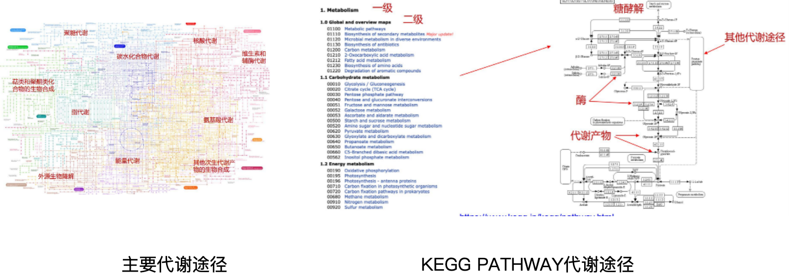

#### 基因功能富集

##### GO/KEGG富集分析

由于GO/KEGG中每种功能类别/代谢途径中的背景基因数量不同，因此基因的绝对数量不能用来衡量基因在某种类别中的富集程度，需要通过统计算法来进行富集分析。

##### DAVID Bioinformatics Resources

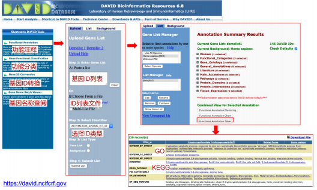
