# 转录组学

## RNA及转录组概论

### RNA

- 核糖核酸（缩写为RNA，即Ribonucleic Acid），存在于生物细胞以及部分病毒、类病毒中的遗传信息载体。
- RNA由核糖核苷酸经磷酸二酯键缩合而成长链状分子。
- RNA的碱基有四种，即A腺嘌呤、U尿嘧啶、G鸟嘌呤、C胞嘧啶，其中，U取代了DNA中的T。
  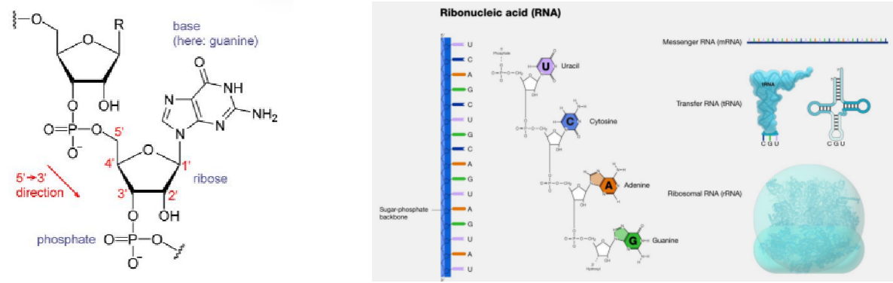
  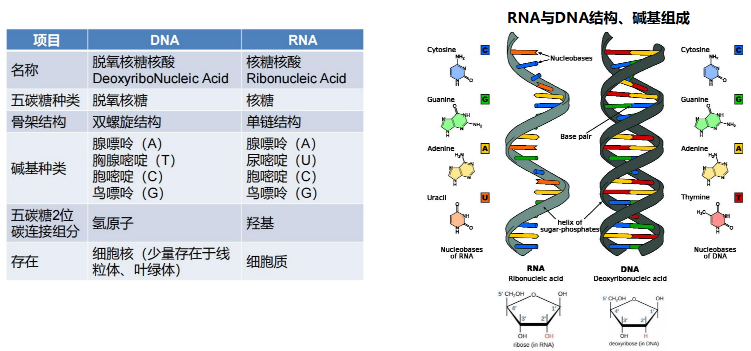

### RNA世界假说

- RNA世界假说(RNA world hypothesis):认为RNA是地球早期生命分子，这
  些早期RNA分子同时拥有DNA遗传信息储存功能，及蛋白质的催化能力，从而支持早期细胞或前细胞生命的运作。- 1962年，Alexander Rich首次提出RNA世界的类似想法 - 1968年，卡尔·沃斯在《遗传密码》建立RNA生命型态的概念 - 1986年，诺奖得主沃特吉尔伯特(Walter Gilbert)正式提出

- RNA作为酶
  - 可自我复制
  - 可催化简单化学反应
  - 可催化肽键形成

- RNA作为信息存储介质
  - 比较脆弱，易水解
  - 不稳定，变异可能性大

- RNA作为调控物质
  - 核糖开关(Riboswitch):基因表达的调控物质之一，在细菌、植物和古菌中发现，改变其二级结构以响应所结合的代谢物，从而影响转录
  - RNA温度计(RNA thermometer):受温度变化而调节基因表达

### RNA thermometer

- RNA温度计（RNA thermometer）是一类对温度敏感的非编码RNA，能随温度变化调控基因表达。主要调控与热休克和冷休克反应有关的基因，与致病性、饥饿状态等过程相关的基因调控也有关系。
- 二级结构随温度变化而改变，使RNA上核糖体结合位点（RBS）等重要区域暴露或遮蔽，进而改变对应编码基因的翻译速率。
- 一般认为，在早期的RNA世界中，RNA温度计的作用是对其他的RNA分子进行温度依赖性的调控。在现代生物中，RNA温度计可以说是一个RNA世界的良好分子化石。

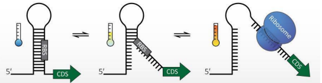

### RNA World

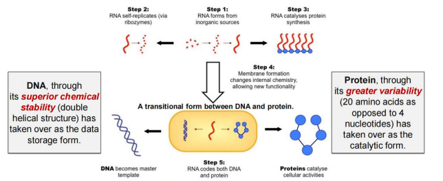

### RNA复杂性

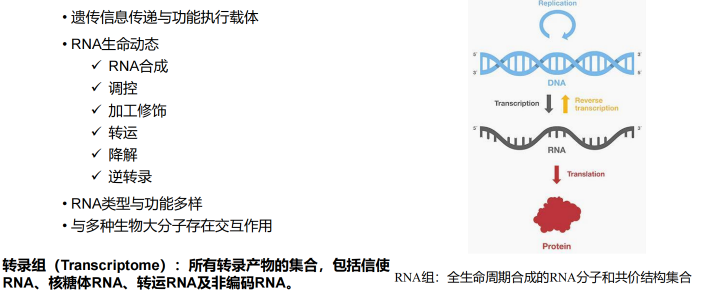

### RNA主要类型

- 在细胞生物中，mRNA为遗传讯息的传递者，指导蛋白质合成，被称为编码RNA（coding RNA）
- 没有编码蛋白质能力的RNA则被称为非编码RNA（non-coding RNA）
- 非编码RNA通过催化生化反应，或调控、参与基因表达过程而发挥相应的生理功能
- 功能：蛋白合成、调控、修饰、复制等

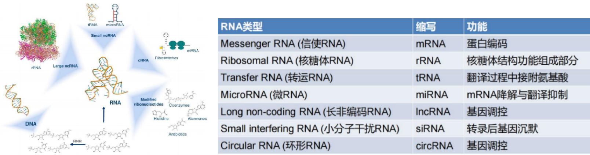

### RNAs in human

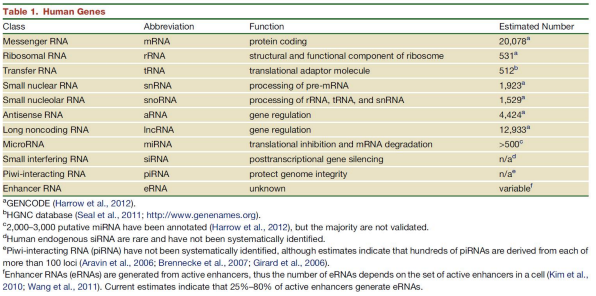

> Transcriptional Regulation and Its Misregulation in Disease. Cell 2013
> https://doi.org/10.1016/j.cell.2013.02.014

### 非编码RNA

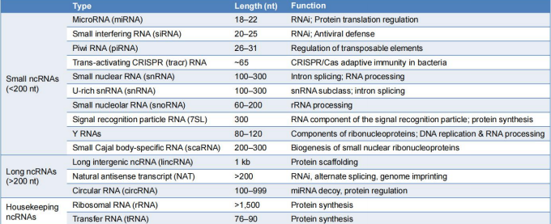

### 信使RNA (Messenger RNA)

- 信使RNA（mRNA）：单链RNA，携带遗传信息，利用遗传密码将每个碱基三联体（或密码子）翻译成相应氨基酸，将遗传信息从DNA传递到核糖体，指导蛋白质合成
- mRNA占细胞总RNA的2%~5%，种多，代谢活跃，半衰期短，合成后数分钟至数小时即被分解

### 核糖体RNA (Ribosomal RNA)

- 核糖体RNA（rRNA），转录自核糖体DNA，分子质量大，结构复杂，是细胞内含量最多的一类RNA，占RNA总量的82%左右
- 功能为在mRNA的指导下将氨基酸合成为肽链，rRNA与多种蛋白质结合成核糖体（Ribosome），作为蛋白质生物合成的“装配机
  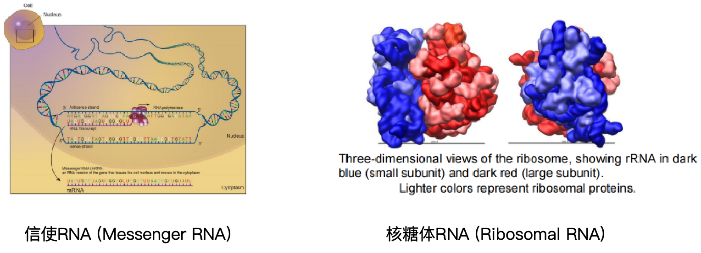

### 转运RNA (Transfer RNA)

- 转运RNA（tRNA），由70-90个核苷酸组成，折叠成三叶草形状
- 氨酰-tRNA合成酶催化tRNA 3'端接附特定种类氨基酸
- 翻译过程中，tRNA反密码子识别mRNA的密码子，将密码子所对应氨基酸转运至核糖体合成多肽链
- 由于遗传密码简并性，存在多种tRNA与一种氨基酸接附现象
- 1968年，罗伯特·W·霍利因其首次分离tRNA，并阐明其序列与结构而获得诺贝尔生理学或医学奖

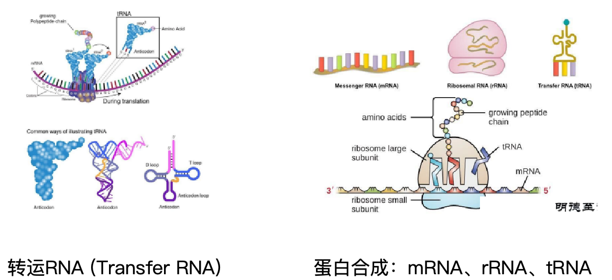

### 微小RNA (miRNA)

- 微小RNA（microRNA, miRNA）内生小非编码RNA分子，~22 nt
- miRNA大多具有茎环结构，其加工过程包括三个阶段：
  - 原始pri-miRNA (300~1000nt)
  - 前体pre-miRNA (70~90nt)
  - 成熟miRNA (20~24nt)
- miRNA在RNA沉默和基因表达转录后调控中发挥作用，通过与mRNA互补配对，诱导mRNA链被切割，或促使mRNA缩短其poly(A)尾巴而降低稳性，或降低mRNA翻译成蛋白质的效率

- 致癌miRNA（OncomiR）：如miR-21（抑制抑癌基因）、miR-17-92簇（促增殖）。
- 抑癌miRNA（TS-miRNA）：如miR-34（激活p53通路）、let-7（抑制RAS）。
  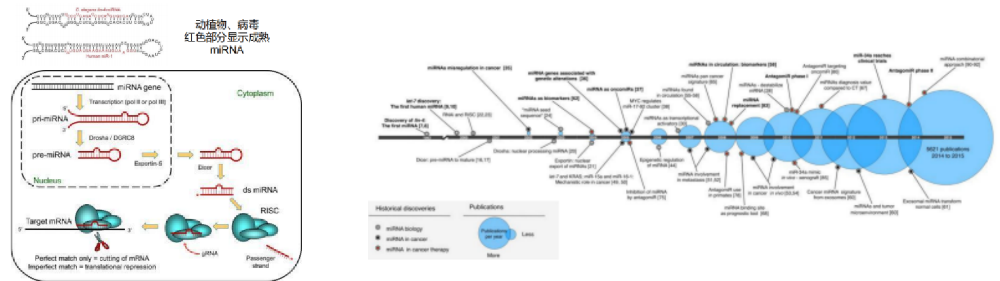

### 长非编码RNA (lncRNA)

- 长链非编码RNA（Long non-coding RNA, lncRNA）是长度大于200个核苷酸的非编码RNA
- 在表观遗传调控、细胞周期调控和细胞分化调控等众多生命活动中发挥重要作用，是目前研究热点
- lncRNA分类
  - 反义长lncRNA
  - 内含子lncRNA
  - 基因间lncRNA
  - 启动子相关lncRNA
  - 非翻译区lncRNA

### LncRNA与染色体失活

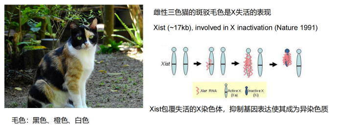

### 小干扰RNA (siRNA)

- 小干扰RNA (Small interference RNA, siRNA)，也称短干扰RNA或沉默RNA，是一类双链非编码RNA分子，长度为20-25个核苷酸对
- 与miRNA相似， siRNA在RNA干扰(RNA interference, RNAi)通路中起作用
- siRNA干扰具有互补核苷酸序列的特定基因的表达，降解转录后mRNA，从而阻止蛋白翻译过程

### RNA干扰（RNAi）

- RNA干扰(RNA interference,RNAi)是指一种分子生物学上由双链RNA诱发 的基因沉默现象，其机制是通过阻碍特定基因的转录或翻译来抑制基因表达。
- RNAi机制普遍存在于动植物，尤其是低等生物中，被认为是进化上相对保守的基因表达调控机制
- 1990年Jorgensen研究查尔酮合成酶对花青素 合成速度的影响，得到了白色和白紫杂色的矮牵牛花。
- 1992年，Romano和Macino在粉色面包霉菌中 发现外源导入基因可抑制具有同源序列的内源基因表达。
- 1998年，Fire和Mello在线虫中发现，双链 RNA相比正义或反义RNA显示出了更强的抑制效果(Nature 1998)。

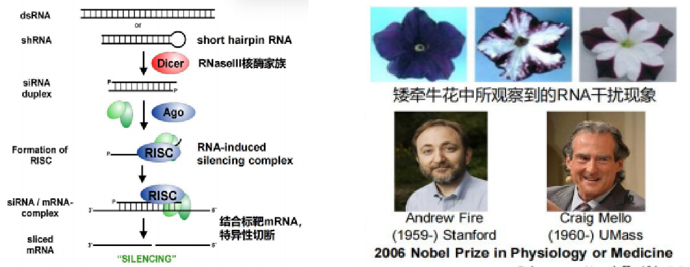

### 环形RNA (circRNA)

- 环形RNA（Circular RNA）是一种单链RNA，分子呈封闭环状结构，表达稳定，不易降解，是RNA领域最新研究热点
- 功能上，circRNA分子富含miRNA结合位点，在细胞中起到miRNA海绵（miRNA sponge）的作用，可解除miRNA对其靶基因的抑制作用，称为竞争性内源RNA（ceRNA）机制
- 人类：768986 circRNAs（circAtlas数据库）
  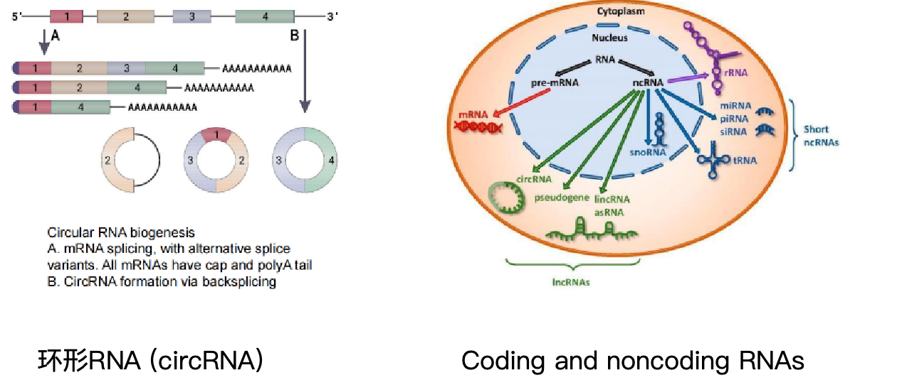

### RNA合成（转录Transcription）

- 转录：在RNA聚合酶（RNA Polymerase）的催化作用下，遗传信息由DNA到RNA的过程，一般分为启动、延伸、终止三个阶段
  - 启动：转录起始于RNA聚合酶和通用转录因子与启动子的结合
  - 延伸：转录启动后，DNA双螺旋链解开，RNA聚合酶以其中一条DNA链作为模板链。RNA聚合酶以3’-5’端的方向读取模板链，并以5’-3’端的方向合成与之反向平行互补的RNA链，也称转录本（Transcript）
  - 终止：转录终止于DNA非编码序列末端附近的终止子处

### 转录调控

- 转录调控（Transcriptional regulation）：指通过改变转录效率从而调控RNA转录本表达水平的过程。转录调控可以控制基因的时空动态表达。原核与真核生物具有不同的转录调控机制。
- 顺式作用元件（cis-regulatory elements, CRE）： 位于基因旁侧序列中能影响基因表达的DNA序列，可影响基因转录活性。
- 反式作用元件（trans-regulatory elements, TRE）：转录模板上游基因编码的一类蛋白调节因子，又称转录因子(Transcription Factors)，通过与特异的顺式作用元件相互作用反式激活基因转录，分为两类：①通用转录因子：所有mRNA转录启动共有。②特异转录因子：个别基因转录所必需，决定基因的时空特异性表达。

### 原核生物转录调控

- 原核生物转录调控规律
  - 营养和环境因素影响转录调控
  - 多个基因可位于同一转录单元上，称为操纵子（operon）
  - 同一操纵子中基因受到相同的转录调控，翻译过程相互独立
- 原核生物转录调控机制类型
  - 代谢产物对基因活性的调节
  - 弱化子对基因活性的调节
  - 降解物对基因活性的调节
  - 细菌的应激反应

### 真核生物转录调控特点

- 几种调控水平相互作用：局部调控特定细胞单个基因的打开或关闭，全局调控维持染色质水平的基因表达模式
- 转录调控元件包括顺式元件及反式因子，作用方式更为复杂
- 通用转录因子和RNA聚合酶组成基础转录复合体，转录激活因子和阻遏因子与其作用激活或抑制转录
- 增强子远离其所控制基因，与转录激活因子结合增强基因转录。沉默子作为负调控序列，与阻遏因子结合，抑制基因转录
  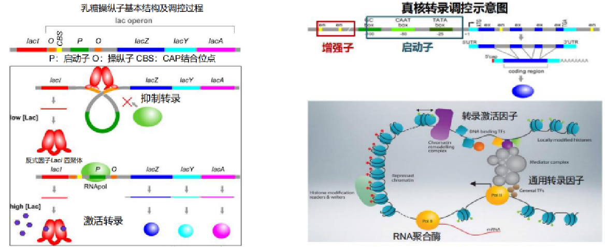

### 转录因子

- Transcription Factor (TF): a type of protein that binds to a specific DNA sequence and regulates gene transcription—turn on & off—that gene are expressed at the right time and in the right amount.
  - There are 1665 TFs and 1025 TF cofactors in the human genome (AnimalTFDB as of Mar 2025).
  - Only a subset of TFs may be expressed in a given cell at a given time point.
  - TFs are essential for gene expression regulation in all living organisms.
  - TFs are of clinical significance because TF mutations can cause specific diseases, and medications can be potentially targeted toward them.
- Transcription Factor Binding Sites (TFBS): 4-20bp short DNA sequences where TFs bind.
  - There are millions of TF binding sites in the human genome.
    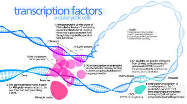

### 转录后加工与修饰

真核细胞中，将初级RNA转录本转化为成熟RNA的加工过程

加工修饰类型

- 5'端加帽 (5' Capping)
- 3’端加尾 (Cleavage and polyadenylation)
- 剪接 (Splicing)
- 化学修饰 (Chemical modification)
- 编辑 (Editing)

### mRNA加工

mRNA加工 (mRNA Processing)：将初级mRNA转化为成熟RNA的加工过程，发生在细胞核中
mRNA翻译之前，包括5'端加帽、3'端多聚腺苷酸化、RNA剪接

- 5'端加帽 (5' Capping)：在mRNA前体5'端加上7-甲基鸟苷（m7G）
- 3'端加尾 (Cleavage and polyadenylation)：对mRNA前体3’端进行切割，随后加上约200个腺嘌呤残基以形成多聚腺苷酸尾（poly A tail）
  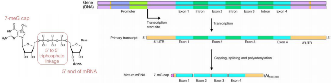

### Regulation of poly(A) tail length

- Poly(A) tail length plays an essential role in regulating mRNA metabolism.
- Poly(A) tail length is regulated in a gene-specific manner—mRNAs with short half-lives in general have long poly(A) tails, while mRNAs with long half-lives are featured with relatively short poly(A) tails.
- Across species, poly(A) tails in the nucleus are almost twice as long as in the cytoplasm.
  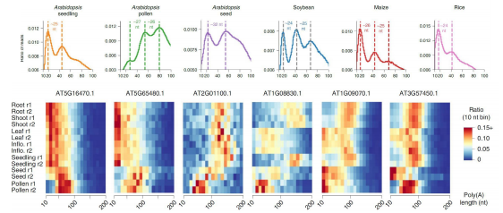

### RNA剪接

- RNA剪接（RNA Splicing）：将非编码内含子从RNA前体上除去，将外显子拼接在一起的加工过程
- 剪接体（Spliceosome）：由识别位于mRNA前体序列剪接位点的蛋白质和小核RNA (snRNA)聚合而成
- RNA剪接反应：由剪接体蛋白复合物催化，可发生在RNA前体合成加帽后及转录过程中
- 可变剪接（Alternative Splicing）：mRNA前体以多种方式被剪接，产生编码不同蛋白质序列的成熟mRNA

### 单基因转录模式的多样性

- 可变剪接（alternative splicing，AS，选择性剪接）：在 mRNA 前体到成熟 mRNA 的过程当中，不同的剪切方式使得同一个基因可以产生多个不同的成熟 mRNA，最终产生不同的蛋白质。
- 在真核生物体内广泛存在，人类基因组中95%的基因都存在可变剪接现象，导致转录本和蛋白质结构与功能的多态性，是一种重要的转录调控机制。

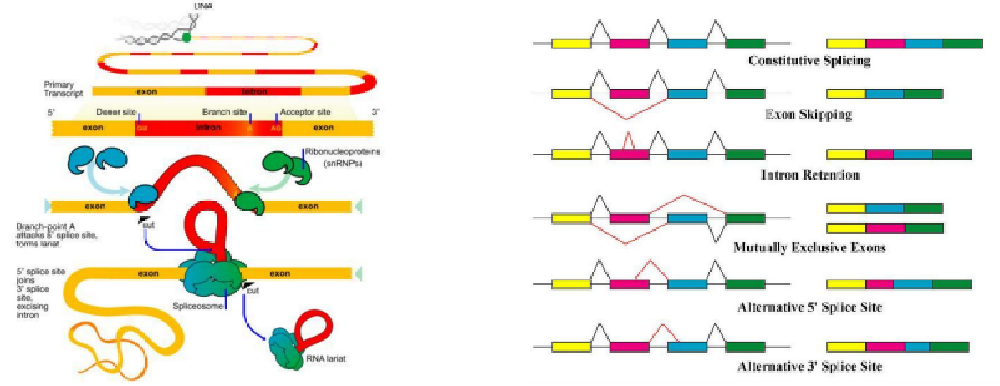

### RNA化学修饰

- RNA化学修饰（Chemical Modification）：RNA分子合成后发生的化学组分变化，具有改变RNA结构、功能和稳定性等作用
- 目前已知的RNA化学修饰类型包含100多种，代表示例： m6A, m5C, Ψ, m7G
  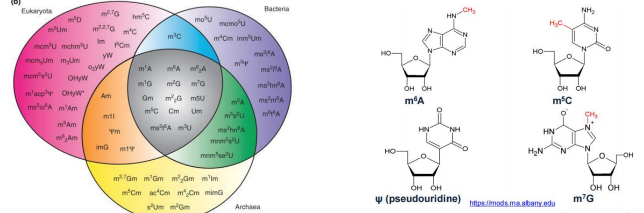

### RNA编辑

- RNA编辑(RNA editing)对RNA分子内特定核苷酸序列进行修饰的分子过程，包括核苷酸的插入、删除和碱基替换
- 存在于真核生物、原核生物、病毒的一些tRNA、rRNA、mRNA或miRNA分子中
- 发生在细胞核和胞浆内，也发生在线粒体和质体内
- 由对应编辑体(Editosome)介导
  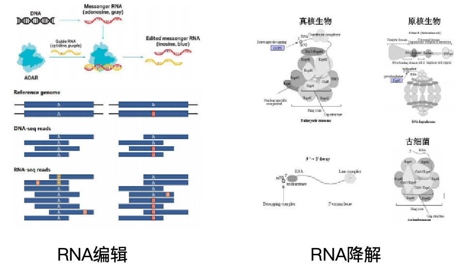

### RNA Interference with siRNA

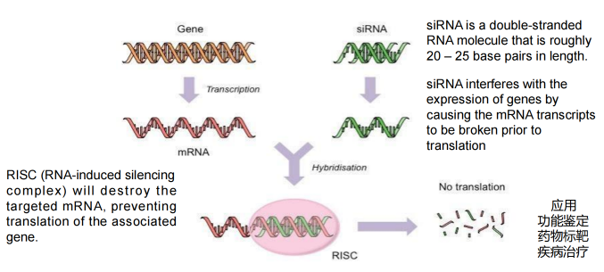

### RNA交互网络

RNA molecules play crucial roles in various biological processes. Their regulation and function are mediated by interacting with other molecules.

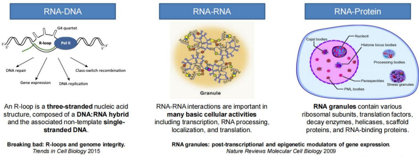

### 转录组（Transcriptome）

- 转录组：在某一特定条件下，所能转录出的所有RNA的总和，包括信使RNA(mRNA)、核糖体RNA(rRNA)、转运RNA(tRNA)及非编码RNA;狭义上指细胞所能转录出的mRNA。
- 转录组可以被视为蛋白质组的前体，即由基因组表达的整组蛋白质。
- 转录组学：研究在单个细胞或特定类型细胞、组织、器官或发育阶段的细胞群内所产生的各类RNA分子的类型和数量。
  > Transcriptome is the set of allRNA transcripts,includingcoding &non-coding.

### 转录组的特点

- Transcriptome is highly dynamic and complex in comparison to the relatively stable genome.
- Transcriptome reflects the genes that are being actively expressed at any given time—gene expression.
- Understanding the transcriptome is essential for interpreting the functional elements of the genome and revealing the molecular constituents of cells and tissues, and also for understanding development and disease.
- The key aims of transcriptomics are:
  - to catalogue all transcripts, including mRNAs, non-coding RNAs and small RNAs;
  - to determine the transcriptional structure of genes, in terms of their start sites, 5′ and 3′ ends, splicing patterns and other post-transcriptional modifications;
  - to quantify the changing expression levels of each transcript during development and under different conditions.

### 转录组研究方法

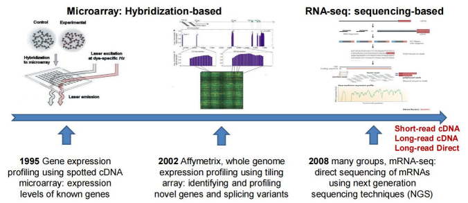
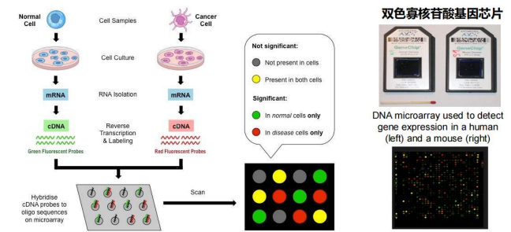

## 转录组测序

### RNA_seq

利用高通量测序技术来检测组织或细胞在特定状态中所有的转录产物

- also called "Whole Transcriptome Shotgun Sequencing" ("WTSS")
- refers to the use of high-throughput sequencing technologies
- sequence cDNA to get information about a sample's RNA content
- a powerful tool to detect the whole transcriptome in cell and tissue
  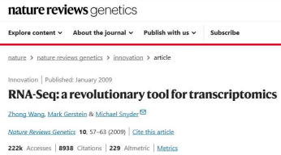

### 转录组测序

- 转录组测序又称RNA测序（RNA Sequencing, RNA-seq），就是把mRNA和 non-coding RNA（ncRNA）全部或者其中一些用高通量测序技术进行测序分析的技术，是一种基于二代测序技术研究转录组学的高通量测序方法
- 相比于传统的芯片方法，RNA-seq能够精确地定量转录本表达、发现新转录本、识别可变剪接事件、检测基因融合，从而揭示不同条件下转录组的动态性
- RNA-seq具有背景噪音低、所需样品量少、灵敏度高等突出优点，正逐渐取代芯片技术，成为转录组分析的常规手段
- RNA-seq可以发现新的转录本和可变剪切异构体，DNA芯片只能检测已知转录本的表达
- RNA-seq比芯片的解析精度更高：单个碱基
  

### 转录组测序基本流程

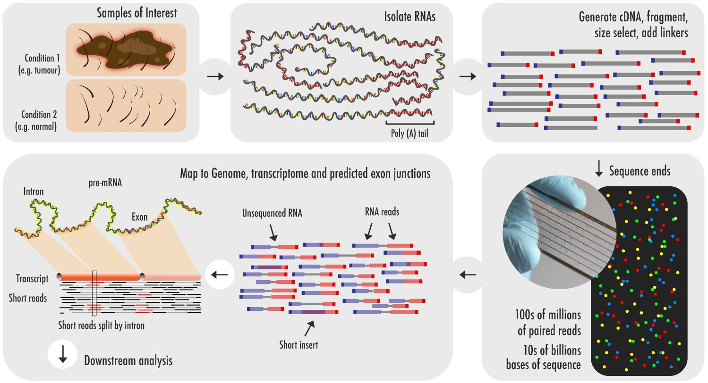

- Step1：RNA样本的准备
  - 从细胞或组织中提取RNA分子，然后根据实验目标选择特定类型的RNA分子
  - mRNA-seq：利用寡核苷酸磁珠富集poly(A)尾的RNA分子

- Step2:cDNA测序文库的构建
  - 片段化：将RNA分子打碎成200~500bp长的片段
  - 将RNA片段反转录成cDNA
  - 对cDNA片段进行末端修饰和接头添加，并进行PCR扩增，得到cDNA测序文库

- Step3:高通量测序
  - 对cDNA文库进行高通量测序，过程与DNA测序类似

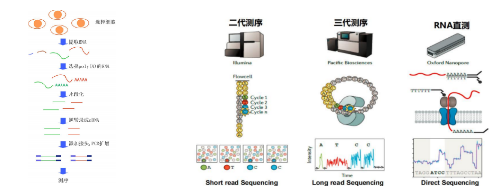

### Microarray vs.RNA-seq

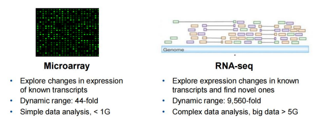

### RNA-seq reads比对

- RNA-seq 的reads比对是指将reads匹配到参考基因组或转录组的相应位置上，得到reads的基因组位置信息
- 非剪接比对
  - 将reads比对到连续的基因组区域，不考虑内含子（intron）的剪接现象。
  - 代表工具：Bowtie2, BWA
  - 适用情况：原核生物、比对到参考转录组。研究的对象是人、小鼠或拟南芥等注释信息相对完善的物种，或者只关注已知基因或转录本的表达情况。
- 剪接比对
- 考虑到 reads匹配的基因区域可能会被内含子隔开而不连续，故在剪接位点附近的reads可能会部分比对到剪接点两侧外显子上，
- 代表工具：STAR, HSAT2, TopHat2, GSNAP, MapSplice。（ GSNAP 和 Map plice在剪接比对的基础上专门对鉴定SNP进行了优化）
- 适用情况：比配到参考基因组。
  1. 构建剪接位点数据库：使用已知注释（如GENCODE）或从头预测（de novo）识别潜在剪接位点。
  2. 分段比对（Split Alignment）：将reads分成多个部分，分别比对到不同外显子，再通过剪接信号连接。
  3. 评分与过滤：根据比对质量（如匹配得分、剪接信号强度）筛选可靠比对结果。

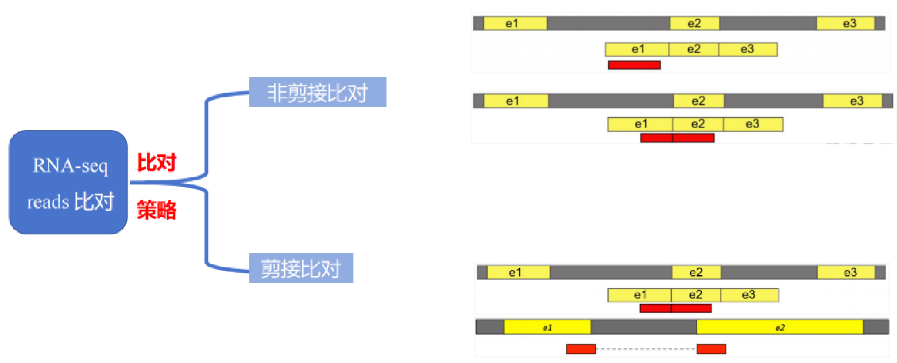

- reads来源于剪接后的转录组序列，但由于参考转录组信息不完善，当前研究通常是将reads比对到参考基因组，而不是参考转录组。这可能导致一些位于剪接区域的reads比对不准确。
- 由于测序错误引起的碱基插入、缺失、错配等现象使得reads比对更为复杂，影响比对结果的准确性。
- 在序列比对过程中，一个read可能比对到基因组的多个位置（多重匹配）。

### 转录组重建

- 利用reads定位信息推断出表达转录本的外显子结构，从而将比对的read组装成转录单元，最终确定所有表达的转录本的结构，这个过程被称为转录组重建。
- 转录组重建是转录本和基因表达定量的基础。
- 组装方法分为两类：基因组引导法（genome-guided）和基因组独立法（genome-independent）

- 基因组引导法（genome-guided）：也叫基于参考的转录组装配（reference-based transcriptome assembly），首先根据read的基因组位置，将重叠的read拼接成转录本片段，然后利用位于剪接区域的read进行转录本结构刻画，最后利用基因的已知注释信息对重构的转录本进行校正，进而完成装配。
- 可以提高所构建转录本的敏感性和准确性；可识别基因的新转录本。
- 常见软件有 StringTie 和 cufflinks。

- 基因组独立法（genome-independent）：也叫从头装配，运用图论的思想，基于reads之间的序列比对构建出de Bruijn图，并根据图中的路径和reads的丰度确定转录本的结构，从而完成转录本的装配。
- 可识别新的基因和新的转录本
- 代表性的软件有 SOAPdenovo-Trans, Trans-ABySS, Trinity。

## 基因表达定量

- Gene expression is the process by which information from a gene is usedin the synthesis of a functional gene product.
- Regulation of gene expressionrefers to the control of theamount and timng of appearanceof the functional product of a gene.
- Gene expression is the mostfundamental level at which thegenotype gives rise to thephenotype, i.e.observable trait.

### GTEx (基因型‐组织表达研究联盟)

- 为研究遗传差异通过分子表型影响人类健康提供资源。 收集并研究了来自948名生前健康的人类捐献者的17382多份尸检样本，涵盖54个组织，包括31个实体器官组织、13个脑分区、全血、两个来自捐献者血液和皮肤的细胞系。利用这些样本研究基因表达的组织和个体差异。

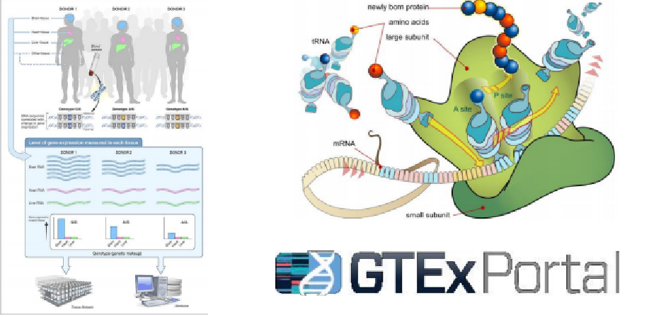

- Regulation of gene expression includes a wide range of mechansms that are used by cells to increase or decrease the production of gene products.
- Regulation of gene expression gives control over the timing,location,and amount of a given gene product present in a cell.
- Regulation of gene expression is the basis for development,morphogenesis,cellular differentiation,and the versatility and adaptability of any organism.
- Gene expression is regulated through changes in the number and type of interactions between molecules that collectively influence transcription of DNA and translation of RNA.

> Regulate the right genes,at the right time,in the right cells,and with the right amount.

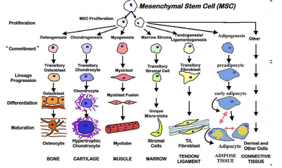

### 基因表达影响生物性状

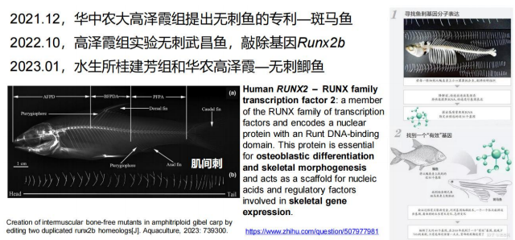

### 基于RNA-seq的基因表达定量计算

- 通常RNA-seq利用转录本匹配到的 reads 数估算表达，比芯片技术的荧光信号更为精确。
- 对给定的基因组参考区域（如基因、转录本），计算比对上的read数，称为raw count（RC），read count。

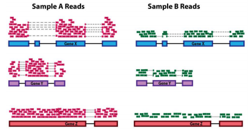

- reads计数根据对多重比对reads(可能比对到基因组的多个位置)处理方式的不同分为两种策略：
  - 只选择唯一匹配reads计数 - 将多重比对的reads舍弃，一般用于估计基因水平的reads匹配数。常用的工具具有
    HTSeq-count和featureCounts。
  - 保留多重匹配的reads:.
    - 利用统计模型将多重比对的reads定位到对应的转录本异构体上。常用工具包括CufTlinks、StringTie和RSEM等
- read counts的数量会受到多种因素的影响
  - 基因长度：在同一个样本中，基因越长，随机打断得到的片段就越多，该基因被测到的概率就越大，比对到该基因的reads就越多。
  - 测序深度：不同样本中，样本的测序深度越高，同一基因被测到的次数越多，比对到该基因的reads就越多。
- 当我们进行基因差异表达的分析时，往往是在多个样本中比较不同基因的表达量，如果不进行数据标准化，比较结果是没有意义的。
- 因此，我们需要标准化的两个关键因素就是基因长度和测序深度。

### CPM

- CPM 全称 Counts Per Million mapped reads。
- 令count_ij 和 count_gj 分别表示基因 i 和基因 g 在样本 j 中的 read count值，则有
  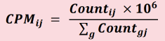
- 10^6 是标化因子（Scale factor），表示测序文库大小的数量级，标化了测序深度的影响，但没有考虑基因长度的影响
- CPM 适合于产生的read数不受基因长度影响的测序方法，比如miRNA-seq测序，miRNA长度一般为20~24bp

### RPKM

- RPKM全称Reads Per Kilobase Million或Reads Per Kilobase of Exon modeler Per Million mappeds ,即“每一百万条Reads中，对基因的每1000个Base而言，比对到该1000个base的Reads数"
- 令Count_ij和Count_gj，分别表示基因i和基因g在样本j中的count值；L_i表示基因i的长度（单位为bp）；N_j表示样本j中的count总数，则有
  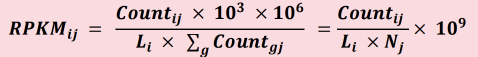
- 这里count_ij/L_ij表示每碱基的计数(counts per base,CPB),CPB会依赖于样本捕获的read总量，因此通过除以count总数来校正。

### FPKM

- 全称Fragments Per Kilobase Million或Fragments Per Kilobase of exon model per Million mapped fragments。
- FPKM与RPKM非常相似，只是RPKM用于single-end测序，而FPKM用于pair-end测
  序。
- 二代测序时，会将所有的DNA打成片段(fragment),然后再去测序。single-end中，一个fragment对应一个Read,而pair-end中，一个fragment会从两端分别测定一次，因此这两个配对Read对应的是同—fragment(偶尔也会有一个fragment只对应一个Read的情况，另一个Read因为某些原因被剔除或丢失了)。因此，对于FPKM来说，比对到同一片段上的两个Read只会算作一个fragment,也就是说FPKM是以Fragment为准，不以Read数为准，但计算方式是完全一样的。

- 令F_ij 和 F_gj 分别表示基因 i 和基因 g 在样本 j 中的fragment值；L_i 表示基因 i 的长度（单位为bp ）；N_j 表示样本 j 中的 fragment 总数，则有
  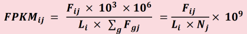
- RPKM/FPKM 适用于基因长度波动较大的测序方法，如lncRNA测序，lncRNA长度在200~100000bp不等
- RPKM/FPKM与RPM/CPM的区别：考虑了基因长度对read count的影响

### TPM

- TPM 全称 Transcripts Per Kilobase of exon model per Million mapped reads 或 Transcripts Per Million
- 令count_ij 和 count_gj 分别表示基因 i 和基因 g 在样本 j 中的count值，L_i 表示基因 i 的长度（单位为kbp ），则有
  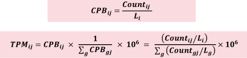

- CPB依赖于样本捕获的read总量，因此通过除以样本的CPB之和来校正。
- TPM使用CPB之和作为文库校正因子的好处是考虑了不同样本间的基因长度的分布。因为CPB是一个对基因长度进行校正后的表达量单位，所以𝑪�之和不会再带入基因长度的bias。因此，如果需要比较的样本之间转录本分布不一致时（例如不同物种RNA-seq的比较），使用TPM是一个较佳的Normalization 方案。

### TPM vs RPKM

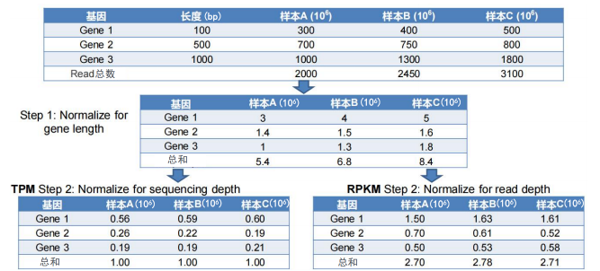

### A sample RNA-Seq pipeline

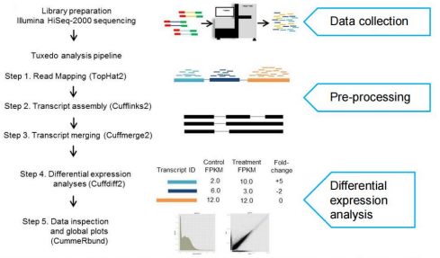

### RNA-seq分析核心策略

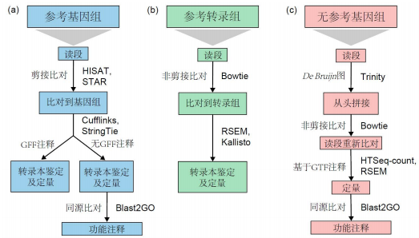

## 差异表达分析

### 异表达分析的概念

- 差异表达分析的核心目标是识别在不同实验条件下（如疾病 vs. 健康、处理 vs. 对照）表达水平发生显著变化的基因。其本质是统计建模，通过比较不同组间的基因表达分布，判断差异是否具有生物学意义而非技术误差（组间差异大于组内差异）。

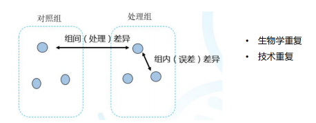

- 通过组内差异和组间差异的比较，就可以判断处理效应是否存在。显著与否还是要依赖于统计检验的结果。
- 差异表达分析的结果般用差异倍数(fold change)和统计检验显著性值来描述。
- 在转录组的基因差异表达分析中，一般的筛选标准是基因表达差异倍数大于2、并且FDR≤0.05为显著差异的基因。

### 统计模型：负二项分布

- 由于二代数据得到的基因表达丰度是reads count,属于离散型分布，所以主流的方法是用负二项分布(属于离散型分布)模型进行检验。
- 主流差异分析软件edgeR、DESeq都采用负二项分布。
  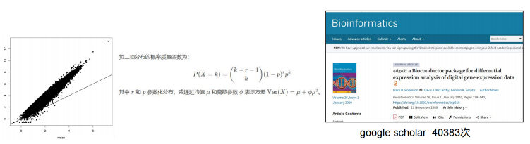

### 倍数法

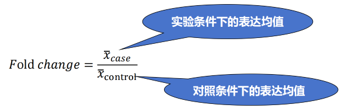

- 通常以2倍Fold change (FC)为阈值，判断基因是否差异表达
- 多数差异表达方法直接给出的是log2(FC)
- 优缺点：
  - 简单直接，早期常用，样本少，无统计意义
  - 当基因表达水平的变化不大时，有可能找不到差异表达基因，假阴性率高；降低阈值，增大假阳性率。
  - 极小值/极小值，如0.0002/0.0001无意义
  - 无统计意义，目前主要用于大规模初筛或辅助其他方法使用。

### T 检验

- T检验是对两组样本的均值差的检验。
- 适用于两种实验条件(两个组)下基因表达量的比较，要求基因表达服从正态分布。
- 运用t检验法可以判断基因在两个不同条件下的表达差异是否具有统计显著性。
- 零假设H₀:u₁=u2,即某基因在两种不同条件下的平均表达水平相等。
- 对应的备择假设H₁:U₁≠U₂。

- 当两组样本相互独立，且两组方差相等(方差齐性)时，可以使用student-t检验方法比较两组差异
  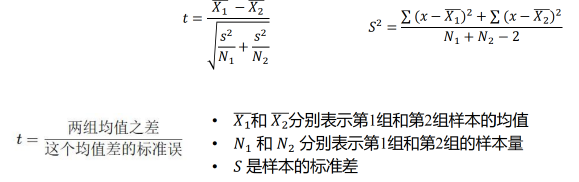

- R语言实现：

```R =
t.test(x,y,alternative="two.sided",varequal=TRUE)
```

- 当两组样本相互独立，但两组方差不相等（方差不齐）时，可以使用校正的student-t检验方法，即Welch t检验比较两组差异
  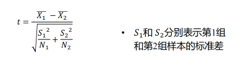

- Welch t检验是一种相对保守安全的检验方法，一般默认选择该方法。
- 通常，除非组大小和标准差都非常不同，否则经典的student-t检验和Welch t检验的结果非常相似
- R语言实现：

```R =
t.test(x, y, alternative = "two.sided", var.equal = FALSE)
```

- 当两组样本相互关联（如同一组患者用药前后的表达数据），且两组方差相等（方差齐性）时，可以配对样本t检验。
- R语言实现：

```R =
t.test(x, y, alternative = "two.sided", var.equal = TRUE, paired=TRUE)
```

- 结果解释：根据统计量t值，得到显著性水平p值，设定假设检验水平a，若p < a，则拒绝零假设，认为某基因在两个不同条件下的表达差异具有统计学意义。
- T 检验属于参数化检验方法，此类方法对数据分布有一定的假设，必要时需要首先检验样本分布是否符合该假设。
- 在进行T检验之前，最好首先检验数据是否为正态分布。如果数据不是正态分布的，建议使用非参数两样本Wilcoxon秩和检验。

### 秩和检验

- 如果两组样本来自两个独立的但非正态获分布或形态不清的两总体，要检验两组样本之间的差异是否显著，不应运用参数检验中的T检验，而需采用秩和检验。
- R语言实现：

```R =
wilcox.test(x, y = NULL, alternative = c("two.sided","less","greater"), paired = FALSE)
```

### 方差分析

- 方差分析是英国统计学家R.A.Fisher提出的对两组或多组样本平均数差异显著性检验的方法。
- 按因素划分，可分为单因素方差分析、双因素方差分析和多因素方差分析。单因素方差分析是对因素的主效应进行分析，而双因素方差分析与多因素方差分析则对因素的主效应和它们的相互作用进行分析。
- 方差分析要求数据服从正态分布。
- 基本思想
  - 反应测量数据变异性的指标有多个，在方差分析中选用方差来度量资料的变异程度。
  - 在一次实验中，可以得到一系列不同的观测值。测量数据的总变异（即总方差）按照变异来源分为处理（组间）效应和误差（组内）效应，要正确认识观测值的变异是由于处理效应还是误差效应引起的，需要分别计算出处理效应的方差以及误差效应的方差，在一定显著水平下进行比较，如果二者相差不大，说明实验处理对观测值的影响不大；如果差异较大则说明实验处理对于观测的影响较大。
- 将基因在样本间的总变异分解为
  - 组间变异：不同条件导致的基因表达的差异
  - 组内变异：个体差异和测量引起的随机误差

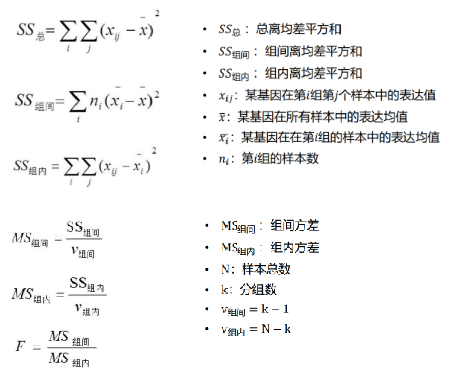

- 根据统计量F,得到p值，设定假设检验水平为α,当p<α时，认为该基因在不同条件下的表达差异具有统计学意义
- R语言实现：

```R =
aov(formula,data=NULL,projections=FALSE,…)
```

### Kruskal-Wallis检验

- Kruskal-Wallis H test亦称“K-W检验”、“H检验”等，是用于推断计量资料或等级资料的多个独立样本所来自的多个总体分布是否有差别的非参数检验。
- 被检验的几个样本必须是独立的或不相关的。
- K-W检验不假设样本来自正态分布。
- 在理论上K-W检验原假设H₀应为多个总体分布相同，即多个样本来自同一总体，原假设被拒绝意味着至少一个样本的总体分布不同于其他样本。
- R语言实现：

```R =
kruskal.test(formula,data,subset,na.action,...)
```

### 多重假设检验

- I型错误(假阳性):在假设检验作推断结论时，拒绝了实际上正确的检验假设，即将无差异表达的基因判断为差异表达。
- Ⅱ型错误(假阴性):不拒绝实际上不正确的，即将有差异表达的基因判断为无差异表达。
- 假定表达谱包含n个基因，整个差异基因筛选需要做n次假设检验，若每次假设检验发生假阳性的概率为p,则在这个差异基因筛选过程中至少有一个基因是假阳性的概率为P=1-(1-p)",由于n较大，导致P较大。
- 多重假设检验带来的放大的假阳性率，需要进行纠正。常用的纠正策略有Bonferroni效正、控制FDR(false discovery rate)值、BH校正等。
- R语言实现：

```R =
p.adjust(p,method=p.adjust.methods,n=length(p))。
p.adjust.methods可选("holm","hochberg","hommel","bonferroni","BH","BY","fdr","none")
```

### 常用差异表达分析工具比较

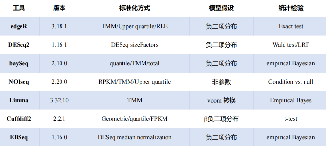

- limma在大多数实验中表现良好，且运行速度很快
- DESeq和edgeR在显著性值排序上与limma表现相似，但是对于FDR的控制似乎过于宽松
- SAMseq在FDR控制表现良好，但是需要10个以上的生物学重复才能达到可接受的检测灵敏度
- NOISeq和NOISeqBIO可以有效控制假阳性，同时牺牲了部分灵敏度，但是在不同处理条件生物学重复数不同的情况下表现良好
- Cuffdiff和Cuffdif2可以分析转录本水平的差异表达，但是表现不如人意，这也从侧面反映了转录本水平的reads比对分配问题仍然没有得到很好的解决，类似的异构体水平分析工具还有EBseq等。
- 上述提及的分析工具大多只能进行成对比较，而Next maSigPro、DyNB、Ballgown和EBSeq-HMM等工具可以分析时间序列的RNA-seq数据。

### limma差异表达分析

- limma(Linear Models for Microarray Data)是基因表达分析的金标准工具，最初为微阵列设计，后通过voom方法扩展支持RNA-seq数据。其核心优势在于线性模型+经验贝叶斯收缩，特别适合大样本(n>10)或多组比较场景
- 第一步：转换为log(ratio)数据形式

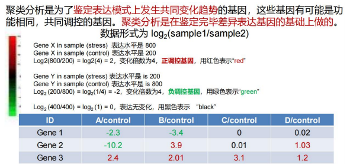

- 第二步：计算基因对间相关系数并聚类
  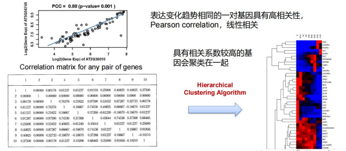

### 基因表达模式

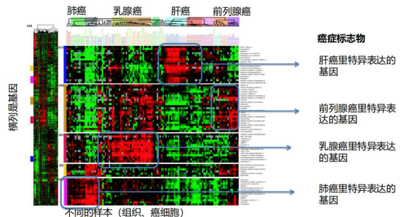

### 转录调控影响基因表达模式

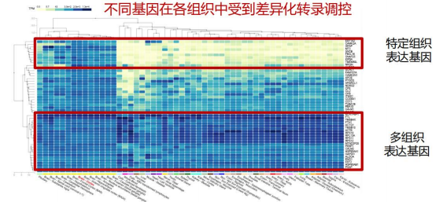

### 管家基因与组织特异基因

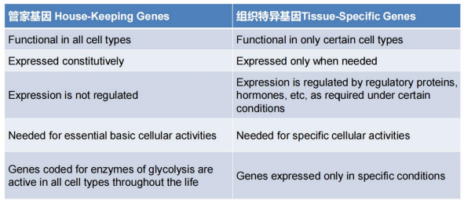

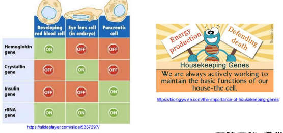

### GO terms specific for HK&TS genes

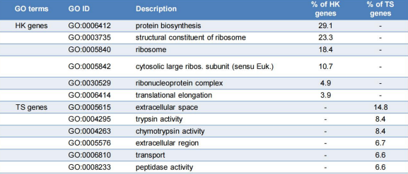

### Differential gene expression profiles

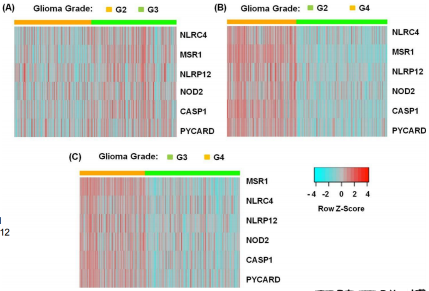

### Circadian gene

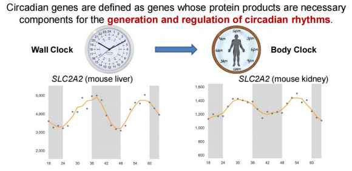

## 基于多组学数据的疾病分类( ATTAC & 斑马鱼用不到 )

### 疾病分类的常见任务

- pan-cancer多分类，即区分不同癌种。例如对BRCA、LUAD等多种癌症进行分类。
- 单癌种内部的分子亚型分类。例如在BRCA、LUAD、LIHC内部分亚型。
- 诊断性二分类多分类。如BRCA的肿瘤与非肿瘤。

### 疾病分类的常见方法

#### 传统机器学习

这是 TCGA 多组学分类最稳妥、最容易复现的一类路线。典型做法是先对各组学分别做特征筛选或降维，再把特征拼接或分层融合，最后用 SVM、Random Forest、XGBoost、Elastic Net、逻辑回归 等分类器建模。
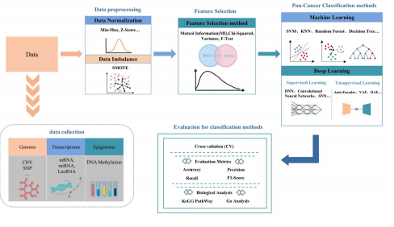

> 它的优势是对中小样本、高维数据更稳，解释也相对直接；劣势是对跨组学非线性关系的建模能力有限

#### 表示学习 / 深度学习

这类方法先为每种组学学习低维表示，再做分类，核心代表是 Autoencoder、VariationalAutoencoder (VAE)、多分支 MLP/CNN。MOFA/MOFA+ 更偏统计表示学习与可解释降维，适合先找潜在因子、再接下游分类；XOmiVAE 是偏可解释的 VAE 分类模型；还有研究直接用 VAE/MMD-VAE 对 TCGA 卵巢癌等多组学数据做样本识别、亚型聚类和分类。
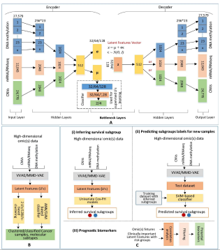

#### 图机器学习 / 图神经网络

多组学数据天然带有“关系结构”：基因—基因、蛋白—蛋白、患者—患者、通路—通路之间都不是独立的。代表性方法里，MOGONET 很典型：它用图卷积网络整合多组学，用于生物医学分类任务，并兼顾生物标志物识别；近两年也出现了更多 multi- v iew GNN、graph attention、hierarchical GNN 变体，重点解决多模态关系建模和解释性问题。
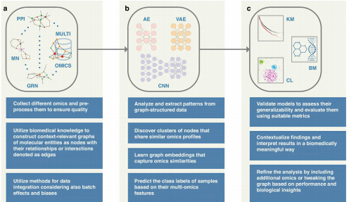

#### 更广义的“AI”方法

对比学习、自监督预训练、迁移学习、生成式模型、foundation-model 风格的表征学习。
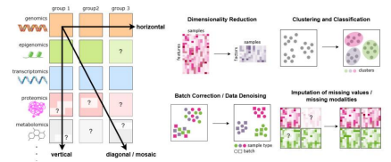

### TCGA简介

肿瘤基因组图谱 (The Cancer Genome Atlas, TCGA)计划由美国 National Cancer Institute(NCI) 和 National Human Genome Research Institute (NHGRI) 于2006年联合启动。目前收录了来自 11,000 个病人，33个癌症的数据，2.5P的数据量.

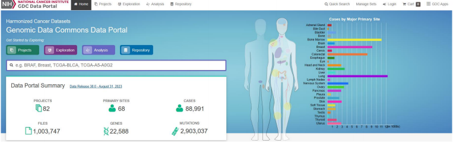

#### 数据下载——UCSC Xena

> https://xena.ucsc.edu/public/

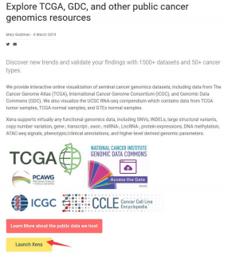

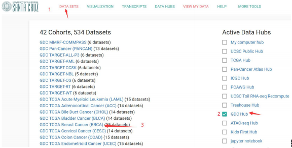

#### 数据类型

- 基因表达数据（RNA-seq）
  - 数据矩阵：基因 × 样本（行是基因，列是样本）
  - 常用数据：- FPKM / TPM（标准化表达量）- counts（原始读数，适合差异分析）- 用途：基因表达谱可用于区分癌症亚型或正常/肿瘤样本
    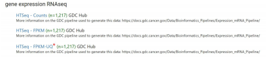

- 甲基化数据（DNA Methylation）
  - 数据矩阵：CpG位点 × 样本（行是甲基化探针，列是样本）
  - 常用平台：Illumina 450K/EPIC
  - 用途：甲基化水平可用于表观遗传分类
    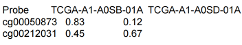

- 拷贝数变异（CNV）
  - 数据矩阵：基因/基因组区域 × 样本（行是基因，列是样本）
  - 常用数据：
    - GISTIC2 处理后的数据（-2=深度缺失，-1=缺失，0=正常，1=增益，2=扩增）
  - 用途：拷贝数变化可用于识别驱动基因和分子亚型。 数据类型
    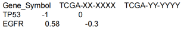

- 体细胞突变（SNV/Indel）
  - 数据格式：通常存储为MAF文件（Mutation Annotation Format）
  - 关键信息：
    - Hugo_Symbol（基因名）
    - Variant_Classification（突变类型，如错义突变、无义突变）
  - 用途：可用于突变特征分析和分类。
    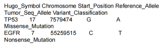

- 蛋白质组数据（RPPA）
  - 数据矩阵：蛋白质/磷酸化位点 × 样本（行是蛋白，列是样本）
  - 用途：蛋白活性可用于功能亚型分类。
    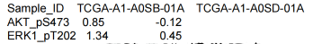

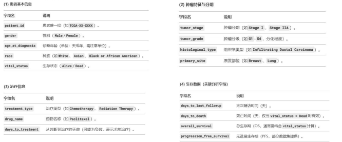

#### 实验项目流程

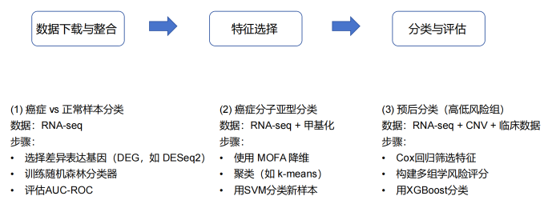
