# 系统生物学

## 系统生物学及分子生物网络基础

- 生物学家及生化学家早就意识到，纵向的单个分子及其通路（如蛋白质，或更常见的酶）细致研究仅仅是对于认识生命科学的可行的、必要的开始。
- 当代生物科学的进展—生物信息学—即是对以往的个别研究的归纳和演绎。
- 辩证唯物主义：物质世界是由无数相互联系、相互依赖、相互制约、相互作用的事物和过程所形成的统一整体。

### 系统生物学概念

- 生物系统包含两类信息：- 编码执行生物功能分子机器的基因 - 识别基因表达、调控相互作用的网络
  DNA > mRNA > 蛋白质 >生物分子相互作用 > 通路 > 网络
  细胞 > 组织 > 生物体 >种群 > 生态系统

### 复杂网络的基本概念

- 钱学森给出了复杂网络的一个较严格的定义：具有自组织、自相似、吸引子、小世界、无标度中部分或全部性质的网络称为复杂网络。
- 在网络理论的研究中，复杂网络是由数量巨大的节点和节点之间错综复杂的关系共同构成的网络结构。
- 用数学的语言来说，就是一个有着足够复杂的拓扑结构特征的图。
- 复杂网络的研究是现今科学研究中的一个热点，与现实中各类高复杂性系统，如互联网网络、神经网络和社会网络、生物分子网络的研究有密切关系。

### 主要表现

1. 结构复杂性: 表现在节点数目巨大，网络结构呈现多种不同特征。
2. 节点复杂性: 表现在网络节点的多样性。复杂网络中的节点可以代表任何事物，例如，人际关系构成的复杂网络节点代表单独个体，万维网组成的复杂网络节点可以表示不同网页。
3. 网络进化性: 表现在节点或连接的产生与消失。例如world-wide network，网页或链接随时可能出现或断开，导致网络结构不断发生变化。
4. 连接多样性: 节点之间的连接权重存在差异，且有可能存在方向性。
5. 动力学复杂性: 节点集可能属于非线性动力学系统，单个节点的状态演化可能由非线性微分方程描述。
6. 多重复杂性融合: 即以上多重复杂性相互影响，导致更为难以预料的结果。例如，设计一个电力供应网络需要考虑此网络的进化过程，其进化过程决定网络的拓扑结构。当两个节点之间频繁进行能量传输时，他们之间的连接权重会随之增加，通过不断的学习与记忆逐步改善网络性能。

### 网络的基本概念（图论相关基本定义，学过可直接跳过）

- 通常可以用图G =（V,E）表示网络：
  - V是网络的节点集合，每个节点代表一个生物分子，或者一个环境刺激；
  - E是边的集合，每条边代表节点之间的相互关系。当V中的两个节点v1与v2之间存在一条属于E的边e1时，称边e1连接v1与v2，或者称v1连接于v2，也称作v2是v1的邻居。

#### 有向网络和无向网络

- 根据网络中的边是否具有方向性或者说连接一条边的两个节点是否存在顺序，网络可以分为有向网络与无向网络，边存在方向性，为有向网络，否则为无向网络。
- 生物分子网络的方向性取决于其所代表的关系。
- 如调控关系中转录因子与被调控基因之间是存在顺序关系的，因此转录调控网络是有向网络，而基因表达相关网络中的边代表的是两个基因在多个实验条件下的表达高相关性，因此是无向的。
  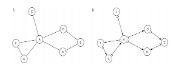

#### 加权网络与等权网络

网络中的边在网络中具有不同意义或在某个属性上有不同的价值是网络中普遍存在的一种现象。

- 比如交通网中，连接两个城市（节点）的道路（边）一般具有不同的长度，而在互联网中两台直接相连的计算设备间通讯的速度也不尽相同。
- 如果网络中的每条边都赋予相应的数字，这个网络就称为加权网络，赋予的数字称为边的权重。
- 权重可以用来描述节点间的距离、相关程度、稳定程度、容量等等各种信息，具体所代表的意义依赖于网络和边本身所代表的意义。
- 如果网络中各边之间没有区别，可以认为各边的权重相等，称为等权网络或无权网络。

#### 二分网络

如果网络中的节点可分为两个互不相交的集合，而所有的边都建立在来自不同集合的节点
之间，则称这样的网络为二分网络（bipartite network）。
例如，药物分子与其靶蛋白的结合关系即可以用二分网络的形式表示出来。
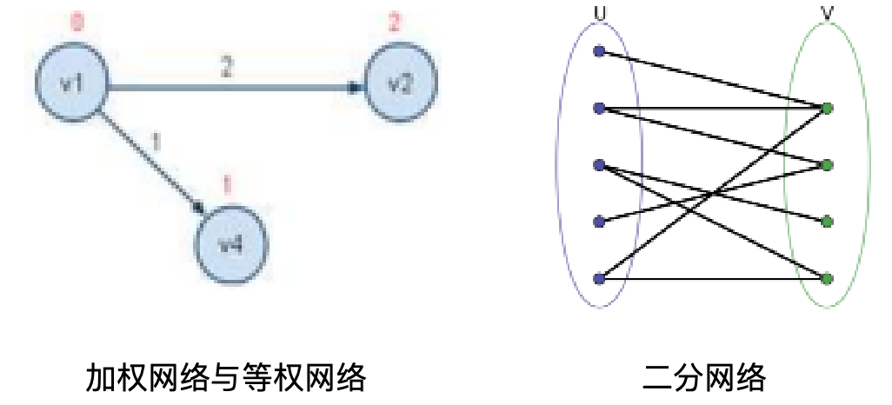

#### 网络中的路径与距离

- 网络中的路径是指一系列节点，其中每个节点都有一条边连接到紧随其后的节点。
- 对包含节点数目有限的路径来说，第一个结点称为起点，最后一个节点称为终点，二者均可称为路径的端点，其余的节点则称为路径的内点或中继点。这样的路径也称为连接起点与终点的路径
  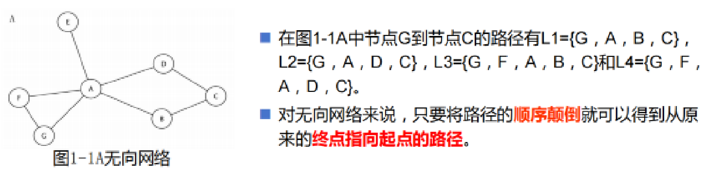

#### 网络的基本概念

在有向网络中，起点与终点是不可逆的。例如图1-1B所示网络中节点由A出发到节点C间存在路径L3={A，D，C}，但C不能找到路径回到A。
图1-1 B有向网络

- 网络中如果两个节点间由一条路径连接，则称这两个节点是连通的。所有能够连通的节点和它们之间的边构成了一个连通分量。
- 路径中所经过边的权重之和称为路径的权重，也称为路径的长度。对于等权网络而言，路径的长度即为路径中所经过边的数目。

#### 网络的拓扑属性--连通度

- 连通度（degree）是描述单一节点的最基本的拓扑性质。节点v的连通度是指网络中直接与v相连的边的数目。
- 例如在图1-2A中节点A的连通度k=3。
- 对于有向网络往往还要区分边的方向，由节点v发出的边的数目称为节点v的出度，指向节点v的边数则称为节点v的入度
- 我们用符号k来表示连通度，kout表示出度，kin表示入度。
  在图1-2 B中节点A的入度为1，出度为2。
  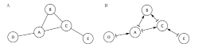

- 连通度描述了网络中某个节点的连接数量，整个网络的连通性可以使用其平均值来表示。对于由N个节点和L条边组成的无向网络其平均连通度为K_net=2L/N。
- 连通度是一种简单而十分重要的拓扑属性。在研究中，连通度较大的节点称为中心节点（hub），它们很自然地成为目前研究的重点。
- 研究显示，在蛋白质互作网络(PPI)等生物网络中，支持生命基本活动的必需基因或其翻译产物的比例在中心节点中出现的频率显著高于一般节点。
- 同时，人类蛋白质互作网络的研究表明，中心节点显著富集着与癌症等遗传性疾病相关的基因。
  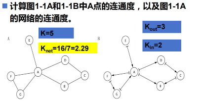

#### 网络的拓扑属性--聚类系数

在很多网络中，如果节点v1连接于节点v2，节点v2连接于节点v3，那么节点v3很可能与v1相连接。这种现象体现了部分节点间存在的密集连接性质，可以用聚类系数（clustering coefficient）CC来表示，在无向网络中，聚类系数定义为：
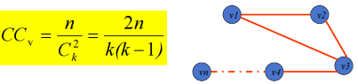
公式中，k表示节点V的邻居数目，n表示节点V的k个邻居两两之间连接的边数， 表示k个邻居两两相连的最多边数。

因为n表示在节点v的所有的k个邻居间边的数目，则

在无向网络中，n的最大数目可以由邻居节点的两两组合数k（k-1）/2来确定，所以CC值位于［0，1］区间。
当节点v的所有邻居都彼此连接时，v的聚类系数CC=1；相反，当v的邻居间不存在任何连接时，CC＝0。

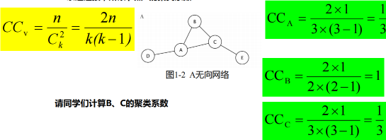

在有向网络中，由于两个节点间可以存在两条方向相反的边，则标准化的聚类系数被定义为：
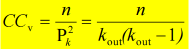
其中，k_out指v的出度，k指节点A指向的连接的邻居个数，n指所有v所指向的连接的节点彼此之间存在的边数。

#### 网络的拓扑属性--介数

- 一个节点的介数（Betweenness）是衡量这个节点出现在其它节点间最短路径中的比例。
- 节点v的介数Bv定义如下：
  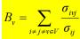
  其中， 表示节点i到节点j的最短路径的条数， 表示其中通过节点v的路径条数
- 介数也可以用标准化至[0，1]区间的形式表示, n表示所有节点数目：
  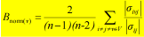
- 介数表明了一个节点在其它节点彼此连接中所起的作用。介数越高，意味着在保持网络紧密连接性中节点越重要。

#### 网络的拓扑属性--紧密度

紧密度（closeness）是描述一个节点到网络中其它所有节点平均距离的指标。节点v的紧密度Cv定义如下：
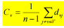
其中dvj表示节点v到节点j的距离。紧密度测度衡量节点接近网络“中心”的程度，紧密度越小，节点越接近中心。

#### 网络的拓扑属性--拓扑系数

类似于聚类系数，拓扑系数（topology coefficient）是反映互作节点间共享连接比例的测度，节点v的拓扑系数Tv可以定义为：
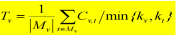

其中， 表示与节点v和节点t都连接的节点数。 为所有与节点v分享邻居的节点集合。拓扑系数反映了节点的邻居间被其它节点连接在一起的比例。

#### 网络的拓扑属性--直径与平均距离

- 直径（diameter）是描述网络总体性质的一个属性。网络的直径是指网络中任意两个连通节点间距离的最大值，也就是最小值的最大值。
- 网络的直径代表了网络中节点连接可能出现的最远距离，标志着网络紧密的程度。
- 网络的平均距离（average distance）也是描述网络总体性质的一个属性。
- 网络的平均距离是指网络中任意两个连通节点距离的平均值，也是衡量网络紧密程度的重要指标

#### 网络的拓扑属性--分布函数

除了平均连通度以外，连通度的分布P(k), k=1,2,...是另一种重要描述网络连通性的属性。
而类似的针对网络还可以建立起随连通度变化的聚类系数的连通度函数C(k)，这个函数被定义为当函数自变量等于k时，C(k)等于所有连通度为k的节点的聚类系数的平均值。

## 生物网络特征及分类

### 生物网络特征背景

中国的黄帝和岐伯撰写的中华医学经典《黄帝内经》阐述了经络理论

利用网络的观点观察复杂的人体而成的一种生物网络模型。重点突出了十二经脉的主要地位，描述了人体12条经络构成的有向环网络。

- 1837年，Darwin在他的第一部书稿中描述物种进化采用了树形网络图

Crick描述细胞遗传信息流的网络图

- 1953年，Francis Crick 与Watson和Wilkins发现了DNA的双螺旋结构，共同获得了1962年诺贝尔生理学和医学奖。
- 1958年Crick提出“中心法则”描述细胞遗传信息流的网络图（实线）。
- 1970年设想的相反的信息流方向，即从RNA-DNA-蛋白质。（虚线）

Crick用有向网络图来描述可能是双向的细胞的遗传信息网络，这是他发现一种新的生物网络并用网络图描述这种生物网络的经典案例。

- 2004年，人类基因组计划所属的国际人类基因组测序联合工作组织宣布了一项新的人类基因数估计数据：约为2~2.5万个基因。
- 2005年，发表黑猩猩基因组草图指出：人类和黑猩猩的基因同源性高达98%~99%。在基因数、基因结构与功能、染色体与基因组构造上几乎相同。

生物学面临的最大挑战是如何解释各物种间基因组上的相似与功能上的巨大差异。在基因组水平上恐怕很难完成。

借助在系统生物学、蛋白质组、人类相互作用组、代谢组、癌症基因组、遗传信息网络、表观遗传网络等生物科学新领域的研究有可能解释。

### 生物网络特征简介

- 生物分子网络具有稀疏性
  - 如果网络大小为N，边数的复杂度为O(N)，而不是O(N^2)
  - 生物网络的稀疏性的实质：
    是生物在长期进化过程中达到某种优化的表现结果。
- 生物分子网络具有scale-free性质
  - 普遍的生物学机制：
    - 度分布的无标度性质是生物分子网络的一个重要拓扑特性

例如，在蛋白质互作网络中：就可以用基因复制来解释高连接度节点的形成。

- 无标度网络的显著特点：
  - 多数节点有少量连接，少数节点有大量连接。
    这种特性表明：生物分子网络拥有动态过程，少数节点所代表的生物分子起到关键作用。

例如：在对真核细胞和细菌的研究中发现，细胞的新陈代谢有着无标度的拓扑属性；

- 在代谢反应中：
  - 多数的代谢酶解物仅参与了1个或2个反应，
  - 而少数几个酶解物则参与了众多反应，发挥着代谢中枢的作用

- 生物分子网络具有超小世界性
  - 许多生物分子网络：
    - 平均路径比一般小世界平均路径还要短。
    - 有的学者还提出这是一种超小世界的性质，下表中可见不少生物分子网络具有超小世界性。
      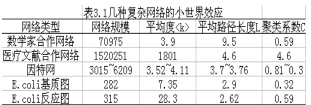

- 超小世界效应最先发现：
  - 在细胞内新陈代谢的研究中。
    平均通过3或4个反应的路径就能够连接多数成对的代谢物，短的路径长度表明，对代谢物浓度的局域扰动能够迅速地遍及整个网络。
  - 由此可见，具有超小世界效应的网络
    更便于生物信息在网络的节点之间得到迅速传播。

- 构建的层次网络，
  - 它的聚类系数C依赖于节点度k，并且成反比关系，即C(k)∝1/k
  - 说明低度值的节点有着较高的聚类系数，属于联系紧密的小模块。
  - 高度连接的中枢节点其聚类系数却较低，它们的角色是在不同的模块间建立起连接。
  - 数值表明，许多生物分子网络的聚类系数满足：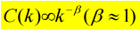
  - 结果表明：生物分子网络具有层次结构。

- 生物分子网络具有负关联性

- 许多生物分子网络（如蛋白质相互作用网络、代谢网络、基因调控网络）被研究发现具有度的负关联性（negative degree correlation），也称为异配（disassortativity）。这意味着高度连接的节点（Hub节点）倾向于与连接较少的节点相连，而低度节点之间或Hub节点之间的直接连接相对较少。这种特性对网络的功能和稳定性有重要影响。
- 网络中高度节点（Hub）和低度节点之间的连接偏好性
  - 负关联（Disassortative）：Hub节点倾向于连接低度节点（常见于生物网络）。
  - 正关联（Assortative）：Hub节点倾向于互相连接（如社交网络）。
- 量化方法：
  - Pearson相关系数（r）：计算所有边两端节点的度的相关性，r∈[−1,1]
  - r<0：负关联（生物网络常见） r>0：正关联（如合作网络）
  - 最近邻平均度（knn(k)）：观察给定度k的节点的邻居的平均度。

- 生物分子网络具有一定的鲁棒性和适应性
  - 大量实验表明，具有幂律度分布的生物分子网络具有鲁棒性：
  - 即对于外界环境的变化或者内部个体之间的不相容有着一定的承受能力，这与生物分子网络无标度的拓扑性质息息相关。
- 生物学上：
  - 通过对Cerevisiae和Coil的移除分析已经证实拥有不同度值的节点对移除表型的影响差异很大。
  - 当移除网络中的多数非关键节点基因时，几乎没有明显的表型影响。
  - 生物分子网络具有鲁棒性的同时，也就具有适应性。
  - 当外界环境发生变化时，也表现出适应性，这些性质的产生机制都是目前研究的重点。

### 生物分子网络模型构建方法

- 根据生物分子网络的以上实证特性，能否给出一个数学模型构建方法来比较好地模拟，是从理论上开展对生物系统研究关键性的一步。通常称这个建模过程为生物分子网络构建的过程。
- 成熟数据：构造出所要研究的相对比较可靠的生物分子网络，然后直接用于有关生物问题的研究。
- 尚不完整的数据：从数据库和文献中查找解决数据量不够的问题合理处理为自于不同数据库的数据问题提出构建生物分子网络的理论方法。
- 基于拓扑结构的网络模型、基于生物物理/化学的模型、基于机器学习的预测模型

### 生物分子网络分类

#### 基因调控网络

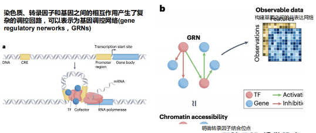

#### 蛋白质互作网络

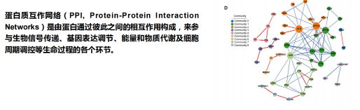

#### 信号转导网络

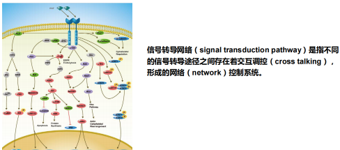

#### 代谢网络

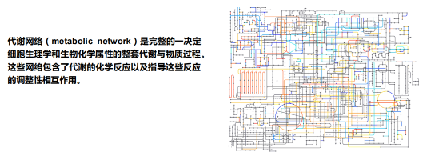

#### 表观遗传调控网络

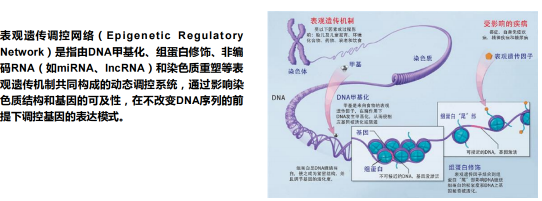

#### 人类疾病网络

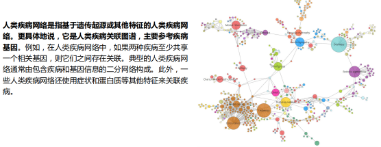
