# 生物信息学笔记

> **笔记信息 / Note Information**
>
> **作者 / Author**：蔡靖熹
> 福州大学 数据科学与大数据技术专业 本科生
> Fuzhou University, Data Science and Big Data Technology, Undergraduate
>
> **内容说明**：本笔记由本人根据学习整理撰写。
>
> **参考资料**：
>
> - 部分知识点参考自福州大学医工交叉研究院熊壮博士《生物信息学》课程课件

> **AI辅助说明**：本笔记 Markdown 排版结构与逻辑整理借助 AI 工具辅助完成，AI 未参与专业内容的判断与生成，核心知识内容以本人撰写为准。如有内容错误，责任由本人承担。
>
> **联系方式 / Contact**：
> tchinchina@outlook.com
> cjx941008@qq.com

---

## 目录

- 第一章 生物信息学导论
- 第二章 常用生物信息学数据库
- 第三章 测序技术
- 第四章 测序比较（序列比对）

---

## 第一章 生物信息学导论

### 一、什么是生物信息学

**Biology + Informatics = Bioinformatics**

生物信息学是一门交叉学科，涵盖生物信息的获取、处理、存储、分发、分析和解释等所有方面，综合运用**数学、计算机科学和生物学**的各种工具，来阐明和理解海量数据所包含的生物学意义。

> 一种通俗理解：生物信息学是一门收集、分析遗传数据并分发给研究机构的新学科，特指数据库类的工作。

#### 与其他交叉学科的区别

生物信息学常与以下学科混淆，但侧重点不同：

| 学科           | 英文               | 侧重点                                     |
| -------------- | ------------------ | ------------------------------------------ |
| 生物计量学     | biometrics         | 依赖生物/生理特征的数字安全方法            |
| 生物数学       | biomathematics     | 生物结构与动态过程的数学建模               |
| 生物化学       | biochemistry       | 生命体内的化学过程                         |
| 生物物理学     | biophysics         | 用物理学方法研究生命现象                   |
| **生物信息学** | **bioinformatics** | 用信息学方法处理、组织、分析生物大分子信息 |

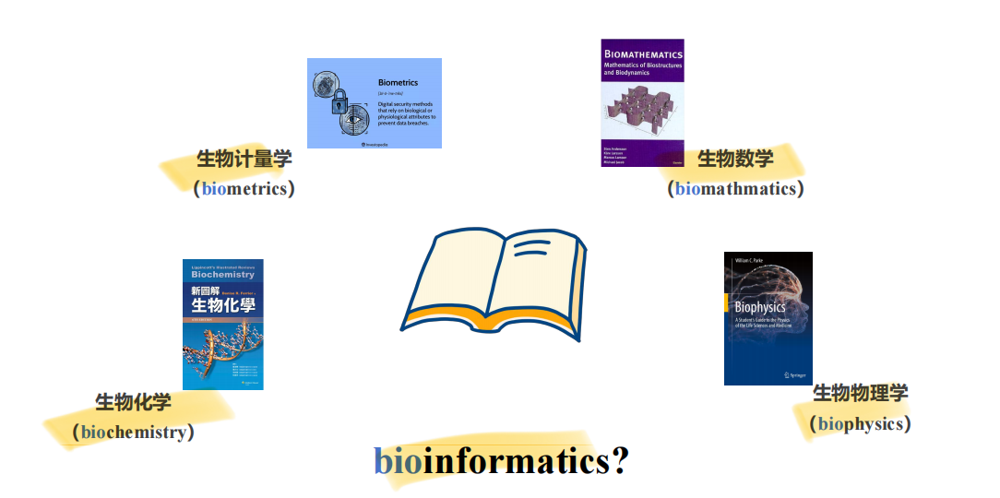

#### 经典定义（2001）

生物信息学是在大分子方面的**概念型生物学**，并使用信息学技术——这些方法衍生自应用数学、计算机科学以及统计学等学科，用以在大尺度上理解和组织与生物大分子相关的信息。

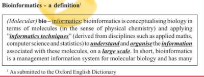

#### 广义生物信息学观点

生物学研究可以被看作是研究**信息的传递**：

- 从 DNA 经转录、翻译到蛋白质
- 从细胞质到细胞核
- 从母细胞到子细胞
- 从一个细胞/组织到另一个细胞/组织
- 从一代到下一代

---

### 二、生物信息学的历史渊源

生物信息学是"生物"与"信息"两条脉络交汇的产物。

#### 生物学脉络

| 人物                     | 贡献                             |
| ------------------------ | -------------------------------- |
| 拉马克                   | 用进废退、获得性遗传             |
| 达尔文                   | 《物种起源》——自然选择、适者生存 |
| 孟德尔                   | 豌豆杂交实验                     |
| 米歇尔                   | 分离出核酸                       |
| 约翰森                   | 首次提出"基因"概念               |
| 摩尔根                   | 染色体遗传理论                   |
| 艾弗里、麦克劳德、麦卡蒂 | 证明 DNA 为遗传物质              |

#### 信息学脉络

| 人物     | 贡献                     |
| -------- | ------------------------ |
| 帕斯卡   | 压强、三角学、早期计算机 |
| 莱布尼兹 | 提出计算机概念           |
| 摩尔斯   | 摩尔斯电码               |
| 图灵     | "计算机之父"             |

#### 两条脉络的时间交汇

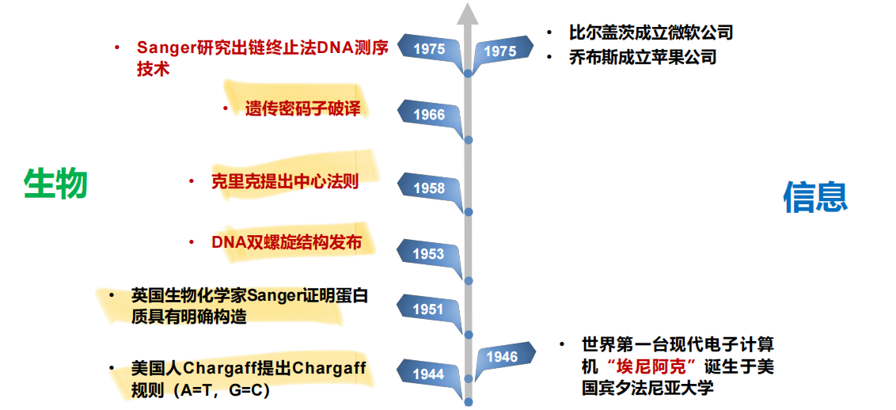

- **1944** 美国人 Chargaff 提出 Chargaff 规则（A=T，G=C）
- **1946** 世界第一台现代电子计算机"埃尼阿克"诞生于美国宾夕法尼亚大学
- **1951** 英国生物化学家 Sanger 证明蛋白质具有明确构造
- **1953** DNA 双螺旋结构发布
- **1958** 克里克提出中心法则
- **1966** 遗传密码子破译
- **1975** Sanger 研究出链终止法 DNA 测序技术；同年比尔·盖茨成立微软公司、乔布斯成立苹果公司

#### "生物信息学"学科的正式形成

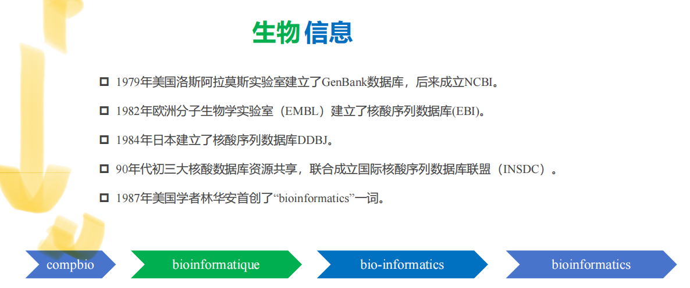

- **1979** 美国洛斯阿拉莫斯实验室建立 GenBank 数据库，后来成立 NCBI
- **1982** 欧洲分子生物学实验室（EMBL）建立核酸序列数据库（EBI）
- **1984** 日本建立核酸序列数据库 DDBJ
- **90年代初** 三大核酸数据库资源共享，联合成立国际核酸序列数据库联盟（**INSDC**）
- **1987** 美国学者林华安首创 "bioinformatics" 一词

名称演变路径：`compbio → bioinformatique → bio-informatics → bioinformatics`

---

### 三、生物信息学研究的主要内容

1. **数据库建设与工具开发**：生物数据的检索、下载、整合与共享
2. **组学数据分析与解释**：包括基因组、转录组、蛋白质组等各类组学数据
3. **生物系统及网络分析**：如蛋白互作网络、基因共表达网络、调控网络等（下图示例了从非网络数据推断网络的三种典型场景）
   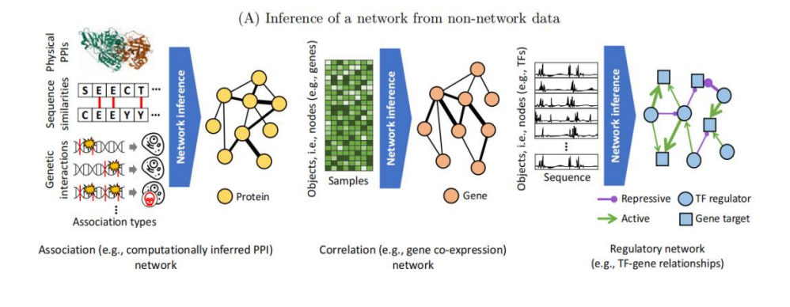
4. **算法、方法开发**：开发新的算法及统计学方法，揭示大数据之间的联系

---

### 四、生物信息学的应用

- **基础研究**：探究机体的生理病理机制，如衰老、癌症的发病机制
- **临床研究**：疾病诊断与预后评估，如利用病原核酸序列诊断疾病
- **药物开发**：新药筛选、药靶设计、老药新用，如肿瘤免疫检查点抑制剂的研发

#### 精准医学中的 Y = f(X) 框架

| 变量 | 含义 | 对应过程 |
|---|---|---|
| **X** | 多组学与临床/环境数据（基因组、转录组、蛋白组、代谢组、微生物组、表观组、暴露组等） | 数据汇聚（Deposition） |
| **f** | 算法模型 | 算法整合（Integration） |
| **Y** | 结果（预防、预测、诊断、管理疾病等） | 知识挖掘（Translation） |

即：通过对多层次组学与临床数据（X）建立算法模型（f），挖掘知识以获得健康/疾病相关结果（Y）。

---

### 五、补充知识点

- 人类基因组含有约 **30 亿**个 DNA 碱基对
- 其中编码蛋白质的区域约占 **1.5%**

---

## 第二章 常用生物信息学数据库

### 一、数据库基础知识

**数据库**是一类用于存储和管理数据的计算机文档，将数据以结构化记录的形式组织，以便于信息检索。

- **记录（record）**：数据库的每一条数据，也叫**条目（entry）**
- **字段（field）**：描述某一类数据特性或属性的组成部分

#### 数据库分类

| 类型           | 定义                                                                        | 特点                                          | 举例                                                                 |
| -------------- | --------------------------------------------------------------------------- | --------------------------------------------- | -------------------------------------------------------------------- |
| **一级数据库** | 数据直接来源于实验获得的原始数据，只经过简单归类整理和注释                  | 存储原始测序数据，通常由测序中心/研究机构提供 | NCBI SRA、ENA（欧洲）、DDBJ（日本）、GSA（中国，组学原始数据归档库） |
| **二级数据库** | 在一级数据库、实验数据和理论分析基础上，针对特定应用目标建立的整理/分类结果 | 经过分析处理，形成特色专题数据库              | dbSNP（SNP数据）、GEO（基因表达数据）、GWH（基因组数据库）           |

---

### 二、NCBI（美国国立生物技术信息中心）

NCBI 充分利用了公共数据库各记录间本身存在的逻辑关系，可从多种类型数据的文本信息中交叉检索所需信息。

#### 1. GenBank 数据库

包含所有已知的核酸序列及相关文献著作、生物学注释。每条记录代表一个单独、连续、带注释的 DNA 或 RNA 片段。

**数据来源三类：**

1. 测序工作者直接提交的序列
2. 与其他数据机构协作交换的数据
3. 美国专利局提供的专利数据

**记录描述符：**

| 字段       | 缩写 | 含义                          |
| ---------- | ---- | ----------------------------- |
| LOCUS      | ID   | 序列名称                      |
| DEFINITION | DE   | 序列简单说明                  |
| ACCESSION  | AC   | 序列编号                      |
| VERSION    | —    | 序列版本号                    |
| KEYWORDS   | KW   | 相关关键词                    |
| SOURCE     | OS   | 序列来源物种名                |
| ORGANISM   | OC   | 物种学名及分类学位置          |
| REFERENCE  | RN   | 相关文献编号/递交序列注册信息 |
| AUTHORS    | RA   | 相关文献作者/递交序列作者     |
| TITLE      | RT   | 相关文献题目                  |
| JOURNAL    | RL   | 相关文献刊物/递交序列作者单位 |
| MEDLINE    | —    | 相关文献 Medline 引文代码     |
| REMARK     | —    | 相关文献注释                  |
| COMMENT    | OC   | 关于序列的注释信息            |

#### 2. FASTA 格式（序列文件标准格式）

基于文本、用于表示核酸或多肽序列的通用格式，已成为生物信息学领域的标准。

- 序列标题以 `>` 开头，下一行为具体序列
- 核苷酸符号大小写均可，氨基酸一般大写
- 一般每行字符数不超过 80 个
- 无特殊的序列结束标志
- 多条序列即将该格式连续列出
  

#### 3. Gene 数据库

收录全部已测序物种的基因注释信息，包括基因名称、染色体定位、基因序列及编码产物（mRNA、蛋白质）情况，并与 GenBank、OMIM 等 NCBI 子库及 KEGG、Gene Ontology 等外部数据库交叉引用。

- **标识符**：即 Entrez gene ID，唯一（unique），依基因发现顺序由 1 至多位数字组成。例如 TP53 的基因标识符为 **7157**。
- **收录内容**：Entrez gene ID、基因概括与转录本信息表、基因完整/官方名字、基因类型、基因别名、基因信息表、染色体位置、文献注释、相关疾病信息、参与通路、互作分子信息、Gene Ontology 功能注释等。

#### 4. PubMed 数据库

收录生命科学相关的已发表期刊文献。

**关键词检索逻辑（适用于所有数据库）：**

| 逻辑符 | 示例                       | 含义                             |
| ------ | -------------------------- | -------------------------------- |
| AND    | ("single cell" AND cancer) | 同时包含两个关键词               |
| OR     | ("single cell" OR cancer)  | 包含任意一个即可（也可同时包含） |
| NOT    | ("single cell" NOT cancer) | 包含前者但不包含后者             |

**双引号规则：**

- 单个单词关键词（如 cancer）可不加引号
- 多个单词组成的词组（如 "single cell"）必须加双引号，否则搜索结果可能只包含其中一个词，或两个词分散出现在文本各处，而非作为完整词组出现
  
  

#### 5. GEO（Gene Expression Omnibus）数据库

接收和管理基因芯片或测序技术获得的表达数据。

**注释信息层级：**

| 代码 | 全称     | 含义                                 |
| ---- | -------- | ------------------------------------ |
| GPL  | Platform | 特定的芯片/测序平台类型              |
| GSM  | Sample   | 参与表达测序的样本/个体信息          |
| GSE  | Series   | 一组相关样本实验测定的基因表达谱数据 |

**Series Matrix 文件结构：**

- `!Series*`：数据集信息
- `!Sample*`：样本信息
- 中间部分：存储的表达数据（表达谱矩阵）
  
  
  
  

#### 6. 其他重要 NCBI 数据库

| 数据库 | 说明                                                                         |
| ------ | ---------------------------------------------------------------------------- |
| RefSeq | 在 GenBank 基础上，为每个基因不同数据类型提取一个可靠注释条目作为参考条目    |
| Genome | 收录已完成测序物种的全部基因组序列、定位数据及正在测序物种的阶段性基因组信息 |
| SRA    | 存储原始测序数据                                                             |
| PMC    | 收集已发表、免费获取的生物医学与生命科学期刊文献                             |
| OMIM   | 以疾病和基因为中心，阐述遗传变异介导的疾病（表型）相关基因情况               |

**遗传多态数据库：**

- **dbSNP**：收录所有物种中发现的短序列多态和突变信息
- **dbVar**：收录较大规模的基因组变异
- **dbGaP**：收录以遗传多态为分子标记物的基因型与表型（疾病）关联性研究数据
- **ClinVar**：收录临床中发现/报道的、有证据支持的与人类疾病或健康状态相关的变异位点

**蛋白质数据库：**

- **Protein**：收录来源于 GenPept、RefSeq、Swiss-Prot、PIR、PRF、PDB 等资源的蛋白质序列和注释数据
- **Protein Cluster**：提供存在联系的蛋白质集合信息，并与注释、结构、结构域、家族相关数据库交互访问
- **Structure**：提供蛋白质三维结构信息及相关可视化、结构比对工具

---

### 三、EMBL-EBI（欧洲分子生物学实验室－欧洲生物信息学研究所）

#### 简介

- **EMBL** 实验室 **1980 年**于德国海德堡成立，是世界上最早的核酸序列数据管理机构之一
- **1992 年** EMBL 理事会投票决定于英国威康信托基因组科学园建立**欧洲生物信息学研究所（EBI）**，并于 **1995 年**完成迁移
- 当时 EBI 拥有两个数据库：核酸序列数据库 **EMBL-Bank** 和蛋白质序列数据库 **UniProt**

网址：https://www.ebi.ac.uk/

#### 主要生物分子数据资源

| 数据库       | 内容                   |
| ------------ | ---------------------- |
| EMBL-Bank    | 核酸（DNA 和 RNA）序列 |
| Ensembl      | 基因组                 |
| ArrayExpress | 微阵列基因表达         |
| UniProt      | 蛋白质序列和注释       |
| Reactome     | 细胞通路               |

#### 1. Ensembl 数据库

提供高质量、综合注释的**脊椎动物**基因组数据。

- 提供基因表达组织差异性分析、基因序列提取、变异位点效应预测、基因多态性定位、跨物种基因比较、用户数据分析等功能模块
- 基因编码以 **"ENSG"** 开头；转录本以 **"ENST"** 开头
- 网址：http://www.ensembl.org/index.html
- **Ensembl Genomes** 数据库：提供非脊椎动物全基因组数据
  
  
  
  

#### 2. BioMart 数据检索平台

- 将储存在不同数据库中的基因、蛋白等序列和注释信息进行整合
- 查询不同数据库来源的基因 ID、基因组定位、表达、结构等信息
- 支持不同数据资源条目代码转换、功能富集，可批量获取相关数据
- 方便获取一个物种全部基因组或局部区域的核酸、蛋白序列及各种注释信息
- **功能模块**：数据查询、ID 转换、序列数据提取、富集分析
  
  

#### 3. UniProt 蛋白质数据资源

网址：http://www.uniprot.org/

**UniProtKB —— UniProt 的核心资源**，主要包括两部分：

| 组成部分       | 特点                                                                                                                                                           |
| -------------- | -------------------------------------------------------------------------------------------------------------------------------------------------------------- |
| **Swiss-Prot** | 收录非冗余、高质量的**专家手动注释**数据；每条记录尽可能从文献、其他数据库搜集每个物种每个蛋白质的所有注释信息，包括选择性剪接、多态、翻译后修饰、蛋白质家族等 |
| **TrEMBL**     | 收录经高质量**计算分析获得的自动注释**信息                                                                                                                     |

**检索流程**：输入关键字 → 结果筛选（分 Swiss-Prot / TrEMBL）→ 结果查看（进入蛋白质注释词条）

**UniProt 其他资源：**

| 数据库    | 内容                                                         |
| --------- | ------------------------------------------------------------ |
| UniRef    | 根据蛋白质序列在不同物种中的相似性进行分簇                   |
| UniParc   | 非冗余蛋白质序列仓库，收集全部公开发布或文献发表的蛋白质序列 |
| Proteomes | 收集已完全测序物种的蛋白质组                                 |

---

### 四、CNCB / NGDC（国家生物信息中心）

- **CNCB 首页**：https://www.cncb.ac.cn/
- **NGDC 首页**：https://ngdc.cncb.ac.cn/
  
  

#### 主要数据库资源

| 数据库                         | 全称/说明                                   | 链接                              |
| ------------------------------ | ------------------------------------------- | --------------------------------- |
| **GSA**                        | Genome Sequence Archive，原始组学数据归档库 | —                                 |
| **Genome Warehouse**           | 基因组序列库                                | http://bigd.big.ac.cn/gwh         |
| **Genome Variation Map**       | 基因组变异库                                | https://ngdc.cncb.ac.cn/gvm       |
| **Gene Expression Nebulas**    | 基因表达数据库                              | https://ngdc.cncb.ac.cn/gen       |
| **MethBank**                   | 甲基化数据库                                | https://ngdc.cncb.ac.cn/methbank/ |
| **多组学知识库**               | 整合多组学数据的知识库                      | —                                 |
| **Open Library of Bioscience** | 生命科学文献库                              | https://ngdc.cncb.ac.cn/openlb    |

#### 特色资源库

- **癌症单细胞表达图谱数据库**：收录癌症相关单细胞表达数据
- **iDog**：犬类资源库
- **Aging Atlas**：衰老知识库
- **Database Commons**：数据库集成/导航平台
  
  
  
  

#### 生物大数据跨库搜索引擎

**Big Search**：支持在国家生物信息中心多个数据库间进行跨库统一检索。

**生命科学文献库：Open Library of Bioscience**（https://ngdc.cncb.ac.cn/openlb）

---

### 五、TCGA（肿瘤基因组图谱）

#### 简介

**The Cancer Genome Atlas（TCGA）** 计划由美国 **National Cancer Institute（NCI）** 和 **National Human Genome Research Institute（NHGRI）** 于 **2006 年**联合启动。

- 目前收录来自 **11,000** 个病人、**33** 个癌症类型的数据，数据量达 **2.5 PB**
- Home 页：https://cancergenome.nih.gov/

#### 包含的 5 类组学数据

| 组学类型 | 定义 | 数据内容 |
| ------------------------------ | ---------------------------------------------------------------- | ---------------------------------------------------------------------- |
| **基因组** | 一种生物所有遗传信息的总和，或载有遗传信息的全体核酸 | 核酸序列组成、基因组结构（基因突变、拷贝数变异） |
| **转录组** | 细胞中所有 RNA 分子的总和，包括 mRNA、rRNA、tRNA、ncRNA 等 | RNA 分子表达水平（基因表达水平改变、可变剪切） |
| **蛋白质组** | 一个基因、一种生物或一种细胞/组织所表达的全套蛋白质 | 蛋白质序列、表达水平（序列比较、表达水平改变） |
| **表观基因组** | 所有参与细胞基因调控过程的化学修饰，是表观遗传信息的重要组成部分 | DNA 甲基化、组蛋白修饰（化学修饰和空间结构如何影响基因功能与表达调控） |
| （第五类，原文未列出具体名称） | — | — |

#### TCGA 数据下载 —— UCSC Xena

- **UCSC Xena** 不仅包含 TCGA 数据，还包含 **ICGC**、**CCLE** 等其他数据资源
- 网址：https://xena.ucsc.edu/public/
- 通过 "Launch Xena" 进入数据下载页面，选择数据中心和癌症类型
  
  
  
  
  

**下载数据要点：**

- **表达数据（count）**：行（row）为基因，列（col）为样本
- **样本编号**规则：最后一部分数字用于区分正常与肿瘤样本
  - **01–09**：肿瘤样本（tumor）
  - **10 及以上**：正常/癌旁样本（normal）
- 可下载：基因标识对应信息、患者表型数据（phenotype）、患者生存数据（**OS: Overall Survival**，其中 1 = dead）

---

### 六、UCSC 基因组浏览器

#### 简介

- **UCSC Genome Browser** 由美国加州大学 Santa Cruz 分校的 Jim Kent 等人建立，是人类基因组图谱三大门户网站之一
- 收录物种范围广泛：**48 种哺乳动物、19 种其他脊椎动物、3 种后口动物、20 种昆虫**及线虫等众多动物，以及病毒、酵母等微生物全基因组数据
- 采用 NCBI 拼接整合的人类基因组序列作为平台，提供多种基因组定位数据：染色体区带、连续子和间隙、mRNA 和表达序列标签（EST）、预测基因、单核苷酸多态（SNPs）、STS 遗传/放射杂交图谱、重复序列、鼠同源序列、斑马鱼同源序列等

#### 经典工具

| 工具                              | 功能                                               |
| --------------------------------- | -------------------------------------------------- |
| **Genome Browser**                | 以缩放和滚动的方式查看染色体注释                   |
| **Blat**                          | 快速将用户输入序列以图像方式在基因组中显示比对位置 |
| **Table Browser**                 | 提供下载 Genome Browser 数据库数据的便捷链接       |
| **LiftOver**                      | 不同版本基因组坐标之间的转换                       |
| **Variant Annotation Integrator** | 预测变异的功能影响                                 |

#### 网站与使用要点

- **展示面板（track）**：可显示/隐藏不需要的 track
  
- **控制面板**：添加感兴趣的 track，展示层级从 hide → full，结构逐渐详细

- 支持将当前浏览器视图下载为图片

## 

### 七、三大数据库门户小结

| 平台          | 所属地区 | 核心数据库                                                   |
| ------------- | -------- | ------------------------------------------------------------ |
| **NCBI**      | 美国     | GenBank、Gene、PubMed、GEO、SRA、RefSeq、OMIM 等             |
| **EMBL-EBI**  | 欧洲     | EMBL-Bank、Ensembl、UniProt、ArrayExpress、Reactome、BioMart |
| **CNCB/NGDC** | 中国     | GSA、Genome Warehouse、Genome Variation Map、MethBank 等     |

三者数据资源常互相协作、交换共享（如国际核酸序列数据库联盟 INSDC），是生物信息学数据获取的核心枢纽。

---

## 第三章 测序技术

### 第一代测序技术

#### 背景

##### 何为测序？

测序（sequencing）又称定序，是对多聚体中单体排列顺序进行测定的技术，亦即测出目标分子一级结构的序列。
例如：测定DNA、RNA、多肽、多糖链基本
组成单位残基（核苷酸、氨基酸、单糖）的排列顺序。测序意味着确定无分支的生物聚合物的一级结构（有时被误称为一级序列）。
测序结果是一个符号化的线性描述，简明地总结了被测序的分子的大部分原子级结构的序列

#### Maxam-Gilbert化学降解法

##### 常用化学试剂

- 标记：将一个DNA片段的5'端磷酸基作放射性标记。
- 降解：再分别采用不同的化学方法修饰和裂解特定碱基，从而产生一系列长度不一而5'端被标记的DNA片段。
- 电泳：这些以特定碱基结尾的片段群通过凝胶电泳分离。
- 自显影：再经放射线自显影，确定各片段末端碱基。
  从而得出目的DNA的碱基序列。

##### 序列读取方法

1、从胶片底部一个个向顶部读。
2、如果G+A中出现1条带，就看G列中是否有同样大小的条带，若有即为G碱基，无则为A碱基。
3、如果C+T中出现1条带，就看C列中是否有同样大小的条带，若有即为C碱基，无则为T碱基。

##### 优点

·所测序列来自原DNA分子而不是酶促合成所产生的拷贝，因此不会产生由于酶促反应而带来的误差

##### 缺点

·没有改进，操作繁琐
·化学试剂毒性大
·放射性同位素标记效率偏低以致需要较长的放射自显影曝光时间
·人工读取数据费时费力

#### 双脱氧链终止法

> Fred sanger（1918-2013）

##### 原理

- 生物体内，在DNA聚合酶作用下，以单链DNA为模板合成互补的DNA链。
- u根据碱基配对的原则，将脱氧核糖核苷(dNTP)底物加到引物的3′－OH末端，使引物延伸链的延长通过引物的3’-OH基，与脱氧核糖核苷酸底物的5’-磷酸基因，生成磷酸二酯键而实现，其合成方向由5’→3’
- uSanger发现在DNA聚合反应过程中，掺入一种双脱氧核糖核苷酸（ddNTP）底物时，它的5’-磷酸基团是正常的，能够加到正常核苷酸的3’-OH基末端，但其自身3’-OH基团由于脱氧而不存在，下一个核苷酸不能通过5’-磷酸与之形成磷酸二酯键，使DNA链的延伸被终止于这个双脱氧核糖核苷酸处。

##### dNTP的连接/ddNTP的连接

> ddNTP不能与后一个核苷酸连接

###### 声明

##### 优点

- 方法简便，质量控制好；
- 分辨率高，结果直观；
- 测序片段长（ 700 – 1000bp）；
- 准确性高，因此成为基因测序的“金标准”

##### 缺点

- 通量低，试剂昂贵，成本高，耗时耗力

#### 荧光自动测序技术

##### 由来

- Sanger测序：手工测序
  1985年，Lloyd Smith 等提出通过荧光标记替代同位素标记，发展了荧光自动测序技术。
- DNA测序的自动化是在Sanger的双脱氧链末端终止法的基础上由美国应用生物系统公司进一步发展起来的荧光测序法，其基本原理与末端终止法一样，都是通过ddNTP竞争性的终止新合成的DNA链。
- 自动化测序主要差别在于非放射性标记方式和反应产物分析系统。

##### 单一荧光自动测序系统

- 用单一的Cy5荧光染料标记测序引物或dNTP进行测序。
- 用Sanger法原理进行测序反应，分别生成四组终止于4种不同碱基、带有Cy5荧光素标记的DNA片段。
- A、T、G和C四组反应产物在不同的泳道上电泳，用激光激发荧光探测光信号，计算机分析，得出样品DNA的序列。

##### 多色荧光自动测序系统

- 早在1987 年Perkin Elmer (PE) Applied Biosystems 公司就推出DNA 自动测序仪，其专利
  是分别采用 4 种荧光染料进行标记且在同一个泳道测序，具有极大的优越性

- 其原理是采用四种荧光染料标记终止物ddNTP或引物，经Sanger 测序反应后，产物 3′端(标记终止物ddNTP 法)或 5′ 端(标记引物法)带有不同荧光标记，一个样品的 4 个测序可以在一个泳道内电泳，从而降低了测序泳道间迁移率差异对精确性的影响。
- 可一次测定 96 个或更多样品。
- 比常规电泳的测序速度提高了 9倍 ，显著提高了DNA测序的速度和准确性

##### 四色荧光标记物

### 第二代测序技术

#### 二代测序技术概述

- 二代测序也叫“下一代测序技术”The Next-generation Sequencing,（NGS）
- NGS解决了一代测序只能测一条序列的缺陷，之所以称其为高通量测序就是因为它一次能够同时测很多的序列。
- 也叫“循环芯片测序法” （Cyclic-arraySequencing） ，即对布满DNA样品的芯片重复进行基于DNA的聚合酶链式反应（模板变性、引物退火杂交及延伸）以及荧光序列读取反应

#### NGS步骤

##### Step1：文库（library）制备

- A sequencing library is, by definition, a pool of DNA fragments with adapters attached.
- 将核酸序列利用酶方法、化学或物理方法打碎小片段（ fragments ），只选取特定大小的fragments，然后在这些fragments的两端加上测序接头（adapter），形成测序的library。
- adapter是一段已知的短核苷酸序列，用于链接fragments，为后续的library扩增、区分序列来源等

##### Step2：文库PCR扩增

聚合酶链式反应(Polymerase Chain Reaction, PCR)：是一种用于放大扩增特定的DNA片段的分子生物学技术，它可看作是生物体外的特殊DNA制，PCR的最大特点是能将微量的DNA大幅增加

##### Step3：测序

对扩增后的library进行上机测序，测定每个fragment的序列，这些测出来的碱基序列叫做 读段 或 读长（read）

- 测序深度（depth）：目标序列中平均每个碱基被检测的次数
- 覆盖度（coverage）：测序获得的序列占整个目标序列的比例

##### NGS深度和覆盖度

##### NGS测序策略

###### 单末端（Single-end）测序：

• 引物结合位点只连接到DNA或cDNA片段的一端，然后未端加上接头，扩增并测序。
• 单末端测序建库简单，操作步骤少，比双末端测序速度更快一些，价格低
• 常用于小基因组、转录组、宏基因组测序等

###### 双末端测序——Pair-end

- 在DNA或cDNA 片段两端都加上接头和测序引物结合位点，第一轮测序完成后，去掉模板链，然后引导互补链在原位置重新产生并扩增，以获得第二轮测序所需模板，并进行第二轮合成测序。
- 两端的序列形成“一对”，中间的距离叫插入长度。距离信息可以用来判定组装后成对 reads 间的序列是否准确，也可用来帮助组装。这种测序方式可以用来解决基因组中的重复序列难题，被广泛采用。
- 双末端测序则会产生成对的 reads，有利于基因注释和转录本异构体的发现。

###### 单/双末端测序图示

#### 二代测序仪及公司

##### 高通量测序技术的问世

- 2003年，随着人类基因组计划的完成，遗传学研究正式进入了基因组学时代。
- 用Sanger法测序一个人的基因组，成本高达5000多万美元。
- 2003年NIH发起了“5年内实现10万美元=1个基因组”和“10年实现1000美元=1个基因组”的两步走战略计划。
- 在鸟枪法的原理基础上，科学家发明了高通量测序技术，提高单位时间内产生的数据量。

##### 测序公司的三强争霸

- 2005年第一台商用高通量测序仪454横空出世，由美国的454Life Sciences公司于2005年开发，后被罗氏收购。
- 2006年英国剑桥的Solexa公司推出基于SBS技术的高通量测序仪，后被Illumina公司收购。
- Sanger法时代的霸主ABI晚了半个身位，于2007也推出了自己的SoLiD高通量测序仪。

##### Roche 454

###### Roche 454 测序原理

- 焦磷酸测序技术 (Pyrosequencing) 是由Nyren等人于1987年发展起来的一种新型的酶级联测序技术。
- 每当掺入一个碱基 (蓝色的G) 时，就会释放出焦磷酸 (PPi)， PPi在硫化酶 (sulfurylase，蓝色箭头) 催化下生成ATP。然后荧光素酶 (红色箭头) 在ATP参与下将荧光素转变成氧化荧光素同时发光。
- 测序反应是通过释放PPi，经过ATP硫酸化酶和荧光素酶作用发光，向反应体系中加入1种dNTP，如果它刚好能和DNA模板的下一个碱基配对，则会在DNA 聚合酶的作用下，添加到测序引物的 3’ 末端，同时释放出一个分子的PPi，CCD捕捉荧光拍照。

###### Roche 454 测序流程

- Step1：文库构建。产生单链模板DNA文库
- Step2：对文库进行乳液PCR（ emulsion PCR, em-PCR ）扩增
- Step3：测序。边合成边测序，焦磷酸测序

###### DNA 文库的制备

454测序系统中的DNA文库构建与Illumina的构建方法不同，它是利用喷雾法将DNA样本打断成300-800bp的小片段，并在两端加入不同的接头，或者将DNA变性后用引物进行扩增，克隆到特定的载体中，最终构建单链DNA文库

###### 乳液 PCR

Roche 454系统的DNA扩增过程与Illumina不同，这些单链DNA会被28um的珠子固定，并埋入乳液中。
乳剂PCR最大的特点是形成大量独立的DNA扩增反应空间，其关键技术是利用乳剂的特性将不同的珠子分开。
其基本过程为：在进行样本DNA扩增前，将含有PCR反应所有组分的水溶液注入高速旋转的矿物油表面，形成无数被矿物油包裹的小水滴，每一个小水滴形成一个独立的PCR反应空间，理想情况下，每一小滴水滴中只含有一个DNA模板和一个珠子。
磁珠表面包裹着小水滴，上面有与接头相匹配的互补寡核苷酸，使单链DNA能特异性地结合在磁珠上。同时，孵育体系含有PCR试剂，确保固定在磁珠上的每一个小片段DNA都能作为唯一的模板进行扩增。此外，PCR产物还能与磁珠结合。反应完成后，乳化体系被破坏，目标DNA开始聚集。最终，每一个小片段将被扩增约100万倍，从而达到测序过程所需的量级。

###### 焦磷酸测序

测序之前需要用聚合酶和单链DNA结合蛋白将带有DNA的珠子处理好，然后把这些珠子放在PTP板上，这个板上有很多直径为44um的特殊纳米孔，每个纳米孔只能容纳一个珠子，通过这种方式可以固定每个珠子的位置，方便测序。
此测序过程采用的方法是焦磷酸测序（pyrosequencing）。将较小的磁珠放入纳米孔中，开始测序反应。DNA测序反应是以扩增并固定后的单链DNA为基础的，如果一个dNTP能与模板DNA配对，则合成后会释放出焦磷酸基团，释放出的焦磷酸基团与ATP硫酸化学酶发生反应，产生ATP。ATP与荧光素酶共同氧化使荧光素分子被触发而发出荧光，PTP板另一侧的CCD相机记录下荧光信号，最后通过计算机软件对结果进行处理。由于每种dNTP在反应中都会产生独特的荧光颜色，因此可以根据荧光颜色测出DNA序列。反应结束后，ATP被二磷酸酶降解，导致荧光猝灭，测序反应进入下一个循环。

###### Roche 454 测序的特点与主要应用

- 特点
  - read较长，400－800bp
  - 由于454测序技术中，每个测序反应都在PTP板上独立的小孔中进行，因而能大大降低相互间的干扰和测序偏差
  - 通量较低，1Run 1M 序列，400－600Mb
  - 相对成本较高
  - 可以对未知基因组进行从头测序de novo sequencing
  - 当遇到polymer时，如AAAAAA等，荧光强度和碱基个数不成线性关系，判定重复碱基个数有困难
- 主要应用
  - de novo测序

##### Illumina Solexa

###### Illumina Solexa 测序发展历史

- 1997年夏天，Shankar Balasubramanian和David Klenerman提出了合成测序（Sequencing bySynthesis，简称SBS），并成为一种创新的DNA测序方法的基础。1998年，Balasubramanian和Klenerman找到了风险投资公司Abingworth Management，并获得最初的种子资金来成立Solexa。
- 2005年，对噬菌体phiX-174进行了完整基因组的测序，单次运行中带来了超过300万个碱基。
- 2006年，第一代Solexa测序仪，即Genome Analyzer于2006年面世，使科学家能够在单次运行内测序1 Gb的数据。
- 2007年，Illumina收购了Solexa（6亿美元）。

###### Illumina Solexa 测序原理

**核心原理：可逆终止反映**

- 四种颜色的荧光基团用叠氮连接到四种相应的碱基上，同时核苷酸 3' 末端也用一个叠氮基堵住，避免后续配对
- 叠氮基团在遇到巯基试剂时，会发生断裂，并在原来的位置留下一个羟基

###### Illumina Solexa 测序流程

- Step1：文库构建。产生单链模板DNA文库
- Step2：对文库进行桥式PCR（ bridge PCR）扩增
- Step3：测序。边合成边测序，可逆终止测序

###### 接头（adapter）是一系列特定的寡核苷酸序列，包括：

- P5 和 P7 适配器序列：
  这些是 Illumina 平台上使用的两种常见适配器。P5 适配器位于测序读取的一端，而 P7适配器位于另一端。在测序时，flowcell oligo会与 DNA片段上的 P5 和 P7 适配器序列结合，使 DNA 片段固定在 flowcell上，从而允许进行测序反应。
- DNA barcode 或 index 序列：
  DNA barcode 也称为index（复数为 indices），是一个独特的短序列，用于将不同样本标识，允许在同一测序流程中混合多个样本。这对于高通量测序非常有用，因为它允许同时处理多个样本，而不需要单独测序。
- PCR 引物结合序列：
  接头还包含用于引物结合的序列。PCR 引物是在扩增步骤中使用的特定 DNA 序列，有助于将 DNA 片段进行增加复制，使其在测序过程中变得更加丰富。

###### 流动池：Flowcell

- 是一种载玻片形状大小的半导体芯片,我们也可以把它叫做芯片，像一个载玻片，上面有一行字母，是这个flowcell 的编号。
- 中间的通道，我们把它们叫做 lane，这里就是我们测序反应发生的地方
- lane 又被分成了好多行，每一行我们把它叫做 swath，
- 每行 swath 又被分成好多小格子，每个小格叫做 tile

  

- 在 lane 的内表面其实做了专门的化学修饰，主要有用 2 种不同的寡聚核苷酸引物，它们被种在 flowcell 的表面，也就是我们前面提到的 flowcell oligo，它们会与 DNA 片段上的 P5 和 P7 适配器序列结合，使即将被测序的 DNA 片段可以被固定在 flowcell 上。
  > 图中的一个小圆球就代表一个碱基， 它们是通过共价键连接到 flowcell 上的。

###### 桥式 PCR 扩增

###### 特点

• 高度自动化的系统
• read较短，100－150bp
• 通量高，25G每天，120-150G每Run
• 读取片段多，适合进行大量小片段的测序，如microRNA profiling
• 基于可逆反应，随反应轮数增加，效率降低，信号衰减

###### 主要应用

• RNA测序
• 表观遗传学研究

##### ABI SOLiD (Sequencing by Oligonucleotide Ligation and Detection)

###### Oligo连接测序：

通过连接酶连接，再对oligo上荧光基团进行检测两碱基测序法

• 前2个碱基是真实的碱基。组合起来可以有16种可能，AA\AT\AG\AC, GG\GA\GT\GC...... 每种排列对一种荧光颜色（红、绿、蓝、黄）。

> 也就是说每种颜色可以对应4种排列。

• 中间3个通用碱基，
• 后3个有荧光标记的碱基
• 前2个碱基是真实的碱基。组合起来可以有16
种可能，AA\AT\AG\AC, GG\GA\GT\GC...... 每种排列对应一种荧光颜色（红、绿、蓝、
黄）。注意！也就是说每种颜色可以对应4种
排列。
• 中间3个通用碱基，
• 后3个有荧光标记的碱基

加上8碱基探针后：
• 用激光excite 发荧光。
• 用化学方法剪切掉后面3个荧光标记的碱基，只留下前5个碱
基和游离的磷酸基团，以便加上第二个探针。
• 前两个步骤循环，直到合成整条链。
• 接下来，偏移1个、2个、3个、4个碱基，重复步骤1。也就
是会测5轮
• 最后通过荧光颜色来判断
• 第一个已知的碱基来自5’或3’的adapter，又已知荧光颜色，
就可以推出另外一个碱基
• 可以从5'到3'推测一次序列，反过来也可以从3'到5'再推测一
次序列，这样就可以大大提升测序准确性。

###### SOLiD 测序流程

- Step1：文库构建。产生单链模板DNA文库
  
- Step2：对文库进行emPCR扩增 - emPCR：磁珠连接 - fragment可以结合特定bead，不是所有bead都有结合的fragment - 结合有fragment的bead，通过离心筛选出来，然后结合到glass slide
  
- Step3：连接测序
  - 链接法则
    
    
  - 荧光信号映射到字符
    

###### 特点

- 读长较短，50-75bp
- 精度高，每个碱基读取两次非常高的准确性，特别是对于SN的检测
- 通量高， 20-30G每天，1Run 可达120G

###### 主要应用

- 基因组重测序
- SNP检测

#### 二代测序常见测序平台的差异

### 第三代测序技术

#### 第三代测序技术概述

- 测序技术经过第一代、第二代的发展，读长从一代测序的近1000bp，降到了二代测序的几百bp，通量和速度大幅提升，那么第三代测序的发展思路在于保持二代测序的速度和通量优势同时，弥补其读长较短的劣势。
- 三代测序与前两代相比，最大的特点就是单分子测序，所以又叫单分子测序技术(Single-molecule Sequencing，SMS)，测序过程无需进行PCR扩增，实现了对每一条分子的单独测序。
- 分为两大技术阵营
  - 单分子荧光测序：代表为美国螺旋生物(Helicos)的tSMS技术和美国太平洋生物(Pacific Bioscience)的SMRT技术
  - 纳米孔测序：代表为英国牛津纳米孔公司的新型纳米孔测序法（nanoporesequencing）

#### Helicos Heliscope单分子测序技术

##### 原理

- HeliScope测序仪是由Quake团队设计开发的（2008年），实际上是一种循环芯片测
  序设备。
- HeliScope 测序仪最大的特点是无需对测序模板进行扩增，它使用了一种高灵敏度
  的荧光探测仪直接对单链DNA模板进行合成法测序。
  - 首先，将基因组DNA切割成随机的小片段DNA分子（200bp），并且在每个片段末端加上poly- A尾。
  - 然后通过poly-A尾和固定在芯片上的poly-T杂交，将待测模板固定到芯片上，制成测序芯片。最后借助聚合酶将荧光标记的单核苷酸掺入到引物上。
  - 采集荧光信号，切除荧光标记基团，进行下一轮测序反应， 如此反复，最终获得完整的序列信息。

##### 技术特点

- Read 长度约为30-35 bp，每个循环的数据产出量为21-28 Gb；
- 在测序完成前，各小片段的测序进度不同；
- 可根据同聚物的合成会导致荧光信号的减弱（荧光淬灭）这一特点来推测同聚物的长度；
- 可通过二次测序来提高准确度。

#### PacBio SMRT单分子测序技术

##### 原理

- Pacific Biosciences (PacBio) 推出的单分子实时 (single molecular real time,SMRT) DNA测序技术基于边合成边测序的思想（使用4色荧光标记 4 种碱基），其超长读长的关键在于使用了活性持久且高保真的DNA聚合酶，并以SMRT Cell作为测序载体。
- 以 RSII 测序平台为例，SMRT Cell是一张厚度为100nm的金属芯片，一面带有15万个（2014年数据）直径为几十纳米的小孔，称为零模波导（zero-mode waveguide,ZMW），也可以简称为纳米孔。
  
- 固定测序复合物。
  - 将测序复合物（聚合酶，测序模板，测序引物）撒入测序小孔。
  - 由于聚合酶加了生物素，在芯片玻璃底板有链酶亲和素。利用生物素和链酶亲和素的亲和力，包含聚合酶的测序复合物会被固定在玻璃底板。
- 带有荧光基团的dNTP
  - 在芯片溶液中含有许多游离的ATGC四种碱基的dNTP，在磷酸基团上分别带有四种颜色的荧光基团。
    

- 边合成边测序。测序时，DNA聚合酶催化相应的dNTP与测序模板互补配对，当一个dNTP被加入到DNA合成链的同时，它也进入了零模波导孔的荧光信号检测区，能够在激发光的激发下发出荧光，光学系统记录所发出的荧光信号，并将其转化为核苷酸序列信息。

##### 特点

- 在不会影响吞吐量和准确性的前提下，提供目前最长的读取长度，可达10 kb；
- 测序速度很快，每秒约10个dNTP；
- 可测取富含AT或GC区域，高度重复序列，回文序列等，不会产生GC的较大偏差；
- 错误率较高，达到15%，出错随机，可通过多次测序来进行有效的纠错；如果不含系统误差，准确度可达 99.999％；
- 原始DNA不被破坏；
- 可以直接测取化学修饰，在表观遗传学中有重要应用
- 在不会影响吞吐量和准确性的前提下，提供目前最长的读取长度，可达10 kb；
- 测序速度很快，每秒约10个dNTP；
- 可测取富含AT或GC区域，高度重复序列，回文序列等，不会产生GC的较大偏差；
- 错误率较高，达到15%，出错随机，可通过多次测序来进行有效的纠错；如果不含系统误差，准确度可达 99.999％；
- 原始DNA不被破坏；
- 可以直接测取化学修饰，在表观遗传学中有重要应用
  

#### Oxford Nanopore单分子测序技术

##### 原理

- Reader ：在自然界中，有一种可以嵌入到细胞膜中作为离子或分子通道的跨膜蛋白，具有天然的蛋白纳米孔。经过人为基因工程修饰后，得到的就是 Nanopore 测序所需的纳米孔蛋白Reader。
  
- 多聚物薄膜(Membrane)：纳米孔蛋白会被嵌入到高电阻率的 Membrane （人工合成的多聚物膜），膜两侧是离子溶液，在两侧加不同的电位，离子就会在孔中流动，形成电流。
  
- 马达蛋白（Motor）：在 Nanopore 文库构建时，需要在接头上连接一种动力蛋白，用于将DNA或RNA分子推入纳米孔中。以DNA解螺旋酶作为 Motor（动力蛋白）为例，它除了可以解开双螺旋，使之变为单链，还可以提供推动力。
  
- 连接臂（Tether）：该蛋白用于锚定DNA或RNA链，防止在溶液中飘动，并使其进入纳米孔中。
  

- 纳米孔技术的基本原理
  - 在充斥着电解液的容器中，放置镶嵌有纳米孔蛋白的分子膜，膜上只有纳米孔可以使离子通过。
  - 利用外加电源在纳米孔两侧提供稳定的电势差，使得纳米孔中通过稳定的电流。
  - 由于纳米孔的直径（2.6nm）很小，只能容纳一个核苷酸通过，所以当有核苷酸通过时，纳米孔被阻断，通过的电流强度随之发生变化。
  - 四种核苷酸的空间构象不一样，因此当它们通过纳米孔时，所引起的电流变化不一样。由多个核苷酸组成的DNA或RNA链通过纳米孔时，检测通过纳米孔电流的强度变化，即可判断通过的核苷酸类型，从而进行实时测序。

##### 特点

- 读长很长，大约在几十kb，甚至100 kb；
- 错误率目前相比较高，是随机错误，而不是聚集在读取的两端；
- 数据可实时读取；
- 通量很高(30x人类基因组有望在一天内完成)；
- 起始DNA在测序过程中不被破坏；
- 样品制备简单又便宜；
- 可直接测序RNA。

#### 单分子测序技术优缺点

##### 三代测序优势：

- 第三代基因测序read较长，可以减少拼接成本，节省内存和计算时间；
- 真正实现了单分子测序，无PCR扩增偏好性和GC偏好性
- 可直接检测碱基修饰

##### 三代测序缺陷：

- read的错误率偏高，需重复测序以纠错（增加测序成本）；
- 依赖DNA聚合酶的活性；
- 成本较高（二代Illumina的测序成本是每100万个碱基0.05-0.15$，三代测序成本是每100万个碱基0.33-1.00$）

---

## 第四章 测序比较（序列比对）

### 序列比对相关概念

#### 定义

序列比对（sequence alignment）就是运用某种特定的数学模型或算法，找出两个或多个序列之间的最大匹配碱基或残基数，比对的结果反映了算法在多大程度上提供序列之间的相似性关系及它们的生物学特征。序列比对是序列分析和数据库搜索的基础。

#### 目的

通过比较两条或多条序列之间是否具有足够的相似性，从而判定它们之间是否具有同源性

#### 分类

#### 相似/同一/同源

#### 直系/旁系

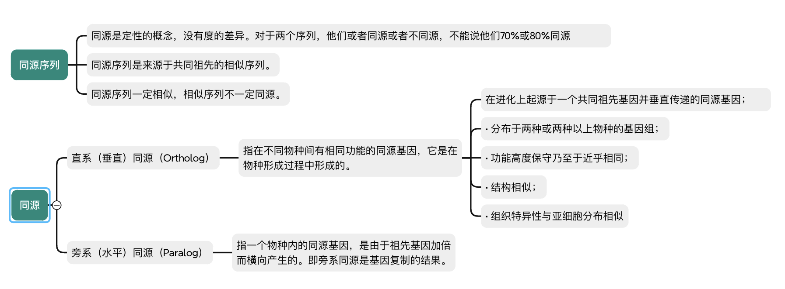

#### 作用

##### 获得共性序列

- 共性序列（Consensus sequence，一致/共有序列）的概念用来描述一组DNA 或者蛋白质序列，通常这组序列互相之间非常相似但又不完全相同，共性序列就由这组相似序列中每个位置最常出现的碱基或者氨基酸组成
- 共性序列常用于数据库搜索、探针设计、识别高度相似的序列

##### 突变分析

- 与参考基因组比较，识别序列中变异位点

##### 种系分析

- 根据基因或基因组序列的差异判断种系关系
- 多序列比对通常是构造种系树的第一步。

##### 保守区段分析

- 保守区段：某一段序列在进化演变过程中，在不同的物种中都被保留
- 多序列比对是识别进化上保守的这些区段的基本方法

##### 基因和蛋白质功能分析

- 通过与已知功能的同源基因和蛋白质进行多序列比对来推断新基因和蛋白质的功能。

### 序列比对打分方法

#### 序列比对替换打分矩阵

> 掌握替换打分矩阵的定义
> 构建替换打分矩阵的两种手段

- 在序列比对中一般需要给出一个定量的数值来描述两者的一致性和相似性。在此过程中，替换打分矩阵用来评价碱基或残基之间的相似性。
- 在长期实践中，发现一些特定的碱基替换或者残基替换的频率是要高于另一些替换的，因此可以通过统计方法或者基于进化的突变模型来给每一种替换定义不同的分值，从而体现出不同碱基或残基之间发生替换的可能性。
- 替换打分矩阵
  - 即是一种打分规则，其数学本质是统计权重，它定量地描述了不同替换的意义
  - 替换打分矩阵包括核酸序列替换打分矩阵和蛋白质序列替换打分矩阵。

- 对于序列中单个字符的替换引起的失配，需要考虑不同字符间的替换具有不同的概率和意义

##### 等价矩阵（Unitary matrix）

- 相同核苷酸间的匹配得分为1，不同核苷酸间的替换得分为0
  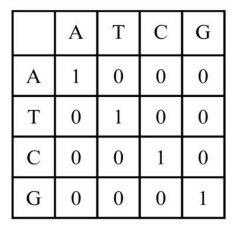

##### 转换-颠换矩阵（Transition-transversion matrix）

- 转换：嘌呤(A, G)之间的替换，或者嘧啶(C, T)之间的替换
- 颠换：嘌呤与嘧啶间的替换。
- 转换的发生概率远高于颠换
- 转换得分为-1，颠换得分为-5
  

##### BLAST矩阵

• 基于大量实际比对
• 匹配得分为+5，反之为-4
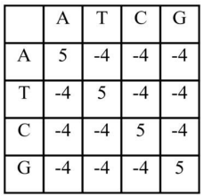

#### 核酸序列替换打分矩阵

> 知道常用的三种打分矩阵

#### 蛋白质序列替换打分矩阵

> 知道常用的打分矩阵
> 掌握PAM矩阵和BLOSUM矩阵的差别

##### 等价矩阵

- 匹配得分为1，反之为0

##### 遗传密码矩阵（Genetic code matrix）

- 通过计算一个氨基酸转变成另一个氨基酸所需的密码子变化的数目而得到，矩阵元素的值对应于代价。
- 常用于进化距离的计算，优点是计算结果可以直接用于绘制进化树。
- 当蛋白质序列相似度较低时，不适用

##### 疏水性矩阵（Hydrophobic matrix ）

- 根据氨基酸侧链基团疏水性的不同以及氨基酸替换前后理化性质改变的大小
- 若一次氨基酸替换后疏水特性不发生大的变化，则这种替换的得分高，否则得分
  低
- 适用于偏重蛋白质功能方面的序列比对

##### PAM矩阵（ Dayhoff 突变数据矩阵）

- 根据对氨基酸之间的相互替换率计算得到的PAM矩阵，即可接受点突变（Point accepted mutation）或可接受突变百分比（ Percent of accepted mutation ）矩阵。（可接受：突变不会因自然选择而被淘汰）
- PAM基于氨基酸进化的点突变模型，即如果两种氨基酸替换频繁，说明自然界易接受这种替换，那么这对氨基酸替换得分就应该高。
- PAM-1：一条序列1%的氨基酸发生突变，这一过程发生1次后，氨基酸之间的相对突变概率。PAM-1是基于相似性较高（通常为 85%以上）的序列比对后计算所得。
- PAM-n ：PAM-1 自乘 n 次可以得到 PAM-n ，即发生了n次，取对数即为其替换记分矩阵。
- n越小表示氨基酸变异的可能性越小（进化距离越近）
- 在实际使用中，需要根据待比较序列之间的亲缘关系远近，来选择适合的 PAM 矩阵。
- 如果序列亲缘关系远，也就是说序列间会有很多突变，那就选 PAM 后面跟一个大数字的矩阵。
- 如果亲缘关系近，也就是突变比较少，序列间大多数地方都是一样的，那就选 PAM后面跟一个小数字的矩阵。
  
  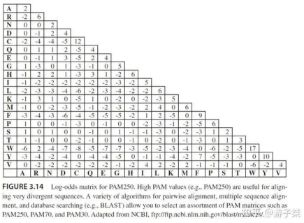

##### BLOSUM（Block Substitution Matrix）矩阵

- BLOSUM矩阵的相似度是根据真实数据产生的。
- 基于蛋白质序列块（短序列）比对进行推断
- BLOSUM-80代表该矩阵由一致性 >= 80% 的序列计算而来
- BLOSUM-62是指矩阵由一致性 >= 62% 的序列计算而来
- BLOSUM-n：n越小，氨基酸相似的可能性越小
- BLOSUM矩阵的优点是符合实际观测结果，不足之处是它不考虑进化距离，不能提供进化信息。
  

#### 空位罚分

> 知道什么是起始空位和延伸空位
> 能利用线性空位罚分和仿射空位罚分计算具体的罚分值

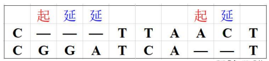

##### 线性空位罚分（Constant gap penalty）

- 最简单的罚分方式，仅考虑起始空位罚分，连续的空位不罚分。
- 如下图所示，设起始空位罚分值为－4，序列应罚8 分。
  

##### 仿射空位罚分（Affine gap penalty）

- 起始空位对应着一个罚分，延伸空位则对应一个相对较低的罚分。
- ·仿射空位罚分采用线性函数 **g(k)=a+b\*(k-1)** 计算连续空位罚分(a为起始空位罚分；b为空位延伸罚分；k为空位数量)。

- 罚分与空位的长度成比例
- 如下图所示，采用仿射空位罚分，a＝－4、b＝－3，则共罚 17分（−17 = −4 + −3 × 3 − 1 + −4 + −3 × 2 − 1）
  

### 双序列比对算法

#### 一、dotplot 算法

> 了解dotplot 算法的基本步骤

- dotplot 法或对角线作图由Gibb提出。
- 将两条待比较的序列分别放在矩阵的X/Y轴上
- 依次比较两条序列的每个字符，当对应行与列的字符匹配时，则在矩阵对应的位置上打点，得到点矩阵。
- 在点阵矩阵中，将位于对角线方向上相邻的点连接起来，这些直线所对应的矩形区域就是这两条序列的相似性片段。
  

- 两条序列完全相同，点矩阵的主对角线各位置都被标记。
  
- 两条序列有共同的子序列，对每一个子序列有一条与对角线平行的由一系列点组成的斜线。
  

#### 二、双序列全局比对

> 掌握全局比对时适用场景
> 熟练使用Needleman-Wunsch算法进行序列全局比对

- 主要用途：寻找关系密切的序列；鉴别或证明新序列与已知序列家族的同源性，是进行分子进化分析的重要前提。
- 代表算法：Needleman-Wunsch算法（动态规划）。

##### Needleman-Wunsch算法

- a,b是两条待比对序列
- la|=m,|b|=n
- S(i,j)是按照指定替换打分矩阵得到的前缀a[1..]与b[1….j]的最大相似性得分
- w(c,d)是字符c和d按照替换计分矩阵计算的得分
- S(0,0)=0
  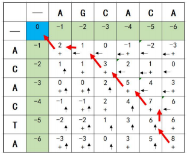

###### 计算比对得分

- w(匹配)=+2
- w(a,-)=w(-,b)=w(失配)=-1

###### 回溯路径

- 从右下角向元素开始，回溯到当前单元格来源的单元格中值最大的单元格。

###### 范例

#### 三、双序列局部比对

> 掌握局部比对时适用场景
> 熟练使用Smith-Waterman算法进行序列局部比对

- 对一条长序列和短序列进行全局比对，整体相似性得分可能不高，找不到相似的序列。
- 局部比对：在每个序列中使用某些局部区域片段进行比对，找出两个序列间高相似度的片段。
- 适用于亲缘关系较远、整体上不具有相似性而在一些较小的区域上存在局部相似性的两个序列
- 代表算法：Smith-Waterman算法

###### Smith-Waterman算法

- a,b是两条待比对序列
- la|=m,|b|=n
- S(i,j)是按照指定替换打分矩阵得到的前缀a[1….]与b[1….]的最大相似性得分
- w(c,d)是字符c和d按照替换计分矩阵计算的得分
- S(i,0)=0,0≤i≤m;S(0,j)=0,0≤j≤n
  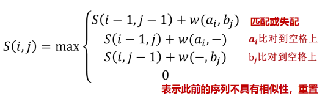
- 回溯：从矩阵得分的最大分值的元素开始回溯直至分数为0的元素
  

#### 双序列比对工具

##### 全局比对

> https://www.ebi.ac.uk/jdispatcher/psa/emboss_needle

##### 局部比对

> https://www.ebi.ac.uk/jdispatcher/psa/emboss_water

### 比对的统计学显著性

#### 典型方法

##### 目的

- 确定由比对算法计算的相似性是否可靠，是否偶然
- 假定序列A和B的比对得分是S，为判断S的可靠性

##### 方法

- 法1：将序列A或B与大量非同源的序列做比对，得到比对得分集合S1，然后将S与S1进行比较。
- 法2：把序列A或B与一组随机产生的序列进行比对，得到比对得分集合S2，然后将S与S2进行比较。
- 法3：首先随机将序列A与B中的一个打乱重组，比如说重组100次，并与另一个序列比对，得到一组比对得分S3；接着计算S3的均值M和标准差D，并计算Z值：Z=（S-M）/D；最后根据Z值判断两个序列相似得分的显著性
  

### 数据库搜索

#### 经典BLAST

- 理解BLAST算法的基本原理

##### BLAST在线工具

- 掌握BLAST的不同检索模式
- 会使用BLAST算法在指定数据库中搜索相似序列

##### BLAST：basic local alignment search tool

- 数据库搜索是双序列局部比对的特例
- 查询序列 (Query)：希望通过数据库搜索确定其性质或功能的序列
- 目标序列 (Hits)：通过数据库搜索得到的和查询序列具有一定相似性的序列
- 是目前最常用的数据库搜索算法
- 要点是片段对（segment pair）的概念，它是指两个给定序列中的一对子序列，它们的长度相等，且可以形成无空格的完全匹配

##### 基本步骤

- 找出某些“种子”(Word)，即查询序列和目标序列间非常短的片段对，他们的比对得分大于或等于某个阈值
- 向两端不带空格地扩展种子，并使用替换计分矩阵计算得分，当得分低于某个既定阈值时停止扩展（改进后的BLAST允许空位的插入）
- 给出扩展后的片段对，即为高分值片段对（High-scoring pairs，HSPs）
  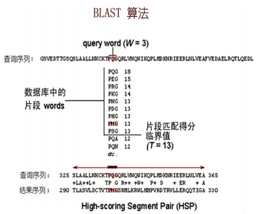

##### BLAST的查询序列和数据库的类型

##### 在线工具

> https://blast.ncbi.nlm.nih.gov/Blast.cg
> 

##### E value

- 表示随机匹配的可能性，E值越大，随机匹配的可能性也越大。E值接近零或为零时，基本上就是完全匹配了。
  

##### 三种BLAST算法

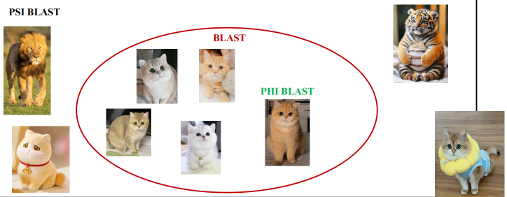

### 多序列比对

对两个以上字符序列进行比对，逐列比较其字符的异同，使得每一列的字符尽可能一致，以发现其共同的结构特征的方法

#### 目标

使参与比对的序列间有尽可能多的列具有相同的字符，即，使得相同残基的位点位于同一列，以便于发现不同序列间的相似部分，从而推断它们在结构和功能上的相似关系，主要用于分子进化关系，预测蛋白质的二级结构和三级结构、估计蛋白质折叠类型的总数，基因组序列分析等。

#### 主要涉及四个要素：

- 选择一组能进行比对的序列（要求是同源序列）；
- 选择一个实现比对与计分的算法与软件；
- 确定软件的参数；
- 合理地解释比对的结果；

#### 多序列全局比对

- 假定序列中所有对应字符均可以匹配，所有字符具有同等的重要性，空格的插入是为了使整个序列得到比对，包括使两端对齐。
- 把整个序列当成一个保守的区段，关心的是序列整体上的可比性与相似度，常用于外显子测序、RNA序列和蛋白质序列的比对。

##### 动态规划法

##### 渐进多序列比对

- 步骤
  1. 使用动态规划法对每两个序列进行配对比对，该步多使用距离矩阵来描述序列间的关联性
  2. 由距离矩阵构造一棵指导树(guide tree),反映序列间的关联情况
  3. 以计分最高的配对比对作为“种子”，根据指导树逐渐向多序列比对中加入序列
- 代表算法： ClustalW/ ClustalX
- 优点：能处理高达数百个序列的比对
- 缺点：不保证产生全局最优的比对，容易陷入局部最优解（坏种子；序列加入顺序；失配传播）
  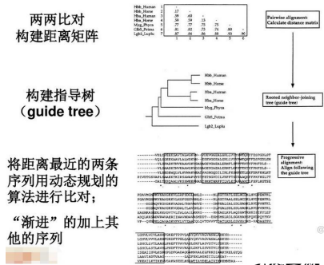

##### 迭代法

- 基本过程：先用渐进多序列比对产生一个初始结果，再对序列的不同子集进行反复比对并利用这些结果重新进行多序列比对，目标是改进多序列比对的总计分值。
- 迭代法常使用随机搜索或者通过对比对结果进行重排来寻找更优的解，直到计分值不再提高
- 常用算法：MAFFT

##### 基于一致性的方法

- 一致性：对于序列 $X$、$Y$ 和 $Z$，若 $X_i$ 比对于 $Z_k$ 且 $Z_k$ 比对于 $Y_j$，则 $X_i$ 应比对于 $Y_j$。
- 基本特点：充分利用多个序列间的比对信息对配对比对进行更合理的计分。
- 代表算法：ProbCons，T-Coffee

#### 多序列局部比对

- 不假定整个序列可以匹配，重在考虑序列中能够高度匹配的一个区段，可赋予该区段更大的计分权值，空格的插入是为了使高度匹配的区段得到更好的比对。
- 关心序列中某个保守区段之间的可比性与相似度，常用于揭示多个序列中的一个保守区段。

- 待比对的多个序列长度相当且高度相似，全局比对与局部比对的结果基本相同
- 待比对的多个序列长度差异较大或亲缘关系较远，全局比对与局部比对的结果相差较大。
  

##### 常用多序列局部比对软件

- SAM：基于隐马尔可夫模型，蛋白质结构预测
- Mulan：发现进化上保守的功能元件

###### Clustal Omega

> https://www.ebi.ac.uk/Tools/msa/clustalo/

- ClustalX和ClustalW是两个使用最广泛的多序列比对工具，均采用渐进式多序列比对算法。
- Clustal Omega是欧洲生物信息研究所（EBI）开发的多序列比对工具，现已经完全取代了之前ClustalW 的地位

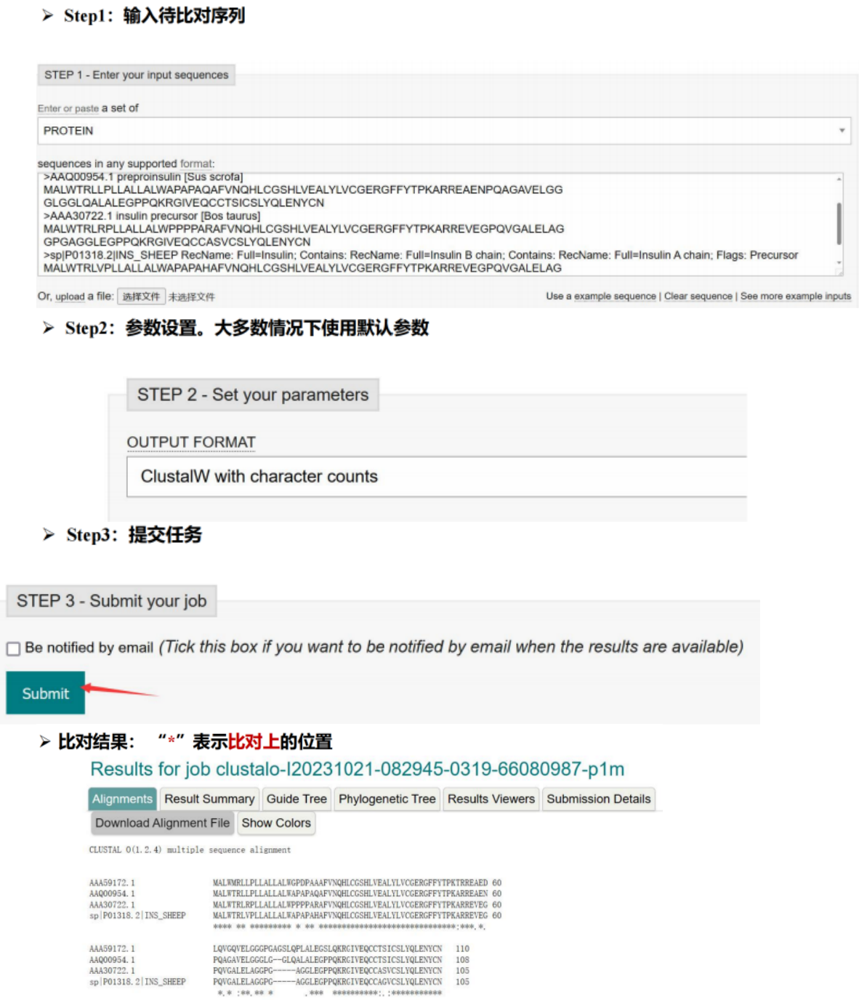

---

## 再次致谢

本笔记内容整理自：
福州大学医工交叉研究院熊壮博士《生物信息学》课程课件，福州大学
部分内容结合课件内容与个人理解重新整理，如有出入以老师课件原文为准。
