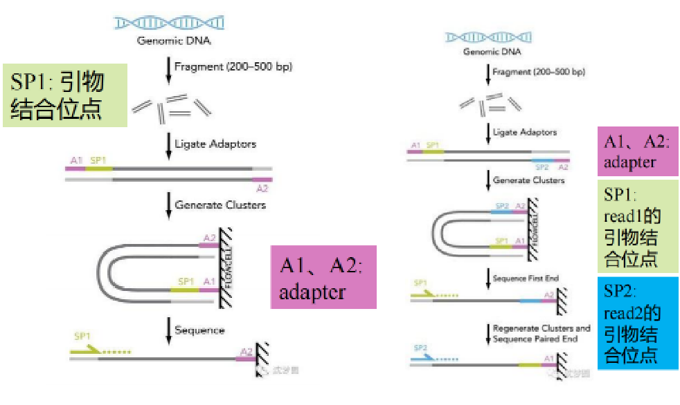

# 生物信息学笔记

> **笔记信息 / Note Information**
>
> **作者 / Author**：蔡靖熹
> 福州大学 数据科学与大数据技术专业 本科生
> Fuzhou University, Data Science and Big Data Technology, Undergraduate
>
> **内容说明**：本笔记由本人根据学习整理撰写。
>
> **参考资料**：
>
> - 部分知识点参考自福州大学医工交叉研究院熊壮博士《生物信息学》课程课件

> **AI辅助说明**：本笔记 Markdown 排版结构与逻辑整理借助 AI 工具辅助完成，AI 未参与专业内容的判断与生成，核心知识内容以本人撰写为准。如有内容错误，责任由本人承担。
>
> **联系方式 / Contact**：
> tchinchina@outlook.com
> cjx941008@qq.com

---

## 目录

- 第一章 生物信息学导论
- 第二章 常用生物信息学数据库
- 第三章 测序技术
- 第四章 测序比较（序列比对）
- 第五章 基因组学
- 第六章 转录组学
- 第七章 系统生物学

---

## 第一章 生物信息学导论

### 一、什么是生物信息学

**Biology + Informatics = Bioinformatics**

生物信息学是一门交叉学科，涵盖生物信息的获取、处理、存储、分发、分析和解释等所有方面，综合运用**数学、计算机科学和生物学**的各种工具，来阐明和理解海量数据所包含的生物学意义。

> 一种通俗理解：生物信息学是一门收集、分析遗传数据并分发给研究机构的新学科，特指数据库类的工作。

#### 与其他交叉学科的区别

生物信息学常与以下学科混淆，但侧重点不同：

| 学科           | 英文               | 侧重点                                     |
| -------------- | ------------------ | ------------------------------------------ |
| 生物计量学     | biometrics         | 依赖生物/生理特征的数字安全方法            |
| 生物数学       | biomathematics     | 生物结构与动态过程的数学建模               |
| 生物化学       | biochemistry       | 生命体内的化学过程                         |
| 生物物理学     | biophysics         | 用物理学方法研究生命现象                   |
| **生物信息学** | **bioinformatics** | 用信息学方法处理、组织、分析生物大分子信息 |


#### 经典定义（2001）

生物信息学是在大分子方面的**概念型生物学**，并使用信息学技术——这些方法衍生自应用数学、计算机科学以及统计学等学科，用以在大尺度上理解和组织与生物大分子相关的信息。


#### 广义生物信息学观点

生物学研究可以被看作是研究**信息的传递**：

- 从 DNA 经转录、翻译到蛋白质
- 从细胞质到细胞核
- 从母细胞到子细胞
- 从一个细胞/组织到另一个细胞/组织
- 从一代到下一代

---

### 二、生物信息学的历史渊源

生物信息学是"生物"与"信息"两条脉络交汇的产物。

#### 生物学脉络

| 人物                     | 贡献                             |
| ------------------------ | -------------------------------- |
| 拉马克                   | 用进废退、获得性遗传             |
| 达尔文                   | 《物种起源》——自然选择、适者生存 |
| 孟德尔                   | 豌豆杂交实验                     |
| 米歇尔                   | 分离出核酸                       |
| 约翰森                   | 首次提出"基因"概念               |
| 摩尔根                   | 染色体遗传理论                   |
| 艾弗里、麦克劳德、麦卡蒂 | 证明 DNA 为遗传物质              |

#### 信息学脉络

| 人物     | 贡献                     |
| -------- | ------------------------ |
| 帕斯卡   | 压强、三角学、早期计算机 |
| 莱布尼兹 | 提出计算机概念           |
| 摩尔斯   | 摩尔斯电码               |
| 图灵     | "计算机之父"             |

#### 两条脉络的时间交汇


- **1944** 美国人 Chargaff 提出 Chargaff 规则（A=T，G=C）
- **1946** 世界第一台现代电子计算机"埃尼阿克"诞生于美国宾夕法尼亚大学
- **1951** 英国生物化学家 Sanger 证明蛋白质具有明确构造
- **1953** DNA 双螺旋结构发布
- **1958** 克里克提出中心法则
- **1966** 遗传密码子破译
- **1975** Sanger 研究出链终止法 DNA 测序技术；同年比尔·盖茨成立微软公司、乔布斯成立苹果公司

#### "生物信息学"学科的正式形成


- **1979** 美国洛斯阿拉莫斯实验室建立 GenBank 数据库，后来成立 NCBI
- **1982** 欧洲分子生物学实验室（EMBL）建立核酸序列数据库（EBI）
- **1984** 日本建立核酸序列数据库 DDBJ
- **90年代初** 三大核酸数据库资源共享，联合成立国际核酸序列数据库联盟（**INSDC**）
- **1987** 美国学者林华安首创 "bioinformatics" 一词

名称演变路径：`compbio → bioinformatique → bio-informatics → bioinformatics`

---

### 三、生物信息学研究的主要内容

1. **数据库建设与工具开发**：生物数据的检索、下载、整合与共享
2. **组学数据分析与解释**：包括基因组、转录组、蛋白质组等各类组学数据
3. **生物系统及网络分析**：如蛋白互作网络、基因共表达网络、调控网络等（下图示例了从非网络数据推断网络的三种典型场景）
   
4. **算法、方法开发**：开发新的算法及统计学方法，揭示大数据之间的联系

---

### 四、生物信息学的应用

- **基础研究**：探究机体的生理病理机制，如衰老、癌症的发病机制
- **临床研究**：疾病诊断与预后评估，如利用病原核酸序列诊断疾病
- **药物开发**：新药筛选、药靶设计、老药新用，如肿瘤免疫检查点抑制剂的研发

#### 精准医学中的 Y = f(X) 框架


| 变量 | 含义 | 对应过程 |
|---|---|---|
| **X** | 多组学与临床/环境数据（基因组、转录组、蛋白组、代谢组、微生物组、表观组、暴露组等） | 数据汇聚（Deposition） |
| **f** | 算法模型 | 算法整合（Integration） |
| **Y** | 结果（预防、预测、诊断、管理疾病等） | 知识挖掘（Translation） |

即：通过对多层次组学与临床数据（X）建立算法模型（f），挖掘知识以获得健康/疾病相关结果（Y）。

---

### 五、补充知识点

- 人类基因组含有约 **30 亿**个 DNA 碱基对
- 其中编码蛋白质的区域约占 **1.5%**

---

## 第二章 常用生物信息学数据库

### 一、数据库基础知识

**数据库**是一类用于存储和管理数据的计算机文档，将数据以结构化记录的形式组织，以便于信息检索。

- **记录（record）**：数据库的每一条数据，也叫**条目（entry）**
- **字段（field）**：描述某一类数据特性或属性的组成部分

#### 数据库分类

| 类型           | 定义                                                                        | 特点                                          | 举例                                                                 |
| -------------- | --------------------------------------------------------------------------- | --------------------------------------------- | -------------------------------------------------------------------- |
| **一级数据库** | 数据直接来源于实验获得的原始数据，只经过简单归类整理和注释                  | 存储原始测序数据，通常由测序中心/研究机构提供 | NCBI SRA、ENA（欧洲）、DDBJ（日本）、GSA（中国，组学原始数据归档库） |
| **二级数据库** | 在一级数据库、实验数据和理论分析基础上，针对特定应用目标建立的整理/分类结果 | 经过分析处理，形成特色专题数据库              | dbSNP（SNP数据）、GEO（基因表达数据）、GWH（基因组数据库）           |

---

### 二、NCBI（美国国立生物技术信息中心）

NCBI 充分利用了公共数据库各记录间本身存在的逻辑关系，可从多种类型数据的文本信息中交叉检索所需信息。

#### 1. GenBank 数据库

包含所有已知的核酸序列及相关文献著作、生物学注释。每条记录代表一个单独、连续、带注释的 DNA 或 RNA 片段。

**数据来源三类：**

1. 测序工作者直接提交的序列
2. 与其他数据机构协作交换的数据
3. 美国专利局提供的专利数据

**记录描述符：**

| 字段       | 缩写 | 含义                          |
| ---------- | ---- | ----------------------------- |
| LOCUS      | ID   | 序列名称                      |
| DEFINITION | DE   | 序列简单说明                  |
| ACCESSION  | AC   | 序列编号                      |
| VERSION    | —    | 序列版本号                    |
| KEYWORDS   | KW   | 相关关键词                    |
| SOURCE     | OS   | 序列来源物种名                |
| ORGANISM   | OC   | 物种学名及分类学位置          |
| REFERENCE  | RN   | 相关文献编号/递交序列注册信息 |
| AUTHORS    | RA   | 相关文献作者/递交序列作者     |
| TITLE      | RT   | 相关文献题目                  |
| JOURNAL    | RL   | 相关文献刊物/递交序列作者单位 |
| MEDLINE    | —    | 相关文献 Medline 引文代码     |
| REMARK     | —    | 相关文献注释                  |
| COMMENT    | OC   | 关于序列的注释信息            |


#### 2. FASTA 格式（序列文件标准格式）

基于文本、用于表示核酸或多肽序列的通用格式，已成为生物信息学领域的标准。

- 序列标题以 `>` 开头，下一行为具体序列
- 核苷酸符号大小写均可，氨基酸一般大写
- 一般每行字符数不超过 80 个
- 无特殊的序列结束标志
- 多条序列即将该格式连续列出
  

#### 3. Gene 数据库

收录全部已测序物种的基因注释信息，包括基因名称、染色体定位、基因序列及编码产物（mRNA、蛋白质）情况，并与 GenBank、OMIM 等 NCBI 子库及 KEGG、Gene Ontology 等外部数据库交叉引用。

- **标识符**：即 Entrez gene ID，唯一（unique），依基因发现顺序由 1 至多位数字组成。例如 TP53 的基因标识符为 **7157**。
- **收录内容**：Entrez gene ID、基因概括与转录本信息表、基因完整/官方名字、基因类型、基因别名、基因信息表、染色体位置、文献注释、相关疾病信息、参与通路、互作分子信息、Gene Ontology 功能注释等。


#### 4. PubMed 数据库

收录生命科学相关的已发表期刊文献。

**关键词检索逻辑（适用于所有数据库）：**

| 逻辑符 | 示例                       | 含义                             |
| ------ | -------------------------- | -------------------------------- |
| AND    | ("single cell" AND cancer) | 同时包含两个关键词               |
| OR     | ("single cell" OR cancer)  | 包含任意一个即可（也可同时包含） |
| NOT    | ("single cell" NOT cancer) | 包含前者但不包含后者             |

**双引号规则：**

- 单个单词关键词（如 cancer）可不加引号
- 多个单词组成的词组（如 "single cell"）必须加双引号，否则搜索结果可能只包含其中一个词，或两个词分散出现在文本各处，而非作为完整词组出现
  
  

#### 5. GEO（Gene Expression Omnibus）数据库

接收和管理基因芯片或测序技术获得的表达数据。

**注释信息层级：**

| 代码 | 全称     | 含义                                 |
| ---- | -------- | ------------------------------------ |
| GPL  | Platform | 特定的芯片/测序平台类型              |
| GSM  | Sample   | 参与表达测序的样本/个体信息          |
| GSE  | Series   | 一组相关样本实验测定的基因表达谱数据 |


**Series Matrix 文件结构：**

- `!Series*`：数据集信息
- `!Sample*`：样本信息
- 中间部分：存储的表达数据（表达谱矩阵）
  
  
  
  

#### 6. 其他重要 NCBI 数据库

| 数据库 | 说明                                                                         |
| ------ | ---------------------------------------------------------------------------- |
| RefSeq | 在 GenBank 基础上，为每个基因不同数据类型提取一个可靠注释条目作为参考条目    |
| Genome | 收录已完成测序物种的全部基因组序列、定位数据及正在测序物种的阶段性基因组信息 |
| SRA    | 存储原始测序数据                                                             |
| PMC    | 收集已发表、免费获取的生物医学与生命科学期刊文献                             |
| OMIM   | 以疾病和基因为中心，阐述遗传变异介导的疾病（表型）相关基因情况               |

**遗传多态数据库：**

- **dbSNP**：收录所有物种中发现的短序列多态和突变信息
- **dbVar**：收录较大规模的基因组变异
- **dbGaP**：收录以遗传多态为分子标记物的基因型与表型（疾病）关联性研究数据
- **ClinVar**：收录临床中发现/报道的、有证据支持的与人类疾病或健康状态相关的变异位点

**蛋白质数据库：**

- **Protein**：收录来源于 GenPept、RefSeq、Swiss-Prot、PIR、PRF、PDB 等资源的蛋白质序列和注释数据
- **Protein Cluster**：提供存在联系的蛋白质集合信息，并与注释、结构、结构域、家族相关数据库交互访问
- **Structure**：提供蛋白质三维结构信息及相关可视化、结构比对工具

---

### 三、EMBL-EBI（欧洲分子生物学实验室－欧洲生物信息学研究所）

#### 简介

- **EMBL** 实验室 **1980 年**于德国海德堡成立，是世界上最早的核酸序列数据管理机构之一
- **1992 年** EMBL 理事会投票决定于英国威康信托基因组科学园建立**欧洲生物信息学研究所（EBI）**，并于 **1995 年**完成迁移
- 当时 EBI 拥有两个数据库：核酸序列数据库 **EMBL-Bank** 和蛋白质序列数据库 **UniProt**

网址：https://www.ebi.ac.uk/


#### 主要生物分子数据资源

| 数据库       | 内容                   |
| ------------ | ---------------------- |
| EMBL-Bank    | 核酸（DNA 和 RNA）序列 |
| Ensembl      | 基因组                 |
| ArrayExpress | 微阵列基因表达         |
| UniProt      | 蛋白质序列和注释       |
| Reactome     | 细胞通路               |

#### 1. Ensembl 数据库

提供高质量、综合注释的**脊椎动物**基因组数据。

- 提供基因表达组织差异性分析、基因序列提取、变异位点效应预测、基因多态性定位、跨物种基因比较、用户数据分析等功能模块
- 基因编码以 **"ENSG"** 开头；转录本以 **"ENST"** 开头
- 网址：http://www.ensembl.org/index.html
- **Ensembl Genomes** 数据库：提供非脊椎动物全基因组数据
  
  
  
  

#### 2. BioMart 数据检索平台

- 将储存在不同数据库中的基因、蛋白等序列和注释信息进行整合
- 查询不同数据库来源的基因 ID、基因组定位、表达、结构等信息
- 支持不同数据资源条目代码转换、功能富集，可批量获取相关数据
- 方便获取一个物种全部基因组或局部区域的核酸、蛋白序列及各种注释信息
- **功能模块**：数据查询、ID 转换、序列数据提取、富集分析
  
  

#### 3. UniProt 蛋白质数据资源

网址：http://www.uniprot.org/


**UniProtKB —— UniProt 的核心资源**，主要包括两部分：

| 组成部分       | 特点                                                                                                                                                           |
| -------------- | -------------------------------------------------------------------------------------------------------------------------------------------------------------- |
| **Swiss-Prot** | 收录非冗余、高质量的**专家手动注释**数据；每条记录尽可能从文献、其他数据库搜集每个物种每个蛋白质的所有注释信息，包括选择性剪接、多态、翻译后修饰、蛋白质家族等 |
| **TrEMBL**     | 收录经高质量**计算分析获得的自动注释**信息                                                                                                                     |

**检索流程**：输入关键字 → 结果筛选（分 Swiss-Prot / TrEMBL）→ 结果查看（进入蛋白质注释词条）


**UniProt 其他资源：**

| 数据库    | 内容                                                         |
| --------- | ------------------------------------------------------------ |
| UniRef    | 根据蛋白质序列在不同物种中的相似性进行分簇                   |
| UniParc   | 非冗余蛋白质序列仓库，收集全部公开发布或文献发表的蛋白质序列 |
| Proteomes | 收集已完全测序物种的蛋白质组                                 |

---

### 四、CNCB / NGDC（国家生物信息中心）

- **CNCB 首页**：https://www.cncb.ac.cn/
- **NGDC 首页**：https://ngdc.cncb.ac.cn/
  
  

#### 主要数据库资源

| 数据库                         | 全称/说明                                   | 链接                              |
| ------------------------------ | ------------------------------------------- | --------------------------------- |
| **GSA**                        | Genome Sequence Archive，原始组学数据归档库 | —                                 |
| **Genome Warehouse**           | 基因组序列库                                | http://bigd.big.ac.cn/gwh         |
| **Genome Variation Map**       | 基因组变异库                                | https://ngdc.cncb.ac.cn/gvm       |
| **Gene Expression Nebulas**    | 基因表达数据库                              | https://ngdc.cncb.ac.cn/gen       |
| **MethBank**                   | 甲基化数据库                                | https://ngdc.cncb.ac.cn/methbank/ |
| **多组学知识库**               | 整合多组学数据的知识库                      | —                                 |
| **Open Library of Bioscience** | 生命科学文献库                              | https://ngdc.cncb.ac.cn/openlb    |


#### 特色资源库

- **癌症单细胞表达图谱数据库**：收录癌症相关单细胞表达数据
- **iDog**：犬类资源库
- **Aging Atlas**：衰老知识库
- **Database Commons**：数据库集成/导航平台
  
  
  
  

#### 生物大数据跨库搜索引擎

**Big Search**：支持在国家生物信息中心多个数据库间进行跨库统一检索。


**生命科学文献库：Open Library of Bioscience**（https://ngdc.cncb.ac.cn/openlb）


---

### 五、TCGA（肿瘤基因组图谱）

#### 简介

**The Cancer Genome Atlas（TCGA）** 计划由美国 **National Cancer Institute（NCI）** 和 **National Human Genome Research Institute（NHGRI）** 于 **2006 年**联合启动。

- 目前收录来自 **11,000** 个病人、**33** 个癌症类型的数据，数据量达 **2.5 PB**
- Home 页：https://cancergenome.nih.gov/


#### 包含的 5 类组学数据


| 组学类型 | 定义 | 数据内容 |
| ------------------------------ | ---------------------------------------------------------------- | ---------------------------------------------------------------------- |
| **基因组** | 一种生物所有遗传信息的总和，或载有遗传信息的全体核酸 | 核酸序列组成、基因组结构（基因突变、拷贝数变异） |
| **转录组** | 细胞中所有 RNA 分子的总和，包括 mRNA、rRNA、tRNA、ncRNA 等 | RNA 分子表达水平（基因表达水平改变、可变剪切） |
| **蛋白质组** | 一个基因、一种生物或一种细胞/组织所表达的全套蛋白质 | 蛋白质序列、表达水平（序列比较、表达水平改变） |
| **表观基因组** | 所有参与细胞基因调控过程的化学修饰，是表观遗传信息的重要组成部分 | DNA 甲基化、组蛋白修饰（化学修饰和空间结构如何影响基因功能与表达调控） |
| （第五类，原文未列出具体名称） | — | — |

#### TCGA 数据下载 —— UCSC Xena

- **UCSC Xena** 不仅包含 TCGA 数据，还包含 **ICGC**、**CCLE** 等其他数据资源
- 网址：https://xena.ucsc.edu/public/
- 通过 "Launch Xena" 进入数据下载页面，选择数据中心和癌症类型
  
  
  
  
  

**下载数据要点：**

- **表达数据（count）**：行（row）为基因，列（col）为样本
- **样本编号**规则：最后一部分数字用于区分正常与肿瘤样本
  - **01–09**：肿瘤样本（tumor）
  - **10 及以上**：正常/癌旁样本（normal）
- 可下载：基因标识对应信息、患者表型数据（phenotype）、患者生存数据（**OS: Overall Survival**，其中 1 = dead）


---

### 六、UCSC 基因组浏览器

#### 简介

- **UCSC Genome Browser** 由美国加州大学 Santa Cruz 分校的 Jim Kent 等人建立，是人类基因组图谱三大门户网站之一
- 收录物种范围广泛：**48 种哺乳动物、19 种其他脊椎动物、3 种后口动物、20 种昆虫**及线虫等众多动物，以及病毒、酵母等微生物全基因组数据
- 采用 NCBI 拼接整合的人类基因组序列作为平台，提供多种基因组定位数据：染色体区带、连续子和间隙、mRNA 和表达序列标签（EST）、预测基因、单核苷酸多态（SNPs）、STS 遗传/放射杂交图谱、重复序列、鼠同源序列、斑马鱼同源序列等

#### 经典工具

| 工具                              | 功能                                               |
| --------------------------------- | -------------------------------------------------- |
| **Genome Browser**                | 以缩放和滚动的方式查看染色体注释                   |
| **Blat**                          | 快速将用户输入序列以图像方式在基因组中显示比对位置 |
| **Table Browser**                 | 提供下载 Genome Browser 数据库数据的便捷链接       |
| **LiftOver**                      | 不同版本基因组坐标之间的转换                       |
| **Variant Annotation Integrator** | 预测变异的功能影响                                 |

#### 网站与使用要点


- **展示面板（track）**：可显示/隐藏不需要的 track
  
- **控制面板**：添加感兴趣的 track，展示层级从 hide → full，结构逐渐详细


- 支持将当前浏览器视图下载为图片


### 七、三大数据库门户小结

| 平台          | 所属地区 | 核心数据库                                                   |
| ------------- | -------- | ------------------------------------------------------------ |
| **NCBI**      | 美国     | GenBank、Gene、PubMed、GEO、SRA、RefSeq、OMIM 等             |
| **EMBL-EBI**  | 欧洲     | EMBL-Bank、Ensembl、UniProt、ArrayExpress、Reactome、BioMart |
| **CNCB/NGDC** | 中国     | GSA、Genome Warehouse、Genome Variation Map、MethBank 等     |

三者数据资源常互相协作、交换共享（如国际核酸序列数据库联盟 INSDC），是生物信息学数据获取的核心枢纽。

---

## 第三章 测序技术


### 第一代测序技术

#### 背景

##### 何为测序？

测序（sequencing）又称定序，是对多聚体中单体排列顺序进行测定的技术，亦即测出目标分子一级结构的序列。
例如：测定DNA、RNA、多肽、多糖链基本
组成单位残基（核苷酸、氨基酸、单糖）的排列顺序。测序意味着确定无分支的生物聚合物的一级结构（有时被误称为一级序列）。
测序结果是一个符号化的线性描述，简明地总结了被测序的分子的大部分原子级结构的序列

#### Maxam-Gilbert化学降解法


##### 常用化学试剂


- 标记：将一个DNA片段的5'端磷酸基作放射性标记。
- 降解：再分别采用不同的化学方法修饰和裂解特定碱基，从而产生一系列长度不一而5'端被标记的DNA片段。
- 电泳：这些以特定碱基结尾的片段群通过凝胶电泳分离。
- 自显影：再经放射线自显影，确定各片段末端碱基。
  从而得出目的DNA的碱基序列。

##### 序列读取方法

1、从胶片底部一个个向顶部读。
2、如果G+A中出现1条带，就看G列中是否有同样大小的条带，若有即为G碱基，无则为A碱基。
3、如果C+T中出现1条带，就看C列中是否有同样大小的条带，若有即为C碱基，无则为T碱基。

##### 优点

·所测序列来自原DNA分子而不是酶促合成所产生的拷贝，因此不会产生由于酶促反应而带来的误差

##### 缺点

·没有改进，操作繁琐
·化学试剂毒性大
·放射性同位素标记效率偏低以致需要较长的放射自显影曝光时间
·人工读取数据费时费力

#### 双脱氧链终止法

> Fred sanger（1918-2013）

##### 原理

- 生物体内，在DNA聚合酶作用下，以单链DNA为模板合成互补的DNA链。
- u根据碱基配对的原则，将脱氧核糖核苷(dNTP)底物加到引物的3′－OH末端，使引物延伸链的延长通过引物的3’-OH基，与脱氧核糖核苷酸底物的5’-磷酸基因，生成磷酸二酯键而实现，其合成方向由5’→3’
- uSanger发现在DNA聚合反应过程中，掺入一种双脱氧核糖核苷酸（ddNTP）底物时，它的5’-磷酸基团是正常的，能够加到正常核苷酸的3’-OH基末端，但其自身3’-OH基团由于脱氧而不存在，下一个核苷酸不能通过5’-磷酸与之形成磷酸二酯键，使DNA链的延伸被终止于这个双脱氧核糖核苷酸处。


##### dNTP的连接/ddNTP的连接


> ddNTP不能与后一个核苷酸连接


###### 声明


##### 优点

- 方法简便，质量控制好；
- 分辨率高，结果直观；
- 测序片段长（ 700 – 1000bp）；
- 准确性高，因此成为基因测序的“金标准”

##### 缺点

- 通量低，试剂昂贵，成本高，耗时耗力

#### 荧光自动测序技术

##### 由来

- Sanger测序：手工测序
  1985年，Lloyd Smith 等提出通过荧光标记替代同位素标记，发展了荧光自动测序技术。
- DNA测序的自动化是在Sanger的双脱氧链末端终止法的基础上由美国应用生物系统公司进一步发展起来的荧光测序法，其基本原理与末端终止法一样，都是通过ddNTP竞争性的终止新合成的DNA链。
- 自动化测序主要差别在于非放射性标记方式和反应产物分析系统。

##### 单一荧光自动测序系统

- 用单一的Cy5荧光染料标记测序引物或dNTP进行测序。
- 用Sanger法原理进行测序反应，分别生成四组终止于4种不同碱基、带有Cy5荧光素标记的DNA片段。
- A、T、G和C四组反应产物在不同的泳道上电泳，用激光激发荧光探测光信号，计算机分析，得出样品DNA的序列。

##### 多色荧光自动测序系统

- 早在1987 年Perkin Elmer (PE) Applied Biosystems 公司就推出DNA 自动测序仪，其专利
  是分别采用 4 种荧光染料进行标记且在同一个泳道测序，具有极大的优越性

- 其原理是采用四种荧光染料标记终止物ddNTP或引物，经Sanger 测序反应后，产物 3′端(标记终止物ddNTP 法)或 5′ 端(标记引物法)带有不同荧光标记，一个样品的 4 个测序可以在一个泳道内电泳，从而降低了测序泳道间迁移率差异对精确性的影响。
- 可一次测定 96 个或更多样品。
- 比常规电泳的测序速度提高了 9倍 ，显著提高了DNA测序的速度和准确性

##### 四色荧光标记物


### 第二代测序技术

#### 二代测序技术概述

- 二代测序也叫“下一代测序技术”The Next-generation Sequencing,（NGS）
- NGS解决了一代测序只能测一条序列的缺陷，之所以称其为高通量测序就是因为它一次能够同时测很多的序列。
- 也叫“循环芯片测序法” （Cyclic-arraySequencing） ，即对布满DNA样品的芯片重复进行基于DNA的聚合酶链式反应（模板变性、引物退火杂交及延伸）以及荧光序列读取反应

#### NGS步骤

##### Step1：文库（library）制备

- A sequencing library is, by definition, a pool of DNA fragments with adapters attached.
- 将核酸序列利用酶方法、化学或物理方法打碎小片段（ fragments ），只选取特定大小的fragments，然后在这些fragments的两端加上测序接头（adapter），形成测序的library。
- adapter是一段已知的短核苷酸序列，用于链接fragments，为后续的library扩增、区分序列来源等

##### Step2：文库PCR扩增

聚合酶链式反应(Polymerase Chain Reaction, PCR)：是一种用于放大扩增特定的DNA片段的分子生物学技术，它可看作是生物体外的特殊DNA制，PCR的最大特点是能将微量的DNA大幅增加

##### Step3：测序

对扩增后的library进行上机测序，测定每个fragment的序列，这些测出来的碱基序列叫做 读段 或 读长（read）

- 测序深度（depth）：目标序列中平均每个碱基被检测的次数
- 覆盖度（coverage）：测序获得的序列占整个目标序列的比例

##### NGS深度和覆盖度


##### NGS测序策略

###### 单末端（Single-end）测序：

• 引物结合位点只连接到DNA或cDNA片段的一端，然后未端加上接头，扩增并测序。
• 单末端测序建库简单，操作步骤少，比双末端测序速度更快一些，价格低
• 常用于小基因组、转录组、宏基因组测序等

###### 双末端测序——Pair-end

- 在DNA或cDNA 片段两端都加上接头和测序引物结合位点，第一轮测序完成后，去掉模板链，然后引导互补链在原位置重新产生并扩增，以获得第二轮测序所需模板，并进行第二轮合成测序。
- 两端的序列形成“一对”，中间的距离叫插入长度。距离信息可以用来判定组装后成对 reads 间的序列是否准确，也可用来帮助组装。这种测序方式可以用来解决基因组中的重复序列难题，被广泛采用。
- 双末端测序则会产生成对的 reads，有利于基因注释和转录本异构体的发现。

###### 单/双末端测序图示


#### 二代测序仪及公司

##### 高通量测序技术的问世

- 2003年，随着人类基因组计划的完成，遗传学研究正式进入了基因组学时代。
- 用Sanger法测序一个人的基因组，成本高达5000多万美元。
- 2003年NIH发起了“5年内实现10万美元=1个基因组”和“10年实现1000美元=1个基因组”的两步走战略计划。
- 在鸟枪法的原理基础上，科学家发明了高通量测序技术，提高单位时间内产生的数据量。

##### 测序公司的三强争霸

- 2005年第一台商用高通量测序仪454横空出世，由美国的454Life Sciences公司于2005年开发，后被罗氏收购。
- 2006年英国剑桥的Solexa公司推出基于SBS技术的高通量测序仪，后被Illumina公司收购。
- Sanger法时代的霸主ABI晚了半个身位，于2007也推出了自己的SoLiD高通量测序仪。

##### Roche 454

###### Roche 454 测序原理


- 焦磷酸测序技术 (Pyrosequencing) 是由Nyren等人于1987年发展起来的一种新型的酶级联测序技术。
- 每当掺入一个碱基 (蓝色的G) 时，就会释放出焦磷酸 (PPi)， PPi在硫化酶 (sulfurylase，蓝色箭头) 催化下生成ATP。然后荧光素酶 (红色箭头) 在ATP参与下将荧光素转变成氧化荧光素同时发光。
- 测序反应是通过释放PPi，经过ATP硫酸化酶和荧光素酶作用发光，向反应体系中加入1种dNTP，如果它刚好能和DNA模板的下一个碱基配对，则会在DNA 聚合酶的作用下，添加到测序引物的 3’ 末端，同时释放出一个分子的PPi，CCD捕捉荧光拍照。

###### Roche 454 测序流程


- Step1：文库构建。产生单链模板DNA文库
- Step2：对文库进行乳液PCR（ emulsion PCR, em-PCR ）扩增
- Step3：测序。边合成边测序，焦磷酸测序

###### DNA 文库的制备


454测序系统中的DNA文库构建与Illumina的构建方法不同，它是利用喷雾法将DNA样本打断成300-800bp的小片段，并在两端加入不同的接头，或者将DNA变性后用引物进行扩增，克隆到特定的载体中，最终构建单链DNA文库

###### 乳液 PCR

Roche 454系统的DNA扩增过程与Illumina不同，这些单链DNA会被28um的珠子固定，并埋入乳液中。
乳剂PCR最大的特点是形成大量独立的DNA扩增反应空间，其关键技术是利用乳剂的特性将不同的珠子分开。
其基本过程为：在进行样本DNA扩增前，将含有PCR反应所有组分的水溶液注入高速旋转的矿物油表面，形成无数被矿物油包裹的小水滴，每一个小水滴形成一个独立的PCR反应空间，理想情况下，每一小滴水滴中只含有一个DNA模板和一个珠子。
磁珠表面包裹着小水滴，上面有与接头相匹配的互补寡核苷酸，使单链DNA能特异性地结合在磁珠上。同时，孵育体系含有PCR试剂，确保固定在磁珠上的每一个小片段DNA都能作为唯一的模板进行扩增。此外，PCR产物还能与磁珠结合。反应完成后，乳化体系被破坏，目标DNA开始聚集。最终，每一个小片段将被扩增约100万倍，从而达到测序过程所需的量级。

###### 焦磷酸测序

测序之前需要用聚合酶和单链DNA结合蛋白将带有DNA的珠子处理好，然后把这些珠子放在PTP板上，这个板上有很多直径为44um的特殊纳米孔，每个纳米孔只能容纳一个珠子，通过这种方式可以固定每个珠子的位置，方便测序。
此测序过程采用的方法是焦磷酸测序（pyrosequencing）。将较小的磁珠放入纳米孔中，开始测序反应。DNA测序反应是以扩增并固定后的单链DNA为基础的，如果一个dNTP能与模板DNA配对，则合成后会释放出焦磷酸基团，释放出的焦磷酸基团与ATP硫酸化学酶发生反应，产生ATP。ATP与荧光素酶共同氧化使荧光素分子被触发而发出荧光，PTP板另一侧的CCD相机记录下荧光信号，最后通过计算机软件对结果进行处理。由于每种dNTP在反应中都会产生独特的荧光颜色，因此可以根据荧光颜色测出DNA序列。反应结束后，ATP被二磷酸酶降解，导致荧光猝灭，测序反应进入下一个循环。

###### Roche 454 测序的特点与主要应用

- 特点
  - read较长，400－800bp
  - 由于454测序技术中，每个测序反应都在PTP板上独立的小孔中进行，因而能大大降低相互间的干扰和测序偏差
  - 通量较低，1Run 1M 序列，400－600Mb
  - 相对成本较高
  - 可以对未知基因组进行从头测序de novo sequencing
  - 当遇到polymer时，如AAAAAA等，荧光强度和碱基个数不成线性关系，判定重复碱基个数有困难
- 主要应用
  - de novo测序

##### Illumina Solexa

###### Illumina Solexa 测序发展历史

- 1997年夏天，Shankar Balasubramanian和David Klenerman提出了合成测序（Sequencing bySynthesis，简称SBS），并成为一种创新的DNA测序方法的基础。1998年，Balasubramanian和Klenerman找到了风险投资公司Abingworth Management，并获得最初的种子资金来成立Solexa。
- 2005年，对噬菌体phiX-174进行了完整基因组的测序，单次运行中带来了超过300万个碱基。
- 2006年，第一代Solexa测序仪，即Genome Analyzer于2006年面世，使科学家能够在单次运行内测序1 Gb的数据。
- 2007年，Illumina收购了Solexa（6亿美元）。

###### Illumina Solexa 测序原理


**核心原理：可逆终止反映**


- 四种颜色的荧光基团用叠氮连接到四种相应的碱基上，同时核苷酸 3' 末端也用一个叠氮基堵住，避免后续配对
- 叠氮基团在遇到巯基试剂时，会发生断裂，并在原来的位置留下一个羟基

###### Illumina Solexa 测序流程

- Step1：文库构建。产生单链模板DNA文库
- Step2：对文库进行桥式PCR（ bridge PCR）扩增
- Step3：测序。边合成边测序，可逆终止测序


###### 接头（adapter）是一系列特定的寡核苷酸序列，包括：

- P5 和 P7 适配器序列：
  这些是 Illumina 平台上使用的两种常见适配器。P5 适配器位于测序读取的一端，而 P7适配器位于另一端。在测序时，flowcell oligo会与 DNA片段上的 P5 和 P7 适配器序列结合，使 DNA 片段固定在 flowcell上，从而允许进行测序反应。
- DNA barcode 或 index 序列：
  DNA barcode 也称为index（复数为 indices），是一个独特的短序列，用于将不同样本标识，允许在同一测序流程中混合多个样本。这对于高通量测序非常有用，因为它允许同时处理多个样本，而不需要单独测序。
- PCR 引物结合序列：
  接头还包含用于引物结合的序列。PCR 引物是在扩增步骤中使用的特定 DNA 序列，有助于将 DNA 片段进行增加复制，使其在测序过程中变得更加丰富。

###### 流动池：Flowcell

- 是一种载玻片形状大小的半导体芯片,我们也可以把它叫做芯片，像一个载玻片，上面有一行字母，是这个flowcell 的编号。
- 中间的通道，我们把它们叫做 lane，这里就是我们测序反应发生的地方
- lane 又被分成了好多行，每一行我们把它叫做 swath，
- 每行 swath 又被分成好多小格子，每个小格叫做 tile

  

- 在 lane 的内表面其实做了专门的化学修饰，主要有用 2 种不同的寡聚核苷酸引物，它们被种在 flowcell 的表面，也就是我们前面提到的 flowcell oligo，它们会与 DNA 片段上的 P5 和 P7 适配器序列结合，使即将被测序的 DNA 片段可以被固定在 flowcell 上。
  > 图中的一个小圆球就代表一个碱基， 它们是通过共价键连接到 flowcell 上的。

###### 桥式 PCR 扩增


###### 特点

• 高度自动化的系统
• read较短，100－150bp
• 通量高，25G每天，120-150G每Run
• 读取片段多，适合进行大量小片段的测序，如microRNA profiling
• 基于可逆反应，随反应轮数增加，效率降低，信号衰减

###### 主要应用

• RNA测序
• 表观遗传学研究

##### ABI SOLiD (Sequencing by Oligonucleotide Ligation and Detection)

###### Oligo连接测序：

通过连接酶连接，再对oligo上荧光基团进行检测两碱基测序法

• 前2个碱基是真实的碱基。组合起来可以有16种可能，AA\AT\AG\AC, GG\GA\GT\GC...... 每种排列对一种荧光颜色（红、绿、蓝、黄）。

> 也就是说每种颜色可以对应4种排列。

• 中间3个通用碱基，
• 后3个有荧光标记的碱基
• 前2个碱基是真实的碱基。组合起来可以有16
种可能，AA\AT\AG\AC, GG\GA\GT\GC...... 每种排列对应一种荧光颜色（红、绿、蓝、
黄）。注意！也就是说每种颜色可以对应4种
排列。
• 中间3个通用碱基，
• 后3个有荧光标记的碱基


加上8碱基探针后：
• 用激光excite 发荧光。
• 用化学方法剪切掉后面3个荧光标记的碱基，只留下前5个碱
基和游离的磷酸基团，以便加上第二个探针。
• 前两个步骤循环，直到合成整条链。
• 接下来，偏移1个、2个、3个、4个碱基，重复步骤1。也就
是会测5轮
• 最后通过荧光颜色来判断
• 第一个已知的碱基来自5’或3’的adapter，又已知荧光颜色，
就可以推出另外一个碱基
• 可以从5'到3'推测一次序列，反过来也可以从3'到5'再推测一
次序列，这样就可以大大提升测序准确性。

###### SOLiD 测序流程

- Step1：文库构建。产生单链模板DNA文库
  
- Step2：对文库进行emPCR扩增 - emPCR：磁珠连接 - fragment可以结合特定bead，不是所有bead都有结合的fragment - 结合有fragment的bead，通过离心筛选出来，然后结合到glass slide
  
- Step3：连接测序
  - 链接法则
    
    
  - 荧光信号映射到字符
    

###### 特点

- 读长较短，50-75bp
- 精度高，每个碱基读取两次非常高的准确性，特别是对于SN的检测
- 通量高， 20-30G每天，1Run 可达120G

###### 主要应用

- 基因组重测序
- SNP检测

#### 二代测序常见测序平台的差异


### 第三代测序技术

#### 第三代测序技术概述

- 测序技术经过第一代、第二代的发展，读长从一代测序的近1000bp，降到了二代测序的几百bp，通量和速度大幅提升，那么第三代测序的发展思路在于保持二代测序的速度和通量优势同时，弥补其读长较短的劣势。
- 三代测序与前两代相比，最大的特点就是单分子测序，所以又叫单分子测序技术(Single-molecule Sequencing，SMS)，测序过程无需进行PCR扩增，实现了对每一条分子的单独测序。
- 分为两大技术阵营
  - 单分子荧光测序：代表为美国螺旋生物(Helicos)的tSMS技术和美国太平洋生物(Pacific Bioscience)的SMRT技术
  - 纳米孔测序：代表为英国牛津纳米孔公司的新型纳米孔测序法（nanoporesequencing）

#### Helicos Heliscope单分子测序技术

##### 原理

- HeliScope测序仪是由Quake团队设计开发的（2008年），实际上是一种循环芯片测
  序设备。
- HeliScope 测序仪最大的特点是无需对测序模板进行扩增，它使用了一种高灵敏度
  的荧光探测仪直接对单链DNA模板进行合成法测序。
  - 首先，将基因组DNA切割成随机的小片段DNA分子（200bp），并且在每个片段末端加上poly- A尾。
  - 然后通过poly-A尾和固定在芯片上的poly-T杂交，将待测模板固定到芯片上，制成测序芯片。最后借助聚合酶将荧光标记的单核苷酸掺入到引物上。
  - 采集荧光信号，切除荧光标记基团，进行下一轮测序反应， 如此反复，最终获得完整的序列信息。

##### 技术特点

- Read 长度约为30-35 bp，每个循环的数据产出量为21-28 Gb；
- 在测序完成前，各小片段的测序进度不同；
- 可根据同聚物的合成会导致荧光信号的减弱（荧光淬灭）这一特点来推测同聚物的长度；
- 可通过二次测序来提高准确度。

#### PacBio SMRT单分子测序技术

##### 原理

- Pacific Biosciences (PacBio) 推出的单分子实时 (single molecular real time,SMRT) DNA测序技术基于边合成边测序的思想（使用4色荧光标记 4 种碱基），其超长读长的关键在于使用了活性持久且高保真的DNA聚合酶，并以SMRT Cell作为测序载体。
- 以 RSII 测序平台为例，SMRT Cell是一张厚度为100nm的金属芯片，一面带有15万个（2014年数据）直径为几十纳米的小孔，称为零模波导（zero-mode waveguide,ZMW），也可以简称为纳米孔。
  
- 固定测序复合物。
  - 将测序复合物（聚合酶，测序模板，测序引物）撒入测序小孔。
  - 由于聚合酶加了生物素，在芯片玻璃底板有链酶亲和素。利用生物素和链酶亲和素的亲和力，包含聚合酶的测序复合物会被固定在玻璃底板。
- 带有荧光基团的dNTP
  - 在芯片溶液中含有许多游离的ATGC四种碱基的dNTP，在磷酸基团上分别带有四种颜色的荧光基团。
    

- 边合成边测序。测序时，DNA聚合酶催化相应的dNTP与测序模板互补配对，当一个dNTP被加入到DNA合成链的同时，它也进入了零模波导孔的荧光信号检测区，能够在激发光的激发下发出荧光，光学系统记录所发出的荧光信号，并将其转化为核苷酸序列信息。

##### 特点

- 在不会影响吞吐量和准确性的前提下，提供目前最长的读取长度，可达10 kb；
- 测序速度很快，每秒约10个dNTP；
- 可测取富含AT或GC区域，高度重复序列，回文序列等，不会产生GC的较大偏差；
- 错误率较高，达到15%，出错随机，可通过多次测序来进行有效的纠错；如果不含系统误差，准确度可达 99.999％；
- 原始DNA不被破坏；
- 可以直接测取化学修饰，在表观遗传学中有重要应用
- 在不会影响吞吐量和准确性的前提下，提供目前最长的读取长度，可达10 kb；
- 测序速度很快，每秒约10个dNTP；
- 可测取富含AT或GC区域，高度重复序列，回文序列等，不会产生GC的较大偏差；
- 错误率较高，达到15%，出错随机，可通过多次测序来进行有效的纠错；如果不含系统误差，准确度可达 99.999％；
- 原始DNA不被破坏；
- 可以直接测取化学修饰，在表观遗传学中有重要应用
  

#### Oxford Nanopore单分子测序技术

##### 原理

- Reader ：在自然界中，有一种可以嵌入到细胞膜中作为离子或分子通道的跨膜蛋白，具有天然的蛋白纳米孔。经过人为基因工程修饰后，得到的就是 Nanopore 测序所需的纳米孔蛋白Reader。
  
- 多聚物薄膜(Membrane)：纳米孔蛋白会被嵌入到高电阻率的 Membrane （人工合成的多聚物膜），膜两侧是离子溶液，在两侧加不同的电位，离子就会在孔中流动，形成电流。
  
- 马达蛋白（Motor）：在 Nanopore 文库构建时，需要在接头上连接一种动力蛋白，用于将DNA或RNA分子推入纳米孔中。以DNA解螺旋酶作为 Motor（动力蛋白）为例，它除了可以解开双螺旋，使之变为单链，还可以提供推动力。
  
- 连接臂（Tether）：该蛋白用于锚定DNA或RNA链，防止在溶液中飘动，并使其进入纳米孔中。
  

- 纳米孔技术的基本原理
  - 在充斥着电解液的容器中，放置镶嵌有纳米孔蛋白的分子膜，膜上只有纳米孔可以使离子通过。
  - 利用外加电源在纳米孔两侧提供稳定的电势差，使得纳米孔中通过稳定的电流。
  - 由于纳米孔的直径（2.6nm）很小，只能容纳一个核苷酸通过，所以当有核苷酸通过时，纳米孔被阻断，通过的电流强度随之发生变化。
  - 四种核苷酸的空间构象不一样，因此当它们通过纳米孔时，所引起的电流变化不一样。由多个核苷酸组成的DNA或RNA链通过纳米孔时，检测通过纳米孔电流的强度变化，即可判断通过的核苷酸类型，从而进行实时测序。

##### 特点

- 读长很长，大约在几十kb，甚至100 kb；
- 错误率目前相比较高，是随机错误，而不是聚集在读取的两端；
- 数据可实时读取；
- 通量很高(30x人类基因组有望在一天内完成)；
- 起始DNA在测序过程中不被破坏；
- 样品制备简单又便宜；
- 可直接测序RNA。

#### 单分子测序技术优缺点

##### 三代测序优势：

- 第三代基因测序read较长，可以减少拼接成本，节省内存和计算时间；
- 真正实现了单分子测序，无PCR扩增偏好性和GC偏好性
- 可直接检测碱基修饰

##### 三代测序缺陷：

- read的错误率偏高，需重复测序以纠错（增加测序成本）；
- 依赖DNA聚合酶的活性；
- 成本较高（二代Illumina的测序成本是每100万个碱基0.05-0.15$，三代测序成本是每100万个碱基0.33-1.00$）

---

## 第四章 测序比较（序列比对）

### 序列比对相关概念

#### 定义

序列比对（sequence alignment）就是运用某种特定的数学模型或算法，找出两个或多个序列之间的最大匹配碱基或残基数，比对的结果反映了算法在多大程度上提供序列之间的相似性关系及它们的生物学特征。序列比对是序列分析和数据库搜索的基础。

#### 目的

通过比较两条或多条序列之间是否具有足够的相似性，从而判定它们之间是否具有同源性

#### 分类


#### 相似/同一/同源


#### 直系/旁系


#### 作用

##### 获得共性序列

- 共性序列（Consensus sequence，一致/共有序列）的概念用来描述一组DNA 或者蛋白质序列，通常这组序列互相之间非常相似但又不完全相同，共性序列就由这组相似序列中每个位置最常出现的碱基或者氨基酸组成
- 共性序列常用于数据库搜索、探针设计、识别高度相似的序列

##### 突变分析

- 与参考基因组比较，识别序列中变异位点

##### 种系分析

- 根据基因或基因组序列的差异判断种系关系
- 多序列比对通常是构造种系树的第一步。

##### 保守区段分析

- 保守区段：某一段序列在进化演变过程中，在不同的物种中都被保留
- 多序列比对是识别进化上保守的这些区段的基本方法

##### 基因和蛋白质功能分析

- 通过与已知功能的同源基因和蛋白质进行多序列比对来推断新基因和蛋白质的功能。

### 序列比对打分方法

#### 序列比对替换打分矩阵

> 掌握替换打分矩阵的定义
> 构建替换打分矩阵的两种手段

- 在序列比对中一般需要给出一个定量的数值来描述两者的一致性和相似性。在此过程中，替换打分矩阵用来评价碱基或残基之间的相似性。
- 在长期实践中，发现一些特定的碱基替换或者残基替换的频率是要高于另一些替换的，因此可以通过统计方法或者基于进化的突变模型来给每一种替换定义不同的分值，从而体现出不同碱基或残基之间发生替换的可能性。
- 替换打分矩阵
  - 即是一种打分规则，其数学本质是统计权重，它定量地描述了不同替换的意义
  - 替换打分矩阵包括核酸序列替换打分矩阵和蛋白质序列替换打分矩阵。

- 对于序列中单个字符的替换引起的失配，需要考虑不同字符间的替换具有不同的概率和意义

##### 等价矩阵（Unitary matrix）

- 相同核苷酸间的匹配得分为1，不同核苷酸间的替换得分为0
  

##### 转换-颠换矩阵（Transition-transversion matrix）

- 转换：嘌呤(A, G)之间的替换，或者嘧啶(C, T)之间的替换
- 颠换：嘌呤与嘧啶间的替换。
- 转换的发生概率远高于颠换
- 转换得分为-1，颠换得分为-5
  

##### BLAST矩阵

• 基于大量实际比对
• 匹配得分为+5，反之为-4


#### 核酸序列替换打分矩阵

> 知道常用的三种打分矩阵

#### 蛋白质序列替换打分矩阵

> 知道常用的打分矩阵
> 掌握PAM矩阵和BLOSUM矩阵的差别

##### 等价矩阵

- 匹配得分为1，反之为0

##### 遗传密码矩阵（Genetic code matrix）

- 通过计算一个氨基酸转变成另一个氨基酸所需的密码子变化的数目而得到，矩阵元素的值对应于代价。
- 常用于进化距离的计算，优点是计算结果可以直接用于绘制进化树。
- 当蛋白质序列相似度较低时，不适用

##### 疏水性矩阵（Hydrophobic matrix ）

- 根据氨基酸侧链基团疏水性的不同以及氨基酸替换前后理化性质改变的大小
- 若一次氨基酸替换后疏水特性不发生大的变化，则这种替换的得分高，否则得分
  低
- 适用于偏重蛋白质功能方面的序列比对

##### PAM矩阵（ Dayhoff 突变数据矩阵）

- 根据对氨基酸之间的相互替换率计算得到的PAM矩阵，即可接受点突变（Point accepted mutation）或可接受突变百分比（ Percent of accepted mutation ）矩阵。（可接受：突变不会因自然选择而被淘汰）
- PAM基于氨基酸进化的点突变模型，即如果两种氨基酸替换频繁，说明自然界易接受这种替换，那么这对氨基酸替换得分就应该高。
- PAM-1：一条序列1%的氨基酸发生突变，这一过程发生1次后，氨基酸之间的相对突变概率。PAM-1是基于相似性较高（通常为 85%以上）的序列比对后计算所得。
- PAM-n ：PAM-1 自乘 n 次可以得到 PAM-n ，即发生了n次，取对数即为其替换记分矩阵。
- n越小表示氨基酸变异的可能性越小（进化距离越近）
- 在实际使用中，需要根据待比较序列之间的亲缘关系远近，来选择适合的 PAM 矩阵。
- 如果序列亲缘关系远，也就是说序列间会有很多突变，那就选 PAM 后面跟一个大数字的矩阵。
- 如果亲缘关系近，也就是突变比较少，序列间大多数地方都是一样的，那就选 PAM后面跟一个小数字的矩阵。
  
  

##### BLOSUM（Block Substitution Matrix）矩阵

- BLOSUM矩阵的相似度是根据真实数据产生的。
- 基于蛋白质序列块（短序列）比对进行推断
- BLOSUM-80代表该矩阵由一致性 >= 80% 的序列计算而来
- BLOSUM-62是指矩阵由一致性 >= 62% 的序列计算而来
- BLOSUM-n：n越小，氨基酸相似的可能性越小
- BLOSUM矩阵的优点是符合实际观测结果，不足之处是它不考虑进化距离，不能提供进化信息。
  

#### 空位罚分

> 知道什么是起始空位和延伸空位
> 能利用线性空位罚分和仿射空位罚分计算具体的罚分值


##### 线性空位罚分（Constant gap penalty）

- 最简单的罚分方式，仅考虑起始空位罚分，连续的空位不罚分。
- 如下图所示，设起始空位罚分值为－4，序列应罚8 分。
  

##### 仿射空位罚分（Affine gap penalty）

- 起始空位对应着一个罚分，延伸空位则对应一个相对较低的罚分。
- ·仿射空位罚分采用线性函数 **g(k)=a+b\*(k-1)** 计算连续空位罚分(a为起始空位罚分；b为空位延伸罚分；k为空位数量)。

- 罚分与空位的长度成比例
- 如下图所示，采用仿射空位罚分，a＝－4、b＝－3，则共罚 17分（−17 = −4 + −3 × 3 − 1 + −4 + −3 × 2 − 1）
  

### 双序列比对算法

#### 一、dotplot 算法

> 了解dotplot 算法的基本步骤

- dotplot 法或对角线作图由Gibb提出。
- 将两条待比较的序列分别放在矩阵的X/Y轴上
- 依次比较两条序列的每个字符，当对应行与列的字符匹配时，则在矩阵对应的位置上打点，得到点矩阵。
- 在点阵矩阵中，将位于对角线方向上相邻的点连接起来，这些直线所对应的矩形区域就是这两条序列的相似性片段。
  

- 两条序列完全相同，点矩阵的主对角线各位置都被标记。
  
- 两条序列有共同的子序列，对每一个子序列有一条与对角线平行的由一系列点组成的斜线。
  

#### 二、双序列全局比对

> 掌握全局比对时适用场景
> 熟练使用Needleman-Wunsch算法进行序列全局比对

- 主要用途：寻找关系密切的序列；鉴别或证明新序列与已知序列家族的同源性，是进行分子进化分析的重要前提。
- 代表算法：Needleman-Wunsch算法（动态规划）。

##### Needleman-Wunsch算法

- a,b是两条待比对序列
- la|=m,|b|=n
- S(i,j)是按照指定替换打分矩阵得到的前缀a[1..]与b[1….j]的最大相似性得分
- w(c,d)是字符c和d按照替换计分矩阵计算的得分
- S(0,0)=0
  

###### 计算比对得分

- w(匹配)=+2
- w(a,-)=w(-,b)=w(失配)=-1

###### 回溯路径

- 从右下角向元素开始，回溯到当前单元格来源的单元格中值最大的单元格。

###### 范例


#### 三、双序列局部比对

> 掌握局部比对时适用场景
> 熟练使用Smith-Waterman算法进行序列局部比对

- 对一条长序列和短序列进行全局比对，整体相似性得分可能不高，找不到相似的序列。
- 局部比对：在每个序列中使用某些局部区域片段进行比对，找出两个序列间高相似度的片段。
- 适用于亲缘关系较远、整体上不具有相似性而在一些较小的区域上存在局部相似性的两个序列
- 代表算法：Smith-Waterman算法

###### Smith-Waterman算法

- a,b是两条待比对序列
- la|=m,|b|=n
- S(i,j)是按照指定替换打分矩阵得到的前缀a[1….]与b[1….]的最大相似性得分
- w(c,d)是字符c和d按照替换计分矩阵计算的得分
- S(i,0)=0,0≤i≤m;S(0,j)=0,0≤j≤n
  
- 回溯：从矩阵得分的最大分值的元素开始回溯直至分数为0的元素
  

#### 双序列比对工具

##### 全局比对

> https://www.ebi.ac.uk/jdispatcher/psa/emboss_needle

##### 局部比对

> https://www.ebi.ac.uk/jdispatcher/psa/emboss_water

### 比对的统计学显著性

#### 典型方法

##### 目的

- 确定由比对算法计算的相似性是否可靠，是否偶然
- 假定序列A和B的比对得分是S，为判断S的可靠性

##### 方法

- 法1：将序列A或B与大量非同源的序列做比对，得到比对得分集合S1，然后将S与S1进行比较。
- 法2：把序列A或B与一组随机产生的序列进行比对，得到比对得分集合S2，然后将S与S2进行比较。
- 法3：首先随机将序列A与B中的一个打乱重组，比如说重组100次，并与另一个序列比对，得到一组比对得分S3；接着计算S3的均值M和标准差D，并计算Z值：Z=（S-M）/D；最后根据Z值判断两个序列相似得分的显著性
  

### 数据库搜索

#### 经典BLAST

- 理解BLAST算法的基本原理

##### BLAST在线工具

- 掌握BLAST的不同检索模式
- 会使用BLAST算法在指定数据库中搜索相似序列

##### BLAST：basic local alignment search tool

- 数据库搜索是双序列局部比对的特例
- 查询序列 (Query)：希望通过数据库搜索确定其性质或功能的序列
- 目标序列 (Hits)：通过数据库搜索得到的和查询序列具有一定相似性的序列
- 是目前最常用的数据库搜索算法
- 要点是片段对（segment pair）的概念，它是指两个给定序列中的一对子序列，它们的长度相等，且可以形成无空格的完全匹配

##### 基本步骤

- 找出某些“种子”(Word)，即查询序列和目标序列间非常短的片段对，他们的比对得分大于或等于某个阈值
- 向两端不带空格地扩展种子，并使用替换计分矩阵计算得分，当得分低于某个既定阈值时停止扩展（改进后的BLAST允许空位的插入）
- 给出扩展后的片段对，即为高分值片段对（High-scoring pairs，HSPs）
  

##### BLAST的查询序列和数据库的类型


##### 在线工具

> https://blast.ncbi.nlm.nih.gov/Blast.cg
> 


##### E value

- 表示随机匹配的可能性，E值越大，随机匹配的可能性也越大。E值接近零或为零时，基本上就是完全匹配了。
  

##### 三种BLAST算法


### 多序列比对

对两个以上字符序列进行比对，逐列比较其字符的异同，使得每一列的字符尽可能一致，以发现其共同的结构特征的方法

#### 目标

使参与比对的序列间有尽可能多的列具有相同的字符，即，使得相同残基的位点位于同一列，以便于发现不同序列间的相似部分，从而推断它们在结构和功能上的相似关系，主要用于分子进化关系，预测蛋白质的二级结构和三级结构、估计蛋白质折叠类型的总数，基因组序列分析等。

#### 主要涉及四个要素：

- 选择一组能进行比对的序列（要求是同源序列）；
- 选择一个实现比对与计分的算法与软件；
- 确定软件的参数；
- 合理地解释比对的结果；

#### 多序列全局比对

- 假定序列中所有对应字符均可以匹配，所有字符具有同等的重要性，空格的插入是为了使整个序列得到比对，包括使两端对齐。
- 把整个序列当成一个保守的区段，关心的是序列整体上的可比性与相似度，常用于外显子测序、RNA序列和蛋白质序列的比对。

##### 动态规划法


##### 渐进多序列比对

- 步骤
  1. 使用动态规划法对每两个序列进行配对比对，该步多使用距离矩阵来描述序列间的关联性
  2. 由距离矩阵构造一棵指导树(guide tree),反映序列间的关联情况
  3. 以计分最高的配对比对作为“种子”，根据指导树逐渐向多序列比对中加入序列
- 代表算法： ClustalW/ ClustalX
- 优点：能处理高达数百个序列的比对
- 缺点：不保证产生全局最优的比对，容易陷入局部最优解（坏种子；序列加入顺序；失配传播）
  

##### 迭代法

- 基本过程：先用渐进多序列比对产生一个初始结果，再对序列的不同子集进行反复比对并利用这些结果重新进行多序列比对，目标是改进多序列比对的总计分值。
- 迭代法常使用随机搜索或者通过对比对结果进行重排来寻找更优的解，直到计分值不再提高
- 常用算法：MAFFT

##### 基于一致性的方法

- 一致性：对于序列 $X$、$Y$ 和 $Z$，若 $X_i$ 比对于 $Z_k$ 且 $Z_k$ 比对于 $Y_j$，则 $X_i$ 应比对于 $Y_j$。
- 基本特点：充分利用多个序列间的比对信息对配对比对进行更合理的计分。
- 代表算法：ProbCons，T-Coffee

#### 多序列局部比对

- 不假定整个序列可以匹配，重在考虑序列中能够高度匹配的一个区段，可赋予该区段更大的计分权值，空格的插入是为了使高度匹配的区段得到更好的比对。
- 关心序列中某个保守区段之间的可比性与相似度，常用于揭示多个序列中的一个保守区段。

- 待比对的多个序列长度相当且高度相似，全局比对与局部比对的结果基本相同
- 待比对的多个序列长度差异较大或亲缘关系较远，全局比对与局部比对的结果相差较大。
  

##### 常用多序列局部比对软件

- SAM：基于隐马尔可夫模型，蛋白质结构预测
- Mulan：发现进化上保守的功能元件

###### Clustal Omega

> https://www.ebi.ac.uk/Tools/msa/clustalo/

- ClustalX和ClustalW是两个使用最广泛的多序列比对工具，均采用渐进式多序列比对算法。
- Clustal Omega是欧洲生物信息研究所（EBI）开发的多序列比对工具，现已经完全取代了之前ClustalW 的地位


---

## 第五章 基因组学

### 一、测序数据存储格式与质量控制

#### FASTA

- fasta格式是一种非常简单的储存序列的格式，可以储存核酸序列（DNA/RNA）也可以储存蛋白质的氨基酸序列（Amino Acid sequence，简称AA序列）
- “>”为开始的一行主要储存的是序列的描述信息；剩下的是序列部分，中间，前后都可以有空格。
- 第一行：以”>”,包含了序列的描述信息。
  - sp：代表该序列来自Swiss-Prot 数据库；gi开头代表来自NCBI
  - P69905是这个序列在Swiss-Prot中的编号
  - HBA_HUMAN是这个序列的简称
  - Hemoglobin subunit alpha是全称
- 序列部分按照官方文档的说明应该是小于120就行，一般70到80左右。
  

#### FASTQ


- 在测序仪进行测序的时候，会自动根据荧光信号的强弱给出一个参考的测序错误概率（error probability，P）。
- P值肯定是越小越好。

```
例如：某一个碱基的错误概率为P=0.01
1.将P取log10之后再乘以-10，得到的结果为Q。
  P=1%，那么对应的Q=-10*log10（0.01）=20
2.把这个Q加上33或者64转成一个新的数值，称为Phred，
  最后把Phred对应的ASCII字符对应到这个碱基。
  如Q=20，Phred = 20 + 33 = 53，对应的符号是”5”
```


- 测序结果的好坏会影响后续数据分析的可靠性，测序完成后的第一个步骤是对原始读段（raw read）进行质量评价，包括移除、修剪或校正不满足给定标准的read
- 一般情况下，质量控制包括碱基质量得分及核苷酸分布的可视化和基于碱基质量得分及序列质量（如引物污染、控制N含量和GC偏性等）进行read的修剪和过滤。
- 评估Illumima 测序结果的常用工具为 FastQC，工具 NGSQC 适用于所有测序平台

#### 评估测序数据质量——FastQC

一款基于Java的软件，一般都是在linux环境下使用命令行运行，它可以快速多线程地对测序数据进行质量评估（Quality Control）

- -o --outdir FastQC生成的报告文件的储存路径，生成的报告的文件名是根据输入来定的
- --extract 生成的报告默认会打包成1个压缩文件，使用这个参数是让程序不打包
- -t --threads 选择程序运行的线程数，每个线程会占用250MB内存，越多越快咯
- -c --contaminants 污染物选项，输入的是一个文件，格式是Name [Tab] Sequence，里面是可能的污染序列，如果有这个选项，FastQC会在计算时候评估污染的情况，并在统计的时候进行分析，一般用不到

- FastQC 可通过输出摘要图表快速进行数据质量的评价
- 输出结果包含12个部分
  - 绿色 √ ：质量达标，PASS
  - 橙色 ！：轻微失常，WARN
  - 红色 x ：严重失常，FAIL


- Encoding
  指测序平台的版本和相应的编码版本号，这个在计算Phred反推error P的时候有用
- Total Sequences
  记录了输入文本的reads的数量
- Sequence length
  是测序的长度
- %GC
  是我们需要重点关注的一个指标，这个值表示的是整体序列中的GC含量，这个数值一般是物种特异的，比如人类细胞就是42%左右


- 图中蓝色的细线是各个位置的平均值的连线
- 一般要求此图中，所有位置的10%分位数大于20,也就是我们常说的Q20过滤
- WARN 如果任何碱基质量低于10,或者是任何中位数低于25
- FAIL 如果任何碱基质量低于5,或者是任何中位数低于20


- 横轴和之前一样，代表101个碱基的每个不同位置;纵轴是tile的Index编号
- 这个图主要是为了防止，在测序过程中，某些tile受到不可控因素的影响而出现测序
  质量偏低
- 蓝色代表测序质量很高，暖色代表测序质量不高，如果某些tile出现暖色，可以在后续分析中把该tile测序的结果全部都去除


- 假如我测的1条序列长度为101bp，那么这101个位置每个位置Q之的平均值就是这条reads的质量值
- 该图横轴是0-40,表示Q值;纵轴是每个值对应的reads数目
  - WARN：峰值小于27
  - FAIL：峰值小于20
- 我们的数据中，测序结果主要集中在高分中，证明测序质量良好！


横轴是1 - 101 bp；
纵轴是百分比图中四条线代表A T C G在每个位置平均含量。

- WARN：任一位置的A/T比例或者G/C比例相差超过10%
- FAIL：任一位置的A/T比例或者G/C比例相差超过20%


- 横轴是0 - 100%； 纵轴是每条序列GC含量对应的数量
- 蓝色的线是程序根据经验分布给出的理论值，红色是真实值，两个应该比较接近才比较好
- 当红色的线出现双峰，基本肯定是混入了其他物种的DNA序列
  - WARN：偏离理论分布的read超过15%
  - FAIL：偏离理论分布的read超过30%


- 当测序仪器不能辨别read的某个位置到底是什么碱基时，就会产生“N”。
- 对所有read的每个位置，统计N的比例
- 正常情况下，N的比例应该很小
- WARN：任一位置N的比例超过5%
- FAIL：任一位置N的比例超过20%


每次测序仪测出来的长度在理论上应该是完全相等的，但是总会有一些偏差
此图中，101bp是主要的，但是还是有少量的100和102bp的长度，不过数量比较少，不影响后续分析
当测序的长度不同时，如果很严重，则表明测序仪在此次测序过程中产生的数据不可信

- WARN：read长度不一致
- FAIL： 有长度为0的read


- 低水平的重复可能表明目标序列的覆盖率非常高，但高水平的重复更有可能表明某种富集偏差（例如 PCR过度扩增）
- 统计序列完全一样的read的比例
- 测序深度越高，越容易产生一定程度的duplication，这是正常现象；但如果duplication程度很高，就提示可能有bias
- 横轴表示duplication的次数，纵轴表示duplicated read数目与unique read 总数的百分比
- WARN：duplicated read的比例超过20%
- FAIL：duplicated read的比例超过50%


- Read中含有adapter的情况
- WARN：含有adapter的read占总read的比例超过5%
- FAIL：含有adapter的read占总read的比例超过5%
- 横轴：read的位置
- 纵轴：含有adapter的序列占总序列的比例


- 这个图统计的是，在序列中某些特征的短序列重复出现的次数
- 1-8bp的时候图例中的几种短序列都出现了非常多的次数，一般来说，出现这种情况，
  要么是adapter没有去除干净，而又没有使用-a参数；
  要么就是序列本身可能重复度比较高，如建库PCR的时候出现了bias

##### 控制方法

- 根据质量评估的结果来决定是否需要采取相关的手段，如去接头、过滤低质量reads、截短序列(主要截断序列起始的接头或者低质量reads)等。
- 常用的工具有 FASTX-Toolkit 和 Trimmomatic 等。
- 如果经过处理之后测序结果评估仍然较差，说明该样本的测序质量较低，应慎重考虑是否用于后续数据分析

### 二、基因与基因组的基本概念


> https://inacrutshell.com/2017/08/21/genetics-the-real-book-of-life/


> https://ib.bioninja.com.au/standard-level/topic-3-genetics/31-genes/genome.html


- 基因（Gene）：产生一条编码蛋白或RNA产物的核苷酸序列
- 基因组（Genome）：生物体所有遗传物质的总和
- 基因组学（Genomics）：以生物体全部基因为研究对象，研究基因组结构、功能、演化、组装、编辑等方面的交叉学科。
  

### 三、基因与基因组结构

#### 基因组结构

##### 基因组大小

基因组：A T G C四种，脱氧核苷酸排列组成
人类基因组是由30亿个碱基（base pair）组成
30亿个碱基 = 3,000,000,000 = 3x10^9 = 3Gbp


> https://ngdc.cncb.ac.cn/gwh/browse/assembly (as of March 27, 2026)

##### 人体基因组


##### 病毒基因组

- 病毒基因组是由核酸构成，核酸是病毒遗传和感染的物质基础。
- 迄今所发现的各种病毒仅含有一种核酸，要么是DNA，要么是RNA。
- 地球上病毒数量极多，文献报道总量达10^31，已知的仅有5000 余种。
- 研究病毒基因组的核酸组成和基因组结构，可揭示病毒基因组转录、复制和表达的调控机制，阐明病毒感染和致病的分子基础。

###### 分类

- 巴尔的摩病毒分类系统：一种由美国病毒学家David Baltimore建立的以基因组和病毒转录mRNA方式为区分的病毒分类系统。
  

###### 大小


###### 结构及其宿主分布


##### 原核生物基因组

###### 结构

- 原核生物(Prokaryote) =细菌(Bacteria)+古细菌(Archaea)
- 基因组大小和基因数目远少于真核生物
- 基因组结构
  - 基因组紧凑
  - 基因连续编码，不含内含子（Intron）
  - 极少出现重复序列
  - 重复基因数量也远小于真核生物
- 遗传物质
  - 染色体：大多数为环状DNA，位于细菌核质区，包含细菌生存的必需基因，只有一个复制起始点，大多数只含有单条染色体
  - 质粒：也是双链环状DNA，能在同种或异种细菌中转移，是附加遗传物质

###### 质粒

- 质粒（Plasmid）一般是小分子DNA，通常为环状，与细菌染色体共存于细胞内
- 有些质粒可整合于主基因组，有的独立存在
- 通常情况下，质粒携带非必需基因，可以跨种属从一个细胞转移到另一个细胞
- 细菌中存在超大型质粒

##### 细菌基因组

###### 大小：free-living vs. parasitic


##### 真核生物基因组结构

- 真核生物：动物、植物、真菌、原生生物
  - 有数量不等的染色体
  - 几乎所有的真核生物都有线粒体
  - 植物细胞中有叶绿体
  - 线粒体基因组和叶绿体基因组都呈环状
  - 基因组中有大量重复序列
- 线粒体和叶绿体都是半自主性细胞器
  - 含有各自基因组能够独立复制
  - 可以均等分裂，产生完全相同子代
  - 有相对独立的复制体系和翻译系统
  - 复制和翻译体系不完全独立，受核基因组控制
- 人类基因组：核基因组+线粒体基因组
  - 核基因组DNA呈线性，总长为~3Gbp，由46条染色体构成，22对为常染色体(autosome)，一对性染色体(X、Y)
  - 线粒体基因组为环状DNA分子，长度为16569bp，编码37个基因，每个细胞有约800个线粒体，每个线粒体含2~10个拷贝
- 植物线粒体基因组
  - 高等植物线粒体中含有多个线性和环状DNA
  - 不同种属之间线粒体基因组变化很大，在120-2500kb之间
  - 含有大量短序列的正向、反向重复序列
- 叶绿体基因组
  - 叶绿体基因组较紧凑，基因间很少非编码序列
  - 种属间基因组恒定，约120kb，很少发生重组

###### 基因组大小计量方式


###### 动物基因组


###### 植物基因组


##### 基因数目

- 真核生物核基因组均由一定数目的染色体组成
- 单倍体细胞所含有的全套染色体称为染色体组
- 真核生物染色体数与生物复杂性及其在进化中的地位没有必然联系
- 瓶尔小草属（Ophioglossum ）是已知生物中染色体最多的，有高达1,260条染色体

##### 染色体


###### 染色体带型命名方法


- 深色区与浅色区相间分布
- 以着丝粒为中心向两侧延伸
- 长短臂：短臂p，长臂q
- 区-亚区
- 带-亚带-次亚带

#### 基因结构

##### 什么是基因

- One gene – one enzyme (Beadle & Tatum 1940):“Every gene encodes the information for one enzyme”
- One gene – one protein:“One gene contains information for one protein (structural proteins included) one gene – one polypeptide
- Current definition: A piece of DNA (or in some cases RNA) that contains the primary sequence to produce a functional biological gene product (RNA, protein).

> 储存有功能的蛋白质多肽链或RNA序列信息，以及表达这些信息所必需的全部核苷酸序列所构成的遗传单位。

##### 结构

内含子Intron

- Non-coding DNA
- Present between two exons
- Removed by RNA splicing

外显子Exon

- Coding DNA
- Encode a part of the final mature RNA
- Translate into amino acids and proteins


##### 内含子vs外显子


##### 重复序列


##### 假基因


##### 转座子Transposon


##### 可变剪切（alternative splicing）


> Alternative splicing is a regulated process during gene expression that results in a single gene coding for multiple proteins.

- "One gene-many polypeptides":aD.melanogaster gene called Dscam,which could potentially have 38,016 splice variants.
- Higher efficiency:information can be stored much more economically.

- Evolutionary flexibility:vertebrates have higher rates of alternative splicing than invertebrates
- Functional diversity:reflected by a rich diversity of expression patterns by coding and non-coding splice variants
- Phenotypic complexity:preceded multicellularity in evolution,aiding in the development of multicellular organisms.
- Human diseases:caused by RNA mis-splicing

> Alternative splicing of Drosophila Dscam generates axon guidance receptors that exhibit isoform-specific homophilic binding. Cell 2004

##### CpG岛（CpG island）


###### CpG区域易发生甲基化


### 四、基因组测序 DNA-seq

#### 全外显子组测序(Whole exome sequencing,WES)

- WES is a genomic technique for sequencing all of the protein-coding regions of genes in a genome(Wikipedia)
- 利用序列捕获技术将【全基因组的外显子区域DNA】捕获富集后进行高通量测序，能够直接发现与蛋白质功能变异相关的遗传变异SNP
- 相比全基因组测序，外显子组测序只需针对外显子区域的DNA即可，覆盖度更深、数据准确性更高，更加简便、经济、高效
- 可用于寻找复杂疾病如癌症、糖尿病、肥胖症的致病基因和易感基因等的研究

#### 全基因组测序（Whole genome sequencing, WGS）

- WGS is the process of determining the entirety, or nearly the entirety, of the DNA sequence of anorganism’s genome at a single time（Wikipedia）
- 对基因组整体进行高通量测序，分析不同个体间的差异，同时完成SNP及基因组结构注释
- 覆盖全基因组，包含外显子测序不能得到的更多信息，在鉴定SNP、插入和缺失突变（Indel）时更有优势

#### 全基因组重测序（Whole genome re-sequencing, WGRS）

- 对已知参考基因组和注释的物种进行不同个体间的WGS，并在此基础上对个体或群体进行差异性分析，鉴定出与某类表型相关的SNP
- 覆盖全基因组，是WGS在不同样本上的重复

#### Read 比对（mapping）

- reads比对指的是将reads匹配到参考基因组上
- 当reads经过处理满足一定的质量标准后，需要将其比对到参考基因组上
- 截止到目前，研究人员已经开发出了多种比对程序及软件对数以百万记的短读段进行有效的比对
- 常用工具：Bowtie，Bowtie2，BWA，MAQ
  

##### 算法BWT

- BWT（Burrows-Wheeler Transform） 是一种用于数据压缩和字符串匹配的算法。
- 由 Michael Burrows 和 David Wheeler 于 1994 年提出。
- BWT 的核心思想是通过对字符串进行重排，使其更易于压缩，同时保留原始字符串的所有信息。
- BWT 在生物信息学中被广泛应用于 短读段比对（如将测序 reads 比对到参考基因组），尤其是在 Bowtie、BWA 等比对工具中

- 分为编码和解码两部分：
  - 编码后，原始字符串中的相似字符会处在比较相邻的位置；
  - 解码就是将编码后的字符串重新恢复成原始字符串的过程
- BWT的一个特点就是经过编码后的字符串可以完全恢复成原始字符串

###### BWT编码

1. 输入一个字符串,假设其中所有字符都介于a-z之间。
2. 在s的末尾加上一个标记字符，该字符要比$中的所有字符都要小。比如$字符。这样将末尾加上标记的新字符串记为s。
3. 重复地将$中的最后一个字符转移到开头，每转移一次就得到一个新的字符串。
4. 将上一步得到的所有新字符串从小到大排序，排序后的字符串数组记为M。
5. M中每个字符串的第一个字符构成F列，M中每个字符串的最后一个字符构成L列。
6. 输出L列。
   [alt text](part5基因组学/image-45.png)

###### BWT解码

1. 输入L列。
2. 对L列进行从小到大排序得到F列。
3. L列的第一个字符是原始字符串的最后一个字符。
4. 根据L列的字符Li找到F列中的相同字符Fj，然后得到Fj所在行的最后一个字符L。将L记录下来。重复上面一步，直到Fj等于标记字符为止。
5. 按照上述步骤找到的各个Lj进行反向排列，得到字符串r。
6. 输出字符串r。
   

##### 比对文件格式

- reads 比对的结果文件为SAM(sequence alignment map)文件
- SAM 文件由注释信息(header section)和比对结果 (alignment section)两部分组成。
- 注释信息必须处于对齐部分之前，以“@”符号开始，与比对结果区分开来。
- 注释信息用不同的tag表示不同的信息，主要有以下几种格式：
  - @HD，说明符合标准的版本、对比序列的排列顺序。VN是格式版本；SO表示比对排序的类型，有
    unknown（default），unsorted，queryname和coordinate几种。
  - @SQ，参考序列说明。SN：参考序列名字。LN：参考序列长度。这些参考序列决定了比对结果sort的顺
    序
  - @RG，比对上的序列（read）说明。Read Group。1个sample的测序结果为1个Read Group。
  - @PG，使用的程序说明。比对所使用的软件及版本，例如hisat2、bwa等
  - @CO，任意的说明信息
- 比对结果部分由 11个顺序固定的必需字段及相应的可选字段组成
  
- SAM 文件的二进制形式是 BAM 文件，相当于压缩的 SAM 文件。
- 对比对结果文件进行分析和编辑：SAMtools软件
- 比对结果的可视化：IGV(integrative genomics viewer) 、Genome Maps 和 Savant

##### 比对结果评估

- reads 匹配百分比：用来评估总测序精确度和 DNA污染程度
- reads 随机性分布：以reads 在参考基因组上的分布来评估RNA打断的随机性程度，reads在参考基因组上分布比较均匀说明打断随机性较好。
- 匹配reads的GC含量与PCR偏差相关。
- 评估工具：
  - RSeQC
  - Qualimap

### 五、基因组变异

#### 自然变异

##### 全基因组复制（Whole genome duplication）

日本遗传学家与演化生物学家Susumu Ohno(1928-2000)在1970年提出

- 基因复制(Gene Duplication)
- 全基因组复制(Whole GenomeDuplication,WGD)
- 脊椎动物两轮WGD假说(2 rounds of WGD),2R hypothesis
- 新遗传物质产生的主要机制
- 基因功能分化
- 基因丢失
- 新物种形成

> 大多数真核生物是二倍体(diploid) 以下为多倍体（Polyploid）
> Monoploid (one copy)
> Diploid (two copies)有性生殖物种
> Hexaploid(six copies)小麦
> Heptaploid(seven copies)
> Octaploid (eight copies)草莓
> Nonaploid (nine copies)
> Decaploid (ten copies)
> Triploid (three copies)无籽西瓜
> Tetraploid (four copies)马铃薯
> Pentaploid (five copies)

##### 2R全基因组复制


##### 整倍体基因组加倍

- 染色体组：一组完整的非同源染色体，在形态和功能上各不相同且互相协助，携带着控制生物生长、发育、遗传和变异的全部信息
- 整倍体（Euploid）变异：以染色体组（全部染色体）为单位进行复制或减少
- 多倍体（Polyploid）： 具有三个或三个以上染色体组的整倍体（普通小麦是六倍体，6x=42）
  - 同源多倍体（autopolyploid）：增加的染色体组来自同一物种
  - 异源多倍体（allopolyploid）：增加的染色体组来自不同物种，生物进化、新物种形成的重要因素
  - 古多倍体（Paleopolyploidy）：在进化历史中经历了基因组多倍化，但随后通过基因的丢失和重排重新二倍化
  - 新多倍体（Neopolyploidy）：新形成的，基因组未发生重排，仍然保持多倍体形式的物种
- 全基因组复制：又称多倍化事件，在植物、动物、真菌中都有发生

##### 多倍体

- 多倍体：具有2套以上染色体组的细胞或个体
- 染色体加倍：可自然发生，也可人工诱发（秋水仙素等）
- 显花植物中有许多物种是多倍体
- 单子叶植物中多倍体物种占90%

无籽西瓜三倍体：二倍体（2x=22）+四倍体（二倍体WGD，4x=44）

- 同源多倍体—少见：月见草（夜来香）
- 异源多倍体—常见：新种产生的重要途径，如西瓜、小麦、香蕉等 -远缘杂交：杂交种后代育性低，在减数分裂中染色体无法配对。经过染色体加倍，解决了配对的问题，改进了育性。


##### 全基因组复制的证据


##### 全基因组复制（WGD）


> 异源八倍体的小黑麦是我国鲍文奎用普通小麦和黑麦杂交，并经全基因组加倍而后培育而成。
> 

##### 染色体异常（Chromosome abnormality）

- 数量变异(Numerical Variation):非整倍体/异倍体(aneuploid)变异，染色体组非成倍增加或减少，只增加或减少一条或几条
  - 缺失：染色体数目减少
  - 增加：染色体数目增加

- 结构变异(Structural Variation)
  - 拷贝数变异(CNV)
    - 插入(Insertion)

    - 缺失(Deletion)

    - 重复(Duplication)

  - 倒位(Inversion)
  - 易位(Translocation)

##### 染色体结构变异

###### 倒位（Inversion）

- 倒位的类型：
  - 臂内倒位Paracentric
  - 臂间倒位Pericentric
- 倒位是物种进化的重要因素之一，可能导致新物种的产生

> 
> https://en.wikipedia.org/wiki/Chromosomal_inversion

###### 易位（Translocation）


##### 染色体融合（Fusion）


##### 基因获得和缺失（Gene gain and loss）

- 基因家族（Gene family）：来源于同一个祖先，通过复制（Duplication）而产生两个或更多的拷贝而构成的一组同源基因（Homologous genes，duplicates）
- 复制类型：基因复制、基因家族复制
- 家族成员：经过突变（Mutation）和分化（Divergence），在结构和功能上具有明显的相似性，各自具有不同的表达调控模式
- 染色体位置：分散在同一染色体的不同位置，或者存在于不同染色体上

###### 球蛋白基因家族

球蛋白(Globin)超基因家族：脊椎动物氧呼吸代谢过程，主要包括血红蛋白(Hemoglobin)、肌红蛋白(Myoglobin)


###### 血红蛋白基因家族


###### 同源基因：直系同源、旁系同源

- 同源基因：直系同源、旁系同源

- 直系同源基因(Ortholog/Orthologous gene):由物种分化所产生同源基因。基因功能保守，进化缓慢，且序列变化速度与进化距离相当，大多数直系同源基因功能相同或相近，调控途径也相似

- 旁系同源基因(Paralog/Paralogous gene):由同一物种内的基因复制而产生的同源基因。基因复制后，其中一条基因丢失或发生沉默，都能促使旁系同源基因分化，产生新特性或新功能
  

###### Hox基因家族

- 同源异形基因(Hox基因)是生物体内一类重要的发育调控基因家族，专门调控生物形体，一旦这些基因发生突变，就会使身体的一部分变形，在个体胚胎发育中起着重要调控作用。
- Hox基因是生物体形体结构“建筑师”,大多数动物皆拥有类似的Hox基因排列方式、产物与作用方式，经历了几十亿年的长期演化但功能类似。

- 进化上高度保守，在染色体上排列成簇，排列顺序与它们所控制的胚胎发育密切相关，称之为共线性规则。这些基因按顺序活化，保证器官以及各部位骨骼依据发育模式，前后轴(anterior-posterior axis,从头到脚)排列。
  

**WGD引发基因复制**


**多物种Hox基因**


###### 序列插入

- 串联重复序列（Tandem repeat）：以相对恒定的短序列为重复单位，首尾相接，串联连接形成的重复序列，又称卫星DNA (Satellite DNA)
  - 小卫星DNA（Minisatellite）
  - 微卫星DNA（Microsatellite），又称短串联重复（Short tandem repeat，STR），简单序列重复（Simple sequence repeat，SSR）
- 散在重复序列（Interspersed repeat）——转座子（Transposon）：是一种跳跃基因，可以由基因组的一个位置跳跃（插入）到另一个位置
  - I型转座子：又叫反转座子（retrotransposon）：“复制-粘贴”型转座元件，通过RNA的媒介作用，通过RNA的反转录获得DNA，从而转移到其他基因组位置。包括：长末端重复LTR（long terminal repeat）、LINE/SINE（long/short interspersed nuclearelement ）
  - II型转座子：也叫做转座子（transposon）：“剪切-粘贴”型转座元件。在转座酶的作用下，II型转座子从原来的位置解离下来，再重新插入到染色体上

###### 散在重复序列：转座子


##### 碱基突变/点突变（Point mutation）

##### 基因突变

- 突变类型
  - 替换：ATG=>ACG,假如某单核苷酸替换在群体发生的频率大于1%,该替换称为单核苷酸多态性(SingleNucleotide Polymorphism,简称SNP)
  - 插入：ATG=>ATCG
  - 删除：ATG=>AG
  - 倒位：ATG=>AGT

- 替换类型
  发生频率：转换>颠换
  - 转换(Transition):嘌呤(A/G)间或嘧啶(T/C)间的替换
  - 颠换(Transversion):嘌呤与嘧啶之间的替换


###### 点突变

- 同义突变（synonymous/silent）：不改变编码氨基酸
  TT**A** (Leu) <-> TT**G** (Leu)
- 非同义突变（nonsynonymous）：改变编码的氨基酸
  TT**A** (Leu) <-> TT**T** (Phe)
- 无义突变（nonsense）：某一氨基酸的密码子变为终止密码子
  T**T**A (Leu) <-> T**A**A (Stop)
- 连读突变（read-through）：终止密码子变成某一氨基酸的密码子
  T**A**A (Stop) <-> T**T**A (Leu)

- 突变是生物进化的基本动力
- 突变具有普遍性、随机性、低频性、可逆性等特点
- 发生条件：细胞分裂时遗传基因的复制发生错误、或受化学物质、基因毒性、辐射或病毒的影响
  - 自发突变（spontaneous mutation） ：在自然条件下，有机体由于与环境随机相互作用或偶然的复制错误而发生的突变
  - 诱发突变（induced mutation）：使用诱变剂处理生物体而产生的突变
- 每个基因都有积累突变的风险

###### 突变：生殖细胞 vs 体细胞

- 生殖细胞(germline)突变：发生在生殖细胞中的突变，可通过有性生殖遗传给后代，并存在于子代的每个细胞中。
- 体细胞(somatic)突变：发生在体细胞中的突变，不会传递给子代，但可传递给由突变细胞分裂所形成的子细胞，在局部形成突变细胞群，可能成为病变甚至癌变的基础。

###### 突变率


### 六、基因组注释

#### 基因组注释的定义

> **基因组测序完成 >> 基因组注释开始**

##### 基因组注释（Genome annotation）

- 定义：利用生物信息学方法和工具，对基因组所有基因的生物学功能进行高通量注释，是当前功能基因组学研究的一个热点。
  - 结构注释（Structural annotation）：基因位置及其结构等
  - 功能注释（Functional annotation）：基因功能及其调控等
- 目的：识别基因组序列中存在的基因和其他多种功能元件（包括编码基因、非编码RNA、转座子等重复序列、调控元件等），并推测其生物学功能（例：ENCODE）。
- 意义：基因组注释是生物学研究的基础，一个基因组的价值取决于该基因组注释的质量，基因组注释建立了从未知功能的基因组序列到该物种生物学研究的桥梁。

> 识别基因组中编码基因、非编码基因及调控区域


#### 基因组注释的复杂性：原核生物 vs 真核生物

##### 基因结构


##### 原核生物基因组注释流程


##### 真核生物基因组注释流程


#### 基因组结构注释

##### 基因预测的方法

- 湿性实验手段：通过实验分析，看其是否能表达基因产物；通量低、成本高
- 干性实验预测：通过计算机对DNA序列进行特征搜寻，分析寻找基因；通量高、成本低（生物信息学）
- 基于基因结构特征搜寻
- 基于同源基因搜索

###### 方法一：基于基因结构特征搜寻

基因的核苷酸序列并非随机排列，而是具有明显特征，可基于开放读码框（Open reading frame, ORF）预测基因。


###### 方法二：基于同源基因搜索

- 通过将数据库中的基因序列与待查的基因组序列进行比较，从中查找可与之匹配的碱基序列及其比例，用于界定基因的方法称为同源搜索。

- 同源基因有以下几种情况：
  - DNA序列某些片段完全相同
  - ORF排列类似
  - ORF翻译成的氨基酸序列相同
  - 模拟多肽高级结构相似

##### 原核生物编码基因预测

- 原核生物基因的各种信号位点（如启动子和终止子信号位点）特异性较强且容易识别，因此相应的基因预测方法已经基本成熟。Prodigal和Glimmer是应用最为广泛的原核生物基因结构预测软件，准确度高。
- 原理: 通过扫描基因组，找到从ATG (少数GTG、TTG)开始的位置，直到TGA、TAG、TAA。
- 多顺反子：在原核细胞中，通常是几种不同的mRNA连在一起，位于同一转录单位内，相互之间由一段短的不编码蛋白质的间隔序列所隔开，享有同一对起点和终点。

##### 原核生物编码基因预测软件

- Glimmer：采用内插马尔科夫模型（IMM）来识别编码区域和非编码区域。一般使用三种方法创建训练模型（Delcher et al. 2007. PMID: 17237039）:
  - 用亲缘关系很近的物种基因
  - 用自身序列创建的ORF数据
  - 用基因组本身的已知信息（常采用自身数据作为训练数据）
- Prodigal：原核的动态编程基因查找算法，针对原核生物的基因预测工具，尤其是高GC的基因组，同时也适用于宏基因组（Hyatt et al. 2010. PMID: 20211023）
- GeneMark：原理是使用统计学模型的从头预测(ab initio)方法，不依赖任何先验知识和经验参数，通过描述DNA序列中核苷酸的离散模型，利用编码区和非编码区的核苷酸分布概率不同来进行基因预测（Besemer, et al. 2001. PMID: 11410670）

##### 真核生物基因组结构注释

- Kozak序列是存在于真核生物mRNA的一段序列，位于mRNA 5’端帽子结构后面的一段核酸序列，通常是GCCRCCATGG，其在翻译的起始中有重要作用。
- 起始密码子：ATG/GTG
  - 第一个ATG的确定可依据Kozak规则，即第一个ATG侧翼序列的碱基分布所满足的统计规律，若将第一个ATG中的碱基A，T，G分别标为1，2，3位，则Kozak规则可描述如下：
  1. 第4位的偏好碱基为G
  2. ATG的5’端约15bp范围的侧翼序列内不含碱基T
  3. 在-3，-6和-9位置，G是偏好碱基
  4. 除-3，-6和-9位，在整个侧翼序列区，C是偏好碱基
- 终止密码子：TAA，TAG，TGA
  - GC%=50% 终止密码子每64bp出现一次
  - GC%>50% 终止密码子每100-200bp出现一次
    

##### 重复序列

重复序列可分为串联重复序列（Tandem repeat）和散在重复序列（Interspersed repeat）两大类：

- 串联重复序列：微卫星序列、小卫星序列等
- 散在重复序列：又称转座子元件TE
  - DNA转座子
  - 反转录转座子（retrotransposon）
    - LTR
    - LINE
    - SINE

##### 重复序列注释方法

- 序列比对方法：一般采用Repeatmasker软件，识别与已知重复序列相似的序列，并对其进行分类。常用Repbase重复序列数据库。
- 从头预测方法：利用重复序列或转座子自身的序列或结构特征构建从头预测算法或软件对序列进行识别。从头预测方法的优点在于能够根据转座子元件自身的结构特征进行预测，不依赖于已有的转座子数据库，能够发现未知的转座子元件。常见的从头预测方法有Recon、RepeatModeler等。

##### 基于转录本注释基因结构

PASA是一种真核生物基因组注释工具，它利用表达的转录序列的剪接排列来自动建模基因结构，并保持基因结构注释与测序数据一致。PASA还识别并分类了转录本比对支持的所有剪接变体。

PASA的注释功能还包括：

- 注释UTR区域
- 外显子的添加、删除、边界调整
- 增加可变剪接变体
- 注释基因的ployA位点
- 识别反义转录本
- 识别并分类所有发现的剪接变异

##### 三种方法的整合


#### 基因组功能注释

通过比对的方法根据已知功能的蛋白质编码基因序列预测未知蛋白质编码基因的功能。

- 功能序列（Functional Motif Detection）
- 基因本体（Gene Ontology Annotation）
- 代谢通路（KEGG Enrichment Analysis）

普遍采用BLAST比对方法对预测出来的编码基因进行功能注释，通过与各种功能数据库（NCBI nr、Swiss-Prot 等）进行蛋白质比对，获取该基因的功能信息。

- Swiss-Prot是经过注释的蛋白质序列数据库，由欧洲生物信息学研究所（EBI） 维护。数据库由蛋白质序列条目构成，每个条目包含蛋白质序列、引用文献信息、分类学信息、注释等。
- NCBI nr 是非冗余的蛋白序列数据库，主要数据来源为GenBank CDS translations+PDB+SwissProt+PIR+PRF。

##### 本体论（Ontology）

- Ontology 是特定领域信息组织的一种形式，是领域知识规范的抽象和描述，是表达、共享、重用知识的方法。
- Ontology 是知识体系构建的关键技术，知识图谱是一种人工智能技术，它的关键在于让计算机能够处理人类的知识。然而，人类脑海中的知识通常是直觉性的，我们无法将这种直觉性的知识直接输入给计算机，Ontology 就是一种对知识建模，使计算机能够识别人类知识的方法。
- 本体（Ontology）通过对于概念（Concept）、术语（Terminology）及其相互关系（Relation, Property）的规范化（Conceptualization）描述，勾画出某一领域的基本知识体系和描述语言。

##### 基因本体（Gene Ontology）

基因本体（Gene Ontology，简称GO）是一种系统地对物种基因及其产物属性进行注释的方法和过程。基因本体知识库是世界上最大的基因功能信息资源。这些知识既是人类可读的，又是机器可读的，是生物医学研究中大规模分子生物学和遗传学实验的计算分析的基础。其目标是:

- 维护和发展基因及其产物属性描述的词汇；
- 注释基因及其产物，传播注释数据；
- 提供方便的工具访问数据；
- 实现在实验数据的基础上，使用GO进行程式解析，例如基因富集组分分析。
  > http://geneontology.org

##### GO的组成

- GO中最基本的概念是term
- GO里的每条记录(entry) 都有一个唯一的编号GO:NNNNNNN，对应一个term，比如“cell”、“DNA binding”、“signal transduction”
- 每个term属于一个ontology，总共有3个ontology：
  1. 分子功能（Molecular Function）
     由基因产物进行的分子水平的活动。分子功能术语描述在分子水平上发生的活动，如“催化”或“运输”。
  2. 细胞组件（Cellular Component）
     细胞的组成（如线粒体）或稳定的大分子复合物（如核糖体）。
  3. 生物过程（Biological Process）
     由多个分子活动完成的过程，例如：DNA修复、信号转导。
     注意，一个生物过程并不等同于一个途径

##### KEGG (Kyoto Encyclopedia of Genes and Genomes)代谢路径数据库

是一组手工绘制的图形图，称为KEGG路径图，表示代谢、遗传信息处理、环境信息处理、细胞过程、组织系统、人类疾病和药物开发的分子路径。KEGG中存在三大类代谢图，每个数据路的pathway都有相应的唯一编号。

- reference pathway：根据已有的知识绘制的的具有一般参考意义的代谢图。通路图中的小框都是白色，在KEGG中名字以map开头，比map00010。
- species-specific pathway：物种特有代谢通路图。绿色小框为该物种特有的基因或酶。名字为特定物种种属英文缩写，比如人的糖酵解通路图hsa00010。
- 以ko/ec/rn开头的Reference pathway：ko通路中的节点只代表基因；ec通路中的节点只代表相关的酶；rn通路中的节点只表示该点参与的某个反应、反应物及反应类型。底色以蓝色表示。


##### 基因功能富集

###### GO/KEGG富集分析

由于GO/KEGG中每种功能类别/代谢途径中的背景基因数量不同，因此基因的绝对数量不能用来衡量基因在某种类别中的富集程度，需要通过统计算法来进行富集分析。

###### DAVID Bioinformatics Resources


---

## 第六章 转录组学

### 一、RNA及转录组概论

#### RNA

- 核糖核酸（缩写为RNA，即Ribonucleic Acid），存在于生物细胞以及部分病毒、类病毒中的遗传信息载体。
- RNA由核糖核苷酸经磷酸二酯键缩合而成长链状分子。
- RNA的碱基有四种，即A腺嘌呤、U尿嘧啶、G鸟嘌呤、C胞嘧啶，其中，U取代了DNA中的T。
  
  

#### RNA世界假说

- RNA世界假说(RNA world hypothesis):认为RNA是地球早期生命分子，这
  些早期RNA分子同时拥有DNA遗传信息储存功能，及蛋白质的催化能力，从而支持早期细胞或前细胞生命的运作。- 1962年，Alexander Rich首次提出RNA世界的类似想法 - 1968年，卡尔·沃斯在《遗传密码》建立RNA生命型态的概念 - 1986年，诺奖得主沃特吉尔伯特(Walter Gilbert)正式提出

- RNA作为酶
  - 可自我复制
  - 可催化简单化学反应
  - 可催化肽键形成

- RNA作为信息存储介质
  - 比较脆弱，易水解
  - 不稳定，变异可能性大

- RNA作为调控物质
  - 核糖开关(Riboswitch):基因表达的调控物质之一，在细菌、植物和古菌中发现，改变其二级结构以响应所结合的代谢物，从而影响转录
  - RNA温度计(RNA thermometer):受温度变化而调节基因表达

#### RNA thermometer

- RNA温度计（RNA thermometer）是一类对温度敏感的非编码RNA，能随温度变化调控基因表达。主要调控与热休克和冷休克反应有关的基因，与致病性、饥饿状态等过程相关的基因调控也有关系。
- 二级结构随温度变化而改变，使RNA上核糖体结合位点（RBS）等重要区域暴露或遮蔽，进而改变对应编码基因的翻译速率。
- 一般认为，在早期的RNA世界中，RNA温度计的作用是对其他的RNA分子进行温度依赖性的调控。在现代生物中，RNA温度计可以说是一个RNA世界的良好分子化石。


#### RNA World


#### RNA复杂性


#### RNA主要类型

- 在细胞生物中，mRNA为遗传讯息的传递者，指导蛋白质合成，被称为编码RNA（coding RNA）
- 没有编码蛋白质能力的RNA则被称为非编码RNA（non-coding RNA）
- 非编码RNA通过催化生化反应，或调控、参与基因表达过程而发挥相应的生理功能
- 功能：蛋白合成、调控、修饰、复制等

)

#### RNAs in human


> Transcriptional Regulation and Its Misregulation in Disease. Cell 2013
> https://doi.org/10.1016/j.cell.2013.02.014

#### 非编码RNA


#### 信使RNA (Messenger RNA)

- 信使RNA（mRNA）：单链RNA，携带遗传信息，利用遗传密码将每个碱基三联体（或密码子）翻译成相应氨基酸，将遗传信息从DNA传递到核糖体，指导蛋白质合成
- mRNA占细胞总RNA的2%~5%，种多，代谢活跃，半衰期短，合成后数分钟至数小时即被分解

#### 核糖体RNA (Ribosomal RNA)

- 核糖体RNA（rRNA），转录自核糖体DNA，分子质量大，结构复杂，是细胞内含量最多的一类RNA，占RNA总量的82%左右
- 功能为在mRNA的指导下将氨基酸合成为肽链，rRNA与多种蛋白质结合成核糖体（Ribosome），作为蛋白质生物合成的“装配机
  

#### 转运RNA (Transfer RNA)

- 转运RNA（tRNA），由70-90个核苷酸组成，折叠成三叶草形状
- 氨酰-tRNA合成酶催化tRNA 3'端接附特定种类氨基酸
- 翻译过程中，tRNA反密码子识别mRNA的密码子，将密码子所对应氨基酸转运至核糖体合成多肽链
- 由于遗传密码简并性，存在多种tRNA与一种氨基酸接附现象
- 1968年，罗伯特·W·霍利因其首次分离tRNA，并阐明其序列与结构而获得诺贝尔生理学或医学奖


#### 微小RNA (miRNA)

- 微小RNA（microRNA, miRNA）内生小非编码RNA分子，~22 nt
- miRNA大多具有茎环结构，其加工过程包括三个阶段：
  - 原始pri-miRNA (300~1000nt)
  - 前体pre-miRNA (70~90nt)
  - 成熟miRNA (20~24nt)
- miRNA在RNA沉默和基因表达转录后调控中发挥作用，通过与mRNA互补配对，诱导mRNA链被切割，或促使mRNA缩短其poly(A)尾巴而降低稳性，或降低mRNA翻译成蛋白质的效率

- 致癌miRNA（OncomiR）：如miR-21（抑制抑癌基因）、miR-17-92簇（促增殖）。
- 抑癌miRNA（TS-miRNA）：如miR-34（激活p53通路）、let-7（抑制RAS）。
  

#### 长非编码RNA (lncRNA)

- 长链非编码RNA（Long non-coding RNA, lncRNA）是长度大于200个核苷酸的非编码RNA
- 在表观遗传调控、细胞周期调控和细胞分化调控等众多生命活动中发挥重要作用，是目前研究热点
- lncRNA分类
  - 反义长lncRNA
  - 内含子lncRNA
  - 基因间lncRNA
  - 启动子相关lncRNA
  - 非翻译区lncRNA

#### LncRNA与染色体失活


#### 小干扰RNA (siRNA)

- 小干扰RNA (Small interference RNA, siRNA)，也称短干扰RNA或沉默RNA，是一类双链非编码RNA分子，长度为20-25个核苷酸对
- 与miRNA相似， siRNA在RNA干扰(RNA interference, RNAi)通路中起作用
- siRNA干扰具有互补核苷酸序列的特定基因的表达，降解转录后mRNA，从而阻止蛋白翻译过程

#### RNA干扰（RNAi）

- RNA干扰(RNA interference,RNAi)是指一种分子生物学上由双链RNA诱发 的基因沉默现象，其机制是通过阻碍特定基因的转录或翻译来抑制基因表达。
- RNAi机制普遍存在于动植物，尤其是低等生物中，被认为是进化上相对保守的基因表达调控机制
- 1990年Jorgensen研究查尔酮合成酶对花青素 合成速度的影响，得到了白色和白紫杂色的矮牵牛花。
- 1992年，Romano和Macino在粉色面包霉菌中 发现外源导入基因可抑制具有同源序列的内源基因表达。
- 1998年，Fire和Mello在线虫中发现，双链 RNA相比正义或反义RNA显示出了更强的抑制效果(Nature 1998)。


#### 环形RNA (circRNA)

- 环形RNA（Circular RNA）是一种单链RNA，分子呈封闭环状结构，表达稳定，不易降解，是RNA领域最新研究热点
- 功能上，circRNA分子富含miRNA结合位点，在细胞中起到miRNA海绵（miRNA sponge）的作用，可解除miRNA对其靶基因的抑制作用，称为竞争性内源RNA（ceRNA）机制
- 人类：768986 circRNAs（circAtlas数据库）
  

#### RNA合成（转录Transcription）

- 转录：在RNA聚合酶（RNA Polymerase）的催化作用下，遗传信息由DNA到RNA的过程，一般分为启动、延伸、终止三个阶段
  - 启动：转录起始于RNA聚合酶和通用转录因子与启动子的结合
  - 延伸：转录启动后，DNA双螺旋链解开，RNA聚合酶以其中一条DNA链作为模板链。RNA聚合酶以3’-5’端的方向读取模板链，并以5’-3’端的方向合成与之反向平行互补的RNA链，也称转录本（Transcript）
  - 终止：转录终止于DNA非编码序列末端附近的终止子处

#### 转录调控

- 转录调控（Transcriptional regulation）：指通过改变转录效率从而调控RNA转录本表达水平的过程。转录调控可以控制基因的时空动态表达。原核与真核生物具有不同的转录调控机制。
- 顺式作用元件（cis-regulatory elements, CRE）： 位于基因旁侧序列中能影响基因表达的DNA序列，可影响基因转录活性。
- 反式作用元件（trans-regulatory elements, TRE）：转录模板上游基因编码的一类蛋白调节因子，又称转录因子(Transcription Factors)，通过与特异的顺式作用元件相互作用反式激活基因转录，分为两类：①通用转录因子：所有mRNA转录启动共有。②特异转录因子：个别基因转录所必需，决定基因的时空特异性表达。

#### 原核生物转录调控

- 原核生物转录调控规律
  - 营养和环境因素影响转录调控
  - 多个基因可位于同一转录单元上，称为操纵子（operon）
  - 同一操纵子中基因受到相同的转录调控，翻译过程相互独立
- 原核生物转录调控机制类型
  - 代谢产物对基因活性的调节
  - 弱化子对基因活性的调节
  - 降解物对基因活性的调节
  - 细菌的应激反应

#### 真核生物转录调控特点

- 几种调控水平相互作用：局部调控特定细胞单个基因的打开或关闭，全局调控维持染色质水平的基因表达模式
- 转录调控元件包括顺式元件及反式因子，作用方式更为复杂
- 通用转录因子和RNA聚合酶组成基础转录复合体，转录激活因子和阻遏因子与其作用激活或抑制转录
- 增强子远离其所控制基因，与转录激活因子结合增强基因转录。沉默子作为负调控序列，与阻遏因子结合，抑制基因转录
  

#### 转录因子

- Transcription Factor (TF): a type of protein that binds to a specific DNA sequence and regulates gene transcription—turn on & off—that gene are expressed at the right time and in the right amount.
  - There are 1665 TFs and 1025 TF cofactors in the human genome (AnimalTFDB as of Mar 2025).
  - Only a subset of TFs may be expressed in a given cell at a given time point.
  - TFs are essential for gene expression regulation in all living organisms.
  - TFs are of clinical significance because TF mutations can cause specific diseases, and medications can be potentially targeted toward them.
- Transcription Factor Binding Sites (TFBS): 4-20bp short DNA sequences where TFs bind.
  - There are millions of TF binding sites in the human genome.
    

#### 转录后加工与修饰

真核细胞中，将初级RNA转录本转化为成熟RNA的加工过程

加工修饰类型

- 5'端加帽 (5' Capping)
- 3’端加尾 (Cleavage and polyadenylation)
- 剪接 (Splicing)
- 化学修饰 (Chemical modification)
- 编辑 (Editing)

#### mRNA加工

mRNA加工 (mRNA Processing)：将初级mRNA转化为成熟RNA的加工过程，发生在细胞核中
mRNA翻译之前，包括5'端加帽、3'端多聚腺苷酸化、RNA剪接

- 5'端加帽 (5' Capping)：在mRNA前体5'端加上7-甲基鸟苷（m7G）
- 3'端加尾 (Cleavage and polyadenylation)：对mRNA前体3’端进行切割，随后加上约200个腺嘌呤残基以形成多聚腺苷酸尾（poly A tail）
  

#### Regulation of poly(A) tail length

- Poly(A) tail length plays an essential role in regulating mRNA metabolism.
- Poly(A) tail length is regulated in a gene-specific manner—mRNAs with short half-lives in general have long poly(A) tails, while mRNAs with long half-lives are featured with relatively short poly(A) tails.
- Across species, poly(A) tails in the nucleus are almost twice as long as in the cytoplasm.
  

#### RNA剪接

- RNA剪接（RNA Splicing）：将非编码内含子从RNA前体上除去，将外显子拼接在一起的加工过程
- 剪接体（Spliceosome）：由识别位于mRNA前体序列剪接位点的蛋白质和小核RNA (snRNA)聚合而成
- RNA剪接反应：由剪接体蛋白复合物催化，可发生在RNA前体合成加帽后及转录过程中
- 可变剪接（Alternative Splicing）：mRNA前体以多种方式被剪接，产生编码不同蛋白质序列的成熟mRNA

#### 单基因转录模式的多样性

- 可变剪接（alternative splicing，AS，选择性剪接）：在 mRNA 前体到成熟 mRNA 的过程当中，不同的剪切方式使得同一个基因可以产生多个不同的成熟 mRNA，最终产生不同的蛋白质。
- 在真核生物体内广泛存在，人类基因组中95%的基因都存在可变剪接现象，导致转录本和蛋白质结构与功能的多态性，是一种重要的转录调控机制。


#### RNA化学修饰

- RNA化学修饰（Chemical Modification）：RNA分子合成后发生的化学组分变化，具有改变RNA结构、功能和稳定性等作用
- 目前已知的RNA化学修饰类型包含100多种，代表示例： m6A, m5C, Ψ, m7G
  

#### RNA编辑

- RNA编辑(RNA editing)对RNA分子内特定核苷酸序列进行修饰的分子过程，包括核苷酸的插入、删除和碱基替换
- 存在于真核生物、原核生物、病毒的一些tRNA、rRNA、mRNA或miRNA分子中
- 发生在细胞核和胞浆内，也发生在线粒体和质体内
- 由对应编辑体(Editosome)介导
  

#### RNA Interference with siRNA


#### RNA交互网络

RNA molecules play crucial roles in various biological processes. Their regulation and function are mediated by interacting with other molecules.


#### 转录组（Transcriptome）

- 转录组：在某一特定条件下，所能转录出的所有RNA的总和，包括信使RNA(mRNA)、核糖体RNA(rRNA)、转运RNA(tRNA)及非编码RNA;狭义上指细胞所能转录出的mRNA。
- 转录组可以被视为蛋白质组的前体，即由基因组表达的整组蛋白质。
- 转录组学：研究在单个细胞或特定类型细胞、组织、器官或发育阶段的细胞群内所产生的各类RNA分子的类型和数量。
  > Transcriptome is the set of allRNA transcripts,includingcoding &non-coding.

#### 转录组的特点

- Transcriptome is highly dynamic and complex in comparison to the relatively stable genome.
- Transcriptome reflects the genes that are being actively expressed at any given time—gene expression.
- Understanding the transcriptome is essential for interpreting the functional elements of the genome and revealing the molecular constituents of cells and tissues, and also for understanding development and disease.
- The key aims of transcriptomics are:
  - to catalogue all transcripts, including mRNAs, non-coding RNAs and small RNAs;
  - to determine the transcriptional structure of genes, in terms of their start sites, 5′ and 3′ ends, splicing patterns and other post-transcriptional modifications;
  - to quantify the changing expression levels of each transcript during development and under different conditions.

#### 转录组研究方法


### 二、转录组测序

#### RNA_seq

利用高通量测序技术来检测组织或细胞在特定状态中所有的转录产物

- also called "Whole Transcriptome Shotgun Sequencing" ("WTSS")
- refers to the use of high-throughput sequencing technologies
- sequence cDNA to get information about a sample's RNA content
- a powerful tool to detect the whole transcriptome in cell and tissue
  

#### 转录组测序

- 转录组测序又称RNA测序（RNA Sequencing, RNA-seq），就是把mRNA和 non-coding RNA（ncRNA）全部或者其中一些用高通量测序技术进行测序分析的技术，是一种基于二代测序技术研究转录组学的高通量测序方法
- 相比于传统的芯片方法，RNA-seq能够精确地定量转录本表达、发现新转录本、识别可变剪接事件、检测基因融合，从而揭示不同条件下转录组的动态性
- RNA-seq具有背景噪音低、所需样品量少、灵敏度高等突出优点，正逐渐取代芯片技术，成为转录组分析的常规手段
- RNA-seq可以发现新的转录本和可变剪切异构体，DNA芯片只能检测已知转录本的表达
- RNA-seq比芯片的解析精度更高：单个碱基
  

#### 转录组测序基本流程


- Step1：RNA样本的准备
  - 从细胞或组织中提取RNA分子，然后根据实验目标选择特定类型的RNA分子
  - mRNA-seq：利用寡核苷酸磁珠富集poly(A)尾的RNA分子

- Step2:cDNA测序文库的构建
  - 片段化：将RNA分子打碎成200~500bp长的片段
  - 将RNA片段反转录成cDNA
  - 对cDNA片段进行末端修饰和接头添加，并进行PCR扩增，得到cDNA测序文库

- Step3:高通量测序
  - 对cDNA文库进行高通量测序，过程与DNA测序类似


#### Microarray vs.RNA-seq


#### RNA-seq reads比对

- RNA-seq 的reads比对是指将reads匹配到参考基因组或转录组的相应位置上，得到reads的基因组位置信息
- 非剪接比对
  - 将reads比对到连续的基因组区域，不考虑内含子（intron）的剪接现象。
  - 代表工具：Bowtie2, BWA
  - 适用情况：原核生物、比对到参考转录组。研究的对象是人、小鼠或拟南芥等注释信息相对完善的物种，或者只关注已知基因或转录本的表达情况。
- 剪接比对
- 考虑到 reads匹配的基因区域可能会被内含子隔开而不连续，故在剪接位点附近的reads可能会部分比对到剪接点两侧外显子上，
- 代表工具：STAR, HSAT2, TopHat2, GSNAP, MapSplice。（ GSNAP 和 Map plice在剪接比对的基础上专门对鉴定SNP进行了优化）
- 适用情况：比配到参考基因组。
  1. 构建剪接位点数据库：使用已知注释（如GENCODE）或从头预测（de novo）识别潜在剪接位点。
  2. 分段比对（Split Alignment）：将reads分成多个部分，分别比对到不同外显子，再通过剪接信号连接。
  3. 评分与过滤：根据比对质量（如匹配得分、剪接信号强度）筛选可靠比对结果。


- reads来源于剪接后的转录组序列，但由于参考转录组信息不完善，当前研究通常是将reads比对到参考基因组，而不是参考转录组。这可能导致一些位于剪接区域的reads比对不准确。
- 由于测序错误引起的碱基插入、缺失、错配等现象使得reads比对更为复杂，影响比对结果的准确性。
- 在序列比对过程中，一个read可能比对到基因组的多个位置（多重匹配）。

#### 转录组重建

- 利用reads定位信息推断出表达转录本的外显子结构，从而将比对的read组装成转录单元，最终确定所有表达的转录本的结构，这个过程被称为转录组重建。
- 转录组重建是转录本和基因表达定量的基础。
- 组装方法分为两类：基因组引导法（genome-guided）和基因组独立法（genome-independent）

- 基因组引导法（genome-guided）：也叫基于参考的转录组装配（reference-based transcriptome assembly），首先根据read的基因组位置，将重叠的read拼接成转录本片段，然后利用位于剪接区域的read进行转录本结构刻画，最后利用基因的已知注释信息对重构的转录本进行校正，进而完成装配。
- 可以提高所构建转录本的敏感性和准确性；可识别基因的新转录本。
- 常见软件有 StringTie 和 cufflinks。

- 基因组独立法（genome-independent）：也叫从头装配，运用图论的思想，基于reads之间的序列比对构建出de Bruijn图，并根据图中的路径和reads的丰度确定转录本的结构，从而完成转录本的装配。
- 可识别新的基因和新的转录本
- 代表性的软件有 SOAPdenovo-Trans, Trans-ABySS, Trinity。

### 三、基因表达定量

- Gene expression is the process by which information from a gene is usedin the synthesis of a functional gene product.
- Regulation of gene expressionrefers to the control of theamount and timng of appearanceof the functional product of a gene.
- Gene expression is the mostfundamental level at which thegenotype gives rise to thephenotype, i.e.observable trait.

#### GTEx (基因型‐组织表达研究联盟)

- 为研究遗传差异通过分子表型影响人类健康提供资源。 收集并研究了来自948名生前健康的人类捐献者的17382多份尸检样本，涵盖54个组织，包括31个实体器官组织、13个脑分区、全血、两个来自捐献者血液和皮肤的细胞系。利用这些样本研究基因表达的组织和个体差异。


- Regulation of gene expression includes a wide range of mechansms that are used by cells to increase or decrease the production of gene products.
- Regulation of gene expression gives control over the timing,location,and amount of a given gene product present in a cell.
- Regulation of gene expression is the basis for development,morphogenesis,cellular differentiation,and the versatility and adaptability of any organism.
- Gene expression is regulated through changes in the number and type of interactions between molecules that collectively influence transcription of DNA and translation of RNA.

> Regulate the right genes,at the right time,in the right cells,and with the right amount.


#### 基因表达影响生物性状


#### 基于RNA-seq的基因表达定量计算

- 通常RNA-seq利用转录本匹配到的 reads 数估算表达，比芯片技术的荧光信号更为精确。
- 对给定的基因组参考区域（如基因、转录本），计算比对上的read数，称为raw count（RC），read count。


- reads计数根据对多重比对reads(可能比对到基因组的多个位置)处理方式的不同分为两种策略：
  - 只选择唯一匹配reads计数 - 将多重比对的reads舍弃，一般用于估计基因水平的reads匹配数。常用的工具具有
    HTSeq-count和featureCounts。
  - 保留多重匹配的reads:.
    - 利用统计模型将多重比对的reads定位到对应的转录本异构体上。常用工具包括CufTlinks、StringTie和RSEM等
- read counts的数量会受到多种因素的影响
  - 基因长度：在同一个样本中，基因越长，随机打断得到的片段就越多，该基因被测到的概率就越大，比对到该基因的reads就越多。
  - 测序深度：不同样本中，样本的测序深度越高，同一基因被测到的次数越多，比对到该基因的reads就越多。
- 当我们进行基因差异表达的分析时，往往是在多个样本中比较不同基因的表达量，如果不进行数据标准化，比较结果是没有意义的。
- 因此，我们需要标准化的两个关键因素就是基因长度和测序深度。

#### CPM

- CPM 全称 Counts Per Million mapped reads。
- 令count_ij 和 count_gj 分别表示基因 i 和基因 g 在样本 j 中的 read count值，则有
  
- 10^6 是标化因子（Scale factor），表示测序文库大小的数量级，标化了测序深度的影响，但没有考虑基因长度的影响
- CPM 适合于产生的read数不受基因长度影响的测序方法，比如miRNA-seq测序，miRNA长度一般为20~24bp

#### RPKM

- RPKM全称Reads Per Kilobase Million或Reads Per Kilobase of Exon modeler Per Million mappeds ,即“每一百万条Reads中，对基因的每1000个Base而言，比对到该1000个base的Reads数"
- 令Count_ij和Count_gj，分别表示基因i和基因g在样本j中的count值；L_i表示基因i的长度（单位为bp）；N_j表示样本j中的count总数，则有
  
- 这里count_ij/L_ij表示每碱基的计数(counts per base,CPB),CPB会依赖于样本捕获的read总量，因此通过除以count总数来校正。

#### FPKM

- 全称Fragments Per Kilobase Million或Fragments Per Kilobase of exon model per Million mapped fragments。
- FPKM与RPKM非常相似，只是RPKM用于single-end测序，而FPKM用于pair-end测
  序。
- 二代测序时，会将所有的DNA打成片段(fragment),然后再去测序。single-end中，一个fragment对应一个Read,而pair-end中，一个fragment会从两端分别测定一次，因此这两个配对Read对应的是同—fragment(偶尔也会有一个fragment只对应一个Read的情况，另一个Read因为某些原因被剔除或丢失了)。因此，对于FPKM来说，比对到同一片段上的两个Read只会算作一个fragment,也就是说FPKM是以Fragment为准，不以Read数为准，但计算方式是完全一样的。

- 令F_ij 和 F_gj 分别表示基因 i 和基因 g 在样本 j 中的fragment值；L_i 表示基因 i 的长度（单位为bp ）；N_j 表示样本 j 中的 fragment 总数，则有
  
- RPKM/FPKM 适用于基因长度波动较大的测序方法，如lncRNA测序，lncRNA长度在200~100000bp不等
- RPKM/FPKM与RPM/CPM的区别：考虑了基因长度对read count的影响

#### TPM

- TPM 全称 Transcripts Per Kilobase of exon model per Million mapped reads 或 Transcripts Per Million
- 令count_ij 和 count_gj 分别表示基因 i 和基因 g 在样本 j 中的count值，L_i 表示基因 i 的长度（单位为kbp ），则有
  

- CPB依赖于样本捕获的read总量，因此通过除以样本的CPB之和来校正。
- TPM使用CPB之和作为文库校正因子的好处是考虑了不同样本间的基因长度的分布。因为CPB是一个对基因长度进行校正后的表达量单位，所以𝑪�之和不会再带入基因长度的bias。因此，如果需要比较的样本之间转录本分布不一致时（例如不同物种RNA-seq的比较），使用TPM是一个较佳的Normalization 方案。

#### TPM vs RPKM


#### A sample RNA-Seq pipeline


#### RNA-seq分析核心策略


### 四、差异表达分析

#### 异表达分析的概念

- 差异表达分析的核心目标是识别在不同实验条件下（如疾病 vs. 健康、处理 vs. 对照）表达水平发生显著变化的基因。其本质是统计建模，通过比较不同组间的基因表达分布，判断差异是否具有生物学意义而非技术误差（组间差异大于组内差异）。


- 通过组内差异和组间差异的比较，就可以判断处理效应是否存在。显著与否还是要依赖于统计检验的结果。
- 差异表达分析的结果般用差异倍数(fold change)和统计检验显著性值来描述。
- 在转录组的基因差异表达分析中，一般的筛选标准是基因表达差异倍数大于2、并且FDR≤0.05为显著差异的基因。

#### 统计模型：负二项分布

- 由于二代数据得到的基因表达丰度是reads count,属于离散型分布，所以主流的方法是用负二项分布(属于离散型分布)模型进行检验。
- 主流差异分析软件edgeR、DESeq都采用负二项分布。
  

#### 倍数法


- 通常以2倍Fold change (FC)为阈值，判断基因是否差异表达
- 多数差异表达方法直接给出的是log2(FC)
- 优缺点：
  - 简单直接，早期常用，样本少，无统计意义
  - 当基因表达水平的变化不大时，有可能找不到差异表达基因，假阴性率高；降低阈值，增大假阳性率。
  - 极小值/极小值，如0.0002/0.0001无意义
  - 无统计意义，目前主要用于大规模初筛或辅助其他方法使用。

#### T 检验

- T检验是对两组样本的均值差的检验。
- 适用于两种实验条件(两个组)下基因表达量的比较，要求基因表达服从正态分布。
- 运用t检验法可以判断基因在两个不同条件下的表达差异是否具有统计显著性。
- 零假设H₀:u₁=u2,即某基因在两种不同条件下的平均表达水平相等。
- 对应的备择假设H₁:U₁≠U₂。

- 当两组样本相互独立，且两组方差相等(方差齐性)时，可以使用student-t检验方法比较两组差异
  

- R语言实现：

```R =
t.test(x,y,alternative="two.sided",varequal=TRUE)
```

- 当两组样本相互独立，但两组方差不相等（方差不齐）时，可以使用校正的student-t检验方法，即Welch t检验比较两组差异
  

- Welch t检验是一种相对保守安全的检验方法，一般默认选择该方法。
- 通常，除非组大小和标准差都非常不同，否则经典的student-t检验和Welch t检验的结果非常相似
- R语言实现：

```R =
t.test(x, y, alternative = "two.sided", var.equal = FALSE)
```

- 当两组样本相互关联（如同一组患者用药前后的表达数据），且两组方差相等（方差齐性）时，可以配对样本t检验。
- R语言实现：

```R =
t.test(x, y, alternative = "two.sided", var.equal = TRUE, paired=TRUE)
```

- 结果解释：根据统计量t值，得到显著性水平p值，设定假设检验水平a，若p < a，则拒绝零假设，认为某基因在两个不同条件下的表达差异具有统计学意义。
- T 检验属于参数化检验方法，此类方法对数据分布有一定的假设，必要时需要首先检验样本分布是否符合该假设。
- 在进行T检验之前，最好首先检验数据是否为正态分布。如果数据不是正态分布的，建议使用非参数两样本Wilcoxon秩和检验。

#### 秩和检验

- 如果两组样本来自两个独立的但非正态获分布或形态不清的两总体，要检验两组样本之间的差异是否显著，不应运用参数检验中的T检验，而需采用秩和检验。
- R语言实现：

```R =
wilcox.test(x, y = NULL, alternative = c("two.sided","less","greater"), paired = FALSE)
```

#### 方差分析

- 方差分析是英国统计学家R.A.Fisher提出的对两组或多组样本平均数差异显著性检验的方法。
- 按因素划分，可分为单因素方差分析、双因素方差分析和多因素方差分析。单因素方差分析是对因素的主效应进行分析，而双因素方差分析与多因素方差分析则对因素的主效应和它们的相互作用进行分析。
- 方差分析要求数据服从正态分布。
- 基本思想
  - 反应测量数据变异性的指标有多个，在方差分析中选用方差来度量资料的变异程度。
  - 在一次实验中，可以得到一系列不同的观测值。测量数据的总变异（即总方差）按照变异来源分为处理（组间）效应和误差（组内）效应，要正确认识观测值的变异是由于处理效应还是误差效应引起的，需要分别计算出处理效应的方差以及误差效应的方差，在一定显著水平下进行比较，如果二者相差不大，说明实验处理对观测值的影响不大；如果差异较大则说明实验处理对于观测的影响较大。
- 将基因在样本间的总变异分解为
  - 组间变异：不同条件导致的基因表达的差异
  - 组内变异：个体差异和测量引起的随机误差


- 根据统计量F,得到p值，设定假设检验水平为α,当p<α时，认为该基因在不同条件下的表达差异具有统计学意义
- R语言实现：

```R =
aov(formula,data=NULL,projections=FALSE,…)
```

#### Kruskal-Wallis检验

- Kruskal-Wallis H test亦称“K-W检验”、“H检验”等，是用于推断计量资料或等级资料的多个独立样本所来自的多个总体分布是否有差别的非参数检验。
- 被检验的几个样本必须是独立的或不相关的。
- K-W检验不假设样本来自正态分布。
- 在理论上K-W检验原假设H₀应为多个总体分布相同，即多个样本来自同一总体，原假设被拒绝意味着至少一个样本的总体分布不同于其他样本。
- R语言实现：

```R =
kruskal.test(formula,data,subset,na.action,...)
```

#### 多重假设检验

- I型错误(假阳性):在假设检验作推断结论时，拒绝了实际上正确的检验假设，即将无差异表达的基因判断为差异表达。
- Ⅱ型错误(假阴性):不拒绝实际上不正确的，即将有差异表达的基因判断为无差异表达。
- 假定表达谱包含n个基因，整个差异基因筛选需要做n次假设检验，若每次假设检验发生假阳性的概率为p,则在这个差异基因筛选过程中至少有一个基因是假阳性的概率为P=1-(1-p)",由于n较大，导致P较大。
- 多重假设检验带来的放大的假阳性率，需要进行纠正。常用的纠正策略有Bonferroni效正、控制FDR(false discovery rate)值、BH校正等。
- R语言实现：

```R =
p.adjust(p,method=p.adjust.methods,n=length(p))。
p.adjust.methods可选("holm","hochberg","hommel","bonferroni","BH","BY","fdr","none")
```

#### 常用差异表达分析工具比较


- limma在大多数实验中表现良好，且运行速度很快
- DESeq和edgeR在显著性值排序上与limma表现相似，但是对于FDR的控制似乎过于宽松
- SAMseq在FDR控制表现良好，但是需要10个以上的生物学重复才能达到可接受的检测灵敏度
- NOISeq和NOISeqBIO可以有效控制假阳性，同时牺牲了部分灵敏度，但是在不同处理条件生物学重复数不同的情况下表现良好
- Cuffdiff和Cuffdif2可以分析转录本水平的差异表达，但是表现不如人意，这也从侧面反映了转录本水平的reads比对分配问题仍然没有得到很好的解决，类似的异构体水平分析工具还有EBseq等。
- 上述提及的分析工具大多只能进行成对比较，而Next maSigPro、DyNB、Ballgown和EBSeq-HMM等工具可以分析时间序列的RNA-seq数据。

#### limma差异表达分析

- limma(Linear Models for Microarray Data)是基因表达分析的金标准工具，最初为微阵列设计，后通过voom方法扩展支持RNA-seq数据。其核心优势在于线性模型+经验贝叶斯收缩，特别适合大样本(n>10)或多组比较场景
- 第一步：转换为log(ratio)数据形式


- 第二步：计算基因对间相关系数并聚类
  

#### 基因表达模式


#### 转录调控影响基因表达模式


#### 管家基因与组织特异基因


#### GO terms specific for HK&TS genes


#### Differential gene expression profiles


#### Circadian gene


### 五、基于多组学数据的疾病分类( ATTAC & 斑马鱼用不到 )

#### 疾病分类的常见任务

- pan-cancer多分类，即区分不同癌种。例如对BRCA、LUAD等多种癌症进行分类。
- 单癌种内部的分子亚型分类。例如在BRCA、LUAD、LIHC内部分亚型。
- 诊断性二分类多分类。如BRCA的肿瘤与非肿瘤。

#### 疾病分类的常见方法

##### 传统机器学习

这是 TCGA 多组学分类最稳妥、最容易复现的一类路线。典型做法是先对各组学分别做特征筛选或降维，再把特征拼接或分层融合，最后用 SVM、Random Forest、XGBoost、Elastic Net、逻辑回归 等分类器建模。


> 它的优势是对中小样本、高维数据更稳，解释也相对直接；劣势是对跨组学非线性关系的建模能力有限

##### 表示学习 / 深度学习

这类方法先为每种组学学习低维表示，再做分类，核心代表是 Autoencoder、VariationalAutoencoder (VAE)、多分支 MLP/CNN。MOFA/MOFA+ 更偏统计表示学习与可解释降维，适合先找潜在因子、再接下游分类；XOmiVAE 是偏可解释的 VAE 分类模型；还有研究直接用 VAE/MMD-VAE 对 TCGA 卵巢癌等多组学数据做样本识别、亚型聚类和分类。


##### 图机器学习 / 图神经网络

多组学数据天然带有“关系结构”：基因—基因、蛋白—蛋白、患者—患者、通路—通路之间都不是独立的。代表性方法里，MOGONET 很典型：它用图卷积网络整合多组学，用于生物医学分类任务，并兼顾生物标志物识别；近两年也出现了更多 multi- v iew GNN、graph attention、hierarchical GNN 变体，重点解决多模态关系建模和解释性问题。


##### 更广义的“AI”方法

对比学习、自监督预训练、迁移学习、生成式模型、foundation-model 风格的表征学习。


#### TCGA简介

肿瘤基因组图谱 (The Cancer Genome Atlas, TCGA)计划由美国 National Cancer Institute(NCI) 和 National Human Genome Research Institute (NHGRI) 于2006年联合启动。目前收录了来自 11,000 个病人，33个癌症的数据，2.5P的数据量.


##### 数据下载——UCSC Xena

> https://xena.ucsc.edu/public/


##### 数据类型

- 基因表达数据（RNA-seq）
  - 数据矩阵：基因 × 样本（行是基因，列是样本）
  - 常用数据：- FPKM / TPM（标准化表达量）- counts（原始读数，适合差异分析）- 用途：基因表达谱可用于区分癌症亚型或正常/肿瘤样本
    

- 甲基化数据（DNA Methylation）
  - 数据矩阵：CpG位点 × 样本（行是甲基化探针，列是样本）
  - 常用平台：Illumina 450K/EPIC
  - 用途：甲基化水平可用于表观遗传分类
    

- 拷贝数变异（CNV）
  - 数据矩阵：基因/基因组区域 × 样本（行是基因，列是样本）
  - 常用数据：
    - GISTIC2 处理后的数据（-2=深度缺失，-1=缺失，0=正常，1=增益，2=扩增）
  - 用途：拷贝数变化可用于识别驱动基因和分子亚型。 数据类型
    

- 体细胞突变（SNV/Indel）
  - 数据格式：通常存储为MAF文件（Mutation Annotation Format）
  - 关键信息：
    - Hugo_Symbol（基因名）
    - Variant_Classification（突变类型，如错义突变、无义突变）
  - 用途：可用于突变特征分析和分类。
    

- 蛋白质组数据（RPPA）
  - 数据矩阵：蛋白质/磷酸化位点 × 样本（行是蛋白，列是样本）
  - 用途：蛋白活性可用于功能亚型分类。
    


##### 实验项目流程


---

## 第七章 系统生物学

### 一、系统生物学及分子生物网络基础

- 生物学家及生化学家早就意识到，纵向的单个分子及其通路（如蛋白质，或更常见的酶）细致研究仅仅是对于认识生命科学的可行的、必要的开始。
- 当代生物科学的进展—生物信息学—即是对以往的个别研究的归纳和演绎。
- 辩证唯物主义：物质世界是由无数相互联系、相互依赖、相互制约、相互作用的事物和过程所形成的统一整体。

#### 系统生物学概念

- 生物系统包含两类信息：- 编码执行生物功能分子机器的基因 - 识别基因表达、调控相互作用的网络
  DNA > mRNA > 蛋白质 >生物分子相互作用 > 通路 > 网络
  细胞 > 组织 > 生物体 >种群 > 生态系统

#### 复杂网络的基本概念

- 钱学森给出了复杂网络的一个较严格的定义：具有自组织、自相似、吸引子、小世界、无标度中部分或全部性质的网络称为复杂网络。
- 在网络理论的研究中，复杂网络是由数量巨大的节点和节点之间错综复杂的关系共同构成的网络结构。
- 用数学的语言来说，就是一个有着足够复杂的拓扑结构特征的图。
- 复杂网络的研究是现今科学研究中的一个热点，与现实中各类高复杂性系统，如互联网网络、神经网络和社会网络、生物分子网络的研究有密切关系。

#### 主要表现

1. 结构复杂性: 表现在节点数目巨大，网络结构呈现多种不同特征。
2. 节点复杂性: 表现在网络节点的多样性。复杂网络中的节点可以代表任何事物，例如，人际关系构成的复杂网络节点代表单独个体，万维网组成的复杂网络节点可以表示不同网页。
3. 网络进化性: 表现在节点或连接的产生与消失。例如world-wide network，网页或链接随时可能出现或断开，导致网络结构不断发生变化。
4. 连接多样性: 节点之间的连接权重存在差异，且有可能存在方向性。
5. 动力学复杂性: 节点集可能属于非线性动力学系统，单个节点的状态演化可能由非线性微分方程描述。
6. 多重复杂性融合: 即以上多重复杂性相互影响，导致更为难以预料的结果。例如，设计一个电力供应网络需要考虑此网络的进化过程，其进化过程决定网络的拓扑结构。当两个节点之间频繁进行能量传输时，他们之间的连接权重会随之增加，通过不断的学习与记忆逐步改善网络性能。

#### 网络的基本概念（图论相关基本定义，学过可直接跳过）

- 通常可以用图G =（V,E）表示网络：
  - V是网络的节点集合，每个节点代表一个生物分子，或者一个环境刺激；
  - E是边的集合，每条边代表节点之间的相互关系。当V中的两个节点v1与v2之间存在一条属于E的边e1时，称边e1连接v1与v2，或者称v1连接于v2，也称作v2是v1的邻居。

##### 有向网络和无向网络

- 根据网络中的边是否具有方向性或者说连接一条边的两个节点是否存在顺序，网络可以分为有向网络与无向网络，边存在方向性，为有向网络，否则为无向网络。
- 生物分子网络的方向性取决于其所代表的关系。
- 如调控关系中转录因子与被调控基因之间是存在顺序关系的，因此转录调控网络是有向网络，而基因表达相关网络中的边代表的是两个基因在多个实验条件下的表达高相关性，因此是无向的。
  

##### 加权网络与等权网络

网络中的边在网络中具有不同意义或在某个属性上有不同的价值是网络中普遍存在的一种现象。

- 比如交通网中，连接两个城市（节点）的道路（边）一般具有不同的长度，而在互联网中两台直接相连的计算设备间通讯的速度也不尽相同。
- 如果网络中的每条边都赋予相应的数字，这个网络就称为加权网络，赋予的数字称为边的权重。
- 权重可以用来描述节点间的距离、相关程度、稳定程度、容量等等各种信息，具体所代表的意义依赖于网络和边本身所代表的意义。
- 如果网络中各边之间没有区别，可以认为各边的权重相等，称为等权网络或无权网络。

##### 二分网络

如果网络中的节点可分为两个互不相交的集合，而所有的边都建立在来自不同集合的节点
之间，则称这样的网络为二分网络（bipartite network）。
例如，药物分子与其靶蛋白的结合关系即可以用二分网络的形式表示出来。


##### 网络中的路径与距离

- 网络中的路径是指一系列节点，其中每个节点都有一条边连接到紧随其后的节点。
- 对包含节点数目有限的路径来说，第一个结点称为起点，最后一个节点称为终点，二者均可称为路径的端点，其余的节点则称为路径的内点或中继点。这样的路径也称为连接起点与终点的路径
  

##### 网络的基本概念

在有向网络中，起点与终点是不可逆的。例如图1-1B所示网络中节点由A出发到节点C间存在路径L3={A，D，C}，但C不能找到路径回到A。
图1-1 B有向网络

- 网络中如果两个节点间由一条路径连接，则称这两个节点是连通的。所有能够连通的节点和它们之间的边构成了一个连通分量。
- 路径中所经过边的权重之和称为路径的权重，也称为路径的长度。对于等权网络而言，路径的长度即为路径中所经过边的数目。

##### 网络的拓扑属性--连通度

- 连通度（degree）是描述单一节点的最基本的拓扑性质。节点v的连通度是指网络中直接与v相连的边的数目。
- 例如在图1-2A中节点A的连通度k=3。
- 对于有向网络往往还要区分边的方向，由节点v发出的边的数目称为节点v的出度，指向节点v的边数则称为节点v的入度
- 我们用符号k来表示连通度，kout表示出度，kin表示入度。
  在图1-2 B中节点A的入度为1，出度为2。
  

- 连通度描述了网络中某个节点的连接数量，整个网络的连通性可以使用其平均值来表示。对于由N个节点和L条边组成的无向网络其平均连通度为K_net=2L/N。
- 连通度是一种简单而十分重要的拓扑属性。在研究中，连通度较大的节点称为中心节点（hub），它们很自然地成为目前研究的重点。
- 研究显示，在蛋白质互作网络(PPI)等生物网络中，支持生命基本活动的必需基因或其翻译产物的比例在中心节点中出现的频率显著高于一般节点。
- 同时，人类蛋白质互作网络的研究表明，中心节点显著富集着与癌症等遗传性疾病相关的基因。
  

##### 网络的拓扑属性--聚类系数

在很多网络中，如果节点v1连接于节点v2，节点v2连接于节点v3，那么节点v3很可能与v1相连接。这种现象体现了部分节点间存在的密集连接性质，可以用聚类系数（clustering coefficient）CC来表示，在无向网络中，聚类系数定义为：

公式中，k表示节点V的邻居数目，n表示节点V的k个邻居两两之间连接的边数， 表示k个邻居两两相连的最多边数。

因为n表示在节点v的所有的k个邻居间边的数目，则

在无向网络中，n的最大数目可以由邻居节点的两两组合数k（k-1）/2来确定，所以CC值位于［0，1］区间。
当节点v的所有邻居都彼此连接时，v的聚类系数CC=1；相反，当v的邻居间不存在任何连接时，CC＝0。


在有向网络中，由于两个节点间可以存在两条方向相反的边，则标准化的聚类系数被定义为：

其中，k_out指v的出度，k指节点A指向的连接的邻居个数，n指所有v所指向的连接的节点彼此之间存在的边数。

##### 网络的拓扑属性--介数

- 一个节点的介数（Betweenness）是衡量这个节点出现在其它节点间最短路径中的比例。
- 节点v的介数Bv定义如下：
  
  其中， 表示节点i到节点j的最短路径的条数， 表示其中通过节点v的路径条数
- 介数也可以用标准化至[0，1]区间的形式表示, n表示所有节点数目：
  
- 介数表明了一个节点在其它节点彼此连接中所起的作用。介数越高，意味着在保持网络紧密连接性中节点越重要。

##### 网络的拓扑属性--紧密度

紧密度（closeness）是描述一个节点到网络中其它所有节点平均距离的指标。节点v的紧密度Cv定义如下：

其中dvj表示节点v到节点j的距离。紧密度测度衡量节点接近网络“中心”的程度，紧密度越小，节点越接近中心。

##### 网络的拓扑属性--拓扑系数

类似于聚类系数，拓扑系数（topology coefficient）是反映互作节点间共享连接比例的测度，节点v的拓扑系数Tv可以定义为：


其中， 表示与节点v和节点t都连接的节点数。 为所有与节点v分享邻居的节点集合。拓扑系数反映了节点的邻居间被其它节点连接在一起的比例。

##### 网络的拓扑属性--直径与平均距离

- 直径（diameter）是描述网络总体性质的一个属性。网络的直径是指网络中任意两个连通节点间距离的最大值，也就是最小值的最大值。
- 网络的直径代表了网络中节点连接可能出现的最远距离，标志着网络紧密的程度。
- 网络的平均距离（average distance）也是描述网络总体性质的一个属性。
- 网络的平均距离是指网络中任意两个连通节点距离的平均值，也是衡量网络紧密程度的重要指标

##### 网络的拓扑属性--分布函数

除了平均连通度以外，连通度的分布P(k), k=1,2,...是另一种重要描述网络连通性的属性。
而类似的针对网络还可以建立起随连通度变化的聚类系数的连通度函数C(k)，这个函数被定义为当函数自变量等于k时，C(k)等于所有连通度为k的节点的聚类系数的平均值。

### 二、生物网络特征及分类

#### 生物网络特征背景

中国的黄帝和岐伯撰写的中华医学经典《黄帝内经》阐述了经络理论

利用网络的观点观察复杂的人体而成的一种生物网络模型。重点突出了十二经脉的主要地位，描述了人体12条经络构成的有向环网络。

- 1837年，Darwin在他的第一部书稿中描述物种进化采用了树形网络图

Crick描述细胞遗传信息流的网络图

- 1953年，Francis Crick 与Watson和Wilkins发现了DNA的双螺旋结构，共同获得了1962年诺贝尔生理学和医学奖。
- 1958年Crick提出“中心法则”描述细胞遗传信息流的网络图（实线）。
- 1970年设想的相反的信息流方向，即从RNA-DNA-蛋白质。（虚线）

Crick用有向网络图来描述可能是双向的细胞的遗传信息网络，这是他发现一种新的生物网络并用网络图描述这种生物网络的经典案例。

- 2004年，人类基因组计划所属的国际人类基因组测序联合工作组织宣布了一项新的人类基因数估计数据：约为2~2.5万个基因。
- 2005年，发表黑猩猩基因组草图指出：人类和黑猩猩的基因同源性高达98%~99%。在基因数、基因结构与功能、染色体与基因组构造上几乎相同。

生物学面临的最大挑战是如何解释各物种间基因组上的相似与功能上的巨大差异。在基因组水平上恐怕很难完成。

借助在系统生物学、蛋白质组、人类相互作用组、代谢组、癌症基因组、遗传信息网络、表观遗传网络等生物科学新领域的研究有可能解释。

#### 生物网络特征简介

- 生物分子网络具有稀疏性
  - 如果网络大小为N，边数的复杂度为O(N)，而不是O(N^2)
  - 生物网络的稀疏性的实质：
    是生物在长期进化过程中达到某种优化的表现结果。
- 生物分子网络具有scale-free性质
  - 普遍的生物学机制：
    - 度分布的无标度性质是生物分子网络的一个重要拓扑特性

例如，在蛋白质互作网络中：就可以用基因复制来解释高连接度节点的形成。

- 无标度网络的显著特点：
  - 多数节点有少量连接，少数节点有大量连接。
    这种特性表明：生物分子网络拥有动态过程，少数节点所代表的生物分子起到关键作用。

例如：在对真核细胞和细菌的研究中发现，细胞的新陈代谢有着无标度的拓扑属性；

- 在代谢反应中：
  - 多数的代谢酶解物仅参与了1个或2个反应，
  - 而少数几个酶解物则参与了众多反应，发挥着代谢中枢的作用

- 生物分子网络具有超小世界性
  - 许多生物分子网络：
    - 平均路径比一般小世界平均路径还要短。
    - 有的学者还提出这是一种超小世界的性质，下表中可见不少生物分子网络具有超小世界性。
      

- 超小世界效应最先发现：
  - 在细胞内新陈代谢的研究中。
    平均通过3或4个反应的路径就能够连接多数成对的代谢物，短的路径长度表明，对代谢物浓度的局域扰动能够迅速地遍及整个网络。
  - 由此可见，具有超小世界效应的网络
    更便于生物信息在网络的节点之间得到迅速传播。

- 构建的层次网络，
  - 它的聚类系数C依赖于节点度k，并且成反比关系，即C(k)∝1/k
  - 说明低度值的节点有着较高的聚类系数，属于联系紧密的小模块。
  - 高度连接的中枢节点其聚类系数却较低，它们的角色是在不同的模块间建立起连接。
  - 数值表明，许多生物分子网络的聚类系数满足：
  - 结果表明：生物分子网络具有层次结构。

- 生物分子网络具有负关联性

- 许多生物分子网络（如蛋白质相互作用网络、代谢网络、基因调控网络）被研究发现具有度的负关联性（negative degree correlation），也称为异配（disassortativity）。这意味着高度连接的节点（Hub节点）倾向于与连接较少的节点相连，而低度节点之间或Hub节点之间的直接连接相对较少。这种特性对网络的功能和稳定性有重要影响。
- 网络中高度节点（Hub）和低度节点之间的连接偏好性
  - 负关联（Disassortative）：Hub节点倾向于连接低度节点（常见于生物网络）。
  - 正关联（Assortative）：Hub节点倾向于互相连接（如社交网络）。
- 量化方法：
  - Pearson相关系数（r）：计算所有边两端节点的度的相关性，r∈[−1,1]
  - r<0：负关联（生物网络常见） r>0：正关联（如合作网络）
  - 最近邻平均度（knn(k)）：观察给定度k的节点的邻居的平均度。

- 生物分子网络具有一定的鲁棒性和适应性
  - 大量实验表明，具有幂律度分布的生物分子网络具有鲁棒性：
  - 即对于外界环境的变化或者内部个体之间的不相容有着一定的承受能力，这与生物分子网络无标度的拓扑性质息息相关。
- 生物学上：
  - 通过对Cerevisiae和Coil的移除分析已经证实拥有不同度值的节点对移除表型的影响差异很大。
  - 当移除网络中的多数非关键节点基因时，几乎没有明显的表型影响。
  - 生物分子网络具有鲁棒性的同时，也就具有适应性。
  - 当外界环境发生变化时，也表现出适应性，这些性质的产生机制都是目前研究的重点。

#### 生物分子网络模型构建方法

- 根据生物分子网络的以上实证特性，能否给出一个数学模型构建方法来比较好地模拟，是从理论上开展对生物系统研究关键性的一步。通常称这个建模过程为生物分子网络构建的过程。
- 成熟数据：构造出所要研究的相对比较可靠的生物分子网络，然后直接用于有关生物问题的研究。
- 尚不完整的数据：从数据库和文献中查找解决数据量不够的问题合理处理为自于不同数据库的数据问题提出构建生物分子网络的理论方法。
- 基于拓扑结构的网络模型、基于生物物理/化学的模型、基于机器学习的预测模型

#### 生物分子网络分类

##### 基因调控网络


##### 蛋白质互作网络


##### 信号转导网络


##### 代谢网络


##### 表观遗传调控网络


##### 人类疾病网络


---

## 再次致谢

本笔记内容整理自：
福州大学医工交叉研究院熊壮博士《生物信息学》课程课件，福州大学
部分内容结合课件内容与个人理解重新整理，如有出入以老师课件原文为准。

---

## 再次致谢

本笔记内容整理自：
福州大学医工交叉研究院熊壮博士《生物信息学》课程课件，福州大学
部分内容结合课件内容与个人理解重新整理，如有出入以老师课件原文为准。
